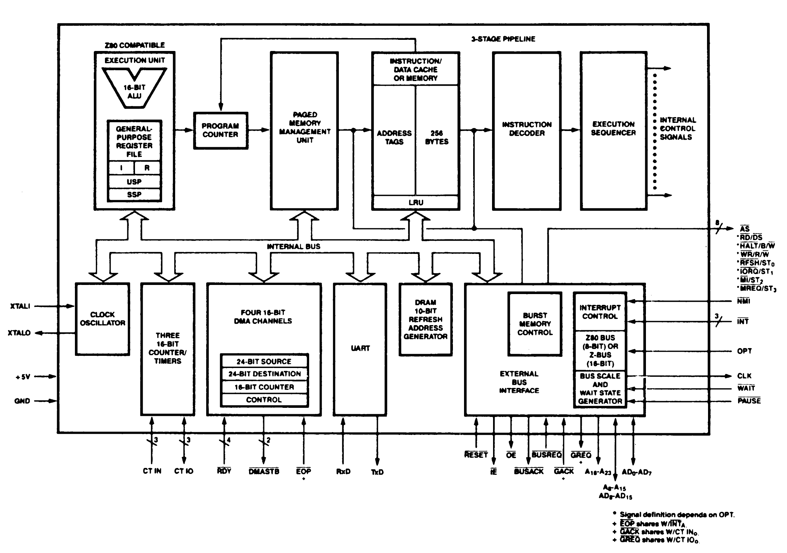

# 1. Z280 Architectural Overview

## Index

[1.1 INTRODUCTION](#11-introduction)

[1.2 MPU ARCHITECTURAL FEATURES](#12-mpu-architectural-features)

[1.2.1 System and User Modes](#121-system-and-user-modes)

[1.2.2 Address Spaces](#122-address-spaces)

[1.2.3 Data Types](#123-data-types)

[1.2.4 Addressing Modes](#124-addressing-modes)

[1.2.5 Instruction Set](#125-instruction-set)

[1.2.6 Exception Coditions](#126-exception-coditions)

[1.2.7 Memory Management](#127-memory-management)

[1.2.8 Cache Memory](#128-cache-memory)

[1.2.9 Refresh](#129-refresh)

[1.2.10 On-Chip Peripherals](#1210-on-chip-peripherals)

[1.2.11 Multiprocessor Mode](#1211-multiprocessor-mode)

[1.2.12 Extended Instruction Facility](#1212-extended-instruction-facility)

[1.3 BENEFITS OF THE ARCHITECTURE](#13-benefits-of-the-architecture)

[1.3.1 High Throughput](#131-high-throughput)

[1.3.2 Integration of System Functions](#132-integration-of-system-functions)

[1.3.3 Operating System Support](#133-operating-system-support)

[1.3.4 Code Density](#134-code-density)

[1.3.5 Compiler Efficiency](#135-compiler-efficiency)

[1.4 SUMMARY](#14-summary)

## 1.1 INTRODUCTION

The Z280™ microprocessor unit (MPU) features an advanced 16-bit CPU that is object-code compatible with the Z80® CPU. The Z280 microprocessor unit includes memory management, peripherals, memory refresh logic, cache memory, wait state generators, and a clock oscillator on the same integrated circuit as the CPU. The on-chip peripheral devices include 4 DMA (Direct Memory Access) channels, 3 counter/timers, and a UART (Universal Asynchronous Receiver/Transmitter). A block diagram of the Z280 MPU is shown in Figure 1-1. This chapter presents some of the features of the Z280 MPU family, with detailed descriptions
of the various aspects of the processor provided in succeeding chapters.

The Z280 MPU has a multiplexed address/data bus for communication with external memory and peripheral devices. Two different bus structures are supported by the 2280: an 8-bit data bus that uses Z80 Bus control signals, and a 16-bit data bus that uses Z-BUS® bus control signals. Zilog's Z80 and Z8500 families of peripherals are easily interfaced to the Z80 Bus; Zilog's Z8000® family of peripherals are easily interfaced to the Z-BUS.

 

 
_Figure 1-1. Block Diagram_

## 1.2 MPU ARCHITECTURAL FEATURES

The central processing unit of the Z280 MPU is a binary-compatible extension of the Z80 CPU architecture. High throughput rates for the Z280 CPU are achieved by a high clock rate, instruction pipelining, and the use of on-chip cache memory. The internal CPU clock can be scaled down to provide for slower speed bus transaction timing. A programmable refresh mechanism for dynamic RAMs and a clock oscillator are provided on-chip.

### 1.2.1 System and User Modes

Two modes of CPU operation, system and user, are provided to facilitate operating system design. In system mode, all of the instructions can be executed and all of the CPU registers can be accessed. This mode is intended for use by programs performing operating system functions. In user mode, certain instructions that affect the state of the machine cannot be executed and the control registers in the CPU are inaccessible. In general, user mode is intended for use by applications programs. This separation of CPU resources promotes the integrity of the system, since programs executing in user mode cannot access those aspects of the CPU that deal with time-dependent or system-interface events.

The register structure has been extended to include separate Stack Pointer registers, one for a system-mode stack and one for a user-mode stack. The system-mode stack is used for saving program status on the occurrence of an interrupt or trap condition, thereby ensuring that the user stack is free of system information. The isolation of the system stack from user-mode programs further promotes system integrity.

### 1.2.2 Address Spaces

Addressing spaces in the Z280 CPU include the CPU register space, the CPU control register space, the memory address space, and the I/O address space. The CPU register file is identical to the Z80 register set, with the exception of the separate system- and user-mode Stack Pointers. The A register acts as an 8-bit accumulator; the HL register is the 16-bit accumulator. These are
supplemented by four other 8-bit registers (B, C, D, E) and two other 16-bit registers (IX, IY); the 8-bit registers can be paired for 16-bit operation, and each 16-bit register can be treated as two 8-bit registers. The Flag register (F) contains information about the result of the last operation. The A, F, B, C, D, E, H, and L registers are replicated in an auxiliary bank of registers. These auxiliary registers can be exchanged with the primary register bank for fast context switching.

Several CPU control registers determine the operation of the Z280 MPU. For example, the contents of control registers determine the CPU operating mode, which interrupts are enabled, and the bus transaction timing. The control registers are accessible in system-mode operation only.

The Z280 CPU's logical memory address space is the same as that of the Z80 CPU: 16-bit addresses are used to reference up to 64K bytes of memory. However, the on-chip Memory Management Unit (MMU) extends the 16-bit logical memory address to a 24-bit physical memory address. Two separate logical address spaces, one for system mode and one for user mode, are supported by the CPU and MMU. Optionally, the MMU can be programmed to distinguish between instruction fetches and data accesses; thus, the Z280 CPU can have up to four memory address spaces: system-mode program, system-mode data, user-mode program, and user-mode data. The logical address space is divided into pages to facilitate controlled sharing of program or data among separate processes.

The Z280 CPU architecture also distinguishes between the memory and I/O address spaces and, therefore, requires specific I/O instructions. I/O addresses in the Z280 CPU are 24 bits long, with the upper 8 bits provided by an I/O page register in the CPU.

### 1.2.3 Data Types

Many data types are supported by the Z280 CPU architecture. The basic data type is the 8-bit byte, which is also the basic addressable memory element. The architecture also supports operations on bits, BCD digits, 2-byte words, and byte strings.

### 1.2.4 Addressing Modes

The operand addressing mode is the method by which a data operand's location is specified. The Z280 CPU supports nine addressing modes, including the five modes available on the Z80 CPU. The addressing modes of the Z280 CPU are:

* Register e Immediate e Indirect Register e Direct Address
* Indexed (with a 16-bit displacement)
* Short Index (with an 8-bit displacement)
* Program Counter (PC) Relative
* Stack Pointer (SP) Relative
* Base Index

All addressing modes are available on the 8-bit load, arithmetic, and logical instructions; the
8-bit shift, rotate, and bit manipulation instructions are limited to the Register, Indirect Register, and Short Index addressing modes. The 16-bit loads on the addressing registers support all addressing modes except Short Index, while other 16-bit operations are limited to the Register, Immediate, Indirect Register, Index, Direct Address, and PC Relative addressing modes.

### 1.2.5 Instruction Set

The Z280 CPU instruction set is an expansion of the Z80 instruction set; the enhancements include support for additional addressing modes for the Z80 instructions as well as the addition of new instructions. The Z280 CPU instruction set provides a full complement of 8- and 16-bit arithmetic operations, including signed and unsigned multiplication and division. Additional
8-bit computational instructions support logical and decimal operations. Bit manipulation, rotate, and shift instructions round out the data manipulation capabilities of the Z280 CPU. The Jump, Call, and Return instructions have both conditional and unconditional versions; Relative addressing is provided for the Jump and Call instructions to support position-independent programs. Block move, search, and I/O instructions provide powerful data movement capabilities. In addition, special instructions have been included to facilitate multitasking, multiple processor configurations, and typical high-level language and operating system functions.

### 1.2.6 Exception Coditions

The Z280 MPU supports three types of exceptions (conditions that alter the normal flow of program execution): interrupts, traps, and resets.

Interrupts are asynchronous events typically triggered by peripherals requiring attention. The Z280 MPU interrupt structure has been significantly enhanced by increasing the number of interrupt request lines and by adding an efficient means for handling nested interrupts. There are four modes for handling interrupts:

* 8080 compatible, in which the interrupting device provides the first instruction of the interrupt routine.
* Dedicated interrupts, in which the CPU jumps to a dedicated address when an interrupt occurs.
* Vectored interrupt mode, in which the interrupting peripheral provides a vector into a table of jump addresses.
* Enhanced vectored interrupt mode, wherein the CPU handles traps and multiple interrupt sources, saving control information as well as the Program Counter when an interrupt occurs.

The first three modes are compatible with the Z80 CPU interrupt modes; the fourth mode provides more flexibility, with support for nested interrupts and a sophisticated vectoring scheme.

Traps are synchronous events that trigger a special CPU response when certain conditions occur during instruction execution. The Z280 CPU supports a sophisticated complement of traps including Division Exception, System Call, Privileged Instruction, Extended Instruction, Single-Step, Breakpoint-on-Halt, Memory Access Violation, and System Stack Overflow Warning traps.

Hardware resets occur when the <ins>RESET</ins> line is activated and override all other conditions. A reset causes certain CPU control registers to be initialized.

### 1.2.7 Memory Management

Memory management consists primarily of dynamic relocation, protection, and sharing of memory.

Proper memory management can provide a logical structure to the memory space that is independent of the actual physical location of data, protect the user from inadvertent mistakes (such as trying to execute data), prevent unauthorized accesses to memory, and protect the operating system from disruption by users.

The 16-bit addresses manipulated by the programmer, used by instructions, and output by the CPU are called logical addresses. The on-chip Memory Management Unit (MMU) transforms the logical addresses into the corresponding 24-bit physical addresses required for accessing memory. This address transformation process is called relocation, and makes user software independent of physical memory. Thus, the user is freed from specifying where information is actually located in physical memory.

Status information generated by the CPU allows the MMU to monitor the intended use of each memory access. Illegal types of accesses, such as writes to read-only memory, can be suppressed; thus, areas of memory can be protected from unintended or unwanted modes of use. Also, the MMU records which memory areas have been modified and can inhibit copies of data from being retained in the on-chip cache.

When a memory access violation is detected by the MMU, a trap condition is generated in the CPU and execution of the current instruction is automatically aborted. This mechanism facilitates the easy implementation of virtual memory systems based on the Z280 MPU.

### 1.2.8 Cache Memory

Cache memories are small high-speed buffers situated between the processor and main memory. For each memory access, control logic checks to see if the data at that memory location is currently stored in the cache. If so, the access is made to the high-speed cache; if not, the access is made to main memory, and the cache itself might be updated. Thus, use of a cache leads to increased performance with fewer memory transactions on the system bus.

The Z280 MPU includes on-chip memory that can be used as a cache for programs, data, or both. Cache operations, including updating, are performed automatically and are completely transparent to the user. Optionally, this on-chip memory can be dedicated to a set of memory locations that are specified under program control, instead of being used as a cache.

### 1.2.9 Refresh

The Z280 MPU has an internal mechanism for refreshing dynamic memory. This mechanism can be enabled or disabled under program control. If enabled, memory refresh operations are performed periodically at a rate determined by the contents of a refresh rate register. A 10-bit refresh address is generated for each refresh operation.

### 1.2.10 On-Chip Peripherals

Several programmable peripheral devices are included on-chip in the Z280 MPUs: four DMA
channels, three 16-bit counter/timers, and a UART. Optionally, one of the DMA channels can be used with the UART as a bootstrap loader for the Z280 MPU's memory after a reset.

### 1.2.11 Multiprocessor Mode

A special mode of operation allows the Z280 MPU to operate in environments that have a global bus, wherein the Z280 MPU is not the bus master of the global bus. A set of memory addresses (determined under program control) is dedicated to a local bus, which is controlled by the Z280 MPU, and another set of addresses is used for the global bus. The Z280 MPU is required to make a bus request and receive an acknowledgement before making a memory access to an address on the global bus. This mode of operation facilitates use of the Z280 MPU in multiple-processor configurations. For example, a Z280 MPU could be used as an I/O processor in a Z80000-, Z8000-, or
Z280-based system.

### 1.2.12 Extended Instruction Facility

The Z280 MPU architecture has a mechanism for extending the basic instruction set through the use of external devices called Extended Processing Units (EPUs). Special opcodes have been set aside to implement this feature. When the Z280 MPU encounters an instruction with one of these opcodes, it performs any indicated address calculations and data transfers; otherwise, it treats the "extended instruction" as if it were executed by the EPU.

If an EPU is not present, the Z280 MPU can be programmed to trap when an extended instruction is encountered so that system software can emulate the EPU's activity.

## 1.3 BENEFITS OF THE ARCHITECTURE

The features of the Z280 MPU architecture provide several significant benefits, including increased program throughput, increased integration of system functions, support for operating systems, and improvements in compiler efficiency and code density.

### 1.3.1 High Throughput

Very high throughput rates can be achieved with the Z280 MPU, due to the cache memory, instruction pipelining, and high clock rates achievsble with this processor. The CPU clock rate can be scaled down to provide the bus clock rate, allowing the designer to use slower, less-expensive memory and I/O devices. Use of the on-chip cache memory further increases throughput by minimizing the number of accesses to the slower, off-chip memory devices. The high code density achievsble with the Z280 CPU's expanded instruction set also contributes to program throughput, since fewer instructions are needed to accomplish a given task.

### 1.3.2 Integration of System Functions

Besides a powerful CPU, the Z280 MPU includes many on-chip devices that previously had to be implemented in logic external to the microprocessor chip. These devices include a clock oscillator, memory refresh logic, wait state generators, the MMU, cache memory, DMA channels, counter/timers, and a UART. Integration of all these functions onto a single chip results in a reduced parts count in a system design, accompanied by a resulting reduction in design and debug time, power requirements, and printed circuit board space. This increased level of integration also, contributes to system throughput, since the on-chip devices can be accessed quickly without the need of an external bus transaction.

### 1.3.3 Operating System Support

Several of the Z280 MPU's architectural features facilitate the implementation of multitasking operating systems for Z280-based systems.

The inclusion of user and system operating modes improves operating system organization. User-mode programs are automatically inhibited from performing operating-system type functions. System-mode memory can be separated from user-mode memory and separate stacks can be maintained for systemmode and user-mode operations. The System Call instruction and the trap mechanism provide a controlled means of accessing operating system functions during user-mode execution.

The interrupt- and trap-handling mechanisms are well suited for operating system implementations. Several levels of interrupts are provided, allowing for separate control of various peripheral devices (both on and off the chip). A new interrupt mode is provided, wherein status information about the currently executing task is saved on the stack and new program status information for the service routine is automatically loaded from a special memory area. Traps result in the same type of program status saving. In both cases, status is always saved on the system stack, leaving the user stack undisturbed.

Allocation of resources within the operating system can be accomplished using a special Test and Set inetruction. Other instructions, such as the Purge Cache instruction, are provided to aid in task switching and other operating system chores.

The on-chip MMU supports a multitasking environment by providing both a means of quickly allocating physical memory to tasks as they are executed on the system and protection mechanisms to enforce proper memory usage.

### 1.3.4 Code Density

Code density affects both processor speed and memory utilization. Code compaction saves memory space and improves processor speed by reducing the number of instructions that must be fetched and decoded. The largest reduction in program size results from the powerful instruction set, where instructions such as Multiply and Divide help substantially reduce the nunber of instructions required to complete a task.

The efficiency of the instruction set is enhanced by the addition of new addressing modes. For example, all nine addressing modes are available for all the 8-bit load, arithmetic, and logical instructions.

### 1.3.5 Compiler Efficiency

For microprocessor users, the transition from assembly language to high-level languages allows greater freedom from architectural dependency and improves ease of programming. For the Z280 MPUs, high-level language support is provided through the inclusion of features designed to minimize typical compilation and code-generation problems.

Among these features is the variety and the power of the Z280 instruction set, allowing the Z280 CPU to easily handle a large amount and variety of data types. The Z280 CPU's ability to manipulate many different data types aids in compiler efficiency; since data structures are high-level constructs frequently used in programming, processing performance is enhanced by providing efficient mechanisms for manipulating them.

Examples of commonly used data structures include arrays, strings, and stacks. Arrays are supported in the Z280 CPU by the Indirect Register, Index, and Base Index addressing modes. Strings are supported by those same addressing modes and the Block Move and Compare instructions; since compilers and assemblers often must manipulate character strings, the Block Move and Block Compare instructions can result in dramatic speed improvements over software simulations of those tasks. Numeric strings of BCD data can be manipulated using the Decimal Adjust and Rotate Digit instructions. Stacks are supported by the Push and Pop instructions and the Stack Pointer Relative, Index, and Base Index addressing modes; the Stack Pointer Relative addressing mode is
especially useful for accessing parameters and local variables stored on the stack.

## 1.4 SUMMARY

The Z280 MPU is a high-performance 16-bit microprocessor, available with 8- and 16-bit external bus interfaces. Code-compatible with the Z80 CPU, the Z280 MPU architecture has been expanded to include features such as multiple memory address spaces, efficient handling of nested interrupts, system and user operating modes, and support for multiprocessor configurations. Additional
functions such as memory management, clock generation, wait state generation, and cache memory are included on-chip, as well as a number of peripheral devices. The benefits of this architecture —including high throughput rates, a high level of system integration, operating system support, code density, and compiler efficiency— greatly enhance the power and versatility of the Z280 MPU. Thus, the Z280 MPU provides both a growth path for existing Z80-based designs and a high-performance processor for future applications.
