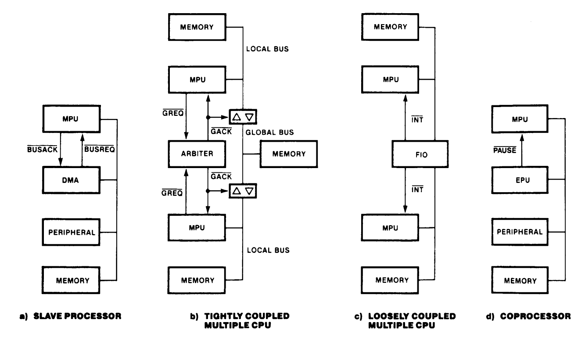
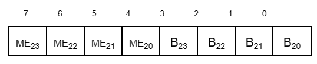
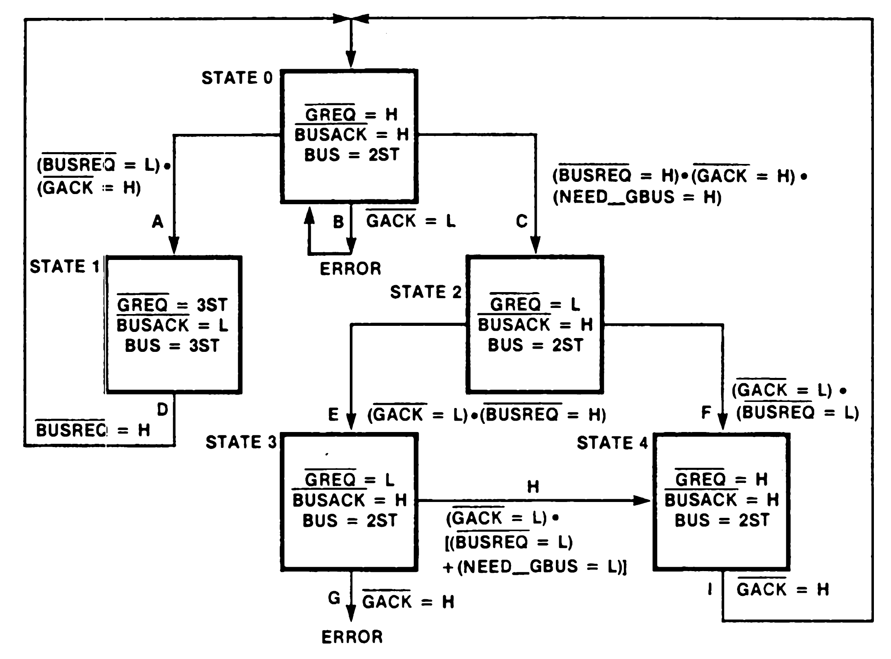
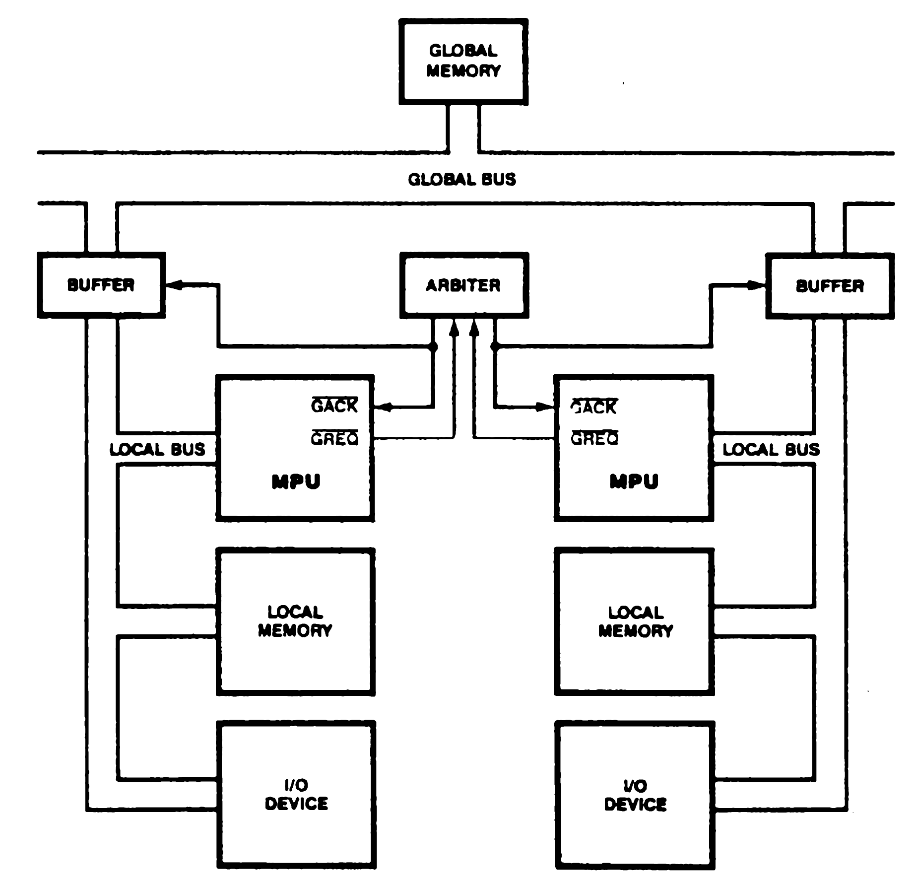
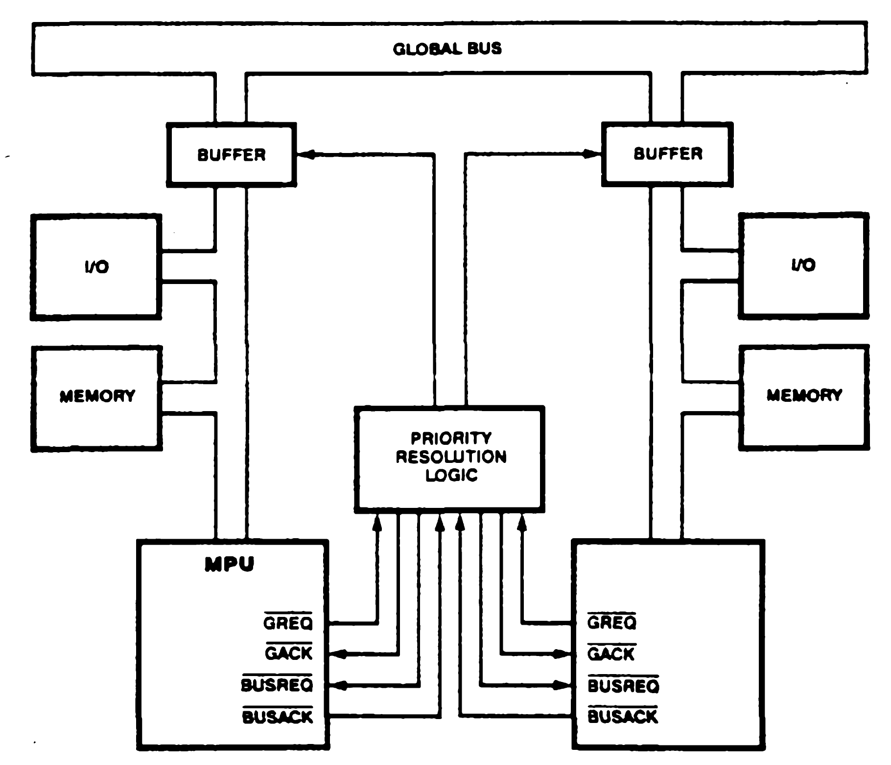
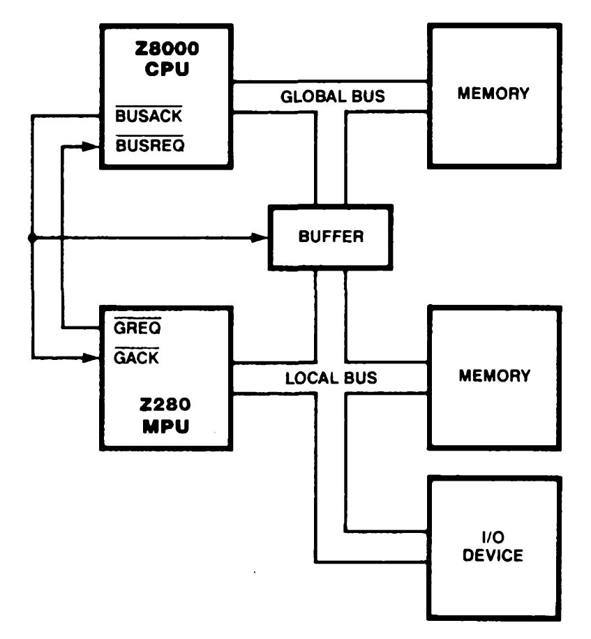
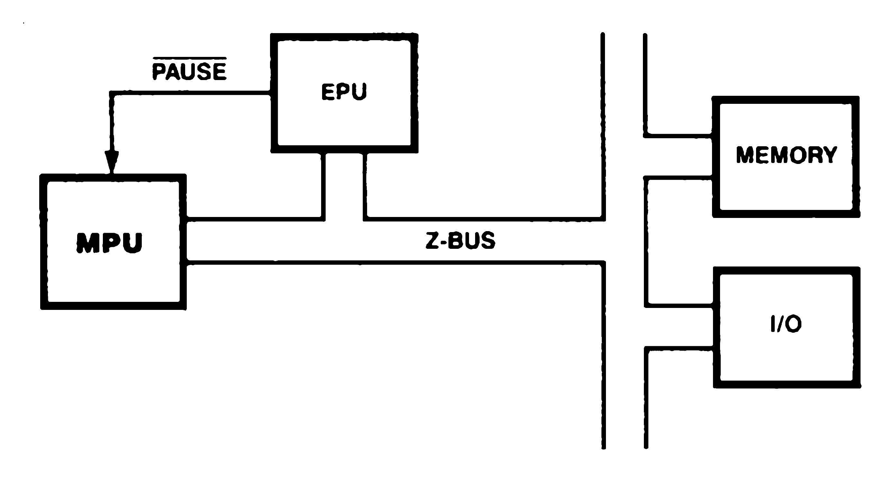
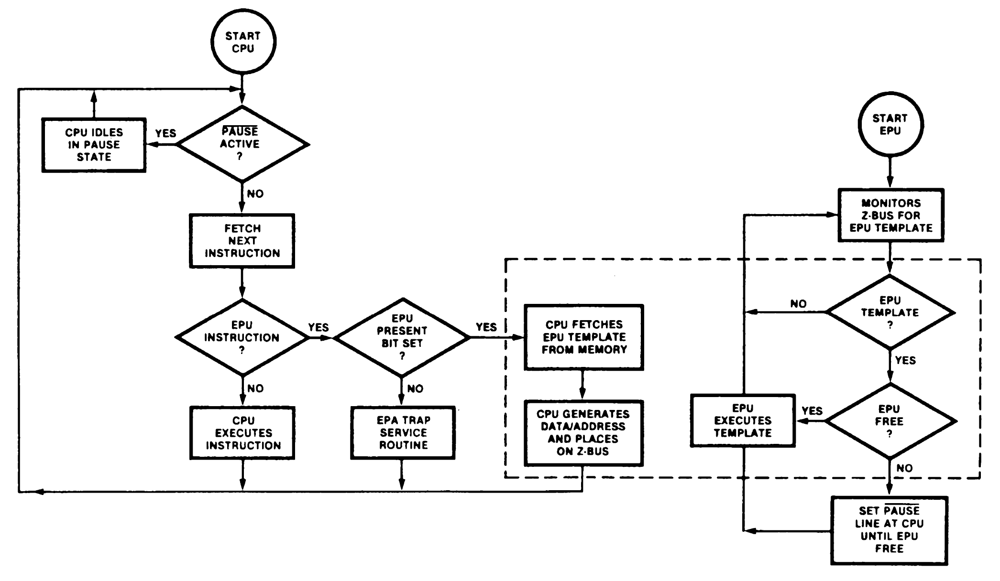

# 10. Multiprocessor Configurations

## 10.1 INTRODUCTION

The Z280 MPU architecture provides support for four types of multiprocessor configurations
(Figure 10-1): slave processors, tightly coupled multiple CPUs, loosely coupled multiple CPUs, and coprocessors.

 

 
_Figure 10-1. Multiprocessor Configurations_

## 10.2 SLAVE PROCESSORS

Slave processors, such as the Z8016 DMA Transfer Controller or other DMA devices, perform dedicated functions asynchronously to the CPU. The CPU and slave processors share a local bus, where the CPU is the default bus master. In order for a slave processor to use the bus, it must request control of the bus from the CPU and receive an acknowledgement of that request.

Two Z280 MPU signals are provided for supporting slave processors: <ins>BUSREQ</ins> and <ins>BUSACK</ins>. A bus request is initiated by pulling the <ins>BUSREQ</ins> input low. Several bus requestors may be wire-ORed to the <ins>BUSREQ</ins> pin; priorities are resolved external to the MPU, usually <ins>BUSREQ</ins> a priority daisy chain. The external <ins>BUSREQ</ins> signal generates an internal, synchronous <ins>BUSREQ</ins>. If this signal is active at the beginning of any bus cycle, the Z280 MPU will relinquish the bus at the end of that bus cycle (with the exception of the TSET instruction, where the read-modify-write cycle is atomic). The MPU suspends execution of the current instruction and gives up control of the bus by 3-stating all address, address/data, bus timing, and bus status output pins. The BUSACK output is then asserted, signaling that the bus request has been accepted and the bus is free for use by the slave processor. The Z280 MPU remains in the bus disconnect state until <ins>BUSACK</ins> is deasserted.

The <ins>BUSREQ</ins> input is sampled during each processor clock period by the external bus interface logic of the Z280 MPU. If <ins>BUSREQ</ins> is sampled active low while the Z280 MPU is involved in an internal operation, the external bus is relinquished to the bus requestor immediately. Internal processing can continue until a transaction involving the external bus is required; the MPU then suspends activity until regaining control of the bus. If <ins>BUSREQ</ins> is sampled active during a CPU-generated transaction on the external bus, the bus is not relinquished nor CPU activity suspended until the current transaction is completed.

The Z280 MPU regains control of the bus after <ins>BUSREQ</ins> rises, continuing execution from the point at which it was suspended. Any bus requestor desiring control of the bus must wait at least two bus cycles after <ins>BUSREQ</ins> has risen before asserting <ins>BUSREQ</ins> again.

In the case of simultaneous bus requests from multiple sources, the on-chip DMA channels have higher priority than external slave processors in Z280 MPU systems. After reset, the Z280 MPU acknowledges an active <ins>BUSREQ</ins> signal before performing any transactions.

## 10.3 TIGHTLY COUPLED MULTIPLE PROCESSORS

Tightly coupled multiple CPUs execute independent instruction streams from their own (local) memory locations and communicate through shared memory locations on a common (global) bus. Each CPU is the default master of its local bus, but the global bus master is chosen by an external arbiter.

The Z280 MPU's multiprocessor mode of operation supports tightly coupled multiple CPU configurations. This mode is also useful when configuring the Z280 MPU as an I/O processor in a distributed processing system. Multiprocessor mode is selected by setting the Multiprocessor Configuration Enable (MP) bit in the Z280 CPU's Bus Timing and Initialization register (see Section 3.2.1). While in the multiprocessor mode, the Z280 MPU is able to support both a local bus and a global bus. The Z280 CPU is the default bus master of the local bus, but must make a request and receive an acknowledgement before performing transactions on the global bus. Only memory transactions can be performed on the global bus; I/O transactions always use the local bus. The range of memory addresses dedicated to the global and local buses is determined by the contents of the CPU's Local Address register.

While in the multiprocessor mode, Counter/Timer 0's I/O and IN pins are used as global bus request (<ins>GREQ</ins>) and global bus acknowledge (<ins>GACK</ins>) signals, respectively. <ins>GREQ</ins> is a three-state output; an active low signal on this line requests use of the global bus. An active low level on the <ins>GACK</ins> input acknowledges a global bus request.

### 10.3.1 The Local Address Register

During each memory transaction while in multiprocessor mode, the Z280 CPU uses the Local Address register to determine if that transaction is to occur on the local or global bus. The Local Address register includes a 4-bit Base field and a 4-bit Match Enable field (Figure 10-2). For each bus transaction, the four most-significant bits of the physical address (address bits A20 through A23) are compared with the 4-bit Base field; the Match Enable field specifies which bits are going to be used during this comparison. If all the corresponding address bits match the Base field in the bit positions specified by the Match Enable field, then the bus transaction can proceed on the local bus without requesting the global bus. If there is a mismatch in at least one specified bit position, then the global bus is requested and the bus transaction does not proceed until the global bus acknowledge signal is asserted. (See section 3.2.3.)

 

 
_Figure 10-2. Local Address Register_

### 10.3.2 Bus Request Protocols

While in the multiprocessor mode, the <ins>BUSREQ</ins> and <ins>BUSACK</ins> signals control use of the local bus in the Same manner as described in section 10.2. When a local bus request is granted, as indicated by an active <ins>BUSACK</ins> signal, the CPU places all output signals, including <ins>GREQ</ins>, in the high-impedance state.

When in control of its local bus, a Z280 CPU can initiate transactions with devices on the global bus that are shared with other CPUs. At any one time, only one CPU can control transactions on the global bus. Control of the global bus is arbitrated by external circuitry. Before initiating a transaction on the global bus, the CPU requests control of the global bus from the external arbiter circuitry by asserting <ins>GREQ</ins> and waiting for an active <ins>GACK</ins> in response. (The timing diagrams for global bus requests are shown in Figures 12—15 and 13-19.) The <ins>GACK</ins> input is asynchronous to the CPU clock; the Z280 CPU synchronizes <ins>GACK</ins> internally. Once <ins>GACK</ins> is asserted, the CPU performs the transaction on the global bus. The CPU then deasserts <ins>GREQ</ins> and waits for the arbiter circuit to deassert <ins>GACK</ins>. The CPU always relinquishes the global bus by deasserting <ins>GREQ</ins> after each global transaction is completed, except during execution of a Test and Set (TSET) instruction (both the data read and write are completed before relinquishing the global bus) or during a burst-mode memory transfer (the entire sequence of burst-mode memory reads is completed before relinquishing the global bus).

A state diagram of the bus request protocol is shown in Figure 10-3.

 

 

NOTES: Interface signals are High (H), Low (L), High or Low (2ST), or 3-stated (3ST). 
NEED_GBUS is an active High signal internal to the CPU.

| | Transition Legend |
|-|-|
A | A local bus request occurs.
B | The global bus arbiter grants control of the global bus when no global bus request is pending. This is an error. The CPU remains in State 0.
C | The CPU requests the global bus in response to the internally generated signal NEED_GBUS.
D | The local bus master relinquishes the bus.
E | The global bus arbiter grants the global bus to the CPU while no local bus request is pehding.
F | The global bus arbiter grants the global bus to the CPU while a local bus request is pending. The local bus request has preempted the CPU.
G | The global bus arbiter reclaims the global bus before the CPU relinquishes the global bus. This is an error. The CPU Is response to this error is undefined.
H | The CPU relinquishes control of the global bus when it no longer needs the global bus or in response to a local bus request.
I | The global bus arbiter reclaims the global bus.

 

| | State Legend
|-|-|
State 0 | The CPU controls the local bus and is neither requesting nor controlling the global bus. The CPU can perform transactions on the local bus.
State 1 | The CPU has granted the local bus. The CPU cannot perform transactions.
State 2 | The CPU controls the local bus and is requesting the global bus. The CPU cannot perform transactions.
State 3 | The CPU controls the local and global buses. The CPU can perform transactions on the global bus.
State 4 | The CPU controls the local bus and is relinquishing control of the global bus.  The CPU cannot perform transactions.

_Figure 10-3. State Diagram for CPU Bus Request Protocol_
  

While a Z280 CPU is asserting <ins>GREQ</ins> and waiting for an active <ins>GACK</ins>, if <ins>BUSREQ</ins> is asserted before <ins>GACK</ins>, the CPU releases the global bus request after <ins>GACK</ins> is asserted without performing any transactions.

The on-chip DMA channels may also initiate transactions on the global bus. During each DMA-controlled transaction, memory addresses generated by a DMA channel are compared to the contents of the Local Address register to determine if the global bus is to be requested, in the same manner as CPU-controlled bus transactions.

If the automatic memory refresh mechanism is enabled, refresh cycles are inhibited while either the CPU or a DMA channel has requested the global bus but not yet received the global bus acknowledge. No refresh transactions are ever performed on the global bus.

### 10.3.3 Examples of the Use of the Global Bus

The Z280 MPU's multiprocessor mode of operation facilitates the development of tightly coupled multiprocessor systems and systems using the Z280 MPU as a front-end I/O processor.

Figure 10-4 is a block diagram illustrating the use of multiple Z280 MPUs as tightly-coupled processors. Access to the global memory via the global bus is controlled by a centralized bus arbitration circuit. The <ins>GACK</ins> circuit controls the buffers that connect or isolate the global bus from each MPU's local bus. Each Z280 MPU can access its local memory independent of the other MPU's activity. Only one MPU at a time can access the shared global memory. Note that memory-mapped I/O devices could also be shared using the global bus.

 

 
_Figure 10-4. Tightly Coupled Processors with Shared Global Memory_
 

Figure 10-5 shows a tightly coupled multiple Z280 MPU system without a global memory, where each processor can directly access the local memory of the other processor. For this system, priority resolution logic would control both the local and global bus requests. A global bus request from
one processor is used to generate a local bus request to the other processor. When one
processor generates a global bus request, an active <ins>GACK</ins> signal is not returned to that processor until the other processor's local bus is available, as indicated by <ins>BUSACK</ins>.

 

 
_Figure 10-5. Tightly Coupled Processors without Global Memory_
 

Although both Figure 10-4 and 10-5 show only two tightly coupled processors, more processors could be added to these systems in a similar manner.

Figure 10-6 illustrates the use of a Z280 MPU as an I/O processor in a Z8000-based system. The
Z280 MPU's <ins>GREQ</ins> signal is used as the bus request signal to the Z8000 CPU; the Z8000 CPU's <ins>BUSACK</ins> signal is input directly to the Z280 MPU's <ins>GACK</ins>, as well as controlling the buffers that normally isolate the Z280 MPU's local bus from the Z8000 CPU's bus.

 

 
_Figure 10-6. Z280 MPU as an I/O Processor_
 

## 10.4 LOOSELY COUPLED MULTIPLE CPUS

Loosely coupled multiple CPUs generally communicate through a multiple-port peripheral, such as the Z8038 FIO (FIFO buffer I/O unit). The Z280 MPU's I/O and interrupt facilities and the on-chip DMA channels support loosely coupled multiprocessing with the Z280 MPU.

## 10.5 COPROCESSORS AND THE EXTENDED PROCESSING ARCHITECTURE

The Zilog Extended Processing Architecture (EPA) provides a flexible and modular approach to expanding the capabilities of the Z280 MPU through the use of coprocessors called Extended Processing Units (EPUs). The Extended Processing Architecture is available on the Z-BUS configurations of the Z280 MPU, but not the Z80 Bus configurations. Up to four EPUs can be connected to a single Z280 MPU.

An Extended Processing Unit is a coprocessor that can be used to execute complex, time-consuming tasks in order to unburden the CPU. EPUs connect directly to the Z-BUS; no extra external logic is required to interface an EPU to a Z280-based system (Figure 10-7). As the Z280 CPU fetches and executes instructions, the EPU continuously monitors the instruction stream on the bus. A special group of instructions, called extended instructions, are processed by EPUs. When the Z280 CPU encounters an extended instruction, it performs any specified data transactions, but otherwise assumes that the instruction will be recognized and handled by an EPU. (In systems without EPUs, extended instructions can be used to generate a trap condition.) Thus, when EPUs are added to a system, the instruction set is expanded to include the extended instructions applicable to those EPUs, thereby boosting the processing power of the whole system. The Z280 CPU and EPUs work together like a single central processor; a system with EPUs can be thought of as a system whose central processor consists of 1 + N separate devices, where N is the number of EPUs in the system.

 

 
_Figure 10-7. EPU Connection in Z280 MPU System_
 

The underlying philosophy of the Extended Processing Architecture is that the CPU is an instruction processor; that is, the CPU fetches an instruction, fetches data associated with that instruction, performs the specified operation, and stores the result. Extending the number of operations that can be performed does not affect the instruction fetch and address calculation portion of the CPU activity. The extended instructions exploit this feature. The CPU is responsible for fetching instructions, performing address calculations, and generating the timing signals for bus transactions; however, the actual data manipulation for extended instructions is handled by an EPU. Both the CPU and EPUs are, therefore, controlled via a single instruction stream, eliminating many significant system software and bus contention problems that can occur with other multiprocessing configurations.

### 10.5.1 Extended Instructions

Extended Processing Units connect directly to the Z-BUS and continuously monitor the instruction stream. When the template portion of an extended instruction is fetched from memory, the
appropriate EPU will detect that the instruction is meant for it and respond to the instruction. The CPU is always responsible for fetching instructions and delivering operands to the EPUs. The EPUs recognize the extended instruction templates and execute them, using data supplied with the template and/or data already within internal EPU registers.

There are four types of extended instructions in the Z280 instruction set: data transfers from
memory to an EPU, data transfers from an EPU to memory, data transfers from an EPU to the CPU's accumulator register, and EPU internal operations. Twenty-two instruction opcodes are used to implement these operations. Each extended instruction opcode includes two parts: a two- or four-byte instruction opcode used by the Z280 CPU to determine its activity and the address of the memory operand, and a four-byte instruction "template" that specifies the EPU activity. Six operand addressing modes are supported by the instructions that specify transfers between EPU registers and main memory: Direct Address, Indirect Register, Indexed, Stack Pointer Relative, Program Counter Relative, and Base Index. (See section 5.4.10 for a description of the extended instructions.)

In addition to the hardware-implemented capabilities of the EPA, there is an extended instruction trap mechanism that permits software simulation of EPU functions. The state of the EPU Enable bit in the CPU's Trap Control register indicates whether EPUs are present in the system (see section 3.3.5). If the EPU Enable bit is cleared to 0, indicating that there are not EPUs in the system, the CPU will execute an Extended Instruction trap if an extended instruction is encountered in the instruction stream. The service routine for this trap could perform a software simulation of an EPU's functions. This trap mechanism facilitates the design of systems in which EPUs are not present but may be added later. Initially, the "extended" function is
executed as the Extended Instruction trap service routine; when EPUs are added to the system, the trap routine is eliminated and the EPU Enable bit is set to 1. This change would be transparent to applications programs. (The Extended Instruction trap is described in section 6.3.1.)

### 10.5.2 Extended Instruction Execution Sequence

The CPU and EPU instruction execution sequence is diagrammed in Figure 10-8. When the CPU fetches an extended instruction, the EPU Enable bit in the Trap Control register is examined. If the EPU Enable bit is a 0, an Extended Instruction trap is executed. If the EPU Enable bit is a 1, indicating that there is an EPU in the system, then the CPU fetches the four-byte instruction template from memory. The fetching of the template is indicated by the ST3-ST0 status lines from the CPU. EPUs must continuously monitor the address/data bus and ST3-ST0 status lines for its templates. A 2-bit identification field in the template can select one of up to four EPUs for execution of a given extended instruction. If the extended instruction calls for the transfer of data between the CPU and EPU or between the EPU and memory, the CPU generates the appropriate bus transaction cycles. These transactions are identified by unique encodings of the ST3-ST0 status lines. The EPU monitors the status and timing signals output by the CPU to determine when to participate in the data transaction; the EPU supplies or captures the data when <ins>DS</ins> is active. For transactions between an EPU and memory, the CPU 3-states its address/data lines while <ins>DS</ins> is active so that the EPU or memory can supply the data. (See section 13.5.5 for a description of the bus transaction timing.)

 

 
_Figure 10-8. CPU-EPU Instruction Execution Sequence_
 

The number and type of bus cycles required to fetch the extended instruction template depends on whether the template is aligned on an even address boundary. The four-byte long template can be fetched with two word transactions if the template begins on an even memory address or with one byte and two word transactions if the template begins at an odd memory address, as described in Table 10-1. (In the case of an odd starting address for the template, the EPU captures only the upper byte from the bus during the second word transaction.) The template is always fetched from memory using the CPU's external bus interface, regardless of the current state of the on-chip cache memory.

 

Address at Template Start | Bus Cycle | Address from Z280 | Byte/Word | ST3-ST0
|-|-|-|-|-|
Even | 1 | n | Word | 1101
| | 2 | n+2 | Word | 1100
Odd | 1 | n | Byte | 1101
| | 2 | n+1 | Word | 1100
| | 3 | n+3 | Word | 1100

_Table 10-1. Bus Transactions Involved in Fetch of Extended Instruction Template_
  

If the extended instruction specifies an internal EPU operation, the Z280 CPU can proceed to fetch and execute subsequent instructions. Thus, the CPU and EPUs may be processing in parallel. The <ins>PAUSE</ins> signal is used to synchronize CPU-EPU activity in the case of overlapping extended instructions. If the CPU fetches another extended instruction template intended for an EPU that is still executing a previous instruction, the EPU activates the <ins>PAUSE</ins> input to the CPU to halt further CPU activity until the EPU can finish the original operation. While <ins>PAUSE</ins> is asserted, all CPU activity is suspended except responses to refresh requests, bus requests, and resets.

CPU activity following the fetch of the extended instruction template is governed by the type of extended instruction being processed. In the case of an EPU internal operation, no further bus transactions are required by the extended instruction, so the CPU will proceed to fetch the next instruction. However, the CPU will still honor an active <ins>PAUSE</ins> input and suspend execution until PAUSE is released.

In the case of an EPU-to-CPU transfer instruction, the next non-refresh transaction following the fetch of the template (and after an active <ins>PAUSE</ins> signal is deasserted) will be the EPU-to-CPU bus transaction. EPU-to-CPU bus transactions are identified by a 1110 status code on the ST3-ST0 status lines and are word transactions. The address emitted by the CPU during this cycle is the memory address of the previous transaction (that is, the address used during the last fetch of the instruction template).

In the case of EPU-to-memory or memory-to-EPU transfer instructions, the next one to sixteen non-refresh transactions following the fetch of the template (and after an active PAUSE signal is deasserted) will be the appropriate data transfer cycles. Up to 16 bytes of data may be transferred as the result of a single extended instruction; the number of data transfers to be performed is encoded in the instruction template. The 1010 status code on the ST3-ST0 status lines identifies bus cycles that transfer data between an EPU and memory. The EPU must supply the data for write operations or capture the data for read operations during each transaction, just as if it were part of the CPU. The number and type of transactions generated also depends on whether the starting memory address of the data block to be moved is an even-valued address, as defined in Table 10-2. The case where only one byte is transferred is degenerate and shown separately in Table 10-2 for clarity. These transfers are always performed on the Z280 MPU's external bus, regardless of the current state of the on-chip cache memory.

 

Starting Memory Address | Number of Bytes (n) | Byte/Word Status of Transfers | Type of Addresses | Total Number of  Transactions
|-|-|-|-|-|
Even | Even | word, word....word | All even | n/2
Even | Odd | word, word,...,word, byte | All even | (n+1)/2
Even | One |  | byte | Even | 1
Odd | Even | byte, word,...,word, byte | First odd, others even | (n+2)/2
Odd | Odd | byte, word....word, word | First odd, others even | (n+1)/2
Odd | One | byte | Odd | 1

_Table 10-2. Sequence of Transactions for Data Transfers between an EPU and Memory_
