# 12. Z280 Bus External Interface

## 12.1 INTRODUCTION

The Z280 MPU is typically only one component in a system that may include memory, peripherals, slave processors, coprocessors, and other CPUs, all connected via a system bus. Two different component-interconnect bus schemes are available with the Z280 MPU: the Z80 Bus and the Z-BUS.

This chapter describes the external manifestations (that is, the activity on the pins) that result from CPU or on-chip peripheral activity for the Z80 Bus configurations of the Z280 MPU. (The Z-BUS external interface is described in Chapter 13.) Since the pins are connected to the system bus, most of this discussion will center on the bus and bus operations.

The condition of the OPT signal pin determines the configuration of the bus interface for the Z280 MPU; the Z80 Bus configuration is selected by applying a logical 0 (ground) level on the OPT pin.

The Z80 Bus on the Z280 MPU includes a 24-bit address bus, 8-bit data bus, and associated status and control signals. The data bus is multiplexed with the low-order 8 bits of the address bus. Figure 12-1a shows the pin functions for the Z80 Bus configuration of the Z280 MPU. The Z80 bus described here is compatible with Zilog's Z8400 and Z8300 families of peripheral devices.

 

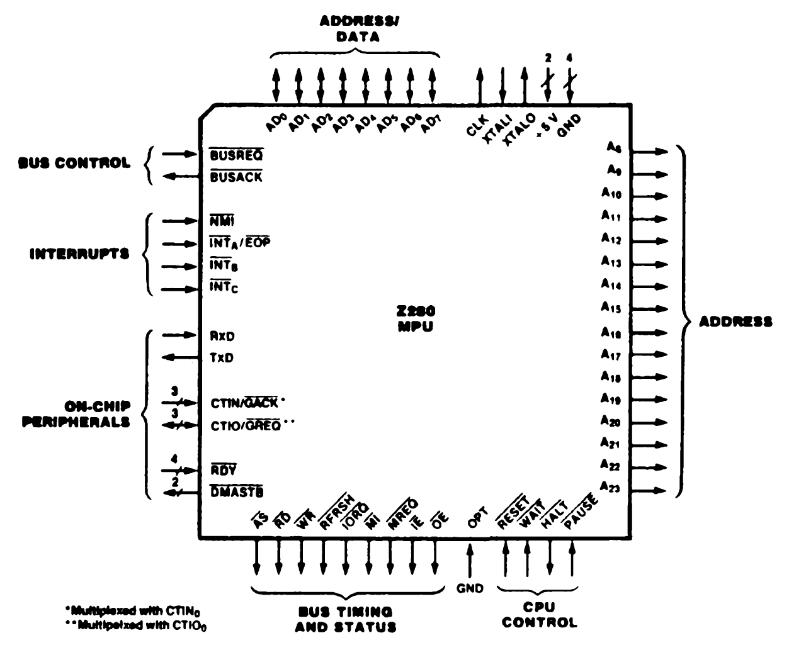 
_Figure 12-1a. Pin Functions_

 

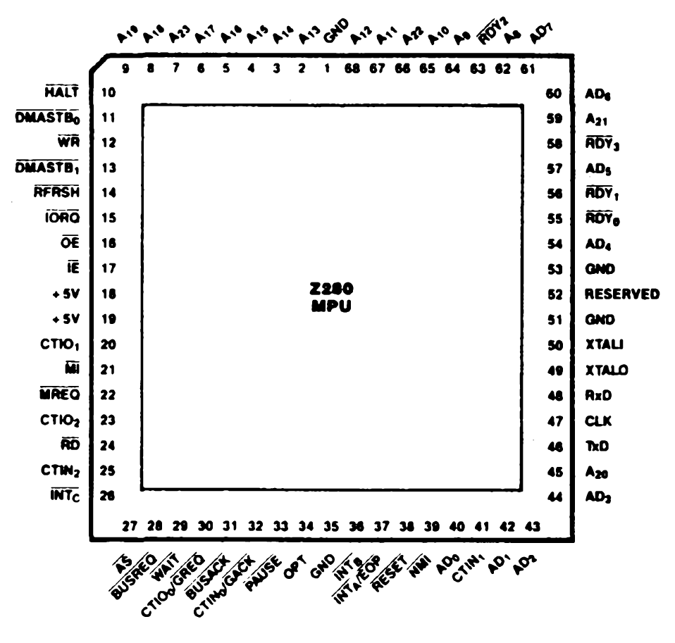 
_Figure 12-1b. Pin Assignments_
 

_Figure 12-1. Z80 Bus Configuration (input OPT tied to GND)_

## 12.2 BUS OPERATIONS

Two kinds of operations can occur on the Z80 Bus: transactions and requests. At any given time only one device (either the CPU or a bus requestor such as a DMA channel) can be in control of the bus; this device is called the bus master. Transactions are always initiated by the bus master and are responded to by some other device on the bus. Only one transaction can proceed at a time. Requests can be initiated by a device that does not have control of the bus.

Seven types of transactions can occur on the Z80 Bus, as described below:

**Memory transaction.** CPU- or DMA-controlled transfer of data to or from a memory location.

**RETI transaction.** CPU-initiated transaction used in conjunction with the interrupt logic of Z8400 family peripherals.

**Halt transaction.** Transaction indicating that the CPU is entering the Halt state due to the execution of a HALT instruction or a fatal sequence of traps.

**Refresh.** Transaction that refreshes dynamic memory; refresh transactions do not involve a transfer of data.

**I/O transaction.** CPU- or DMA-controlled transfer of data to or from a peripheral device.

**Interrupt Acknowledge.** CPU-controlled transaction used to acknowledge an interrupt and read data from the interrupting device.

**DMA Flyby transaction.** A DMA-controlled transaction that transfers data between a memory location and a peripheral device.

Two types of requests can occur on the Z80 Bus, as described below:

**Interrupt request.** A request initiated by a peripheral device to gain the attention of the CPU.

**Bus request.** A request by an external device (typically a DMA channel) to gain control of the bus in order to initiate transactions.

A request is answered by the CPU according to its type: for interrupt requests, an interrupt
acknowledge sequence is generated; for bus requests, the CPU relinquishes the bus and activates an acknowledge signal.

## 12.3 PIN DESCRIPTIONS

The pin functions for the Z80 Bus configuration of the Z280 MPU are illustrated in Figure
12-1a. The pin assignments are shown in Figure 12-1b. A functional description of each pin is given below:

**A8-A23.** _Address_ (output, active High, 3-state). These address lines carry I/O addresses and memory addresses during bus transactions.

**AD0-AD7.** _Address/Data_ (bidirectional, active High, 3-state). These eight multiplexed Data and Address lines carry I/O addresses, memory addresses, and data during bus transactions.

**<ins>AS</ins>.** _Address Strobe_ (output, active Low, 3-state). The rising edge of AS indicates the beginning of a transaction and shows that the address is valid.

**<ins>BUSACK</ins>.** _Bus Acknowledge_ (output, active Low). A Low on this line indicates that the CPU has relinquished control of the bus in response to a bus request.

**<ins>BUSREQ</ins>.** _Bus Request_ (input, active Low). A Low on this line indicates that an external bus requester has obtained or is trying to obtain control of the bus.

**CLK.** _Clock Output_ (output). The frequency of the processor timing clock is derived from the oscillator input (external oscillator) or crystal frequency (internal oscillator) by dividing the crystal or external oscillator input by two. The processor clock is further divided by one, two, or four (as programmed) and then output on this line.

**CTIN.** _Counter/Timer Input_ (input, active High). These lines receive signals from external devices for the counter/timers.

**CTIO.** _Counter/Timer I/O_ (bidirectional, active High, 3-state). These I/O lines transfer signals between the counter/timers and external devices.

**<ins>DMASTB</ins>.** _DMA Flyby Strobe_ (output, active Low). These lines select peripheral devices for flyby transfers.

**<ins>EOP</ins>.** _End of Process_ (input, active Low). An external source can terminate a DMA operation in progress by driving EOP Low. EOP always applies to the active channel; if no channel is active, EOP is ignored.

**<ins>GACK</ins>**. _Global Acknowledge_ (input, active Low). A Low on this line indicates the CPU has been granted control of a global bus.

**<ins>GREQ</ins>**. _Global Request_ (output, active Low, 3-state). A Low on this line indicates the CPU has obtained or is trying to obtain control of a global bus.

**GND**. _Ground_. Ground reference.

**<ins>HALT</ins>.** _Halt_ (output, active Low, 3-state). This signal indicates that the CPU is in the Halt state and is awaiting an interrupt before operation can resume.

**<ins>IE</ins>.** _Input Enable_ (output, active Low, 3-state). A Low on this line indicates that the direction of transfer on the Address/Data lines is toward the MPU.

**<ins>INT</ins>.** _Maskable Interrupts_ (input, active Low). A Low on these lines requests an interrupt.

**<ins>IORQ</ins>.** _Input/Output Request _(output, active Low, 3-state). This signal indicates that AD0-AD7 and AD16-AD23 of the address bus hold a valid I/O address for an I/O read or write operation. An <ins>IORQ</ins> signal is also generated with an <ins>M1</ins> signal when an interrupt is being acknowledged, to indicate that an interrupt response vector can be placed on the data bus.

**<ins>M1</ins>.** _Machine Cycle One_ (output, active Low, 3-state). This signal indicates that the current transaction is the opcode fetch cycle of a RETI instruction execution. <ins>M1</ins> also occurs with <ins>IORQ</ins> to indicate an interrupt acknowledge cycle.

**<ins>MREQ</ins>.** _Memory Request_ (output, active Low, 3-state). This signal indicates that the address bus holds a valid address for a memory read or write operation.

**<ins>NMI</ins>.** _Nonmaskable Interrupt_ (input, failing-edge activated). A High-to-Low transition on this line requests a nonmaskable interrupt.

**<ins>OE</ins>.** _Output Enable_ (output, active Low, 3-state). A Low on this line indicates that the direction of transfer on the Address/Data lines is away from the MPU.

**OPT.** _Bus Option (input_). This signal establishes the bus option during reset.

OPT | Bus Interface
|-|-|
0 | Z80 Bus, 8-bit
1 | Z-BUS, 16-bit

**<ins>PAUSE</ins>.** _MPU Pause_ (input, active Low). While this line is Low the MPU refrains from transferring data to or from an Extended Processing Unit in the system or from beginning the execution of an instruction.

**<ins>RD</ins>.** _Read_ (output, active Low, 3-state). This signal indicates that the CPU or DMA peripheral is reading data from memory or an I/O device.

**<ins>RDY</ins>.** _DMA Ready_ (input, active Low). These lines are monitored by the DMAs to determine when a peripheral device associated with a DMA port is ready for a read or write operation. When a DMA port is enabled to operate, its Ready line indirectly controls DMA activity; the manner in which DMA activity is controlled by the line varies with the operating mode (single-transaction, burst, or continuous).

**<ins>RESET</ins>.** _Reset_ (input, active Low). A Low on this line resets the CPU and on-chip peripherals.

**<ins>RFSH</ins>.** _Refresh_ (output, active Low, 3-state). This signal indicates that the lower ten bits of the Address bus contain a refresh address for dynamic memories and the current <ins>MREQ</ins> signal should be used to perform a refresh to all dynamic memories.

**RxD.** _UART Receive_ (input, active High). This line receives serial data at standard TTL levels.

**TxD.** _UART Transmit_ (output, active High). This line transmits serial data at standard TTL levels.

**<ins>WAIT</ins>.** _Wait_ (input, active Low). A Low on this line indicates that the responding device needs more time to complete a transaction.

**<ins>WR</ins>.** _Write_ (output, active Low, 3-state). This signal indicates that the bus holds valid data to be stored at the addressed memory or I/O location.

**XTALI.** _Clock/Crystal Input_ (time-base input). Connects a parallel-resonant crystal or an external single-phase clock to the on-chip oscillator.

**XTALO.** _Crystal Output_ (time-base output). Connects a parallel-resonant crystal to the on-chip oscillator.

**+5V.** Power Supply Voltage. (+5 nominal).

## 12.4 BUS CONFIGURATION AND TIMING

Four Z280 CPU control registers specify certain characteristics of the Z280 MPU's external interface and determine bus timing: the Bus Timing and Initialization register, Bus Timing and Control register, Local Address register, and Cache Control register.

Bus timing is determined by the frequency of the Z280 MPU's external clock source or crystal and the contents of the Bus Timing and Initialization register, which receives its initial values as part of the reset process (see section 3,2.1). The frequency of the processor clock is one-half of the frequency of the external clock source or crystal. The processor clock can be further divided by a factor of 1, 2, or 4 to provide the bus timing clock, as specified by the contents of the Clock Scaling field in the Bus Timing and Initialization register. The bus timing clock is output by the MPU as the CLK signal. In the logical timing diagrams that follow, signal transitions on the bus are shown in relation to the bus clock, CLK.

The number of automatic wait states included in a given transaction is determined by the contents of the Bus Timing and Initialization and Bus Timing and Control registers. The physical memory address space is divided into two sections based on the most significant physical address bit, A23. Up to three automatic wait states can be added to transactions to the lower half of memory (addresses where A23 =0); similarly, up to three automatic wait states can be added to transactions to the upper half of memory (A23 = 1), to all I/O transactions, and to interrupt acknowledge transactions.

The state of the Multiprocessor Configuration Enable bit in the Bus Timing and Initialization register and the contents of the Local Address register determine which memory transactions require use of a global bus, as described in section 10.3. The contents of the Cache Control register and the state of the address tags and valid bits in the cache memory determine which transactions employ the cache memory and which transactions use the external bus interface, as described in Chapter 8.

## 12.5 TRANSACTIONS

At any given time, one device (either the CPU or a bus requester) has control of the bus and is known as the bus master. A transaction is initiated by the bus master and is responded to by some other device on the bus. Information transfers (both instructions and data) to and from the Z280 MPU are accomplished through the use of transactions. All transactions start when Address Strobe (<ins>AS</ins>) is driven low and then raised high.

If the transaction requires an address, the address is valid on the rising edge of AS. AS can be used to latch Z280 MPU addresses to demultiplex the Z280 Address/Data lines. If an address is generated, the Output Enable (<ins>OE</ins>) line is activated coincident with AS assertion.

The Read (<ins>RD</ins>) and Write (<ins>WR</ins>) lines are used to time the data transfers. For transactions that do not involve the transfer of data (Refresh and Halt transactions), neither <ins>RD</ins> nor <ins>WR</ins> is activated. For write operations, a low on <ins>WR</ins> indicates that valid data from the bus master is on the AD lines. The Output Enable line continues to be asserted until <ins>WR</ins> is deasserted. For read operations, the bus master drives the <ins>RD</ins> line low when the addressed device is to put its data on the bus. Coincident with the assertion of <ins>RD</ins>, the AD lines are 3 stated by the bus master and 0E is deasserted; Input Enable (<ins>IE</ins>) is asserted one-half clock cycle later. The bus master samples the data on the falling clock edge just before deasserting <ins>RD</ins> and <ins>IE</ins>. The rising edge of <ins>RD</ins> or <ins>WR</ins> marks the end of the transaction.

The Z280 MPU's <ins>WAIT</ins> input provides a mechanism whereby the timing of a particular transaction can be extended to accommodate a memory or peripheral device with a long access time. The <ins>WAIT</ins> line is sampled on the falling clock edge when data is to be sampled (i.e. just before <ins>RD</ins> or <ins>WR</ins> rises) during a transaction. If the <ins>WAIT</ins> line is low, another bus clock cycle is added to the transaction before data is sampled (<ins>RD</ins> or <ins>WR</ins> rises). In this added cycle, and all subsequent cycles added due to <ins>WAIT</ins> being low, the <ins>WAIT</ins> line is sampled on the falling edge of the clock and, if it is low, another cycle is added to the transaction before data is sampled. In this way, the transaction can be extended by external logic to an arbitrary length, in increments of one bus clock cycle.

The WATT input is synchronous, and must meet the specified setup and hold times in order for the Z280 MPU to function correctly. This requires asynchronously generated <ins>WAIT</ins> signals to be synchronized to the CLK output before they are input into the Z280 MPU. Automatic wait states can also be generated by programming the Bus Timing and Control register and Bus Timing and Initialization register; these are inserted in the transaction before the external <ins>WAIT</ins> signal is sampled.

### 12.5.1 Memory Transactions

Memory transactions move instructions or data to or from memory when a bus master makes a memory access. Thus, they are generated during program execution to fetch instructions from memory and to fetch and store memory data. They are also generated to store old program status and fetch new program status during interrupt and trap handling, and to transfer information during DMA- controlled memory accesses. A memory transaction is three bus cycles long unless extended with hardware- and/or software-generated wait states, as explained previously.

Memory transaction timing is illustrated in Figures 12-2 and 12-3. During the first bus cycle, <ins>AS</ins> is asserted to indicate the beginning of a transaction; Output Enable (<ins>OE</ins>) is also asserted at this time. The <ins>MREQ</ins> signal goes active during the second half of this bus cycle, which indicates a memory transaction. For a Read operation (Figure 12-2), <ins>RD</ins> is activated during the first half of the second bus cycle, after the bus master has 3-stated the AD lines; <ins>OE</ins> is deasserted at the beginning of the second cycle and Input Enable (<ins>IE</ins>) is asserted during the second half of the second cycle. The bus master samples the information returned from memory on the Address/Data bus on the falling edge of the clock during the third bus cycle; after the data is sampled, <ins>RD</ins>, <ins>MREQ</ins>, and <ins>IE</ins> are deasserted. For a Write operation (Figure 12-3), the <ins>WR</ins> line is asserted during the second half of the second cycle, after the bus master has placed the data to be written on the AD lines, and <ins>OE</ins> stays active throughout the transaction.

The <ins>WAIT</ins> input is also sampled on the falling edge of the clock during the third clock cycle; if <ins>WAIT</ins> is low, another bus clock cycle is added before sampling the data. Wait states can also be added through programming of the Bus Timing and Initialization register and Bus Timing and Control register. For example, Figures 12-4, 12-5, and 12-6 illustrate memory transactions with one wait state.

 

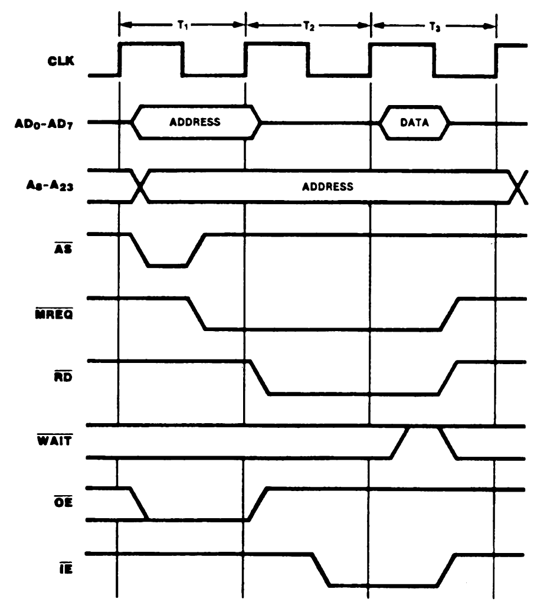 
_Figure 12-2. Memory Read Timing_

 

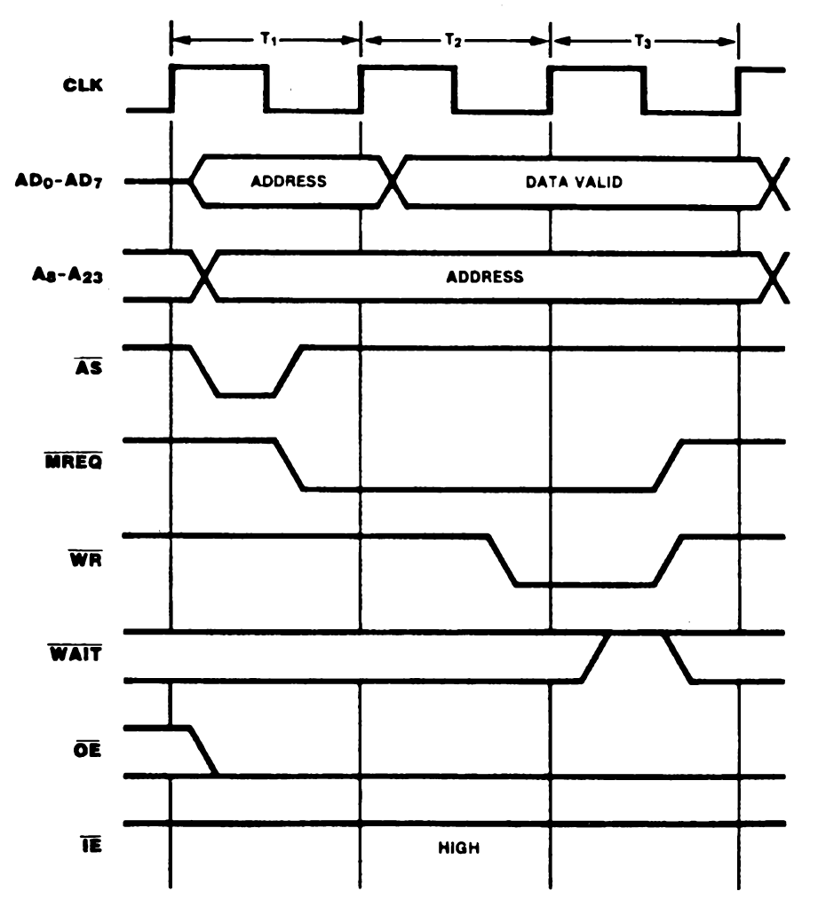 
_Figure 12-3. Memory Write Timing_

 

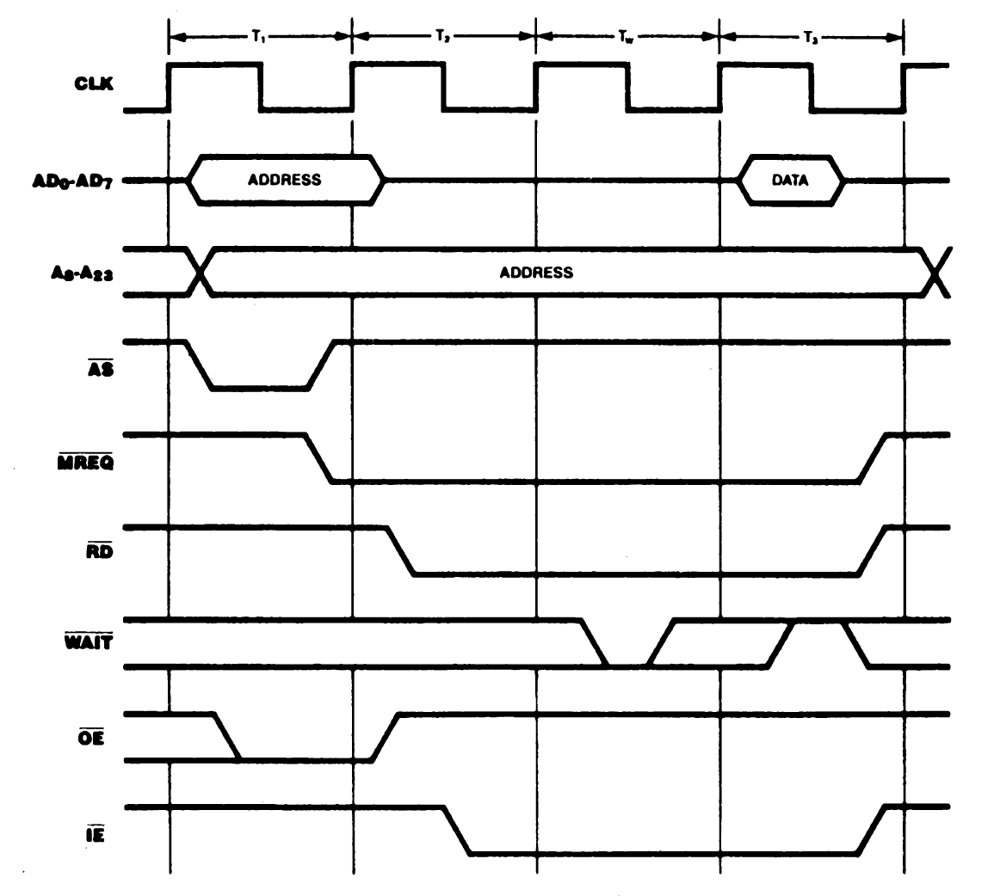 
_Figure 12-4. Memory Read Timing with One External Wait State_

 

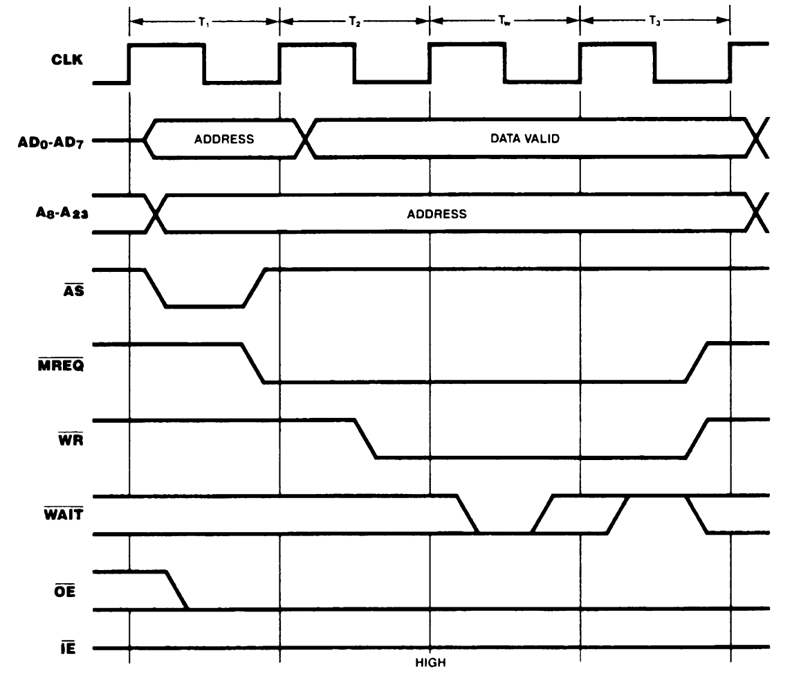 
_Figure 12-5. Memory Write Timing with One External Wait State_

 

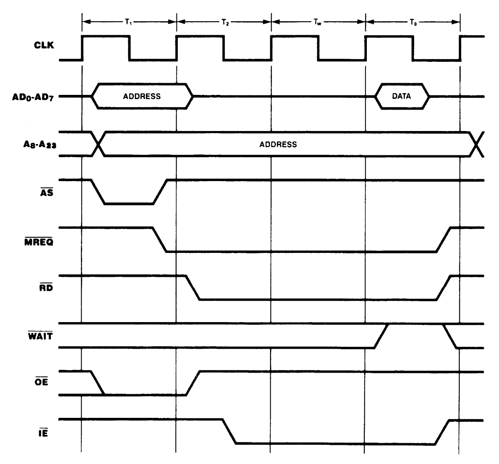 
_Figure 12-6. Memory Read Timing with One Internal Wait State_

### 12.5.2 RETI Transactions

RETI transactions (Figure 12-7) are similar to memory read transactions with two exceptions: M1 is asserted throughout each read transaction, falling early in the first bus cycle, and <ins>MREQ</ins>, <ins>M1</ins>, <ins>RD</ins>, and <ins>IE</ins> are deasserted on the rising edge of the clock following the third cycle. Each of the read transactions is followed by a minimum of three bus cycles of inactivity. These transactions are invoked whenever an RETI instruction is encountered in the instruction stream; they are used to re-fetch the instruction from external memory so that interrupt logic within Z8400 family peripherals that monitor the bus for this instruction will function correctly.

 

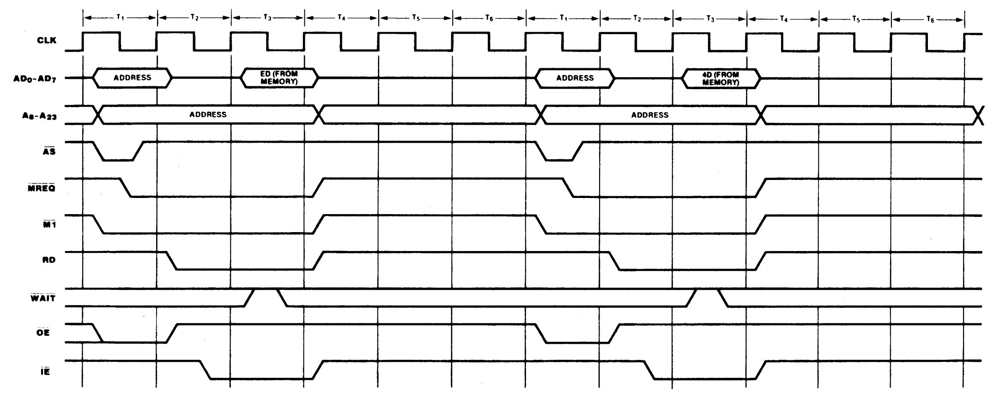 
_Figure 12-7. RETI Read Timing_

### 12.5.3 Halt and Refresh Transactions

There are two types of bus transactions that do not transfer data: Halt and Refresh transactions. These transactions are similar to memory transactions, except that RD and WR remain high, the <ins>WAIT</ins> input is not sampled, and no data is transferred.

Halt transactions (Figure 12-8) are identical to memory read transactions except that <ins>HALT</ins> is asserted throughout the transaction, falling during the second half of the first bus cycle, and remains asserted after the transaction is completed. This transaction is invoked when a <ins>HALT</ins> instruction is executed or a fatal seguence of traps occurs. For Halt transactions generated by the <ins>HALT</ins> instruction, once the Halt transaction is completed, all subseguent CPU activity is suspended until an active interrupt reguest or reset is detected. After Halt transactions generated due to a fatal condition, all CPU activity is suspended until an active reset is detected (see section 6.6). The <ins>HALT</ins> line remains asserted until the interrupt reguest is acknowledged or the reset is received. Refresh transactions or DMA transfers may occur while <ins>HALT</ins> is asserted; also, the bus can be granted. The address put out during the address phase of the Halt transaction is the address of the Halt instruction or the instruction that initiated the fatal seguence of traps.

 

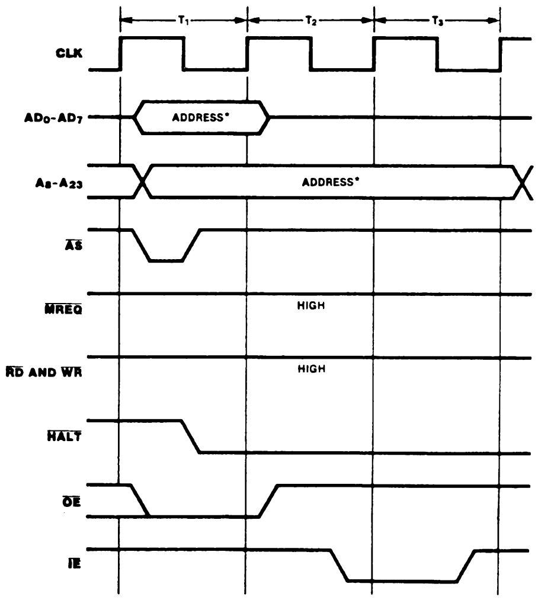 
\* Address of HALT instruction.

_Figure 12-8. Halt Timing_

 

A memory refresh transaction (Figure 12-9) is generated by the Z280 MPU refresh mechanism and can occur immediately after the final clock cycle of any other transaction. The memory refresh counter'8 10-bit address is output on AD0-AD7, A8, and A9 when AS is asserted; the remaining address lines are undefined. The <ins>RFSH</ins> line is activated concurrent with <ins>MREQ</ins>. This transaction can be used to generate refreshes for dynamic RAMs. Refreshes may occur while the CPU is in the Halt state.

 

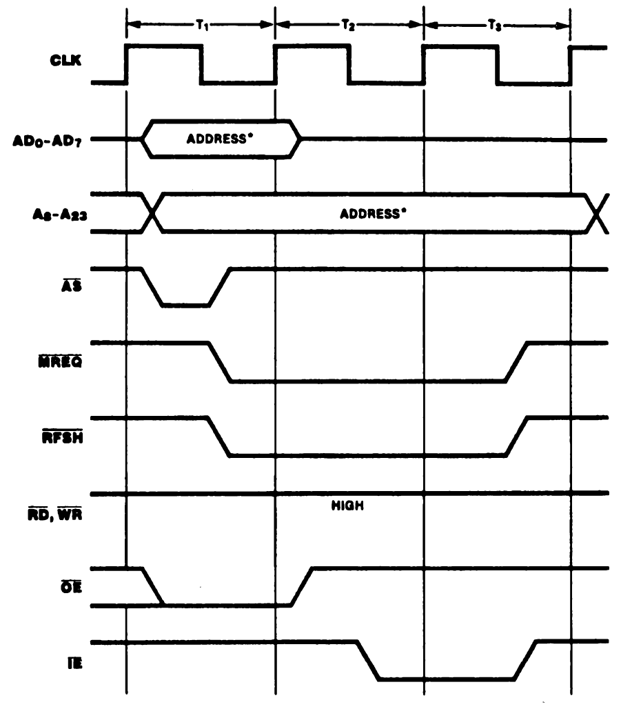 
\* 10 least significant bits are Refresh address, the rest are undefined.

_Figure 12-9. Memory Refresh Timing_

### 12.5.4 I/O Transactions

I/O transactions move data to or from peripherals and are generated during the execution of I/O instructions or during DMA-controlled transfers. I/O transactions to devices in I/O pages FEH and FFH do not generate external bus transactions.

Figures 12-10 and 12-11 illustrate I/O transaction timing. I/O transactions are four clock cycles long at a minimum, and, like memory transactions, may be lengthened by the addition of wait cycles. I/O transaction timing is similar to memory transaction timing with one automatic wait state.

The <ins>IORQ</ins> line indicates that an I/O transaction is taking place. The I/O address is found on AD0-AD7 and A8-A23 when <ins>AS</ins> rises. For read operations, <ins>RD</ins> and </ins>IE</ins> are asserted during the second clock cycle, and input data from the peripheral is sampled by the bus master during the fourth cycle (unless additional wait states are inserted in the transaction). For write operations, <ins>WR</ins> is asserted during the second cycle with <ins>OE</ins> remaining asserted; output data to the peripheral is placed on the bus at this time.

 

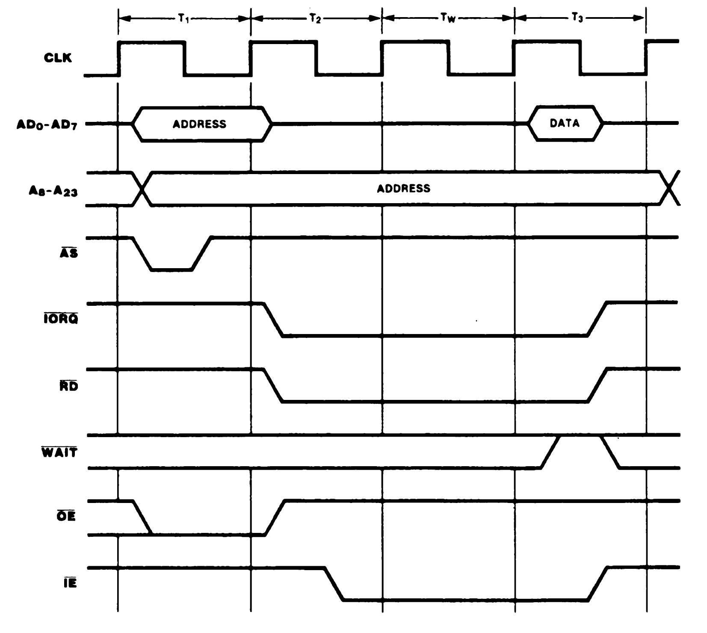 
_Figure 12-10. I/O Read Timing_

 

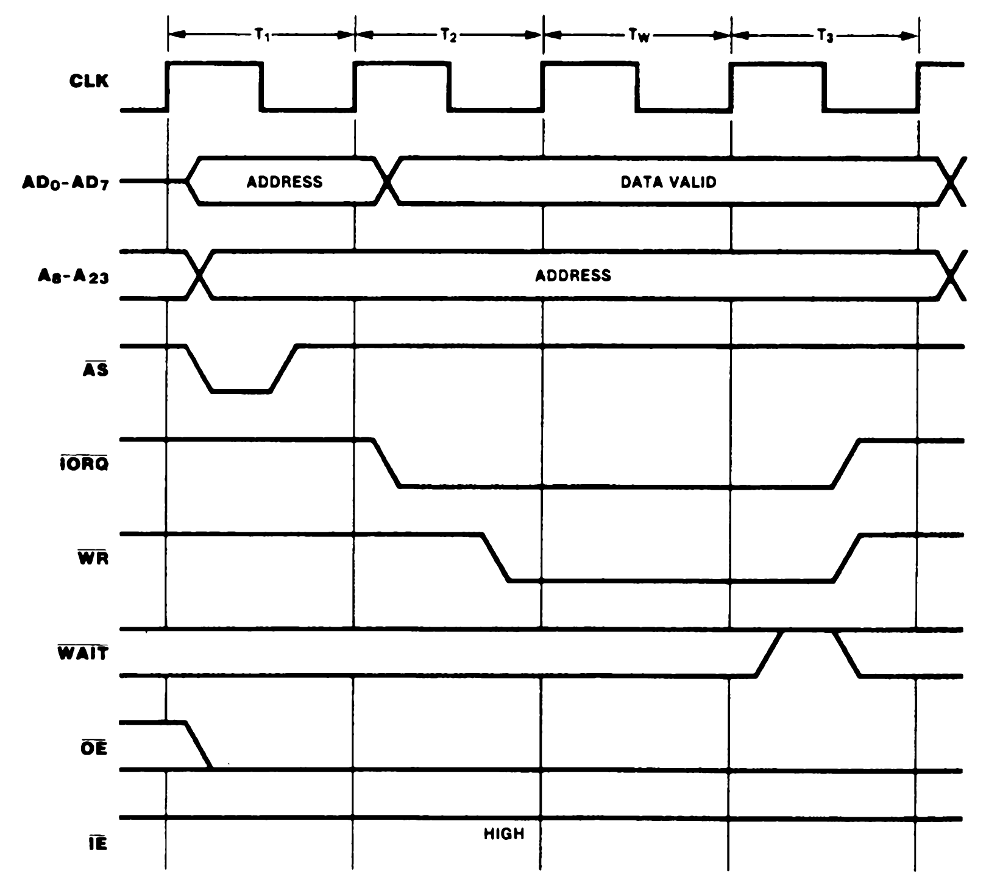 
_Figure 12-11. I/O Write Timing_

### 12.5.5 Interrupt Acknowledge Transactions

Interrupt acknowledge transactions acknowledge an interrupt and read information from the device that generated the interrupt. These transactions are generated automatically by the CPU when an interrupt request is detected.

Interrupt acknowledge transactions are five cycles long at a minimum, with two automatic wait cycles (Figure 12-12). The wait cycles are used to give the interrupt priority daisy chain (or other priority resolution devices) time to settle before the identifier or vector is read. Additional automatic wait states can be generated by programming the Bus Timing and Control register.

 

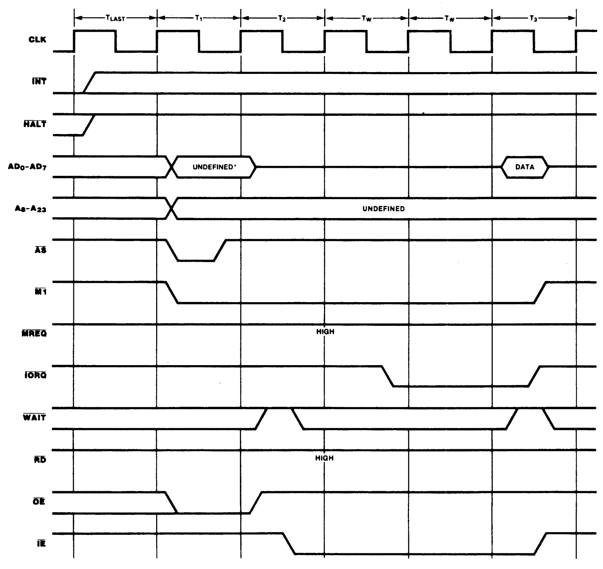 
\* AD1 and AD2 indicate type of interrupt being acknowledged

_Figure 12-12. Interrupt Acknowledge Sequence_

 

The interrupt acknowledge transaction is indicated by an M1 assertion without <ins>MREQ</ins> during the first cycle. The AD1 and AD2 address lines indicate the type of interrupt being acknowledged when <ins>AS</ins> is asserted (see Table 6-4); the remaining address lines are undefined. The <ins>IORQ</ins> signal becomes active during the third cycle to indicate that the interrupting device can place an 8-bit identifier or vector on the bus. It is captured from the AD lines on the falling clock edge before <ins>IORQ</ins> is raised high.

There are two places where the <ins>WAIT</ins> line is sampled and, thus, where wait states can be inserted by external circuitry. The first, during T2, serves to delay the falling edge of <ins>IORQ</ins> to allow the daisy chain a longer time to settle; the second, during T3, serves to delay the point at which the identifier or vector is read. Software-generated wait states can also be added at either time via programming of the DC and I/O fields in the Bus Timing and Control register. As always, software-generated wait states are inserted into the transaction before the external <ins>WAIT</ins> signal is sampled.

### 12.5.6 DMA Flyby Transactions

On-chip DMA channels 0 and 1 can transfer data between memory and peripheral devices using flyby type transfers; external DMA controllers in Z280 MPU systems may also have this capability. The timing of flyby transactions is identical to memory transaction timing, with the exception that the DMA Flyby Strobe (<ins>DMASTB</ins>) signal is activated; the <ins>DMASTB</ins> signal is used to select the participating I/O device that must capture or supply the data during the memory access transaction.

Flyby transactions controlled by the on-chip DMA channels always include one automatic wait state (Figures 12-13 and 12-14). As with all memory transactions, other hardware- and software- generated wait states can be added to the transaction. The external <ins>WAIT</ins> signal is sampled at two different times: during the automatic wait state and during T3.

 

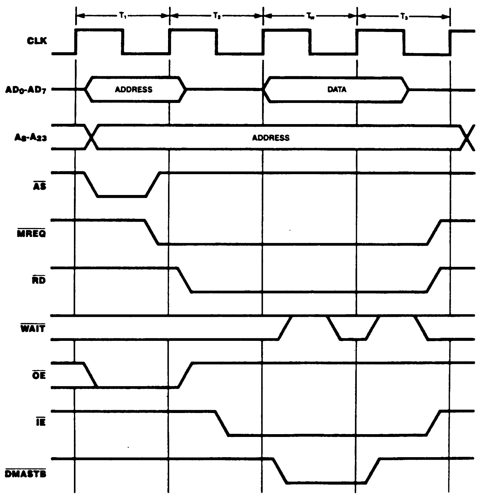 
_Figure 12-13. On-Chip DMA Channel Flyby Memory Read Transaction_

 

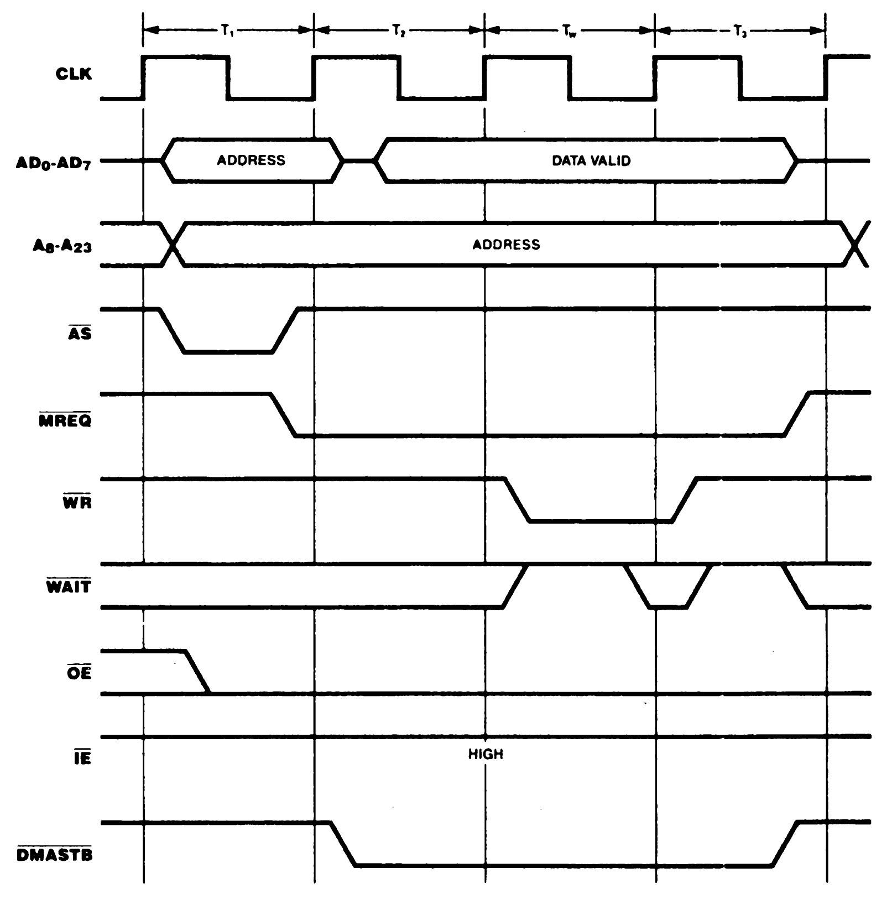 
_Figure 12-14. On-Chip DMA Channel Flyby Memory Write Transaction_

 

For flyby transactions that read from memory and write to a peripheral (Figure 12-13), <ins>DMASTB</ins> is asserted during the automatic wait state and any subsequent wait states added by an active <ins>WAIT</ins> signal sampled during the automatic wait state. Thus, if the <ins>WAIT</ins> input is asserted during the automatic wait state, the additional wait states extend the width of the <ins>DMASTB</ins> pulse. Wait states added via the assertion of <ins>WAIT</ins> during T3 (after <ins>DMASTB</ins> is deasserted) stretch the <ins>RD</ins> signal without affecting <ins>DMASTB</ins>.

For flyby transactions that read from a peripheral and write to memory (Figure 12-14), <ins>DMASTB</ins> is asserted at the beginning of T2 and remains asserted until the second half of T3. The signal is asserted only during the automatic wait state and any subsequent wait states added by sampling <ins>WAIT</ins> during the automatic wait state. Wait states added via the assertion of <ins>WAIT</ins> during T3 stretch the <ins>DMASTB</ins> signal without affecting <ins>WR</ins>.

## 12.6 REQUESTS

The Z280 MPU supports three types of request signals: interrupt requests, local bus requests, and global bus requests. A request is answered according to its type. Interrupt requests are generated by peripheral devices; the Z280 MPU responds with an Interrupt Acknowledge transaction. Local bus requests are initiated by an external potential bus master; the Z280 MPU responds by relinquishing the bus and generating an active Bus Acknowledge signal. Global bus requests are generated by the Z280 CPU or an on-chip DMA channel to access a global bus; the Z280 MPU receives a Global Bus Acknowledge signal in response to the request.

### 12.6.1 Interrupt Requests

The Z280 CPU supports two types of interrupts, maskable <ins>INT</ins> and nonmaskable (<ins>NMI</ins>). The interrupt request line from a device capable of generating interrupts can be tied to the 7.280 MPU's <ins>INT</ins> or <ins>NMI</ins> inputs; several devices can be connected to one interrupt request input, with interrupt priorities established via external logic or a priority daisy chain. However, all Z8400 family peripherals in a Z280-based system will respond to the RETI transaction. Therefore, either all Z8400 family peripherals should use the same interrupt request line or, alternatively, no nesting of interrupts should be allowed among the Z8400 peripherals using different interrupt request lines.

Nonmaskable interrupt requests are edge-triggered, but maskable interrupts are level-triggered. Any high-to-low transition on the <ins>NMI</ins> input is asynchronously edge-detected, and an internal <ins>NMI</ins> latch is set. At the beginning of the last clock cycle during execution of an instruction, the maskable interrupt inputs are sampled along with the state of the internal <ins>NMI</ins> latch. If an interrupt is detected, and that interrupt is enabled in the Master Status register, interrupt processing proceeds in accordance with the current interrupt mode, as described in Chapter 6.

### 12.6.2 Local Bus Requests

To generate transactions on the bus, a potential bus master (such as a DMA controller) must gain control of the bus by making a bus request. A bus request is initiated by pulling <ins>BUSREQ</ins> low; the Z280 MPU responds by 3-stating its address, data, bus control, and bus status outputs and asserting an active <ins>BUSACK</ins>, as described in section 10.2. The CPU regains control of the bus after <ins>BUSREQ</ins> rises. The on-chip DMA channels have higher priority than external devices requesting the bus via <ins>BUSREQ</ins>.

### 12.6.3 Global Bus Requests

If the multiprocessor mode is specified in the Bus Timing and Initialization register, then the contents of the Local Address register determine the range of memory addresses dedicated to the shared global bus. Before accessing an address on the global bus, the Z280 MPU must issue a Global Bus Request (<ins>GREQ</ins>) and receive an active Global Bus Acknowledge (<ins>GREGACKQ</ins>) signal, as described in Section 10.3.

Figure 12-15 illustrates the timing of the global bus request/acknowledge sequence. When the Z280 MPU needs to access a location on the global bus, <ins>GREQ</ins> is asserted in order to request use of the global bus. <ins>GREGACKQ</ins> is then sampled on each successive rising edge of the clock; when <ins>GREGACKQ</ins> becomes active (and if <ins>BUSREQ</ins> is not asserted), the memory transaction proceeds as described in section 12.5.1. <ins>GREQ</ins> is deasserted in the bus clock cycle immediately following the end of the memory transaction (except when executing the Test and Set instruction, where both the memory read and write operations are executed before deasserting <ins>GREQ</ins>).

 

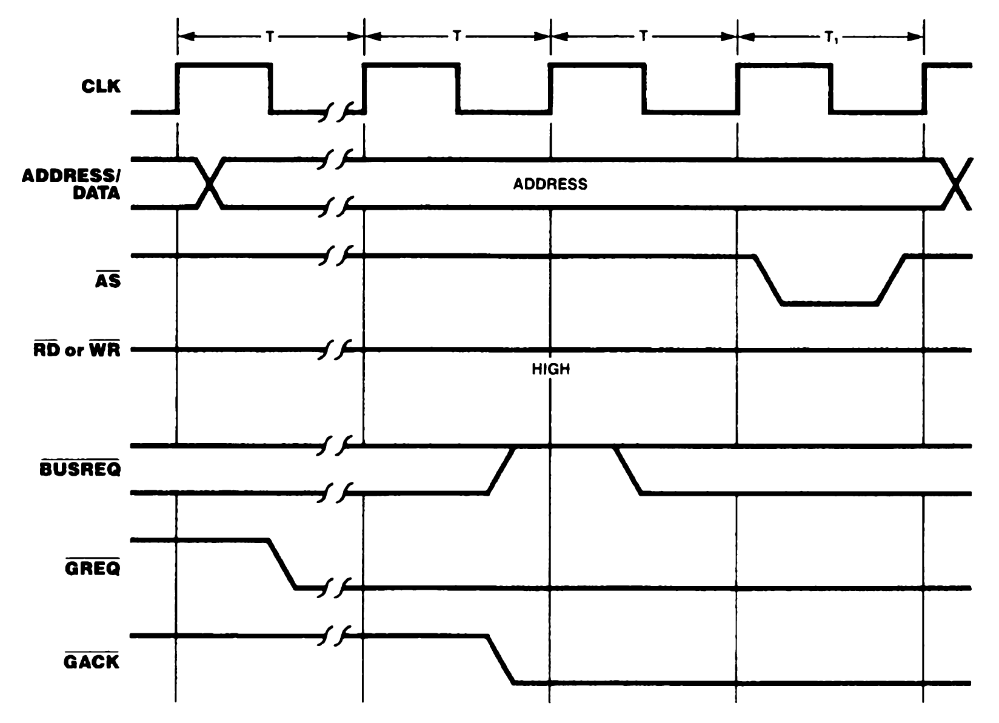 
_Figure 12-15. Multiprocessor Mode Timing_