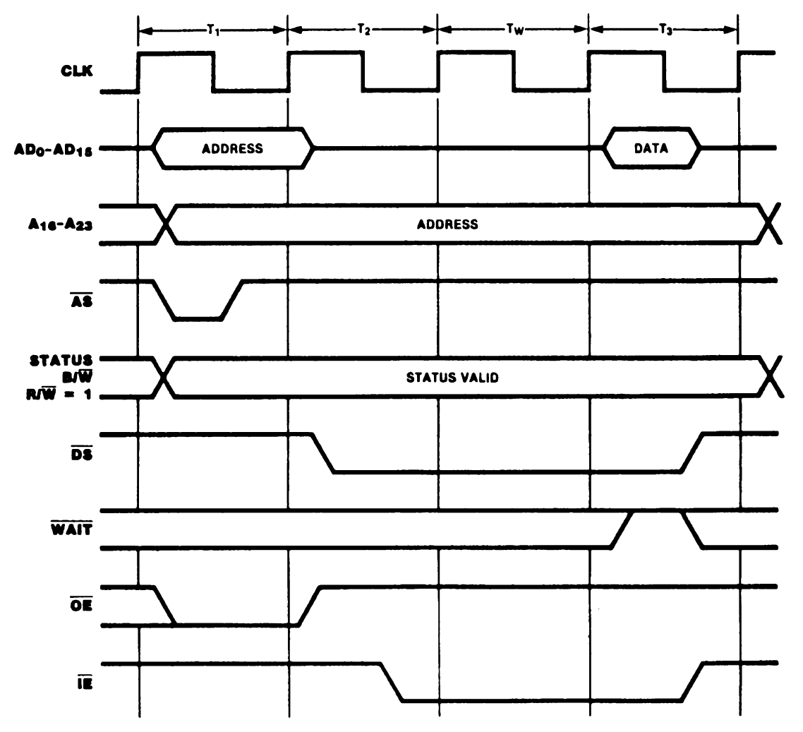

# 13. Z-BUS External Interface

## Index

[13.1 INTRODUCTION](#131-introduction)

[13.2 BUS OPERATIONS](#132-bus-operations)

[13.3 PIN DESCRIPTIONS](#133-pin-descriptions)

[13.4 BUS CONFIGURATION AND TIMING](#134-bus-configuration-and-timing)

[13.5 TRANSACTIONS](#135-transactions)

[13.5.1 Memory Transactions](#1351-memory-transactions)

[13.5.2. Halt and Refresh Transactions](#1352-halt-and-refresh-transactions)

[13.5.3 I/O Transactions](#1353-io-transactions)

[13.3.4 Interrupt Acknowledge Transactions](#1334-interrupt-acknowledge-transactions)

[13.5.3 Extended Processing Unit (EPU) Transactions](#1353-extended-processing-unit-epu-transactions)

[13.5.6 DMA Flyby Transactions](#1356-dma-flyby-transactions)

[13.6 REQUESTS](#136-requests)

[13.6.1 Interrupt Requests](#1361-interrupt-requests)

[13.6.2 Local Bus Requests](#1362-local-bus-requests)

[13.6.3 Global Bus Requests](#1363-global-bus-requests)

## 13.1 INTRODUCTION

The Z280 MPU is typically only one component in a system that may include memory, peripherals, slave processors, coprocessors, and other CPUs, all connected via a system bus. Two different component-interconnect bus schemes are available with the Z280 MPU: the Z80 Bus and the Z-BUS.

This chapter describes the external manifestations (that is, the activity on the pins) that result from CPU or on-chip peripheral activity for the Z-BUS configurations of the Z280 MPU. (The Z80 Bus external interface is described in Chapter 12.) Since the pins are connected to the system bus, most of this discussion will center on the bus and bus operations.

The condition of the OPT pin determines the configuration of the bus interface for the Z280 MPU: the Z-BUS configuration is selected either by applying a logical 1 (Vcc) level on the OPT pin or by leaving the OPT pin disconnected.

The Z-BUS on the Z280 MPU includes a 24-bit address bus, 16-bit data bus, and associated status and control signals. The data bus is multiplexed with the low-order 16 bits of the address bus. The Z-BUS configuration of the Z280 MPU supports the use of Extended Processing Units and burst-mode memories. Figure 13-1 shows the pin functions and pin assignments for the Z-BUS configuration of the Z280 MPU. The Z-BUS described here is compatible with Zilog's Z8000 family of peripheral devices. Other Z-BUS compatible components include the Z8000 family of CPUs. Refer to Zilog's Component Data Book for a complete description of the Z-BUS Component Interconnect convention.

 

 
\* Multiplexed with CTIN0 
\** Multiplexed with CTIO0

_Figure 13-1a. Pin Functions_

 

 
_Figure 13-1b. Pin Assignments_
 

_Figure 13-1. Z-BUS Configuration (input OPT tied to + 5V or not connected)_

## 13.2 BUS OPERATIONS

Two kinds of operations can occur on the Z-BUS: transactions and requests. At any given time only one device (either the CPU or a bus requestor such as a DMA channel) can be in control of the bus; this device is called the bus master. Transactions are always initiated by the bus master and are responded to by some other device on the bus. Only one transaction can proceed at a time. Requests can be initiated by a device that does not have control of the bus.

Seven types of transactions can occur on the Z-BUS, as described below:

**Memory transaction.** CPU- or DMA-controlled transfer of data to or from a memory location.

**Halt transaction.** Transaction indicating that the CPU is entering the Halt state due to execution of a HALT instruction or a fatal sequence of traps.

**Refresh.** Transaction that refreshes dynamic memory; refresh transactions do not involve a transfer of data.

**I/O transaction.** CPU- or DMA-controlled transfer of data to or from a peripheral device.

**Interrupt Acknowledge.** CPU-controlled transaction used to acknowledge an interrupt and read data from the interrupting device.

**EPU transaction.** A transfer of data from an Extended Processing Unit (EPU) to the CPU.

**DMA Flyby transaction.** A DMA-controlled transaction that transfers data between a memory location and a peripheral device.

Two types of requests can occur on the Z-BUS, as described below:

**Interrupt request.** A request initiated by a peripheral device to gain the attention of the CPU.

**Bus request.** A request by an external device (typically a DMA channel) to gain control of the bus in order to initiate transactions.

A request is answered by the CPU according to its type: for interrupt requests, an interrupt
acknowledge sequence is generated; for bus requests, the CPU relinquishes the bus and activates an acknowledge signal.

## 13.3 PIN DESCRIPTIONS

The pin functions and assignments for the Z-BUS configuration of the Z280 MPU are illustrated in Figure 13-1. A functional description of each pin is given below:

**A16-A23.** _Address_ (output, active High, 3-state). These address lines carry I/O addresses and memory addresses during bus transactions.

**AD0-AD15.** _Address/Data_ (bidirectional, active High, 3-state). These 16 multiplexed address and data lines carry I/O addresses, memory addresses, and data during bus transactions.

**<ins>AS</ins>.** _Address Strobe_ (output, active Low, 3-state). The rising edge of Address Strobe indicates the beginning of a transaction and shows that the address, status, R/W, and B/W signals are valid.

**<ins>BUSACK</ins>.** _Bus Acknowledge_ (output, active Low). A Low on this line indicates that the CPU has relinquished control of the bus in response to a bus request.

**<ins>BUSREQ</ins>.** _Bus Request_ (input, active Low). A Low on this line indicates that an external bus requester has obtained or is trying to obtain control of the bus.

**B/<ins>W</ins>.** _Byte/Word_ (output, Low = Word, 3-state). This signal indicates whether a byte or a word of data is to be transmitted during a transaction.

**CLK.** _Clock Output_ (output). The frequency of the processor timing clock is derived from the oscillator input (external oscillator) or crystal frequency (internal oscillator) by dividing the crystal or external oscillator input by two. Thee processor clock is further divided by one, two, or four (as programmed), and then output on this line.

**CTIN.** _Counter/Timer Input_ (input, active High). These lines receive signals from external devices for the counter/timers.

**CTIO.** _Counter/Timer I/O_ (bidirectional, active High, 3-state). These I/O lines transfer signals between the counter/timers and external devices.

**<ins>DMASTB</ins>.** _DMA Flyby Strobe_ (output, active Low). These lines select peripheral devices for DMA flyby transfers.

**<ins>DS</ins>.** _Data Strobe_ (output, active Low, 3-state). This signal provides timing for data movement to or from the bus master.

**<ins>EOP</ins>.** _End of Process_ (input, active Low). An external source can terminate a DMA operation in progress by driving EOP Low. EOP always applies to the active channel; if no channel is active, EOP is ignored.

**<ins>GACK</ins>.** _Global Acknowledge_ (input, active Low). A Low on this line indicates the CPU has been granted control of a global bus.

**<ins>GREQ</ins>.** _Global Request_ (output, active Low, 3-state). A Low on this line indicates the CPU has obtained or is trying to obtain control of a global bus.

**<ins>IE</ins>.** _Input Enable_ (output, active Low, 3-state). A Low on this line indicates that the direction of transfer on the Address/Data lines is toward the CPU.

**<ins>INT</ins>.** _Maskable Interrupt_ (input, active Low). A Low on these lines requests an interrupt.

**<ins>NMI</ins>.** _Nonmaskable Interrupt_ (input, falling-edge activated). A High-to Low transition on this line requests a nonmaskable interrupt.

**<ins>OE</ins>.** _Output Enable_ (output, active Low, 3-state). A Low on this line indicates that the direction of transfer on the Address/Data lines is away from the MPU.

**OPT.** _Bus Option_ (input). This signal establishes the bus option during reset as follows:

OPT | Bus Interface
|-|-|
0 | Z80-Bus, 8-bit
1 |  Z-BUS, 16-bit

**<ins>PAUSE</ins>.** _CPU Pause_ (input, active Low). While this line is Low the CPU refrains from transferring data to or from an Extended Processing Unit in the system or from beginning the execution of an instruction.

**<ins>RDY</ins>.** _DMA Ready_ (input, active Low). These lines are monitored by the DMA channels to determine when a peripheral device associated with a DMA channel is ready for a read or write operation. When a DMA channel is enabled to operate, its Ready line indirectly controls DMA activity; the manner in which DMA activity is controlled by the line varies with the operating mode (single-transaction, burst, or continuous).

**<ins>RESET</ins>.** _Reset_ (input, active Low). A Low on this line resets the CPU and on-chip peripherals.

**R/<ins>W</ins>.** _Read/Write_ (output, Low = Write, 3-state). This signal determines the direction of data transfer for memory, I/O, or EPU transfer transactions.

**RxD.** _UART Receive_ (input, active High). This line receives serial data at standard TTL levels.

**ST0-ST3.** _Status_ (output, active High, 3-state). These four lines indicate the type of transaction occurring on the bus and give additional information about the transaction.

**TxD.** _UART Transmit_ (output, active High). This line transmits serial data at standard TTL levels.

**<ins>WAIT</ins>.** Wait (input, active Low). A Low on this line indicates that the responding device needs more time to complete a transaction.

**XTALI.** _Clock/Crystal Input_ (time-base input). Connects a parallel-resonant crystal or an external single-phase clock to the on-chip clock oscillator.

**XTALO.** _Crystal Output_ (time-base output). Connects a parallel-resonant crystal to the on-chip clock oscillator.

**+5V.** _Power Supply Voltage._ (+5 nominal).

**GND.** _Ground._ Ground reference.

## 13.4 BUS CONFIGURATION AND TIMING

Four Z280 CPU control registers specify certain characteristics of the Z280 MPU's external interface and determine bus timing: the Bus Timing and Initialization register, Bus Timing and Control register, Local Address register, and Cache Control register.

Bus timing is determined by the frequency of the Z280 MPU's external clock source or crystal and the contents of the Bus Timing and Initialization register, which receives its initial values as part of the reset process (see section 3.2.1).

The frequency of the processor clock is one-half of the frequency of the external clock source or crystal. The processor clock can be further divided by a factor of 1, 2, or 4 to provide the bus timing clock, as specified by the contents of the Clock Scaling field in the Bus Timing and Initialization register. The bus timing clock is output by the MPU as the CLK signal. In the logical timing diagrams that follow, signal transitions on the bus are shown in relation to the bus clock, CLK.

The number of automatic wait states included in a given transaction is determined by the contents of the Bus Timing and Initialization and Bus Timing and Control registers. The physical memory address space is divided into two sections based on the most significant physical address bit, A23. Up to three automatic wait states can be added to transactions to the lower half of memory (addresses where A23 = 0); similarly, up to three automatic wait states can be added to transactions to the upper half of memory (A23 = 1), to all I/O transactions, and to interrupt acknowledge transactions.

The state of the Multiprocessor Configuration Enable bit in the Bus Timing and Initialization register and the contents of the Local Address register determine which memory transactions require use of a global bus, as described in section 10.3. The contents of the Cache Control register and the state of the address tags and valid bits in the cache memory determine which transactions employ the cache memory and which transactions use the external bus interface, as described in Chapter 8.

## 13.5 TRANSACTIONS

At any given time, one device (either the CPU or a bus requester) has control of the bus and is known as the bus master. A transaction is initiated by the bus master and is responded to by some other device on the bus. Information transfers (both instructions and data) to and from the Z280 MPU are accomplished through the use of transactions. All transactions start when Address Strobe (<ins>AS</ins>) is driven low and then raised high.

On the rising edge <ins>AS</ins>, the bus status signals (ST0-ST3, R/<ins>W</ins>, and B/<ins>W</ins>) are valid. The ST0-ST3 status lines indicate the type of transaction being performed (Table 13-1). Typically, these signals are decoded and used to enable the appropriate buffers, drivers, and chip select logic necessary for proper completion of the data transfer.

 

Status Lines 3..0 | Type of Transaction
|-|-|
0000 | Reserved
0001 | Refresh
0010 | I/O transaction
0011 | Halt
0100 | Interrupt acknowledge line A
0101 | <ins>NMI</ins> acknowledge
0110 | Interrupt acknowledge line B
0111 | Interrupt acknowledge line C
1000 | Transfer between CPU and memory, cacheable
1001 | Transfer between CPU and memory, non-cacheable
1010 | Data transfer between EPU and memory
1011 | Reserved
1100 | EPU Instruction fetch, template, subsequent words.
1101 | EPU Instruction fetch, template, first word
1110 | Data transfer between EPU and CPU
1111 | Test and Set (data transfers)

_Table 13-1. ST Status Line Decode_

 

If the transaction requires an address, the address is valid on the rising edge of <ins>AS</ins>. Thus, <ins>AS</ins> can be used to latch Z280 MPU addresses to de-multiplex the Address/Data lines. No address is required for EPU-CPU or Interrupt Acknowledge transactions; the contents of the A and AD lines are undefined while <ins>AS</ins> is asserted during these transactions. If an address is generated for a transaction, the Output Enable (<ins>OE</ins>) signal is activated coincident with <ins>AS</ins> assertion.

The Z-BUS MPUs use Data Strobe (<ins>DS</ins>) to time the transfer of data. For transactions that do not involve the transfer of data (Refresh and Halt transactions), <ins>DS</ins> is not activated. During write operations (R/W = low), a low on <ins>DS</ins> indicates that valid data from the bus master is on the Address/Data lines. The Output Enable line continues to be asserted until <ins>DS</ins> is deasserted. For Read Operations (R/W = high), the bus master drives <ins>DS</ins> low when the addressed device is to put its data on the bus. Coincident with the assertion of DS during a read operation, the AD lines are 3-stated by the bus master, <ins>OE</ins> is deasserted, and Input Enable (<ins>IE</ins>) is asserted. The bus master samples the data on the falling clock edge just before deasserting <ins>DS</ins> and <ins>IE</ins>.

The Z280 MPU's <ins>WAIT</ins> input provides a mechanism whereby the timing of a particular transaction can be extended to accommodate a memory or peripheral device with a long access time. The <ins>WAIT</ins> line is sampled on the falling clock edge when data is to be sampled (i.e. just before <ins>DS</ins> rises) during a transaction. If the <ins>WAIT</ins> line is low, another bus clock cycle is added to the transaction before data is sampled and <ins>DS</ins> rises. In this added cycle, and all subsequent cycles added due to <ins>WAIT</ins> being low, the <ins>WAIT</ins> line is sampled on the falling edge of the clock and, if it is low, another cycle is added to the transaction. In this way, the transaction can be extended by external logic to an arbitrary length, in increments of one bus clock cycle.

The <ins>WAIT</ins> input is synchronous, and must meet the specified setup and hold times in order for the Z280 MPU to function correctly. This requires asynchronously-generated <ins>WAIT</ins> signals to be synchronized to the CLK output before they are input into the Z280 MPU. Automatic wait states can also be generated by programming the Bus Timing and Control register and Bus Timing and Initialization register; these are inserted in the transaction before the external <ins>WAIT</ins> signal is sampled.

### 13.5.1 Memory Transactions

Memory transactions move instructions or data to or from memory when a bus master makes a memory access. Thus, they are generated during program execution to fetch instructions from memory and to fetch and store memory data. They are also generated to store old program status and fetch new program status during interrupt and trap handling, and to transfer information during DMA-controlled memory accesses. A memory transaction is three bus cycles long unless extended with hardware- and/or software-generated wait states, as explained previously.

During memory transactions, the ST3-ST0 status lines indicate that a memory transaction is occurring and provide the following information:

* Whether the memory access is cacheable (ST3-ST0 = 1000) or noncacheable (ST3-ST0 = 1001).

* Whether the memory access is a fetch of an extended instruction's template intended for an EPU (ST3-ST0 = 1100 or 1101).

* Whether the data is supplied or captured by an Extended Processor Unit while executing an extended instruction (ST3-ST0 = 1010).

* Whether the memory access is part of an atomic read-modify-write operation during the execution of a Test and Set instruction (ST3-ST0 = 1111).

A memory read is distinguished from a memory write via the R/<ins>W</ins> signal.

#### 13.5.1.1 Byte/Word Organization

The byte is the basic addressable memory element in Z280 MPU systems. However, although memory is addressed as bytes, the Z-BUS configuration of the Z280 MPU has a 16-bit data path, and memory transactions can be byte or word transfers. Each 16-bit word in memory is made up of two 8-bit bytes, where the least-significant byte proceeds the most-significant byte of the word, as in the Z80 CPU architecture. For example, the word at memory location 5000H has its low-order byte at location 5000H and its high-order byte at location 5001H.

Bytes transferred to or from odd memory locations (address bit 0=1) are always transmitted on lines AD0-AD7. Bytes transferred to or from even memory locations (address bit 0=0) are always transmitted on lines AD8-AD15. For byte reads (B/<ins>W</ins> = high, R/<ins>W</ins> = high), the CPU or on-chip DMA channel uses only the byte whose address it put out on the bus. In other words, for a byte read with an odd address, the CPU or DMA channel will only read the lower half of the bus; for a byte read with an even address, the CPU or DMA channel will only read the upper half of the bus. For byte writes (B/<ins>W</ins> = high, R/<ins>W</ins> = low), the CPU or on-chip DMA channel (flowthrough mode) places the byte to be written on both halves of the bus, and the proper byte must be selected in the memory control logic by testing address bit 0.

For word transfers (B/<ins>W</ins> = low), all 16 bits are captured by the CPU or DMA channnel during reads (R/<ins>W</ins> = high) or stored by the memory during writes (R/<ins>W</ins> = low). The most-significant byte of the word is transferred on AD0-AD7 and least-significant byte on AD8-AD15; thus, the bytes of data will appear swapped on the bus, with the most significant byte on the lower half of the bus and the least significant byte on the upper half of the bus. Word transfers always use even-valued addresses (address bit 0 = 0) and result in an access to the byte at the even address and the next consecutive byte at the following odd address. For example, a word access to location 5000H would access the byte at location 5000H (transferred on AD8-AD15) and the byte at location 5001H (transferred on  AD0-AD7).

Instruction fetches are always executed as word transactions. However, instruction opcodes need not be aligned on even-address boundaries; the CPU will use only one byte of the fetched word if appropriate.
Data accesses may be byte or word accesses. Data words aligned at even-address memory boundaries are accessed via one word transaction. Data words on odd-address boundaries are accessed via two consecutive byte transactions.

#### 13.5.1.2 Memory Transaction Timing

Memory transaction timing is illustrated in Figures 13-2 and 13-3. During the first bus cycle, <ins>AS</ins> is asserted to indicate the beginning of a transaction; Output Enable (<ins>OE</ins>) is also asserted at this time. All address and status information is guaranteed valid on the rising edge of <ins>AS</ins>. The ST0-ST3 status lines indicate that a memory transaction is occurring. For a read operation (Figure 13-2), <ins>DS</ins> is activated during the first half of the second bus cycle, after the bus master has 3-3tated the AD lines; <ins>OE</ins> is deasserted at the beginning of the second cycle and Input Enable (<ins>IE</ins>) is asserted during the second half of the second cycle. The bus master samples the information returned from memory on the Address/Data bus on the falling edge of the clock during the third bus cycle; after the data is sampled, <ins>DS</ins> and <ins>IE</ins> are deasserted. For a write operation (Figure 13-3), <ins>DS</ins> is asserted during the second half of the second cycle, after the bus master has placed the data to be written on the AD lines, and <ins>OE</ins> stays active throughout the transaction.

 

 
_Figure 13-2. Memory Read Timing_

 

 
_Figure 13-3. Memory Write Timing_

 

The <ins>WAIT</ins> input is also sampled on the falling edge of the clock during the third clock cycle; if <ins>WAIT</ins> is low, another bus clock cycle is added before sampling the data. Wait states can also be added through programming of the Bus Timing and Initialization register and Bus Timing and Control register. For example, Figures 13-4, 13-5, and 13-6 illustrate memory transactions with one wait state.

 

 
_Figure 13-4. Memory Read Timing with External Wait Cycle_

 

 
_Figure 13-5. Memory Write Timing with External Wait Cycle_

 

 
_Figure 13-6. Memory Read Timing with Internal Wait Cycle_

#### 13.5.1.3 Burst Memory Transactions

The Z-BUS configuration of the Z280 MPU supports a special kind of memory transaction called a "burst memory transaction" for use in systems employing burst-mode memory devices. Control bits in the Cache Control register indicate whether portions of the memory system can support burst transactions; burst mode can be specified for either the upper half of memory (A23 = 1)> the lower half of memory (A23 = 0), or both.

Burst memory transactions are used only during instruction fetches to "prefetch" instructions into the on-chip cache. In a burst memory read, four consecutive words of memory are read. If a byte is to be read from a portion of external memory that supports burst transactions, and that read operation is cacheable, the CPU reads the four words that contain the desired byte of the instruction with a single burst transaction. The address of the first word read during a burst transaction has zeros in the three least significant bits. The CPU reads a total of eight bytes via four word transfers, where the last byte read has all ones in the three least significant bits of its address. This effectively increases the bus bandwidth by prefetching a cache block on a cache miss. Burst transactions are not used when fetching templates in extended instructions.

The timing of a burst transaction is illustrated in Figure 13-7. During burst transactions, four Data Strobes are generated with a single Address Strobe. Timing for the first data transfer is identical to that for a single memory read, including the insertion of automatic wait states.

This first transfer is immediately followed by three more transfers in the next three bus clock cycles. The <ins>WAIT</ins> input is sampled during each transfer and any resulting wait states, thereby allowing wait states to be added before any of the transfers. However, automatic wait states are added only before the first transfer.

 

 
_Figure 13-7. Burst Memory Read Timing_

#### 13.5.1.4 Test and Set Memory Transactions

The Test and Set (TSET) instruction provides a locking mechanism that can be used to synchronize software processes in a multitasking or multiprocessor system where exclusive access to certain resources is required. TSET tests and sets semaphores that control access to shared resources. Execution of TSET involves a memory read followed immediately by a memory write; the memory read followed by the memory write is one indivisible operation. The testing and setting of a semaphore requires the semaphore to be read from memory, modified, then written back into the same memory location. During the first of these two memory operations, the "1111" status code is placed on the ST3-ST0 status lines. This is particularly useful in a multiple microprocessor environment with semaphores in a shared memory area. The Test and Set status code can be used to control external circuitry that precludes memory access by another processor during the Test and Set semaphore operation. Furthermore, the <ins>BUSREQ</ins> input is disabled during a Test and Set operation to ensure that the semaphore is tested and set without any intervening accesses.

### 13.5.2. Halt and Refresh Transactions

There are two kinds of bus transactions that do not transfer data: Halt and Refresh transactions. These transactions are similar to memory transactions, except that <ins>DS</ins> remains high, the <ins>WAIT</ins> input is not sampled, and no data is transferred.

The Halt transaction (Figure 13-8) is generated when a HALT instruction is encountered or a fatal sequence of traps occurs. The "0011" status code on the ST3-ST0 lines identifies the Halt transaction. For Halt transactions generated by the HALT instruction, once the Halt transaction is executed, all subsequent CPU activity is suspended until an active interrupt request or reset is detected. After Halt transactions generated due to a fatal condition, all CPU activity is suspended until an active reset is detected (see section 6.6). However, Refresh transactions or DMA transfers may occur while the CPU is in the Halt state; also, the bus can be granted. The address emitted during the address phase of the Halt transaction is the address of the Halt instruction or the instruction that initiated the fatal sequence of traps.

 

 
\* Address of HALT instruction.

_Figure 13-8. Halt Timing_

 

A memory refresh transaction (Figure 13-9) is generated by the Z280 MPU refresh mechanism and can occur immediately after the final clock cycle of any other transaction. The memory refresh counter's 10-bit address is emitted on AD0-AD9 when <ins>AS</ins> is asserted; the contents of the remaining address lines are undefined. The "0001" status code on the ST3-ST0 lines identifies the Refresh transaction. This transaction can be used to generate refreshes for dynamic RAMs. Refreshes may occur while the CPU is in the Halt state.

 

 
\* 10 least significant bits are Refresh address.

_Figure 13-9. Memory Refresh Timing_

### 13.5.3 I/O Transactions

I/O Transactions move data to or from peripherals and are generated during the execution of I/O instructions or during DMA-controlled transfers. I/O transactions to devices in I/O pages FEH and FFH do not generate external bus transactions.

Figures 13-10 and 13—11 illustrate I/O transaction timing. I/O transactions are four clock cycles long at a minimum, and, like memory transactions, may be lengthened by the addition of wait cycles. I/O transaction timing is similar to memory transaction timing with one automatic wait state. The "0010" status code on the ST3-ST0 lines indicates that an I/O transaction is taking place, and the R/<ins>W</ins> line indicates the direction of the data transfer. The I/O address is found on AD0-AD15 and A16-A23 when <ins>AS</ins> rises. For read operations, <ins>DS</ins> and <ins>IE</ins> are asserted during the second clock cycle, and input data from the peripheral is sampled by the bus master during the fourth cycle (unless additional wait states are inserted in the transaction). Note that <ins>DS</ins> falls near the middle of T2 for I/O read transactions (as opposed to the beginning of T2 for memory reads); this provides peripheral control logic with additional time for address decoding. For write operations, <ins>DS</ins> is asserted during the second cycle with <ins>OE</ins> remaining asserted; output data to the peripheral is placed on the bus at this time.

For byte I/O operations (B/<ins>W</ins> = high), the byte of data is always transferred on the AD0-AD7 bus lines, regardless of the address of the peripheral device. For word I/O operations, the most significant byte of data is transferred on AD0-AD7 and the least significant ,byte on AD8-AD15 as with word memory transactions.

 

 
_Figure 13-10. I/O Read Timing_

 

 
_Figure 13-11. I/O Write Timing_

### 13.3.4 Interrupt Acknowledge Transactions

Interrupt Acknowledge transactions acknowledge an interrupt and read an identifier from the device that generated the interrupt. These transactions are generated automatically by the CPU when an interrupt request is detected.

Interrupt Acknowledge transactions are five cycles long at a mimimum, with two automatic wait cycles (Figure 13-12). The wait cycles are used to give the interrupt priority daisy chain (or other priority resolution devices) time to settle before the identifier is read. Additional automatic wait states can be generated by programming the Bus Timing and Control register.

The ST3-ST0 status lines indicate the type of interrupt being acknowledged. No address is generated, so the contents of the address bus are undefined when <ins>AS</ins> is asserted. The R/<ins>W</ins> line indicates read (high), and the B/<ins>W</ins> line indicates word (low). The identifier is sampled by the CPU on the <ins>AD</in s> lines at the falling clock edge before DS is raised high.

There are two places where the <ins>WAIT</ins> line is sampled and, thus, where wait states can be inserted by external circuitry. The first, during T2, serves to delay the falling edge of <ins>DS</ins> to allow the daisy chain a longer time to settle; the second, during T3, serves to delay the point at which the identifier is read. Software-generated wait states can also be added at either time via programming of the DC and I/O fields in the Bus Timing and Control register. As always, software-generated wait states are inserted into the transaction before the external <ins>WAIT</ins> signal is sampled.

 

 
_Figure 13-12. Interrupt Acknowledge Timing_

### 13.5.3 Extended Processing Unit (EPU) Transactions

Z280 MPUs in the Z-BUS configuration can operate in conjunction with one or more Extended
Processing Units (EPUs). Functioning as a coprocessor, the EPU monitors the status and timing signals output by the CPU so that it knows when to participate in a transaction. The Z280 MPU provides the address, status, and timing signals while the EPU supplies or captures data. Each of the four possible types of transactions that require EPU participation are signalled by the Z280 MPU ST3-ST0 outputs. CPU and EPU interaction is fully described in section 10.5.

#### 13.5.5.1 EPU Instruction Fetch

When the Z280 CPU encounters an extended instruction, the state of the EPU Enable bit in the Trap Control register is examined. If the EPU Enable bit is zero, the Z280 generates an Extended Instruction trap. If the EPU Enable bit is set to 1, then the four-byte EPU template is fetched from memory using memory transactions and captured by both the CPU and EPU. The "1101" status code on the ST3-ST0 lines indicates when the first word of the template is fetched, and the "1100" status code indicates fetches of the subsequent template word or words, depending on the alignment. The CPU fetches the template from external memory using two word transactions if the template is aligned (that is, starts on an even address) or a byte transaction followed by two word transactions if the template is unaligned. The opcode and addressing mode portion of the extended instruction may be executed from cache, but the template will always be fetched from external memory.

In a multiple EPU system, the EPU that is to participate in the execution of an extended instruction is selected implicitly by an identification code in the instruction template. Thus, there is no indication on the bus as to which EPU is cooperating with the CPU at any given time.

#### 13.5.5.2 Memory-EPU Transactions

If an extended instruction involves a read or write to memory, then the transfers of data between memory and the EPU are the next non-refresh transactions performed by the CPU following the fetch of the template. The timing of memory-EPU data transfers is shown in Figures 13-13 and 13-14. The EPU must supply the data during write operations (R/<ins>W</ins> = low) or capture the data during read operations (R/<ins>W</ins> = high), just as if it were part of the CPU. In both cases, the CPU 3-states its AD lines while data is being transferred (<ins>DS</ins> = low). EPU reads from memory are three cycles long unless extended by wait states. EPU writes to memory are six cycles long unless extended by wait states.

 

 
_Figure 13-13. Memory to EPU Timing_

 

 
_Figure 13-14. EPU Write to Memory_

#### 13.5.5.3 EPU-CPU Transactions

If an extended instruction involves a transfer from the EPU to the Z280 CPU, the next non-refresh transaction following the fetch of the template is the EPU-to-CPU data transfer (Figure 13-15).
EPU-to-CPU transactions have the same form as I/O read transactions and thus are four clock
cycles long, unless extended by wait states. Although <ins>AS</ins> is asserted, no address is generated and the contents of the address bus are undefined. The "1110" status code on the ST3-ST0 lines indicate an EPU-to-CPU transaction.

 

 
_Figure 13-15. EPU to CPU Timing_

#### 13.5.5.4 <ins>PAUSE</ins> Timing

The <ins>PAUSE</ins> signal is used to synchronize CPU-EPU activity in the case of overlapping extended instructions. The CPU samples the <ins>PAUSE</ins> signal within one bus clock period of the completion of the fetch of an extended instruction's template (Figure 13-16). If <ins>PAUSE</ins> is active when sampled, the CPU enters an idle state wherein all CPU activity is suspended. While in this idle state, the CPU samples the <ins>PAUSE</ins> input each processor clock cycle until <ins>PAUSE</ins> is deasserted. The CPU then resumes operation at the point at which it was suspended, either by executing the data transactions associated with the extended instruction (in the case of an extended instruction specifying an EPU-memory or CPU-EPU data transfer) or by starting the fetch of the next instruction (in the case of an extended instruction specifying an internal EPU operation).

 

 
_Figure 13-16. PAUSE Timing_

### 13.5.6 DMA Flyby Transactions

On-chip DMA channels 0 and 1 can transfer data between memory and peripheral devices using flyby type transfers; external DMA controllers in Z280 MPU systems (such as the Z8016 DTC) may also have this capability. The timing of flyby transactions is similar to memory transaction timing, with the exception that the DMA Strobe (<ins>DMASTB</ins>) signal is activated; the <ins>DMASTB</ins> signal is used to select the participating I/O device that must capture or supply the data during the memory access.

Flyby transactions controlled by the on-chip DMA channels always include one automatic wait state (Figures 13-17 and 13-18). As with all memory transactions, other hardware- and software-generated wait states can be aclded to the transaction. The external <ins>WAIT</ins> signal is sampled at two different times: during the automatic wait state and during T3.

 

 
_Figure 13-17. On-Chip DMA Channel Flyby Memory Read Transaction_

 

 
_Figure 13-18. On-Chip DMA Channel Flyby Memory Write Transaction_

 

For Flyby transactions that read from memory and write to a peripheral (Figure 13-17), <ins>DMASTB</ins> is asserted during the automatic wait state and any subsequent wait states due to an active <ins>WAIT</ins> signal. Thus, if the <ins>WAIT</ins> input is asserted during the automatic wait state, the additional wait states extend the width of the <ins>DMASTB</ins> pulse. Wait states added via the assertion of <ins>WAIT</ins> during T3 (after <ins>DMASTB</ins> is deasserted) stretch the <ins>DS</ins> signal without affecting <ins>DMASTB</ins>.

For flyby transactions that read from a peripheral and write to memory (Figure 13-18), <ins>DMASTB</ins> is asserted at the beginning of T2 and remains asserted until the second half of T3. The <ins>DS</ins> signal is asserted only during the automatic wait state. Wait states added via the assertion of <ins>WAIT</ins> stretch the <ins>DMASTB</ins> signal without affecting <ins>DS</ins>.

## 13.6 REQUESTS

The Z280 MPU supports three types of request signals: interrupt requests, local bus requests, and global bus requests. A request is answered according to its type. Interrupt requests are generated by peripheral devices; the Z280 MPU responds with an Interrupt Acknowledge transaction. Local bus requests are initiated by an external potential bus master; the Z280 MPU responds by relinquishing the bus and generating an active Bus Acknowledge signal. Global bus requests are generated by the Z280 CPU or an on-chip DMA channel to access a global bus; the Z280 MPU receives a Global Bus Acknowledge signal in response to the request.

### 13.6.1 Interrupt Requests

The Z280 CPU supports two types of interrupts, maskable and nonmaskable (NMI). The interrupt request line from a device capable of generating interrupts can be tied to the Z280 MPU's NMI or maskable interrupt request inputs; several devices can be connected to one interrupt request input, with interrupt priorities established via external logic or a priority daisy chain.

Nonmaskable interrupt requests are edge-triggered, but maskable interrupts are level-triggered. Any high-to-low transition on the <ins>NMI</ins> input is asynchronously edge-detected, and an internal <ins>NMI</ins> latch is set. At the beginning of the last clock cycle during execution of an instruction, the maskable interrupt inputs are sampled along with the state of the internal <ins>NMI</ins> latch. If an interrupt is detected, and that interrupt is enabled in the Master Status register, interrupt processing proceeds in accordance with the current interrupt mode, as described in Chapter 6.

### 13.6.2 Local Bus Requests

To generate transactions on the bus, a potential bus master (such as a DMA controller) must gain control of the bus by making a bus request. A bus request is initiated by pulling <ins>BUSREQ<ins> low; the Z280 MPU responds by 3-stating its address, data, bus control, and bus status outputs and asaerting
an active BUSACK, as described in section 10.2. The CPU regains control of the bus after <ins>BUSREQ<ins> rises. The on-chip DMA channels have higher priority than external devices requesting the bus via <ins>BUSREQ<ins>.

### 13.6.3 Global Bus Requests

If the multiprocessor mode is specified in the Bus Timing and Initialization register, then the contents of the Local Address register determine the range of memory addresses dedicated to the shared global bus. Before accessing an address on the global bus, the Z280 MPU must issue a Global Bus Request (<ins>GREQ</ins>) and receive an active Global Bus Acknowledge (<ins>GACK</ins>) signal, as described in Section 10.3.

Figure 13-19 illustrates the timing of the global bus request/acknowledge sequence. When the Z280 MPU needs to access a location on the global bus, <ins>GREQ</ins> is asserted in order to request use of the global bus. <ins>GACK</ins> is then sampled on each successive rising edge of the clock; when <ins>GACK</ins> becomes active (and if <ins>BUSREQ</ins> is not asserted), the memory transaction proceeds as described in section 13.5.1. <ins>GREQ</ins> is deasserted in the bus cycle immediately following the end of the memory transaction (except when executing' the Test and Set instruction, where both the memory read and write operations are executed before deasserting <ins>GREQ</ins>).

 

 
_Figure 13-19. Multiprocessor Mode Timing_