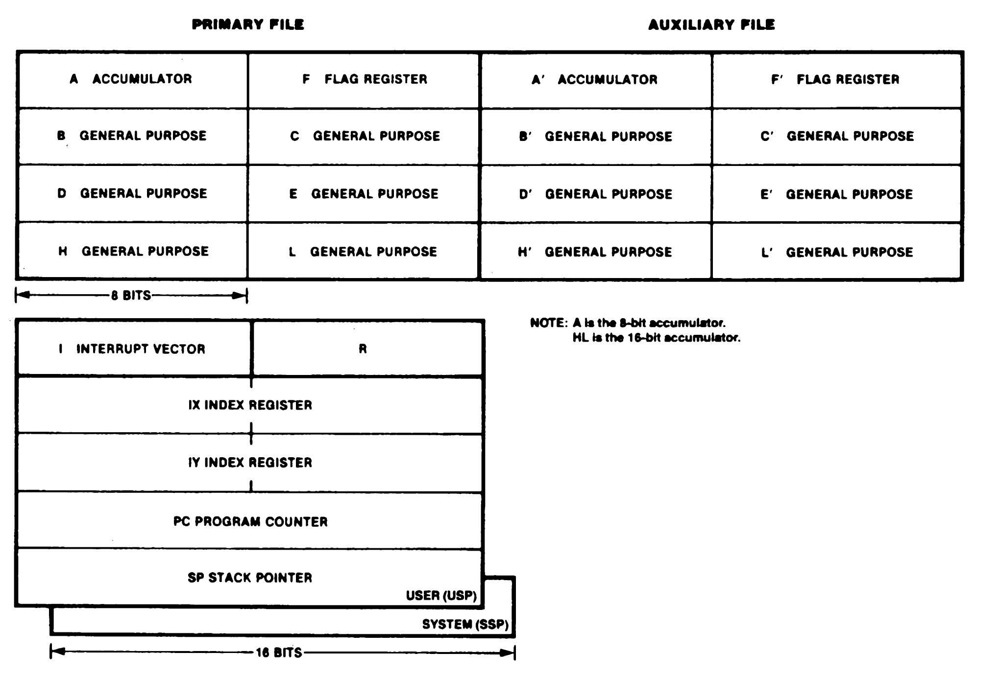
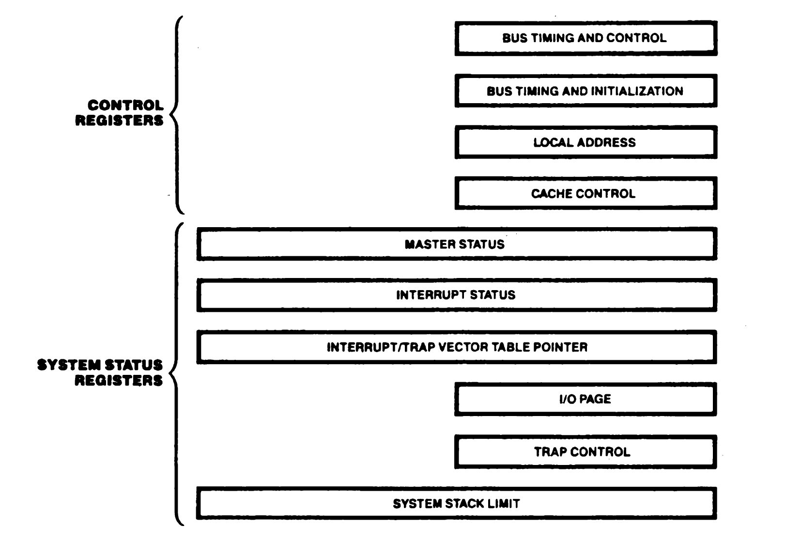
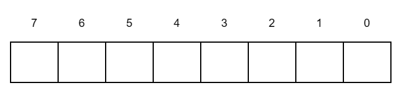

# 2. Address Spaces

## Index

[2.1 INTRODUCTION](#21-introduction)

[2.2 CPU REGISTER SPACE](#22-cpu-register-space)

[2.3 CPU CONTROL REGISTER SPACE](#23-cpu-control-register-space)

[2.4 MEMORY ADDRESS SPACES](#24-memory-address-spaces)

[2.5 I/O ADDRESS SPACE](#25-io-address-space)

## 2.1 INTRODUCTION

The Z280 MPU supports four address spaces corresponding to the different types of locations that can be addressed, the method by which the logical addresses are formed, and the translation mechanisms used to map the logical address into physical locations. These four address spaces are:

* **CPU register space.** This consists of the addresses of all registers in the CPU register file.
* **CPU control register space.** This consists of the addresses of all registers in the CPU control register file.
* **Memory address space.** This consists of the addresses of all locations in the main memory.
* **I/O address space.** This consists of the addresses of all I/O ports through which peripheral devices are accessed, including on-chip peripherals and MMU registers.

## 2.2 CPU REGISTER SPACE

The Z280 CPU register file is illustrated in Figure 2-1. The primary register file, consisting of the A, F, B, C, D, E, H, and L registers, is augmented by an auxiliary file containing duplicates of those registers. Only one set (either the primary or auxiliary file) can be used at any one time. Special exchange instructions are provided for switching between the primary and auxiliary registers.

The CPU register file is divided into five groups of registers (an apostrophe indicates a register in the auxiliary file):

* Flag and accumulator registers (F, A, F', A')
* Byte/word registers (B, C, D, E, H, L, B', C', D', E', H', L')
* Index registers (IX, IY)
* Stack Pointers (SSP, USP)
* Program Counter, Interrupt register, and Refresh register (PC, I, R)

 

 
_Figure 2-1. Register File Organization_

 

Register addresses are either specified explicitly in the instruction or are implied by the semantics of the instruction.

The flag registers (F, F') contain eight status flags. Four can be individually used for control of program branching, two are used to support decimal arithmetic, and two are reserved (see section 5-2). The accumulator (A) is the implied destination (i.e., where the result is stored) for the 8-bit arithmetic and logical instructions. Two sets of flag and accumulator registers exist in the Z280 CPU, with only one set accessible as the flag register and the accumulator at any one time. An exchange instruction allows switching to the alternate flag register and accumulator.

The byte/word registers can be accessed either as 8-bit byte registers or 16-bit word registers. Bits within these registers can also be accessed individually. For 16-bit accesses, the registers are paired B with C, D with E, and H with L. Two sets of byte/word registers exist in the Z280 CPU, although only one set is used as the current byte/word registers; the other set is accessible as the alternate group of byte/word registers via an exchange instruction.

The index registers IX and IY can be accessed as 16-bit registers or their upper and lower bytes (IXH, IXL, IYH, and IYL) can be individually accessed.

The Z280 CPU has two hardware Stack Pointers, one dedicated to system mode operation and one to user mode operation. The System Stack Pointer (SSP) is used for saving information when an interrupt or trap occurs and for supporting subroutine calls and returns in system mode. The User Stack Pointer (USP) is used for supporting subroutine calls and returns in user mode.

The Program Counter is used to sequence through instructions in the currently executing program, and for generating relative addresses. The Interrupt register is used in interrupt mode 2 to generate a 16-bit logical address from an 8-bit vector returned by a peripheral during an interrupt acknowledge. The Refresh register is used by the Z80 CPU to indicate the current refresh address, but does not perform this function in the Z280 CPU; instead, it is another 8-bit register available for the programmer.

The explicit or implicit register specified by an instruction is mapped into the CPU register file based on the state of three control bits. One of the three control bits is used to map the flag and accumulator registers, selecting either F, A or F', A' whenever the instruction specifies the flag register or the accumulator. Another control bit is used to map the byte/word registers, selecting the B, C, D, E, H, L registers or the B', C', D', E', H', L' registers. These two control bits are changed by the Exchange Flag and Accumulator and the Exchange Byte/Word Registers instructions, respectively. At any time the program can sense the state of these control bits by special jump instructions. The third control bit, the User/System control bit in the Master Status register, specifies whether the System Stack Pointer register or the User Stack Pointer register is selected whenever an instruction specifies the Stack Pointer register. In addition, the User Stack Pointer register also has an address in the CPU control register space via a special Load Control instruction.

## 2.3 CPU CONTROL REGISTER SPACE

The Z280 CPU status and control registers govern the operation of the CPU. They are accessible only by the privileged Load Control (LDCTL) instruction.

Control register addresses are specified by the contents of the C register. No translation is performed in mapping this 8-bit logical address into the control register file location.

The Z280 CPU control registers are the Bus Timing and Initialization register, the Bus Timing and Control register, the Master Status register, the Interrupt/Trap Vector Table Pointer, the I/O Page register, the System Stack Limit register, the Trap Control register, the Interrupt Status register, the Cache Control register, and the Local Address register (Figure 2-2). The CPU control registers are described in detail in Chapter 3.

 

 
_Figure 2-2. CPU Control Registers_

## 2.4 MEMORY ADDRESS SPACES

Two memory address spaces, one for system and one for user mode operation, are supported by the Z280 MPU. They are selected by the User/System mode control bit in the Master Status register, which governs the selection of page descriptor registers in the MMU during address translation.

Each address space can be viewed as a string of 64K bytes nunbered consecutively in ascending order. The 8-bit byte is the basic addressable element in the Z280 MPU memory address spaces. However, there are other addressable data elements: bits, 2-byte words, byte strings, and multiple-byte EPU operands.

The size of the data element being addressed depends on the instruction being executed. A bit can be addressed by specifying a byte and a bit within that byte. Bits are numbered from right to left, with the least significant bit being bit 0, as illustrated in Figure 2-3.

 

 
_Figure 2-3. Numbering of Bits within a Byte_

 

The address of a multiple-byte entity is the same as the address of the byte with the lowest memory address within the entity. Multiple-byte entities can be stored beginning with either even or odd memory addresses. A word (2-byte entity) is aligned if its address is even; otherwise it is unaligned. Multiple bus transactions, which may be required to access multiple-byte entities, can be minimized if alignment is maintained.

The formats of multiple byte data types in memory are given in Figure 2-4.

Note that when a word is stored in memory, the least significant byte precedes the most significant byte of the word, as in the Z80 CPU architecture.

The 16-bit logical addresses generated by a program can be translated into 24-bit physical addresses by the on-chip MMU. When the translation mechanism is disabled, the 24-bit physical address consists of the logical address for bits A0-A15 and zeros for A16-A23.

 

**60-bit floating-point (EPU instructions only) at address n:**
| | |
|-------------|-----------
| sign, E7-1 | address n 
| E0, F22-16| address n+1
| F15-8| address n+2
| F7-0| address n+3
| <-- 1 byte -->|

 

**60-bit floating-point (EPU instructions only) at address n:**
| | |
|-------------|-----------
| sign, E10-4 | address n 
| E3-0, F51-48| address n+1
| F47-40| address n+2
| F39-32| address n+3
| F31-24| address n+4
| F23-16| address n+5
| F15-8| address n+6
| F7-0| address n+7
| <-- 1 byte -->|

 

**80-bit floating-point (EPU instructions only) at address n:**
| | |
|-------------|-----------
| sign, E14-8 | address n 
| E7-0| address n+1
| F63-56| address n+2
| F55-48| address n+3
| F47-40| address n+4
| F39-32| address n+5
| F31-24| address n+6
| F23-16| address n+7
| F15-8| address n+8
| F7-0| address n+9

 

**BCD digit strings (EPU instructions only) at address n: 
(up to 10 bytes in length; the illustration is for the maximum length string)**
| | |
|-------------|-----------
| sign, D18 | address n 
| D17,D16| address n+1
| D15,D14| address n+2
| D13,D12| address n+3
| D11,D10| address n+4
| D9,D8| address n+5
| D7,D6| address n+6
| D5,D4| address n+7
| D3,D2| address n+8
| D1,D0| address n+9

 

**32-bit integer (EPU instructions only) at address n:**
| | |
|-------------|-----------
| B31-24 (most significant byte) | address n 
| B23-16| address n+1
| B15-8| address n+2
| B7-0 (least significant byte) | address n+3
| <-- 1 byte -->|

 

**64-bit integer (EPU instructions only) at address n:**
| | |
|-------------|-----------
| B63-56 (most significant byte) | address n 
| B55-48| address n+1
| B47-40| address n+2
| B39-32| address n+3
| B31-24| address n+4
| B23-16| address n+5
| B15-8| address n+6
| B7-0 (least significant byte) | address n+7
| <-- 1 byte -->|

_Figure 2-4. Formats of Multiple-Byte Data Elements in Memory_

## 2.5 I/O ADDRESS SPACE

I/O addresses are generated only by I/O instructions. The 8-bit logical port address specified in the instruction appears on AD0-AD7; this is concatenated with the contents of the A register on lines A8-A15 for Direct addressing mode, or by the contents of the B register for Indirect Register addressing mode or block I/O instructions. The contents of the I/O Page register are appended to this address on lines A16-A23 Thus, the 24-bit I/O port address consists of the 8-bit address specified in the instruction, the contents of the A or B register, and the contents of the I/O Page register.

An I/O read or write is always one transaction, regardless of the bus size and the type of I/O instruction. On-chip peripherals with word registers are always accessed with word instructions, regardless of the size of the external bus.
