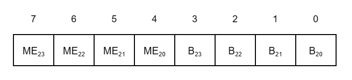
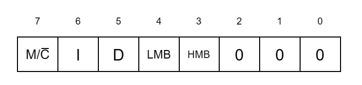
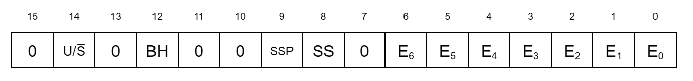
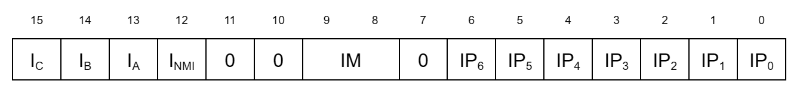
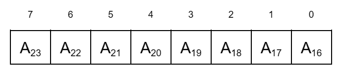

# 3. CPU Control Registers

## Index

[3.1 INTRODUCTION](#31-introduction)

[3.2 SYSTEM CONFIGURATION REGISTERS](#32-system-configuration-registers)

[3.2.1 Bus Timing and Initialization Register](#321-bus-timing-and-initialization-register)

[3.2.2 Bus Timing and Control Register](#322-bus-timing-and-control-register)

[3.2.3 Local Address Register](#323-local-address-register)

[3.2.4 Cache Control Register](#324-cache-control-register)

[3.3 SYSTEM STATUS REGISTERS](#33-system-status-registers)

[3.3.1 Master Status Register](#331-master-status-register)

[3.3.2 Interrupt Status Register](#332-interrupt-status-register)

[3.3.3 Interrupt/Trap Vector Table Pointer](#333-interrupttrap-vector-table-pointer)

[3.3.4 I/O Page Register](#334-io-page-register)

[3.3.5 Trap Control Register](#335-trap-control-register)

[3.3.6 System Stack Limit Register](#336-system-stack-limit-register)

## 3.1 INTRODUCTION

Several CPU control and status registers specify the operating mode of the Z280 MPU. There are two types of CPU control registers: system configuration registers and system status registers. The system configuration registers contain information about the physical configuration of the Z280-based system, such as bus timing information. Typically, the system configuration registers are loaded once during system initialization and are not altered during subsequent operations. The system status registers contain information that may change during system operation, such as the current I/O page. Access to the CPU control registers is restricted to system mode operation only, using the privileged Load Control (LDCTL) instruction. Resets initialize the control registers so that a Z80 object program will execute successfully on the Z280 MPU. (Z80 programs do not affect these registers, since the Load Control instruction is not part of the Z80 CPU's instruction set.) Unused bits in these registers should always be loaded with zeros.

## 3.2 SYSTEM CONFIGURATION REGISTERS

There are four 8-bit system configuration registers: the Bus Timing and Initialization register, the Bus Timing and Control register, the Local Address register, and the Cache Control register.

### 3.2.1 Bus Timing and Initialization Register

The Bus Timing and Initialization register controls the scaling of the processor clock for bus timing, the duration of bus transactions to the lower half of physical memory, and the enabling of the multiprocessor and bootstrap modes. Figure 3-1 illustrates the bit fields in this register.

 

  
_Figure 3-1. Bus Timing and Initialization Register_

 

**Clock Scaling (CS) Field.** This 2-bit field governs the scaling of the CPU clock for generation of bus timing cycles. The state of the CS field determines the bus clock frequency for all bus transactions, as per Table 3-1. This field is initialized during a reset operation, as described below, and cannot be modified via software.

 

| CS Field |Bus Clock Frequency |
|----------|--------------------|
| 00 | Bus clock frequency equals 1/2 CPU clock frequency (one bus clock cycle for every two CPU clock cycles)
| 01 | Bus clock frequency equals CPU clock frequency (one bus clock cycle for every one CPU clock cycle)
| 10 | Bus clock frequency equals 1/4 CPU clock frequency (one bus clock cycle for every four CPU clock cycles)
| 11 | Reserved 

_Table 3-1. CS Field of Bus Timing and Initialization Register_

 

**Low Memory Wait Insertion (LM) Field.** This 2-bit field specifies the number of automatic wait states to insert in memory transactions to the lower 8 megabytes of physical memory (that is, all memory locations where bit 23 of the physical address is a 0), as per Table 3-2. Additional wait states can still be added to any given memory transaction via control of the <ins>WAIT</ins> input.

 

| LM Field | Number of Wait States for Lower 8M Bytes of Memory |
|-|-|
| 00 | 0
| 01 | 1
| 10 | 2
| 11 | 3

_Table 3-2. LM Field of Bus Timing and Initialization Register_

 

**Multiprocessor Configuration Enable (MP) Bit.** This 1-bit field enables the multiprocessor mode of operation, wherein the Z280 MPU is connected to both a local and a global bus. Transactions to addresses on the global bus require a special bus request and acknowledgement before the bus transaction can occur. (See Chapter 10 for details concerning this mode of operation.) Setting this bit to 1 enables the multiprocessor mode, and clearing this bit to 0 disables this mode.

**Bootstrap Mode Enable (BS) Bit.** This 1-bit field enables the bootstrap mode of operation. If the bootstrap mode is selected during a reset operation, memory is automatically initialized via the UART after the reset; the UART receiver and DMA channel 0 are used to transfer 256 bytes of data into the first 256 memory locations; execution then begins from memory location 0. (See Chapter 9 for further details.) Setting this bit to 1 enables the bootstrap mode and clearing this bit to 0 disables this mode. The BS bit can be set to 1 only during a reset operation, as described below. Writing to this bit via a software command has no effect. This bit is always a 1 when this register is read.

Bits 4 and 7 of the Bus Timing and Initialization register are reserved for special use by Zilog and should always be loaded with a zero when writing to this register. When this register is read, bits 4 and 7 may return a 1.

The Bus Timing and Initialization register can be initialized with either of two methods during a reset operation. If the MPU's <ins>WAIT</ins> input is not asserted during reset, this register is automatically initialized to all zeros, thereby specifying a bus clock frequency of one-half the internal CPU clock, no automatic wait states during transactions to the lower 8M bytes of memory, and disabling of the multiprocessor and bootstrap modes. If the <ins>WAIT</ins> input is asserted during reset, the Bus Timing and Initialization register is set to the contents of the AD0-AD7 bus lines, as read during the reset operation (see Chapter 12); this form of initialization is the only way to specify the bootstrap mode. Once the CS field has been loaded during reset, it cannot be modified via software; however, the LM and MP fields can be written using the LDCTL instruction.

### 3.2.2 Bus Timing and Control Register

The 8-bit Bus Timing and Control register determines the timing of bus transactions to the upper 8M bytes of memory and to all I/O devices, and the timing of interrupt acknowledge transactions. Figure 3-2 indicates the format of this register.

 

 
_Figure 3-2. Bus Timing and Control Register_

 

**I/O Wait Insertion (I/O) Field.** This 2-bit field specifies the number of automatic wait states (in addition to the one wait state always present during I/O transactions) to be inserted during each I/O read or write transaction, as per Table 3-3. The specified number of wait states is also added to the vector read portion of an interrupt acknowledge cycle.

 

| I/O Field |Number of Wait States for I/O |
|-|-|
| 00 | 0
| 01 | 1
| 10 | 2
| 11 | 3

_Table 3-3. I/O Field of Bus Timing and Control Register_

 

**High Memory Wait Insertion (HM) Field.** This 2-bit field specifies the number of automatic wait
states to be inserted during memory transactions to the upper 8M bytes of physical memory (locations where address bit 23 of the physical address is a 1), as per Table 3-4.

 

| HM Field |Number of Wait States for  Upper 8M Bytes of Memory |
|-|-|
| 00 | 0
| 01 | 1
| 10 | 2
| 11 | 3

_Table 3-4. HM Field of Bus Timing and Initialization Register_

 

**Daisy Chain Timing (DC).** This 2-bit field determines the number of automatic wait states to be inserted during interrupt acknowledge transactions while the interrupt acknowledge daisy chain is settling, as per Table 3-5. Normally, 2.5 bus clock cycles elapse between the assertion of Address Strobe and the assertion of Data Strobe during an interrupt acknowledge (for the Z-BUS) or between the assertion of <ins>M1</ins> and the assertion of <ins>IORQ</ins> (for the Z80 Bus). The value of the DC field determines if any additional clocks are to be added between the Address Strobe and Data Strobe (or <ins>M1</ins> and <ins>IORQ</ins>) assertions.

 

| DC Field |Number of Walt States for Interrupt Acknowledge |
|-|-|
| 00 | 0
| 01 | 1
| 10 | 2
| 11 | 3

_Table 3-5. DC Field of Bus Timing and Control Register_

 

The contents of the Bus Timing and Control register govern the number of automatic wait states to be inserted during various bus transactions. Additional wait states can be added to any bus transaction via control of the <ins>WAIT</ins> input.

The Bus Timing and Control register is set to 30H by a reset. Bits 4 and 5 should always be written with 0. When this register is read, bits 4 and 5 may return a 1.

### 3.2.3 Local Address Register

The 8-bit Local Address register is used while in multiprocessor mode to determine which memory addresses are accessed via the local bus and which memory addresses are accessed via the global bus. If the multiprocessor mode is disabled (that is, if there is a 0 in bit 5 of the Bus Timing and Initialization register), the contents of the Local Address register have no effect on MPU operation.

If multiprocessor mode is enabled, the MPU automatically uses the Local Address register during each memory access to determine if the global bus is required. The Local Address register consists of a 4-bit match field and a 4-bit base field that are compared to the upper four bits of the physical memory address during memory transactions. The 4-bit match field specifies which bits of the physical memory address are of interest; for those bit positions specified in the match field, if all the corresponding address bits match the Local Address register's base field bits, then the bus transaction can proceed on the local bus. If there is a mismatch in at least one of the specified bit positions then the global bus is requested, and the transaction cannot proceed until the global bus acknowledge signal is asserted. (See Chapter 10 for further discussion of the Multiprocessor mode.)

The format of the Local Address register is illustrated in Figure 3-3.

 

 
_Figure 3-3. Local Address Register_

 

**Base bit (Bn):** For each MEn that is set to 1, the corresponding value of Bn must match the value of address bit An in order for the local bus to be used; otherwise, the transaction requires the use of the global bus.

**Match Enable bit (MEn):** If MEn is set to 1, then the corresponding physical address bit An is compared to base bit Bn to determine if the address requires the use of the global bus. If MEn is a zero, then any values for An and Bn produce a match, signifying a local bus access. If every MEn is cleared to 0, then all memory transactions are performed on the local bus.

The Local Address register is cleared to all zeros by a reset.

### 3.2.4 Cache Control Register

The 8-bit Cache Control register controls the operation of the on-chip memory. The contents of the Cache Control register determine if the on-chip memory is to be used as a cache or as fixed memory locations; if used as a cache, the cache can be enabled for instruction fetches only, for data fetches only, or for both instruction and data fetches. This register is also used to determine if burst-mode memory transactions are supported. (See Chapter 8 for further discussion of the on-chip memory and Chapter 13 for a description of the burst mode memory transaction.)

The Cache Control register contains five control bits, as described below. The format for this register is shown in Figure 3-4.

 

 
_Figure 3-4. Cache Control Register_

 

**Memory/Cache (M/<ins>C</ins>) Bit.** While this bit is set to 1, the on-chip memory is accessed as physical memory with fixed memory addresses; the user can programmably select the ranges of memory addresses for which the on-chip memory will respond. While this bit is cleared to 0, the on-chip memory is accessed associatively as a cache.

**Cache Instruction Disable (I) Bit.** While this bit and the M/C bit are cleared to 0, the on-chip memory is used as a cache during instruction fetches. While this bit is set to 1, instruction fetches do not use the cache. If the M/C bit is a 1, the state of this bit is ignored.

**Cache Data Disable (D) Bit.** While this bit and the M/C bit are cleared to 0, the on-chip memory is used as a cache during data fetches. While this bit is set to 1, data fetches do not use the cache. (The cache can be enabled for both instruction and data fetches by clearing both the I and D bits.) If the M/C bit is a 1, the state of this bit is ignored.

**Low Memory Burst Capability (LMB) Bit.** This 1-bit field specifies whether burst-mode memory transactions will occur during memory transactions to the lower 8M bytes of physical memory (locations where address bit 23 of the physical address is a 0). Setting this bit to 1 enables burst-mode transactions; clearing this bit to 0 disables burst mode transactions.

**High Memory Burst Capability (HMB) Bit.** This 1-bit field specifies whether burst-mode memory transactions will occur during memory transactions to the upper 8M bytes of physical memory (locations where address bit 23 of the physical address is a 1). Setting this bit to 1 enables burst-mode transactions; clearing this bit to 0 disables burst-mode transactions.

The Cache Control register is set to a 20H (hexadecimal) by a reset, enabling the on-chip memory for use as a cache for instruction fetches only and disabling burst mode transactions. Bits 0, 1, and 2 of this register are not used.

## 3.3 SYSTEM STATUS REGISTERS

There are six system status registers in the Z280 CPU: the Master Status register, Interrupt Status register, Interrupt/Trap Vector Table Pointer, I/O Page register, Trap Control register, and System Stack Limit register.

### 3.3.1 Master Status Register

The 16-bit Master Status register (MSR) contains status information about the currently executing program. Typically, the MSR changes when a new programming task is dispatched; it changes automatically when an interrupt or trap occurs. For all traps and for interrupts processed using interrupt mode 3, the old value of the MSR is saved on the system stack and a new MSR is loaded along with the Program Counter to define the service routine. (See Chapter 6 for a detailed discussion of interrupt and trap processing).

The format of the Master Status register is shown in Figure 3-5.

 

 
_Figure 3-5. Master Status Register_

 

**User/System (U/<ins>S</ins>) Bit.** While this bit is cleared to 0, the Z280 MPU is in the system mode of operation; while set to 1, the MPU is in the user mode of operation. The current operating mode determines which Stack Pointer is in use and which instructions can be executed; privileged instructions can be executed only while in system mode.

**Breakpoint-on-Halt Enable (BH) Bit.** While this bit is set to 1, the CPU generates a breakpoint trap whenever a Halt instruction is encountered; while cleared to 0, the Halt instruction is executed normally.

**Single-Step Pending (SSP) Bit.** The CPU checks this bit prior to the start of an instruction execution and generates a Single-Step trap if this bit is set to 1. The Single-Step bit is automatically copied into this field at the completion of an instruction. This bit is automatically cleared when a Single-Step, Division Exception, Access Violation, Privileged Instruction, or Breakpoint-on-Halt trap is executed, so that the saved MSR has a 0 in this bit position. (For these traps, the PC address of the trapped instruction is saved for possible re-execution.)

**Single-Step (SS) Bit.** This bit is the enable for the single-step operating mode. While this bit is set to 1, the CPU is in a single-step mode wherein a Single-Step trap is generated for each instruction; if cleared to 0, single-step mode is disabled.

**Interrupt Request Enable (En) Bit.** There are seven interrupt enable bits in the MSR, one for each type of maskable interrupt source. The Z280 MPU's interrupt sources, including both the external interrupt requests and the on-chip peripherals, are grouped into seven levels of interrupt requests. While bit En is set to 1, interrupt requests from sources at level n are accepted by the CPU; while En is cleared to 0, interrupt requests from sources at level n are not accepted.

The Master Status register is loaded with all zeros by a reset. Bits 7, 10, 11, 13, and 15 of the MSR always should be written with zeros.

### 3.3.2 Interrupt Status Register

The 16-bit Interrupt Status register indicates which interrupt mode is in effect, which interrupt requests are pending, and which interrupt requests are to be vectored. Only the interrupt vector enable bits are writeable; all other bits in this register are read-only status bits. The fields in the Interrupt Status register are shown in Figure 3-6.

 

 
_Figure 3-6. Interrupt Status Register_

 

**Interrupt Vector Enable (In) Bits.** These four bits indicate which of the four external interrupt inputs are to be vectored. While In is set to 1, interrupts on the Interrupt n line are vectored when the CPU is in interrupt mode 3; while In is cleared to 0, that interrupt is not vectored. These bits are ignored when not in interrupt mode 3.

**Interrupt Mode (IM) Field.** This 2-bit field indicates the current interrupt mode in effect, with a value n in this field denoting interrupt mode n. This field can be changed by executing the IM instruction.

**Interrupt Request Pending (IPn) Bits.** When bit IPn is a 1, an interrupt request from a source at level n is pending.

On reset, the Interrupt Vector Enable bits are cleared to all zeros, interrupt mode 0 is in effect, and the Interrupt Pending bits reflect the state of the interrupt requests. Bits 7, 10, and 11 of this register are not used.

### 3.3.3 Interrupt/Trap Vector Table Pointer

The 16-bit Interrupt/Trap Vector Table Pointer contains the twelve most significant bits of the physical memory address of the start of the Interrupt/Trap Vector Table. The Interrupt/Trap Vector Table is a memory area that holds the values that are loaded into the Master Status register and Program Counter during trap and interrupt processing under interrupt mode 3, as described in Chapter 6. The twelve low-order bits of the 24-bit physical address are assumed to be all zeros: thus, the Interrupt/Trap Vector Table must start on a 4K byte boundary in physical memory. The low-order four bits of the Interrupt/Trap Vector Table Pointer must be all zeros (Figure 3-7).

 

 
_Figure 3-7. Interrupt/Trap Vector Table Pointer_

 

The contents of the Interrupt/Trap Vector Table Pointer are unaffected by a reset and are undefined after power-up. When this register is read, bits 3,2,1 and 0 may return a 1.

### 3.3.4 I/O Page Register

The 8-bit I/O Page register determines the upper eight bits of the 24-bit peripheral address output during execution of an I/O transaction (Figure 3-8). I/O pages FEH and FFH are reserved for on-chip peripheral addresses.

 

 
_Figure 3-8. I/O Page Register_

 

The contents of the I/O Page register are cleared to all zeros by a reset.

### 3.3.5 Trap Control Register

The 8-bit Trap Control register contains the enables for the maskable traps. Figure 3-9 illustrates the format of this register.

 

 
_Figure 3-9. Trap Control Register_

 

**Inhibit User I/O (I) Bit.** This bit determines whether or not I/O instructions are privileged instructions. While this bit is set to 1, all I/O instructions are treated as privileged instructions, and an attempt to execute an I/O instruction while in user mode results in a Privileged Instruction trap. While this bit is cleared to 0, I/O instructions can be successfully executed in user mode. I/O instructions can always be executed in system mode, regardless of the state of this bit.

**EPU Enable (E) Bit.** This bit indicates whether or not an Extended Processor Unit (EPU) is available in the system for execution of extended instructions. If this bit is cleared to 0, indicating that no EPUs are present, the CPU generates an Extended Instruction trap whenever an extended instruction is encountered. If this bit is set to 1, the CPU performs whatever data transfers are indicated by the extended instruction opcode, and assumes that the EPU is present to execute the instruction.

**System Stack Overflow Warning (S) Bit.** This is the enable bit for the System Stack Overflow Warning trap. While it is set to 1, Stack Overflow Warning traps can occur during a stack access while in system mode, as determined by the contents of the Stack Limit register. While this bit is cleared to 0, Stack Overflow Warning traps are disabled. This bit is automatically cleared when a System Stack Overflow Warning trap is generated.

The Trap Control register is cleared to all zeros by a reset, indicating that I/O instructions are not privileged, EPUs are not present in the system, and Stack Overflow Warning traps are disabled. Bits 3 through 7 of this register are not used.

### 3.3.6 System Stack Limit Register

The 16-bit System Stack Limit register determines when a System Stack Overflow Warning trap is to be generated. Pushes onto the system-mode stack cause the 12 most significant bits of the logical address of the System Stack Pointer to be compared to the 12 most significant bits of this register; a System Stack Overflow Warning trap is generated if they match. The low-order four bits of this register must be zeros (Figure 3-10). This register has no effect on MPU operation if the System Stack Overflow Warning enable bit in the Trap Control register is cleared to 0.

 

 
_Figure 3-10. System Stack Limit Register_

 

The contents of the System Stack Limit register are cleared to zeros by a reset.
