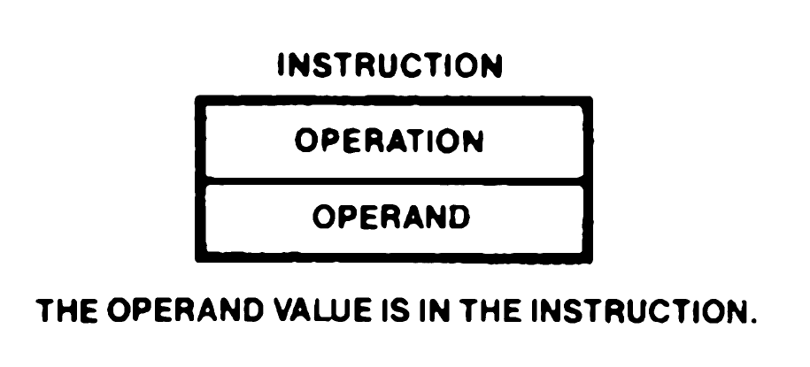
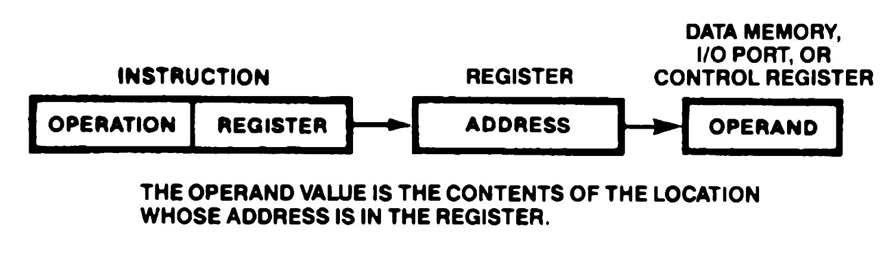
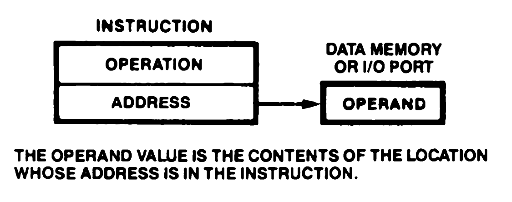
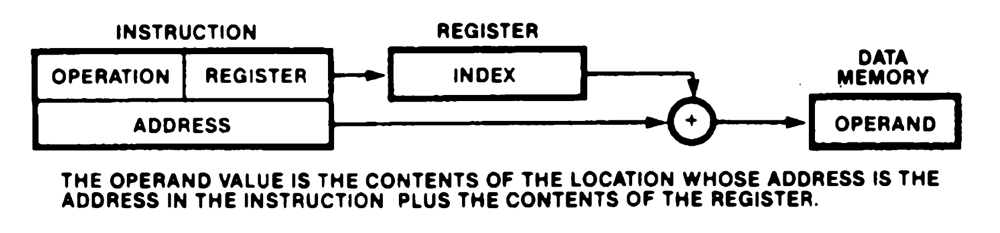
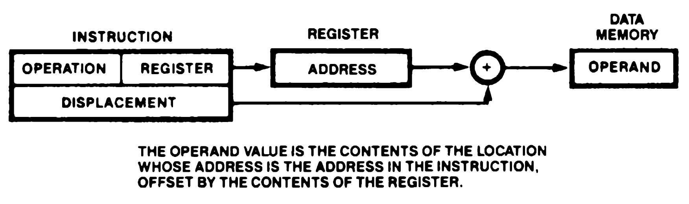
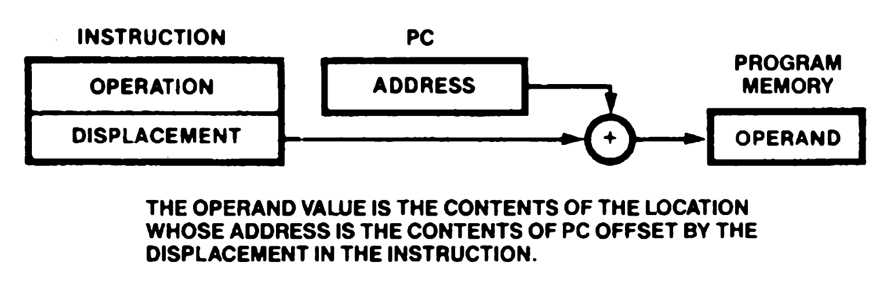
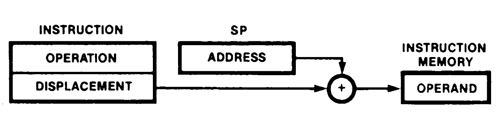
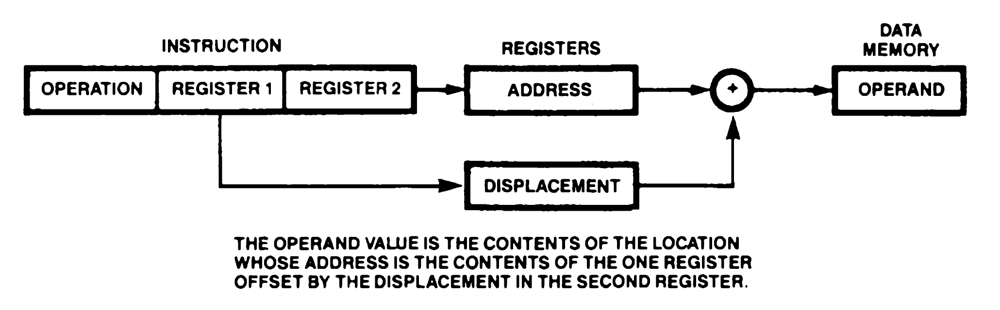

# 4. Addressing Mode and Data Types

## Index

[4.1 INTRODUCTION](#41-introduction)

[4.2 ADDRESSING MODE DESCRIPTIONS](#42-addressing-mode-descriptions)

[4.2.1 Register (R, RX)](#421-register-r-rx)

[4.2.2 Immediate (IM)](#422-immediate-im)

[4.2.3 Indirect Register (IR)](#423-indirect-register-ir)

[4.2.4 Direct Address (DA)](#424-direct-address-da)

[4.2.5 Indexed (X)](#425-indexed-x)

[4.2.6 Short Index (SX)](#426-short-index-sx)

[4.2.7 Program Counter (PC) Relative Address (RA)](#427-program-counter-pc-relative-address-ra)

[4.2.8 Stack Pbinter Relative (SR)](#428-stack-pbinter-relative-sr)

[4.2.9 Base Index (BX)](#429-base-index-bx)

[4.3 DATA TYPES](#43-data-types)


## 4.1 INTRODUCTION

An instruction is a consecutive list of one or more bytes in memory. Most instructions act upon some data; the term operand refers to the data to be operated upon. For Z280 CPU instructions, operands can reside in CPU registers, memory locations, or I/O ports. The methods used to designate the location of the operands for an instruction are called addressing modes. The Z280 CPU supports nine addressing modes: Register, Immediate, Indirect Register, Direct Address, Indexed, Short Index, Program Counter Relative Address, Stack Pointer Relative, and Base Index. A wide variety of data types can be accessed using these addressing modes.


## 4.2 ADDRESSING MODE DESCRIPTIONS

The following pages contain descriptions of the addressing modes for the Z280 CPU. Each description explains how the operand's location is calculated, indicates which address spaces can be accessed with that particular addressing mode, and gives an example of an instruction using that mode, illustrating the assembly language format for the addressing mode. The examples using memory addresses use logical memory addresses; if the MMU is enabled, these logical addresses can be translated to physical addresses before the physical memory is accessed, but this process is not discussed or illustrated here.


### 4.2.1 Register (R, RX)

When this addressing mode is used, the instruction processes data taken from one of the 8-bit registers A, B, C, D, E, H, L, IXH, IXL, IYH, IYL, or one of the 16-bit registers BC, DE, HL, IX, IY, SP, or one of the special byte registers I or R.

Storing data in a register allows shorter instructions and faster execution than occur with instructions that access memory.

 <br/>

The operand is always in the register address space. The register length (byte or word) is specified by the instruction opcode.

**Example of R mode:**

```
LD BC,HL     ;load the contents of HL into BC
```

| Register | Before<br/> instruction execution | After<br/>instruction execution |
|-|-|-|
|BC | A6B8 | 9A20 |
|HL | 9A20 | 9A20 |


### 4.2.2 Immediate (IM)

When the Immediate addressing mode is used, the data processed is in the instruction.

The Immediate addressing mode is the only mode that does not indicate a register or memory address as the source operand.

 <br/>

Because an immediate operand is part of the instruction, it is always located in the program memory address space. Immediate mode is often used to initialize registers.

**Example of IM mode:**

```
LD A,55H     ;load hex 55 into the accumulator
```

| Register | Before<br/> instruction execution | After<br/>instruction execution |
|-|-|-|
|A | 67 | 55 |


### 4.2.3 Indirect Register (IR)

In the Indirect Register addressing mode, the register specified in the instruction holds the address of the operand. The data to be processed is at the location specified by the HL register for memory accesses or the C register for I/O and control register space accesses. For the Load Byte instruction, BC and DE can also be used in addition to HL.

 <br/>

Depending on the instruction, the operand specified by IR mode is located in either the I/O address space (I/O instructions), control register space (Load Control instruction), or data memory address space (all other instructions).

The Indirect Register mode can save space and reduce execution time when consecutive locations are referenced or one location is repeatedly accessed. This mode can also be used to simulate more complex addressing modes, since addresses can be computed before the data is accessed.

**Example of IR mode:**

```
LD A,(HL)     ;load the accunulator with the data
              ;addressed by the contents of HL
```

| Register | Before<br/> instruction execution | After<br/>instruction execution |
|-|-|-|
|A  | 0F | 0B |
|HL | 170C | 170C |

|Data memory<br/> address | Data memory<br/> value |
|-|-|
| 170C | 0B |


### 4.2.4 Direct Address (DA)

When the Direct Address addressing mode is used, the data processed is at the location whose memory or I/O port address is in the instruction.

 <br/>

Depending on the instruction, the operand specified by DA mode is either in the I/O address space (I/O instructions) or in the data memory address space (all other instructions).

This mode is also used by Jump and Call instructions to specify the address of the next instruction to be executed. (Actually, the address serves as an immediate value that is loaded into the Program Counter.)

**Example of DA mode:**

```
LD BC,(5E22H)     ;load BC with the data in
                  ;address 5E22
```

| Register | Before<br/> instruction execution | After<br/>instruction execution |
|-|-|-|
|BC | 6789 | 0301 |

|Data memory<br/> address | Data memory<br/> value |
|-|-|
| 5E22 | 01 |
| 5E23 | 03 |


### 4.2.5 Indexed (X)

For this addressing mode, the data processed is at the location whose address is the address in the instruction offset by the contents of HL, IX, or IY.

The indexed address is computed by adding the address specified in the instruction to a
twos-complement "index" contained in the HL, IX or IY register, also specified by the instruction. Indexed addressing allows random access to tables or other complex data structures where the address of the base of the table is known, but the particular element index must be computed by the program.

 <br/>

**Example of X mode:**

```
LD A,(IX + 231AH)     ;load into the accumulator
                      ;the contents of the memory
                      ;location whose address
                      ;is 231AH + the value in IX
```

| Register | Before<br/> instruction execution | After<br/>instruction execution |
|-|-|-|
|A  | 23 | 3D
|IX | 01FE | 01FE |

|Data memory<br/> address | Data memory<br/> value |
|-|-|
| 2518 | 3D |

Address calculation:

```
 231A
+01FE
 ----
 2518 
```


### 4.2.6 Short Index (SX)

When the Short Index addressing mode is used, the data processed is at the location whose address is the contents of IX or IY offset by an 8-bit signed displacement in the instruction. (Note that this addressing mode was called "Indexed" in the Z80 CPU literature.)

The short indexed address is computed by adding the 8-bit twos-complement signed displacement specified in the instruction to the contents of the IX or IY register, also specified by the instruction. Short Index addressing allows random access to tables or other complex data structures where the address of the base of the table is known, but the particular element index must be computed by the program.

 <br/>

Operands specified by SX mode are always in the data memory address space.

**Example of SX mode:**

```
LD A,(IX - 1)     ;load into the accumulator
                  ;the contents of the memory location
                  ;whose address is one less thatn
                  ;the contents of IX
```

| Register | Before<br/> instruction execution | After<br/>instruction execution |
|-|-|-|
|A  | 01 | 3D
|IX | 203A | 203A |

|Data memory<br/> address | Data memory<br/> value |
|-|-|
| 2039 | 3D |

Address calculation: FF encoding in the instruction is sign-extended before the address calculation.

```
 203A
+FFFF
 ----
 2039 
```


### 4.2.7 Program Counter (PC) Relative Address (RA)

For Program Counter Relative Addressing mode, the data processed is at the location whose address is the contents of the Program Counter offset by an 8- or 16-bit displacement given in the instruction.

The instruction specifies a twos-complement signed displacement that is added to the Program Counter to form the target address. Except for extended instructions, the Program Counter value used is the address of the first instruction following the currently executing instruction. For extended instructions, the address used to calculate the displacement is the address of the template.

 <br/>

An operand specified by RA mode is always in the program memory address space.

The Program Counter Relative Addressing mode is used by certain program control instructions to specify the address of the next instruction to be executed (specifically, the result of the addition of the Program Counter value and the displacement is loaded into the Program Counter). Relative addressing allows references forward or backward from the current Program Counter value; it is used for program control instructions such as Jumps and for Loads that access constants in the program address space.

**Example of RA mode:**

```
LD A,<LABEL>     ;load the accunulator with the
                 ;contents of the memory location
                 ;whose address is LABEL
```

This format implies that the assembler will calculate the displacement from the current PC value to the specified label. Alternatively, slightly different syntaxes can be used for the RA mode if the actual displacement from the instruction using this mode is known. Thus, this example can also be written in the following manner:

```
LD A,<$ + 6>     ;load the accumulator with the
                 ;contents of the memory location
                 ;whose address is six more than
                 ;the address of the start of this
                 ;LD instruction
```

or

```
LD A,(PC + 2)     ;load the accumulator with the
                  ;contents of the memory location
                  ;whose address is two more than
                  ;the current PC, which now points
                  ;to the next instruction
```

Because the Program Counter is advanced to point to the next instruction when the address calculation is performed, the constant that occurs in the instruction is +2.

| Register | Before<br/> instruction execution | After<br/>instruction execution |
|-|-|-|
|A  | 23 | 76
|PC | 0202 | 0206 |

|Data memory<br/> address | Data memory<br/> value | |
|-|-|-|
| 0202 | FD | Instruction byte 1
| 0203 | 78 | Instruction byte 2
| 0204 | 02 | Instruction byte 3
| 0205 | 00 | Instruction byte 4
| 0206 | 18 |
| 0207 | 01 |
| 0208 | 76 | LABEL points here

Address calculation:

```
 0206
+   2
 ----
 0208 
```


### 4.2.8 Stack Pbinter Relative (SR)

For the Stack Pointer Relative addressing mode, the data processed is at the location whose address is the contents of the Stack Pointer offset by a 16-bit displacement in the instruction.

The instruction specifies a twos-complement displacement that is added to the contents of the Stack Pointer register to form the address. An operand specified by SR mode is always in the data memory address space.

 <br/>

The SR addressing mode is used to specify data items to be found in the stack such as parameters passed to subroutines. The System Stack Pointer or User Stack Pointer is selected depending on the state of the User/System bit in the Master Status register.

**Example of SR mode:**

```
LD A,(SP + 2)     ;load into the accumulator
                  ;the contents of the memory
                  ;location whose address is
                  ;two more than the contents
                  ;of SP
```

| Register | Before<br/> instruction execution | After<br/>instruction execution |
|-|-|-|
|A  | 69 | F3
|SP | 8200 | 8200 |

|Data memory<br/> address | Data memory<br/> value | |
|-|-|-|
| 8200 | AB | Top of stack
| 8200 | 01 |
| 8200 | F3 |
| 8200 | 28 |

Address calculation:

```
 8200
+   2
 ----
 8202 
```


### 4.2.9 Base Index (BX)

For the Base Index addressing mode, the data processed is at the location whose address is the contents of HL, IX, or IY, offset by the contents of another of these three registers.

 <br/>

This mode allows access to memory locations whose physical addresses are computed at run time and are not fully known at assembly time. An operand specified by BX mode is always in the data memory address space.

**Example of BX mode:**

```
LD A,(HL + IX)     ;load into the accunulator the
                   ;contents of the memory location
                   ;whose address is the sum of the
                   ;contents of the HL and IX
                   ;register
```

| Register | Before<br/> instruction execution | After<br/>instruction execution |
|-|-|-|
|A  | BC | A2
|HL | 1502 | 1502 |
|IX | FFFE | FFFE |

|Data memory<br/> address | Data memory<br/> value |
|-|-|
| 1500 | A2 |

Address calculation:

```
 1502
+FFFE
 ----
 1500
```


## 4.3 DATA TYPES

Many data types are supported by the Z280 MPU architecture; that is, many data types have a hardware representation in a Z280 MPU system and instructions that directly apply to them. The Z280 MPU supports operations on bytes, words, bits, BCD digits, and byte strings.

The basic data type is a byte, which is also the basic addressable element in the register, memory, and I/O address spaces. The 8-bit load, arithmetic, logical, shift, and rotate instructions operate on bytes in registers or memory. Bytes can be treated as logical, signed numeric, or unsigned numeric values.

Operations on two-byte words are also supported. Sixteen-bit load and arithmetic instructions operate on words in registers or memory; words can be treated as signed or unsigned numeric values. I/O reads and writes can be 8-bit or 16-bit operations. Sixteen-bit logical memory addresses can be held and manipulated in 16-bit registers.

Bits are fully supported and addressed by number within a byte (see Figure 2-2). Bits within byte registers or byte memory locations can be tested, set, or cleared.

Operations on binary-coded decimal (BCD) digits are supported by the Decimal Adjust Accumulator and Rotate Digit instructions. BCD digits are stored in byte registers or memory locations, two per byte. The Decimal Adjust Accumulator instruction is used after a binary addition or subtraction of BCD numbers. The Rotate Digit instructions are used to shift BCD digit strings in memory.

Strings of up to 65,536 bytes can be manipulated by the Z280 CPU's block move, block search, and block I/O instructions. The block move instructions allow strings of bytes in memory to be moved from one location to another. Block search instructions provide for scanning strings of bytes in memory to locate a particular value. The block I/O instructions allow strings of bytes or words to be transferred between memory and a peripheral device.

Arrays are supported by the Indexed, Short Index, and Base Index addressing modes. Stacks are supported by those same modes and the Stack Pointer Relative addressing mode, and by special instructions such as Call, Return, Push, and Pop. A special stack write warning feature aids in the allocation of system stack memory space.

Strings of up to 16 bytes can be transferred between memory and an Extended Processing Unit (EPU) during execution of an extended instruction.
