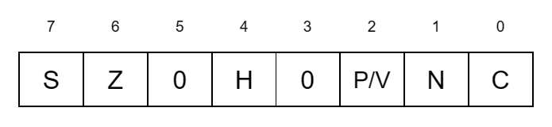

# 5. Instruction Set

## Index

[5.1 INTRODUCTION](#51-introduction)

[5.2 PROCESSOR FLAGS](#52-processor-flags)

[5.2.1 Carry Flag (C)](#521-carry-flag-c)

[5.2.2 Add/Subtract Flag (N)](#522-addsubtract-flag-n)

[5.2.3 Parity/Overflow Flag (P/V)](#523-parityoverflow-flag-pv)

[5.2.4 Half-Carry Flag (H)](#524-half-carry-flag-h)

[5.2.5 Zero Flag (Z)](#525-zero-flag-z)

[5.2.6 Sign Flag (S)](#526-sign-flag-s)

[5.2.7 Condition Codes](#527-condition-codes)

[5.3 INSTRUCTION EXECUTION AND EXCEPTIONS](#53-instruction-execution-and-exceptions)

[5.3.1 Instruction Execution and Interrupts](#531-instruction-execution-and-interrupts)

[5.3.2 Instruction Execution and Traps](#532-instruction-execution-and-traps)

[5.4 INSTRUCTION SET FUNCTIONAL GROUPS](#54-instruction-set-functional-groups)

[5.4.1 8-Bit Load Group](#541-8-bit-load-group)

[5.4.2 16-Bit Load and Exchange Group](#542-16-bit-load-and-exchange-group)

[5.4.3 Block Transfer and Search Group](#543-block-transfer-and-search-group)

[5.4.4 8-Bit Arithmetic and Logic Group](#544-8-bit-arithmetic-and-logic-group)

[5.4.5 16-Bit Arithmetic Operations](#545-16-bit-arithmetic-operations)

[5.4.6 Bit Manipulation, Rotate ands Shift Group](#546-bit-manipulation-rotate-ands-shift-group)

[5.4.7 Program Control Group](#547-program-control-group)

[5.4.8 Input/Output Instruction Group](#548-inputoutput-instruction-group)

[5.4.9 CPU Control Group](#549-cpu-control-group)

[5.4.10 Extended Instruction Group](#5410-extended-instruction-group)

[5.5 NOTATION AND BINARY ENCODING](#55-notation-and-binary-encoding)


## 5.1 INTRODUCTION

The Z280 CPU's instruction set is a superset of the Z80's; the Z280 CPU is opcode compatible with the Z80 CPU. Thus, a Z80 program can be executed on a Z280 MPU without modification. The instruction set is divided into ten groups by function:

* 8-bit load
* 16-bit load and exchange
* Block transfer and search
* 8-bit arithmetic and logical
* 16-bit arithmetic
* Rotate, shift, and bit manipulation
* Program control
* Input/Output
* CPU control
* Extended instructions

Thie chapter describes the instruction set of the Z280 CPUs. First, flags and condition codes are discussed in relation to the instruction set. Then, interruptibility of instructions is discussed and traps are described. The last part of this chapter is a detailed description of each instruction, listed in alphabetic order by mnemonic. This section is intended to be used as a reference for Z280 MPU programmers. The entry for each instruction contains a complete description of the instruction, including addressing modes, assembly language mnemonics, instruction opcode formats, and simple examples illustrating the use of the instruction.


## 5.2 PROCESSOR FLAGS

The Flag register contains six bits of status information, that are set or cleared by CPU operations (Figure 5-1). Four of these bits are testable (C, P/V, Z, and S) for use with conditional jump, call, or return instructions. Two flags are not testable (H, N) and are used for binary-coded decimal (BCD) arithmetic.

<br/>

<br/>
_Figure 5-1. Flag Register_

<br/>

The flags provide a link between sequentially executed instructions, in that the result of executing one instruction may alter the flags, and the resulting value of the flags can be used to determine the operation of a subsequent instruction. The program control instructions whose operation depends on the state of the flags are the Jump, Jump Relative, subroutine Call, and subroutine Return instructions; these instructions are referred to as conditional instructions.


### 5.2.1 Carry Flag (C)

The Carry flag is set or cleared depending on the operation being performed. For add instructions that generate a carry and subtract instructions that generate a borrow, the Carry flag is set to 1. The Carry flag is cleared to 0 by an add that does not generate a carry or a subtract that generates no borrow. This saved carry facilitates software routines for extended precision arithmetic. The multiply and divide instructions use the Carry flag to signal information about the precision of the result. Also, the Decimal Adjust Accumulator instruction leaves the Carry flag set to 1 if a carry occurs when adding BCD quantities.

For the rotate instructions, the Carry flag is used as a link between the least significant and most significant bits for any register or memory location. During shift instructions, the Carry flag contains the last value shifted out of any register or memory location. For logical instructions the Carry flag is cleared. The Carry flag can also be set and complemented with explicit instructions.


### 5.2.2 Add/Subtract Flag (N)

The Add/Subtract flag is used for BCD arithmetic. Since the algorithm for correcting BCD operations is different for addition and subtraction, this flag is used to record whether an add or subtract was last executed, allowing a subsequent Decimal Adjust Accumulator instruction to perform correctly. See the discussion of the DAA instruction for further information.


### 5.2.3 Parity/Overflow Flag (P/V)

This flag is set to a particular state depending on the operation being performed.

For signed arithmetic, this flag, when set to 1, indicates that the result of an operation on twos-complement numbers has exceeded the largest number, or is less than the smallest number, that can be represented using twos-complement notation. This overflow condition can be determined by examining the sign bits of the operands and the result.

The P/V flag is also used with logical operations and rotate instructions to indicate the parity of the result. The number of bits set to 1 in a byte are counted. If the total is odd, odd parity (P = 0) is flagged. If the total is even, even parity is flagged (P = 1).

During block search and block transfer instructions, the P/V flag monitors the state of the byte count register (BC). When decrementing the byte counter results in a zero value, the flag is cleared to 0, otherwise the flag is set to 1.

During the Load Accumulator with I or R register instructions, the P/V flag is loaded with the contents of the Interrupt A enable bit in the Master Status register.

When inputting a byte to a register from an I/O device addressed by the C register, the flag is adjusted to indicate the parity of the data.


### 5.2.4 Half-Carry Flag (H)

The Half-Carry flag (H) is set to 1 or cleared to 0 depending on the carry and borrow status between bits 3 and 4 of an 8-bit arithmetic operation and between bits 11 and 12 of a 16-bit arithmetic operation. This flag is used by the Decimal Adjust Accumulator instruction to correct the result of an addition or subtraction operation on packed BCD data.


### 5.2.5 Zero Flag (Z)

The Zero flag (Z) is set to 1 if the result generated by the execution of certain instructions is a zero.

For arithmetic and logical operations, the Zero flag is set to 1 if the result is zero. If the result is not zero, the Zero flag is cleared to 0.

For the block search instructions, the Zero flag is set to 1 if a comparison is found between the value in the Accumulator and the memory location pointed to by the contents of the register pair HL.

When testing a bit in a register or memory location, the Zero flag contains the complemented state of the tested bit (i.e., the Zero flag is set to 1 if the tested bit is a 0, and vice-versa).

For the block I/O instructions, if the result of decrementing B is zero, the Zero flag is set to 1; otherwise, it is cleared to 0. Also for byte inputs to registers from I/O devices addressed by the C register, the Zero flag is set to 1 to indicate a zero byte input.


### 5.2.6 Sign Flag (S)

The Sign flag (S) stores the state of the most significant bit of the result. When the Z280 CPU performs arithmetic operations on signed numbers, binary twos-complement notation is used to represent and process numeric information. A positive number is identified by a zero in the most significant bit. A negative number is identified by a 1 in the most significant bit.

When inputting a byte from an I/O device addressed by the C register to a CPU register, the Sign flag indicates either positive (S = 0) or negative (S = 1) data.

For the Test and Set instruction, the Sign bit is set to 1 if the tested bit is 1, otherwise it is cleared to 0.


### 5.2.7 Condition Codes

The Carry, Zero, Sign, and Parity/Overflow flags are used to control the operation of the conditional instructions. The operation of these instructions is a function of the state of one of the flags. Special mnemonics called condition codes are used to specify the flag setting to be tested during execution of a conditional instruction; the condition codes are encoded into a 3-bit field in the instruction opcode itself.

Table 5-1 lists the condition code mnemonic, the flag setting it represents, and the binary encoding for each condition code.

<br/>

**Condition Codes for Jump, Call, and Return Instructions:**

| Mnemonic | Meaning | Flag Setting | Binary Code |
|-|-|-|-|
|NZ | Not Zero | Z = 0 | 000 |
|Z  | Zero     | Z = 1 | 001 |
|NC | No Carry | C = 0 | 010 |
|C  | Carry    | C = 1 | 011 |
|NV | No Overflow | V = 0 | 100
|PO | Parity Odd  | V = 0 | 100
|V  | Overflow    | V = 1 | 101
|PE | Parity Even | V = 1 | 101
|NS | No Sign  | S = 0 | 110
|P  | Plus     | S = 0 | 110
|S  | Sign     | S = 1 | 111
|M  | Minus    | S = 1 | 111

<br/>

**Condition Codes for Jump Relative Instruction:**

| Mnemonic | Meaning | Flag Setting | Binary Code
|-|-|-|-
|NZ | Not Zero | Z = 0 | 100
|Z  | Zero     | Z = 1 | 101
|NC | No Carry | C = 0 | 110
|C  | Carry    | C = 1 | 111

_Table 5-1. Condition Codes_


## 5.3 INSTRUCTION EXECUTION AND EXCEPTIONS

Two types of exception conditions, interrupts and traps, can alter the normal flow of program execution. Interrupts are asynchronous events generated by a device external to the CPU; peripheral devices use interrupts to request service from the CPU. Traps are synchronous events generated internally in the CPU by particular conditions that occur during instruction execution. Interrupts and traps are discussed in detail in Chapter 6. This section examines the relationship between instructions and the exception conditions.


### 5.3.1 Instruction Execution and Interrupts

When the CPU receives an interrupt request, and it is enabled for interrupts of that class, the interrupt is normally processed at the end of the current instruction. However, the block transfer and search instructions are designed to be interruptible so as to minimize the length of time it takes the CPU to respond to an interrupt. If an interrupt request is received during a block move, block search, or block I/O instruction, the instruction is suspended after the current iteration. The address of the instruction itself, rather than the address of the following instruction, is saved on the system stack, so that the same instruction is executed again when the interrupt handler executes an interrupt return instruction. The contents of the repetition counter and the registers that index into the block operands are such that, after each iteration, when the instruction is reissued upon returning from an interrupt, the effect is the same as if the instruction were not interrupted. This assumes, of course, that the interrupt
handler preserved the registers.


### 5.3.2 Instruction Execution and Traps

Traps are synchronous events that result from the execution of an instruction. The action of the CPU in response to a trap condition is similar to the case of an interrupt in interrupt mode 3 (see Chapter 6). All traps except for Extended Instruction, System Stack Overflow Warning, Single Step and Breakpoint-on-Halt are nonmaskable.

The Z280 MPU supports eight kinds of traps:

* Division Exception
* Extended Instruction
* Privileged Instruction
* System Call
* Access Violation (page fault and write protect)
* System Stack Overflow Warning
* Single Step
* Breakpoint-on-Halt

The Division Exception trap occurs when executing a divide instruction if either the divisor is zero or the result cannot be represented in the destination (overflow).

The Extended Instruction trap occurs when an extended instruction is encountered, but the Extended Processor Architecture is disabled, (the EPA bit in the Trap Control register should be cleared to 0 if there is no EPU in the system or if the Z280 MPU is configured with an 8-bit bus). This allows the same software to be run on Z280 MPU system configurations with or without Extended Processing Units (EPUs). For systems without EPUs, the desired extended instructions can be emulated by software that is invoked by the Extended Instruction trap. For systems with an 8-bit data bus that also have an EPU, the software invoked by the Extended Instruction trap can use I/O instructions to access the EPU. The information saved on the system stack during this trap is designed to facilitate the 8-bit I/O interface to an EPU by providing address
calculation for the operands and by pushing addresses onto the system stack in the reverse order from which they will be used by an I/O interface trap handler.

The Privileged Instruction trap serves to protect the integrity of a system from erroneous or unauthorized actions of user mode processes. Certain instructions, called privileged instructions, can be executed only in system mode. An attempt to execute one of these instructions in user mode causes a Privileged Instruction trap.

The System Call instruction always causes a trap. This instruction is used to transfer control to system mode software in a controlled way, typically to request operating system services.

The Access Violation trap occurs whenever the Z280 MPU's on-chip MMU detects an illegal memory access. Access Violation traps cause instructions to be aborted. When Access Violation traps occur, the logical address of the instruction is pushed onto the system stack along with the Master Status register; part of the logical address that caused the page fault is latched in the MMU to indicate which page frame caused the fault; and the CPU registers are unmodified, i.e., their contents are the same as just before the instruction execution began. (For block move, block search, or block I/O instructions, the registers are the same as just before the iteration in which the page fault occurred.)

The System Stack Overflow Warning trap arises when pushing information onto the system stack causes the Stack Pointer to reference a specified 16-byte area of memory. Use of this facility protects the system from system stack overflow errors.

The Single Step trap occurs with the execution of each instruction, provided the Single-Step control bit in the Master Status register is set to 1. This facilitates software debugging of programs.

The Breakpoint-on-Halt trap occurs whenever the Halt instruction is encountered and the Breakpoint-on-Halt control bit in the Master Status register is set to 1. This facilitates software debugging of programs.


## 5.4 INSTRUCTION SET FUNCTIONAL GROUPS

This section presents an overview of the Z280 instruction set, arranged by functional groups. (See Section 5.5 for an explanation of the notation used in Tables 5-2 through 5-11.)


### 5.4.1 8-Bit Load Group

This group of instructions (Table 5-2) includes load instructions for transferring data between byte registers, transferring data between a byte register and memory, and loading immediate data into byte registers or memory. All addressing modes are supported for loading between the accumulator and memory or for loading immediate values into memory. Loads between other registers and memory use the IR and SX addressing modes. An exchange instruction is available for swapping the contents of the accumulator with another register or with memory.

The LDUD and LDUP instructions are available for loading to or from the user-mode memory address space while executing in system mode. The CPU flags are used to indicate if the transfer was successfully completed. LDUD and LDUP are privileged instructions. The other instructions in this group do not affect the flags, nor can their execution cause exception conditions.

<br/>

| Instruction Name     | Format   | R | RX | IM | IR | DA | X | SX | RA | SR | BX |
|-|-|-|-|-|-|-|-|-|-|-|-|
| Exchange Accumulator | EX A,src | • | • |   | • | • | • | • | • | • | • |
| Exchange H,L         | EX H,L
| Load Accumulator     | LD A,src | • | • | • | • | • | • | • | • | • | • |
|                      | LD dst,A | • | • |   | • | • | • | • | • | • | • |
| Load Immediate       | LD dst,n | • | • |   | • | • | • | • | • | • | • |
| Load Register (Byte) | LD R,src | • | • | • | • |   |   | •
|                      | LD dst,R | • | • |   | • |   |   | •
| Load in User Data Space | LDUD A,src |   |   |   | • |   |   | •
|                         | LDUD dst,A |   |   |   | • |   |   | •
| Load in User Program Space | LDUP A,src |   |   |   | • |   |   | •
|                            | LDUP dst.A |   |   |   | • |   |   | •

R ... BX = Addressing Modes Available

_Table 5-2. 8-Bit Load Group Instructions_


### 5.4.2 16-Bit Load and Exchange Group

This group of load and exchange instructions (Table 5-3) allows words of data (two bytes equal one word) to be transferred between registers and memory. The exchange instructions allow for switching between the primary and alternate register files, exchanging the contents of two 16-bit registers, or exchanging the contents of an addressing register with the top word on the stack. The 16-bit loads include transfers between registers and memory and immediate loads of registers or memory. The Load Address instruction facilitates the loading of the address registers with a calculated address. The Push and Pop stack instructions are also included in this group. None of these instructions affect the CPU flags, except for EX AF, AF'. The Push instruction can cause a System Stack Overflow Warning trap; otherwise, no exceptions can arise from the execution of these instructions.

<br/>

| Instruction Name     | Format   | R | IM | IR | DA | X | SX | RA | SR | BX |
|-|-|-|-|-|-|-|-|-|-|-|
| Exchange HL with Addressing Register | EX DE,HL
|                      | EX XY,HL
| Exchange Addressing Register with Top of Stack | EX (SP),XX
| Exchange Accumulator/Flag with Alternate Bank | EX AF,AF'
| Exchange Byte/Word Registers with Alternate Bank | EXX
| Load Addressing Register  | LD XX,src |   | • |   | • | • |   | • | • | • |
|                           | LD dst,XX |   |   |   | • | • |   | • | • | • |
| Load Register (Word)      | LD RR,src |   | • | • | • |   | • |   |   |   |
|                           | LD dst,RR |   |   | • | • |   | • |   |   |   |
| Load Immediate Word       | LD dst,nn | • |   | • | • |   |   | • 
| Load Stack Pointer        | LD SP,src | * | • | • | • |   | • 
|                           | LD dst,SP |   |   | • | • |   | • 
| Load Address              | LDA XX,src|   |   |   | • | • |   | • | • | • |
| Pop                       | POP dst   | • |   | • | • |   |   | •
| Push                      | PUSH src  | • | • | • | • |   |   | •

<span>*</span> Restricted to an addressing register (HL, IX, or IY)<br/>
R ... BX = Addressing Modes Available

_Table 5-3. 16-Bit Load and Exchange Group Instructions_


### 5.4.3 Block Transfer and Search Group

This group of instructions (Table 5-4) supports block transfer and string search functions. Using these instructions, a block of up to 65,536 bytes can be moved in memory, or a byte string can be searched until a given value is found. All the operations can proceed through the data in either direction. Furthermore, the operations can be repeated automatically while decrementing a length counter until it reaches zero, or they can operate on one storage unit per execution with the length counter decremented by one and the source and destination pointer registers properly adjusted. The latter form is useful for implementing more complex operations in software by adding other instructions within a loop containing the block instructions.

Various Z280 MPU registers are dedicated to specific functions for these instructions: the BC register for a counter, the DE and HL registers for memory pointers, and the accumulator for holding the byte value being sought. The repetitive forms of these instructions are
interruptible; this is essential since the repetition count can be as high as 65,536. The instruction can be interrupted after any iteration, in which case the address of the instruction itself, rather than the next one, is saved on the system stack; the contents of the operand pointer registers, as well as the repetition counter, are such that the instruction can simply be reissued after returning from the interrupt without any visible difference in the instruction execution.

<br/>

| Instruction Name | Format |
|-|-|
| Compare and Decrement | CPD
| Compare, Decrement and Repeat | CPDR
| Compare and Increment | CPI
| Compare, Increment and Repeat | CPIR
| Load and Decrement | LDD
| Load, Decrement and Repeat | LDDR
| Load and Increment | LDI
| Load, Increment and Repeat | LDIR

_Table 5-4. Block Transfer and Search Group_


### 5.4.4 8-Bit Arithmetic and Logic Group

This group of instructions (Table 5-5) performs 8-bit arithmetic and logical operations. The Add, Add with Carry, Subtract, Subtract with Carry, And, Or, Exclusive Or, Compare, and signed and unsigned Multiply take one input operand from the accumulator and the other from a register, from immediate data in the instruction itself, or from memory. All memory addressing modes are supported: Indirect Register, Short Index, Direct Address,PC Relative Address, Stack Pointer Relative, Indexed, and Base Index. Except for the multiplies, which return the 16-bit result to the HL register, these instructions return the computed result to the accumulator. Both signed
and unsigned division are provided. All memory addressing modes except Indirect Register can be used to specify the divisor.

The Increment and Decrement instructions operate on data in a register or in memory; all memory addressing modes are supported. Three instructions operate only on the accumulator: Decimal Adjust, Complement, and Negate. The final instruction in this group, Extend Sign, takes its 8-bit input from the accumulator and returns its 16-bit result to the HL register.

All these instructions except Extend Sign set the CPU flags according to the computed result. Only the Divide instructions can generate an exception.

<br/>

| Instruction Name     | Format   | R | RX | IM | IR | DA | X | SX | RA | SR | BX |
|-|-|-|-|-|-|-|-|-|-|-|-|
| Add with Carry (Byte) | ADC A,src | • | • | • | • | • | • | • | • | • | • |
| Add (Byte) | ADD A,src | • | • | • | • | • | • | • | • | • | • |
| And | AND A,src | • | • | • | • | • | • | • | • | • | • |
| Compare (Byte) | CP A,src | • | • | • | • | • | • | • | • | • | • |
| Complement Accumulator | CPL A
| Decimal Adjust Accumulator | DAA A
| Decrement (Byte) | DEC dst | • | • |   | • | • | • | • | • | • | • |
| Divide (Byte) | DIV A,src | • | • | • |   | • | • | • | • | • | • |
| Divide Unsigned (Byte) | DIVU A,src  | • | • | • |   | • | • | • | • | • | • |
| Extend Sign (Byte) | EXTS A
| Increment (Byte) | INC dst | • | • |   | • | • | • | • | • | • | • |
| Multiply (Byte) | MULT A,src | • | • | • | • | • | • | • | • | • | • |
| Multiply Unsigned (Byte) | MULTU A,src | • | • | • | • | • | • | • | • | • | • |
| Negate Accumulator | NEG A
| Or | OR A,src | • | • | • | • | • | • | • | • | • | • |
| Substract With Carry (Byte) | SBC A,src | • | • | • | • | • | • | • | • | • | • |
| Substract (Byte) | SUB A,src | • | • | • | • | • | • | • | • | • | • |
| Exclusive OR | XOR A,src | • | • | • | • | • | • | • | • | • | • |

R ... BX = Addressing Modes Available

_Table 5-5. 8-Bit Arithmetic and Logic Group_


### 5.4.5 16-Bit Arithmetic Operations

This group of instructions (Table 5-6) provides 16-bit arithmetic operations. The Add, Add with Carry, Subtract with Carry, and Compare instructions take one input operand from an addressing register and the other from a 16-bit register or from the instruction itself; the result is returned to the addressing register. The 16-bit Increment and Decrement instructions operate on data found in a register or in memory; the Indirect Register, Direct Address or PC Relative addressing mode can be used to specify the memory operand. The instruction that adds the contents of the accumulator to an addressing register supports the use of signed byte indices into tables or arrays in memory.

The remaining 16-bit instructions provide general arithmetic capability using the HL register as one of the input operands. The word Add, Subtract, Compare, and signed and unsigned Multiply instructions take one input operand from the HL register and the other from a 16-bit register, from the instruction itself, or from memory using Indexed, Direct Address, or Relative addressing mode. The 32-bit result of a multiply is returned to the DE and HL registers, with the DE register containing the most significant bits. The signed and unsigned divide instructions take a 32-bit dividend in the DE and HL registers (the DE register containing the most significant bits) and a 16-bit divisor from a register, from the instruction, or from memory using the Indexed, Direct Address, or Relative addressing mode. The 16-bit quotient is returned to the HL register and the 16-bit remainder is returned to the DE register. The Extend Sign instruction takes the contents of the HL register and delivers the 32-bit result to the DE and HL registers, with the DE register containing the most significant bits of the result. The Negate HL instruction negates
the contents of the HL register.

Except for Increment, Decrement, and Extend Sign, all the instructions in this group set the CPU flags to reflect the computed result. The only instructions that can generate exceptions are the Divide instructions.

<br/>

| Instruction Name     | Format   | R | IM | IR | DA | X | RA
|-|-|-|-|-|-|-|-|
| Add with Carry (Word) | ADC XX,src | •
| Add (Word) | ADD XX,src | •
| Add Accumulator to Addressing Register | ADD XX,A
| Add Word | ADDW HL,src | • | • |   | • | • | •
| Compare (Word) | CPW HL,src | • | • |   | • | • | •
| Decrement (Word) | DECW dst | • |   | • | • | • | •
| Divide (Word) | DIV DEHL,src | • | • |   | • | • | •
| Divide Unsigned (Word) | DIVU DEHL,src | • | • |   | • | • | •
| Extend Sign (Word) | EXTS HL
| Increment (Word) | INCW dst | • |   | • | • | • | •
| Multiply (Word) | MULT HL,src | • | • |   | • | • | •
| Multiply Unsigned (Word) | MULTU HL,src | • | • |   | • | • | •
| Negate HL | NEG HL
| Substract With Carry (Word) | SBC XX,src | •
| Substract (Word) | SUBW HL,src | • | • |   | • | • | •

R ... RA = Addressing Modes Available

_Table 5-6. 16-Bit Arithmetic Operation Instructions_


### 5.4.6 Bit Manipulation, Rotate ands Shift Group

Instructions in this group (Table 5-7) test, set, and reset bits within bytes and rotate and shift byte data one bit position. Bits to be manipulated are specified by a field within the instruction. Rotation can optionally concatenate the Carry flag to the byte to be manipulated. Both left and right shifting is supported. Right shifts can either shift 0 into bit 7 (logical shifts) or can replicate the sign in bits 6 and 7 (arithmetic shifts). The Test and Set instruction is useful in multiprogramming and multiprocessing environments for implementing synchronization mechanisms between processes. All these instructions except Set Bit and Reset Bit set the CPU flags according to the calculated result; the operand can be a register or a memory location specified by the Indirect Register or Short Index addressing modes.

The RLD and RRD instructions are provided for manipulating strings of BCD digits; these rotate 4-bit quantities in memory specified by the indirect register. The low-order four bits of the accumulator are used as a link between rotations of successive bytes.

None of these instructions generate exceptions.

<br/>

| Instruction Name     | Format   | R | IR | SX
|-|-|-|-|-|
| Bit Test | BIT dst | • | • | •
| Reset Bit | RES dst | • | • | •
| Rotate Left | RL dst | • | • | •
| Rorate Left Accumulator | RLA
| Rotate Left Circular | RLC dst | • | • | •
| Rotate Left Circular (Accumulator) | RLCA
| Rotate Left Digit | RLD |   | • |  
| Rotate Right | RR dst | • | • | •
| Rotate Right Accumulator | RRA
| Rotate Right Circular | RRC dst | • | • | •
| Rotate Right Circular (Accumulator) | RRCA
| Rotate Right Digit | RRD |   | • |
| Set Bit | SET dst | • | • | •
| Shift Left Arithmetic | SLA dst | • | • | •
| Shift Right Arithmetic | SRA dst | • | • | •
| Shift Right Logical | SRL dst | • | • | •
| Test and Set | TSET dst | • | • | •

R ... SX = Addressing Modes Available

_Table 5-7. Bit Manipulation, Rotate and Shift Group_


### 5.4.7 Program Control Group

This group (Table 5-8) consists of the instructions that affect the Program Counter (PC) and thereby control program flow. The CPU registers and memory are not altered except for the Stack Pointer and the stack, which play a significant role in procedures and interrupts. (An exception is Decrement and Jump if Non-Zero [DJNZ], which uses a register as a loop counter.) The flags are also preserved except for the two instructions specifically designed to set and complement the Carry flag.

The Jump (JP) and Jump Relative (JR) instructions provide a conditional transfer of control to a new location if the processor flags satisfy the condition specified in the instruction. Jump Relative is a 2-byte instruction that jumps to any instruction within the range -126 to +129 bytes from the location of this instruction. Most conditional jumps in programs are made to locations only a few bytes away; the Jump Relative instruction exploits this fact to improve code compactness and efficiency.

A special Jump instruction tests whether the primary or auxiliary register file is being used and branches if the auxiliary file is in use. In systems that reserve the auxiliary register file for interrupt handlers only (via a software convention), this instruction can be used to decide whether registers must be saved.

Call and Restart are used for calling subroutines; the current contents of the PC are pushed onto the processor stack and the effective address indicated by the instruction is loaded into the PC. The use of a procedure address stack in this manner allows straightforward implementation of nested and recursive procedures. Call, Jump, and Jump Relative can be unconditional or based on the setting of a CPU flag.

Jump and Call instructions are available with the Indirect Register and PC Relative Address modes in addition to the Direct Address mode. These can be useful for implementing complex control structures such as dispatch tables. When using Direct Address mode for a Jump or Call, the operand is used as an immediate value that is loaded into the PC to specify the address of the next instruction to be executed.

The conditional Return instruction is a companion to the Call instruction; if the condition specified in the instruction is satisfied, it loads the PC from the stack and pops the stack.

A special instruction, Decrement and Jump if Non-Zero (DJNZ), implements the control part of the basic Pascal FOR loop in a one-word instruction.

System Call (SC) is used for controlled access to facilities provided by the operating system. It is implemented identically to a trap or interrupt in interrupt mode 3: the current program status is pushed onto the system stack, and a new program status is loaded from a dedicated part of memory.

<br/>

| Instruction Name     | Format   | IR | DA | RA
|-|-|-|-|-|
| Call | CALL cc,dst | • | • | •
| Complement Carry Flag | CCF
| Decrement and Jump if Non-Zero | DJNZ dst |   |   | •
| Jump on Auxiliary Accumulator/Flag | JAF dst |   |   | •
| Jump on Auxiliary Register File in Use | JAR dst |   |   | •
| Jump | JP cc,dst | • | • | •
| Jump Relative | JR cc,dst |   |   | •
| Return | RET cc
| Restart | RST p
| System Call | SC nn
| Set Carry Flag | SCF

IR ... RA = Addressing Modes Available

_Table 5-8. Program Control Group Instructions_


### 5.4.8 Input/Output Instruction Group

This group (Table 5-9) consists of instructions for transferring a byte, a word, or a string of bytes or words between peripheral devices and the CPU registers or memory. Byte I/O port addresses transfer bytes on AD<sub>0</sub>-AD<sub>7</sub> only. Thus in a 16-bit data bus environment, 8-bit peripherals must be connected to bus lines AD<sub>0</sub>-AD<sub>7</sub>. In an 8-bit data bus environment, word I/O instructions to external peripherals should not be used; however, on-chip peripherals can still be accessed by word I/O instructions.

The instructions for transferring a single byte (IN, OUT) can transfer data between any 8-bit CPU register or memory address specified in the instruction and the peripheral port specified by the contents of the C register. The IN instruction sets the CPU flags according to the input data; however, special cases of these instructions, restricted to using the CPU accumulator and Direct Address mode, do not affect the CPU flags. Another variant tests an input port specified by the contents of the C register and sets the CPU flags without modifying CPU registers or memory.

The instructions for transferring a single word (INW, OUTW) can transfer data between the HL register and the peripheral port specified by the contents of the C register. For word I/O, the contents of H appear on AD<sub>0</sub>-AD<sub>7</sub> and the contents of L appear as AD<sub>8</sub>-AD<sub>15</sub>. These instructions do not affect the CPU flags.

The remaining instructions in this group form a powerful and complete complement of instructions for transferring blocks of data between I/O ports and memory. The operation of these instructions is very similar to that of the block move instructions described earlier, with the exception that one operand is always an I/O port whose address remains unchanged while the address of the other operand (a memory location) is incremented or decremented. Both byte and word forms of these instructions are available. The automatically repeating forms of these instructions are interruptible.

I/O instructions are not privileged if the Inhibit User I/O bit in the Trap Control register is clear; they can be executed in either system or user mode, so that I/O service routines can execute in user mode. The Memory Management Unit and on-chip peripherals' control and status registers are accessed using the I/O instructions. The contents of the I/O Page register are output on AD<sub>23</sub>-AD<sub>16</sub> with the I/O port address and can be used by external decoding to select specific devices. Pages FF and FE are reserved for on-chip I/O and no external bus transaction is generated. I/O devices can be protected from unrestricted access by using the I/O Page register to select among I/O peripherals.

<br/>

| Instruction Name | Format |
|-|-|
Input| IN dst,(C)
Input Accumulator | IN A(n)
Input HL | INW HL,(C)
Input and Decrement (Byte) | IND
Input and Decrement (Word) | INDW
Input, Decrement and Repeat (Byte) | INDR
Input, Decrement and Repeat (Word) | INDRW
Input and Increment (Byte) | INI
Input and Increment (Word) | INIW
Input, Increment and Repeat (Byte) | INIR
Input, Increment and Repeat (Word) | INIRW
Output | OUT (C),src
Output Accumulator | OUT (n),A
Output HL | OUTW (C),HL
Output and Decrement (Byte) | OUTD
Output and Decrement (Word) | OUTDW
Output, Decrement and Repeat (Byte) | OTDR
Output, Decrement and Repeat (Word) | OTDRW
Output and Increment (Byte) | OUTI
Output and Increment (Word) | OTIRW
Output, Increment and Repeat (Byte) | OTIR
Output, Increment and Repeat (Word) | OTIRW
Test Input |TSTI (C)

_Table 5-9. Input/Output Instruction Group Instructions_


### 5.4.9 CPU Control Group

The instructions in this group (Table 5-10) act upon the CPU control and status registers or perform other functions that do not fit into any of the other instruction groups. There are three instructions used for returning from an interrupt or trap service routine. Return from Nonmaskable Interrupt (REIN) and Return from Interrupt (RETI) are used in interrupt modes 0, 1, and 2 to pop the Program Counter from the stack and manipulate the Interrupt Mask register, or to signal a reset to Z8400 Family peripherals. The Return from Interrupt Long (RETIL) instruction pops a 4-byte program status from the System stack, and is used in interrupt mode 3 and trap processing.

Two of these instructions are not privileged: No Operation (NOP) and Purge Cache (PCACHE). The remaining instructions are privileged.

<br/>

| Instruction Name | Format |
|-|-|
Disable Interrupt| DI mask
Enable Interrupt | EI mask
Halt |HALT
Interrupt Mode Select | IM p
Load Accumulator From I or R Register | LD A,src
Load I or R Register From Accumulator | LD dst,A
Load Control | LDCTL dst,src
No Operation | NOP
Purge Cache | PCACHE
Return From Interrupt | RETI
Return From Interrupt Long | RETIL
Return From Nonmaskable Interrupt | RETN

_Table 5-10. CPU Control Group_


### 5.4.10 Extended Instruction Group

The Z280 MPU architecture contains a powerful mechanism for extending the basic instruction set through the use of external co-processors called Extended Processing Units (EPUs). A group of 22 opcodes is dedicated for the implementation of extended instructions using this facility. The extended instructions (Table 5-11) are intended for use on a 16-bit data bus; thus, this facility is available only on the Z-BUS configuration of the Z280 MPU.

There are four types of extended instructions in the Z280 MPU instruction set: EPU internal operations, data transfers from an EPU to memory, data transfers from memory to an EPU, and data transfers between an EPU and the CPU's accumulator. The extended instructions that access memory can use any of the six basic memory addressing modes (Indexed, Base Index, PC Relative, SP Relative, Indirect Register, and Direct Address). Transfers between the EPU and CPU accumulator are useful when the program must branch based on conditions generated by an EPU operation.

A 4-byte long "template" is embedded in each of the extended instruction opcodes. These templates determine the operation to be performed in the EPU itself. The formats of these templates are described in the following pages. The descriptions are from the point of view of the CPU; that is, only CPU activities are described. The operation of the EPU is implied, but the full specification of the instruction template depends on the implementation of the EPU, and is beyond the scope of this manual. Fields in the template that are ignored by the CPU are indicated by asterisks, and would typically contain opcodes that determine any operation to be performed by the EPU in addition to the data transfers specified by the instruction. A 2-bit identification field is included in each template, for use in selecting one of up to four EPUs in a multiple-EPU system.

The action taken by the CPU upon encountering an extended instruction depends upon the EPA control bit in the CPU's Trap Control register. When this bit is set to 1, indicating that EPUs are included in the system, extended instructions are executed. If this bit is cleared to 0, indicating that there are no EPUs in the system, the CPU executes an extended instruction trap whenever an extended instruction is encountered; this allows a trap service routine to emulate the desired operation in software.

<br/>

| Instruction Name | Format
|-|-|
Load EPU From Memory | EPUM src
Load Memory From EPU | MEPU dst
Load Accumulator From EPU | EPUF
EPU Internal Operation | EPUI

_Table 5-11. Extended Instructions_


## 5.5 NOTATION AND BINARY ENCODING

The rest of this chapter consists of detailed descriptions of the Z280 MPU instructions, arranged in alphabetical order by mnemonic. This section describes the notational conventions used in the instruction descriptions and the binary encoding for register fields within instruction's operation codes (opcodes).

The description of each instruction begins on a new page. The instruction mnemonic and name is printed in bold letters at the top of each page to enable the reader to easily locate a desired description. The assembly language syntax is then given in a single generic form that covers all the variants of the instruction, along with a list of applicable addressing modes. This is followed by a description of the operstion performed by the instruction, a listing of all the flags that are affected by the instruction, a listing of exception conditions that may be caused by execution of the instruction, illustrations of the opcodes for all variants of the instruction, and a simple example of the use of the instruction.

The following notation is used throughout the descriptions of the instructions:

| | |
|-|-|
(addr) |  A direct address
&lt;addr&gt; | An address to be encoded using relative addressing
b | A 3-bit field specifying the position of a bit within a byte
BX | Base Index addressing mode
cc | A condition code specifying whether a flag is set to 1 or cleared to 0
d | An 8-bit signed displacement
DA | Direct Address addressing mode
dd | A 16-bit signed displacement
disp | The displacement calculated from the address in relative addressing
dst | Destination location or contents
IM | Immediate addressing mode
IR | Indirect Register addressing mode
MSR | The Master Status register
n | 8-bit immediate data
nn | 16-bit immediate data
p | An interrupt mode
PC | The Program Counter
PS | The program status registers (the Program Counter and Master Status register)
R | A single 8-bit register of the set (A,B,C,D,E,H,L); also, R1 and R2 are used when two different registers are specified in the same instruction. (Note that the R register itself is accessed by a single instruction and violates this convention.)
R' | The corresponding 8-bit or 16-bit register in the alternate register file, such as A'
RA | PC Relative Address addressing mode
RR | A 16-bit register of the set (BC,DE,HL,SP); also, RRA and RRB are used when two different registers are specified in the same instruction
RX | A single byte in the IX or IY registers; that is, a register in the set (IXH,IXL, IYH,IYL); also, RXA and RXB are used when two different registers are specified in the same instruction
SP | The current Stack Pointer in use
SR | Stack Pointer Relative addressing mode
src | Source location or contents
SX | Short Index addressing mode
USP | The User Stack Pointer
X | Indexed addressing mode
XX | One of the 16-bit addressing registers HL, IX, or IY; also XXA and XXB are used when two different registers are specified in the same instruction
XY | One of the 16-bit index registers IX or IY

In the binary encoding of the instruction, lower case is used for the corresponding encoding of the assembler syntax.

Brackets ([ and ]) are used in the assembly language syntax to indicate an optional field. For example, the 16-bit addition instruction for adding word data to the HL register is described as:

```
ADDW [HL,]src
``````
This format means the instruction can be written as:

```
ADDW HL,src
```
or
```
ADDW src
```

Assignment of a value is indicated by the symbol "←". For example,

```
dst ← dst + src
```

indicates that the source data is added to the destination data and the result is stored in the destination location.

The notation "addr(n)" is used to refer to bit "n" of 8 given location, for example, dst(7).

The register field in the binary encoding of an instruction opcode is encoded as shown in Table 5-12.

<br/>

| Register | Encoding
|-|-|
A |111
B | 000
C | 001
D | 010
E | 011
H | 100
L | 101

_Table 5-12. Encoding of 8-Bit Registers in Instruction Opcodes_

<br/>

The remainder of this chapter consists of the individual descriptions of each Z280 MPU instruction.


## ADC - Add with Carry (Byte)

**ADC** [A,]src

 src = R, RX, IM, IR, DA, X, SX, RA, SR, BX

### Operation

A ← A + src + C

The source operand together with the Carry flag is added to the accumulator and the sum is stored in the accumulator. The contents of the source are unaffected. Twos- complement addition is performed.

### Flags

**S:** Set if the result is negative; cleared otherwise

**Z:** Set if the result is zero; cleared otherwise

**H:** Set if there is a carry from bit 3 of the result; cleared otherwise

**V:** Set if arithmetic overflow occurs, that is, if both operands are of the same sign and the result is of the opposite sign; cleared otherwise

**N:** Cleared

**C:** Set if there is a carry from the most significant bit of the result; cleared otherwise

### Exceptions

None

### Instruction Formats

| Addressing<br/>Mode | Syntax | Instruction Format
|-|-|-|
R | ADC A,R | `10 001  r `
RX | ADC A,RX | `11 *11 101` `10 001 rx `
IM | ADC A,n  | `11 001 110` `     n      `
IR | ADC A,(HL) | `10 001 110`
DA | ADC A,(addr)   | `11 011 101` `10 001 111` ` addr(low)  ` ` addr(high) `
X | ADC A,(XX + dd) | `11 111 101` `10 001 xx ` `   d(low)   ` `  d(high)   `
SX | ADC A,(XY + d) | `11 *11 101` `10 001 110` `     d      `
RA | ADC A,&lt;addr&gt; | `11 111 101` `10 001 000` ` disp(low)  ` ` disp(high) `
SR | ADC A,(SP + dd) | `11 011 101` `10 001 000` `   d(low)   ` `  d(high)   `
BX | ADC A,(XXA + XXB) | `11 011 101` `10 001 bx `

#### Field Encodings

**\*:** 0 for IX, 1 for IY<br/>
**rx:** 100 for high byte, 101 for low byte<br/>
**xx:** 001 for (IX + dd), 010 for (IY + dd), 011 for (HL + dd)<br/>
**bx:** 001 for (HL + IX), 010 for (HL + IY), 011 for (IX + IY)

### Example

ADC A,(HL)

_Before instruction execution:_

| Register | Value |
|-|-|
AF | 48 szxhxvn1
HL | 2454

| Memory<br/>Address |Value |
|-|-|
2454 | 18

_After instruction execution:_

| Register | Value |
|-|-|
AF | 61 00x1x000
HL | 2454

| Memory<br/>Address |Value |
|-|-|
2454 | 18


## ADC - Add With Carry (Word)

**ADC** dst,src

dst = HL<br/>
src = BC, DE, HL, SP

or

dst = IX<br/>
src = BC, DE, IX, SP

or

dst = IY<br/>
src = BC, DE, IY, SP

### Operation

dst ← dst + src + C

The source operand together with the Carry flag is added to the destination and the sum is stored in the destination. The contents of the source are unaffected. Twos-complement addition is performed.

### Flags

**S:** Set if the result is negative; cleared otherwise

**Z:** Set if the result is zero; cleared otherwise

**H:** Set if there is a carry from bit 11 of the result; cleared otherwise

**V:** Set if arithmetic overflow occurs, that is, if the operands are of the same sign and the result is of the opposite sign; cleared otherwise

**N:** Cleared

**C** Set if there is a carry from the most significant bit of the result; cleared otherwise.

### Exceptions

None

### Instruction Formats

Syntax | Instruction Format
|-|-|
ADC HL,RR | `11 101 101` `01 rr  010`
ADC XY,RR | `11 *11 101` `11 101 101` `01 rr  010`

#### Field Encodings

**\*:** 0 for IX, 1 for IY<br/>
**rr:** 001 for BC, 011 for DE, 101 for add register to itself, 111 for SP

### Example

ADC HL,BC

_Before instruction execution:_

| Register | Value |
|-|-|
 F | szxhxvn1
BC | 2308
HL | F038

_After instruction execution:_

| Register | Value |
|-|-|
 F | 00x0x001
BC | 2308
HL | 1341


## ADD - Add Accumulator to Addressing Register

**ADD** dst,A

dst = HL, IX, IY

### Operation

dst ← dst + A

The contents of the accumulator are added to the contents of the destination and the result is stored in the destination. The contents of the accumulator are unaffected. The contents of the accumulator are treated as a signed binary integer and are sign- extended to 16 bits; twos-complement addition is performed.

### Flags

**S:** Set if the result is negative; cleared otherwise

**Z:** Set if the result is zero; cleared otherwise

**H:** Set if there is a carry from bit 11 of the result; cleared otherwise

**V:** Set if arithmetic overflow occurs, that is, if the operands are of the same sign and the result is of the opposite sign from the operands; cleared otherwise

**N:** Cleared

**C:** Set if there is a carry from the most significant bit of the result; cleared otherwise

### Exceptions

None

### Instruction Formats

Syntax | Instruction Format
|-|-|
ADD HL,A | `11 101 101` `01 101 101`
ADC XY,A | `11 *11 101` `11 101 101` `01 101 101`

#### Field Encodings

**\*:** 0 for IX, 1 for IY

### Example

ADD HL,a

_Before instruction execution:_

| Register | Value |
|-|-|
AF | E2 szxhxvnc
HL | 2384

_After instruction execution:_

| Register | Value |
|-|-|
AF | E2 00x1x001
HL | 2366

Computation: accumulator is sign-extended

```
 FFE2
+2384
 ----
 2366 
```


## ADD - Add (Byte)

**ADD** [A],src

src = R, RX, IM, IR, DA, X, SX, RA, SR, BX

### Operation

A ← A + src

The source operand is added to the accumulator and the sum is stored in the accumulator. The contents of the source are unaffected. Twos-complement addition is performed.

### Flags

**S:** Set if the result is negative; cleared otherwise

**Z:** Set if the result is zero; cleared otherwise 

**H:** Set if there is a carry from bit 3 of the result; cleared otherwise 

**V:** Set if arithmetic overflow occurs, that is, if both operands are of the same sign and the result is of the opposite sign; cleared otherwise 

**N:** Cleared

**C:** Set if there is a carry from the most significant bit of the result; cleared otherwise

### Exceptions

None

### Instruction Formats

| Addressing<br/>Mode | Syntax | Instruction Format
|-|-|-|
R | ADD A,R | `10 000  r `
RX | ADD A,RX | `11 *11 101` `10 000 rx `
IM | ADD A,n | `11 000 110`  `     n      `
IR | ADD A,(HL) | `10 000 110`
DA | ADD A,(addr) | `11 011 101` `10 000 111` ` addr(low)  ` ` addr(high) `
X | ADD A,(XX + dd) | `11 111 101` `10 000 xx ` `   d(low)   ` `  d(high)   `
SX | ADD A,(XY + d) | `11 *11 101` `10 000 110` `     d      `
RA | ADD A,&lt;addr&gt; | `11 111 101` `10 000 000` ` disp(low)  ` ` disp(high) `
SR | ADD A,(SP + dd) | `11 011 101` `10 000 000` `   d(low)   ` `  d(high)   `
BX | ADD A,(XXA + XXB) | `11 011 101` `10 000 bx `

#### Field Encodings

**\*:** 0 for IX, 1 for IY<br/>
**rx:** 100 for high byte, 101 for low byte<br/>
**xx:** 001 for (IX + dd), 010 for (IY + dd), 011 for (HL + dd)<br/>
**bx:** 001 for (HL + IX), 010 for (HL + IY), 011 for (IX + IY)

### Example

ADD A,(HL)

_Before instruction execution:_

| Register | Value |
|-|-|
AF | 48 szxhxvnc
HL | 2454

| Memory<br/>Address |Value |
|-|-|
2454 | 18

_After instruction execution:_

| Register | Value |
|-|-|
AF | 60 00x1x000
HL | 2454

| Memory<br/>Address |Value |
|-|-|
2454 | 18


## ADD - Add (Word)

**ADD** dst,src

dst = HL<br/>
src = BC, DE, HL, SP

or

dst = IX<br/>
src = BC, DE, IX, SP

or

dst = IY<br/>
src = BC, DE, IY, SP

### Operation

dst ← dst + src

The source operand is added to the destination and the sum is stored in the destination. The contents of the source are unaffected. Twos-complement addition is performed.

### Flags

**S:** Unaffected

**Z:** Unaffected

**H:** Set if there is a carry from bit 11 of the result; cleared otherwise

**V:** Unaffected

**N:** Cleared

**C** Set if there is a carry from the most significant bit of the result; cleared otherwise.

### Exceptions

None

### Instruction Formats

Syntax | Instruction Format
|-|-|
ADD HL,RR | `00 rr  001`
ADD XY,RR | `11 *11 101` `00 rr  001`

#### Field Encodings

**\*:** 0 for IX, 1 for IY<br/>
**rr:** 001 for BC, 011 for DE, 101 for add register to itself, 111 for SP

### Example

ADD HL,BC

_Before instruction execution:_

| Register | Value |
|-|-|
 F | szxhxvnc
BC | 2308
HL | F038

_After instruction execution:_

| Register | Value |
|-|-|
 F | szx0xv01
BC | 2308
HL | 1340


## ADDW - Add Word

**ADDW** [HL],src

src = R, IM, DA, X, RA

### Operation

HL ← HL + src

The source operand is added to the HL register and the sum is stored in the HL register. The contents of the source are unaffected. Twos-complement addition is performed.

### Flags

**S:** Set if the result is negative; cleared otherwise

**Z:** Set if the result is zero; cleared otherwise 

**H:** Set if there is a carry from bit 11 of the result; cleared otherwise 

**V:** Set if arithmetic overflow occurs, that is, if both operands are of the same sign and the result is of the opposite sign; cleared otherwise 

**N:** Cleared

**C:** Set if there is a carry from the most significant bit of the result; cleared otherwise

### Exceptions

None

### Instruction Formats

| Addressing<br/>Mode | Syntax | Instruction Format
|-|-|-|
R | ADDW HL,RR | `11 101 101` `11 rr  110`
|  | ADDW HL,XY | `11 *01 101` `11 101 101` `11 100 110`
IM | ADDW HL,nn | `11 111 101` `11 101 101` `11 110 110` `   n(low)   ` `   n(high)  `
DA | ADDW HL,(addr) | `11 011 101` `11 101 101` `11 010 110` ` addr(low)  ` ` addr(high) `
X | ADDW HL,(XX + dd) | `11 111 101` `11 101 101`  `11 xy  110` `   d(low)   ` `  d(high)   `
RA | ADDW HL,&lt;addr&gt; | `11 011 101` `11 101 101` `11 110 110` ` disp(low)  ` ` disp(high) `
IR | ADDW HL,(HL) | `11 011 101` `11 101 101` `11 000 110`

#### Field Encodings

**\*:** 0 for IX, 1 for IY<br/>
**rr:** 000 for BC, 010 for DE, 100 for HL, 110 for SP<br/>
**xy:** 000 for (IX + dd), 010 for (IY + dd)

### Example

ADDW HL,DE

_Before instruction execution:_

| Register | Value |
|-|-|
F | szxhxvnc
DE | 0010
HL | A123

_After instruction execution:_

| Register | Value |
|-|-|
F | 10x0x000
DE | 0010
HL | A133


## AND - And

**AND** [A],src

src = R, RX, IM, IR, DA, X, SX, RA, SR, BX

### Operation

A ← A AND src

A logical AND operation is performed between the corresponding bits of the source operand and the accumulator and the result is stored in the accumulator. A 1 bit is storede wherever the corresponding bits in the two operands are both 1s; otherwise a 0 bit is stored. The contents of the source are unaffected.

### Flags

**S:** Set if the most significant bit of the result is set; cleared otherwise

**Z:** Set if all bits of the result are zero; cleared otherwise 

**H:** Set

**P:** Set if parity is even; cleared otherwise 

**N:** Cleared

**C:** Cleared

### Exceptions

None

### Instruction Formats

| Addressing<br/>Mode | Syntax | Instruction Format
|-|-|-|
R | AND A,R | `10 100  r `
RX | AND A,RX | `11 *11 101` `10 100 rx `
IM | AND A,n  | `11 100 110` `     n      `
IR | AND A,(HL) | `10 100 110`
DA | AND A,(addr) | `11 011 101` `10 100 111` ` addr(low)  ` ` addr(high) `
X | AND A,(XX + dd) | `11 111 101` `10 100 xx ` `   d(low)   ` `  d(high)   `
SX | AND A,(XY + d) | `11 *11 101` `10 100 110` `     d      `
RA | AND A,&lt;addr&gt;| `11 111 101` `11 100 000` ` disp(low)  ` ` disp(high) `
SR | AND A,(SP + dd) | `11 011 101` `10 100 000` `   d(low)   ` `  d(high)   `
BX | AND A,(XXA + XXB) | `11 011 101` `10 100 bx `

#### Field Encodings

**\*:** 0 for IX, 1 for IY<br/>
**rx:** 100 for hight byte, 101 for low byte<br/>
**xx:** 011 for (IX + dd), 010 for (IY + dd), 011 for (HL + dd)<br/>
**bx:** 001 for (HL + IX), 010 for (HL + IY), 011 for (IX + IY)

### Example

AND A,(HL)

_Before instruction execution:_

| Register | Value |
|-|-|
AF | 48 szxhxvnc
HL | 2454

| Memory<br/>Address |Value |
|-|-|
2454 | 18

_After instruction execution:_

| Register | Value |
|-|-|
AF | 08 00x1x000
HL | 2454

| Memory<br/>Address |Value |
|-|-|
2454 | 18


## BIT - Bit Test

**BIT** b,dst

dst = R, IR, SX

### Operation

Z ← NOT dst(b)

The specified bit b within the destination operand is tested, and the Zero flag is set to 1 if the specified bit is zero, otherwise the Zero flag is cleared to 0. The contents of the destination are unaffected. The bit to be tested is specified by a 3-bit field in the instruction; this field contains the binary encoding for the bit number to be tested. The bit number must be between 0 and 7.

### Flags

**S:** Unaffected

**Z:** Set if the specified bit is zero; cleared otherwise

**H:** Set

**P:** Unaffected

**N:** Cleared

**C:** Unaffected

### Exceptions

None

### Instruction Formats

| Addressing<br/>Mode | Syntax | Instruction Format
|-|-|-|
R | BIT b,R | `11 001 011` `01  b   r `
IR | BIT b,(HL) | `11 001 011` `01  b  110`
SX | BIT b,(XY + d) | `11 *11 101` `11 001 011` `     d      ` `01  b  110`

#### Field Encodings

**\*:** 0 for IX, 1 for IY<br/>

### Example

BIT 1,A

_Before instruction execution:_

| Register | Value |
|-|-|
AF | 00010110 szxhxvnc

_After instruction execution:_

| Register | Value |
|-|-|
AF | 00010110 s0x1xp0c


## CALL - Call

**CALL** [cc,]dst

dst = IR, DA, RA

### Operation

If the cc is satisfied then:<br/>
SP ← SP - 2<br/>
(SP) ← PC<br/>
PC ← dst

A conditional call transfers program control to the destination address if the setting of a selected flag satisfies the condition code "cc" specified in the instruction; an unconditional call always transfers control to the destination address. The current contents of the Program Counter (PC) are pushed onto the top of the stack; the PC value used is the address of the first instruction byte following the Call instruction. The destination address is then loaded into the PC and points to the first instruction of the called procedure. At the end of a procedure a return instruction (RET) can be used to return to the original program.

Each of the Zero, Carry, Sign, and Overflow flags can be individually tested and a call performed conditionally on the setting of the flag.

When using DA mode with the CALL instruction, the operand is not enclosed in parentheses.

### Flags
No flags affected

### Exceptions

System Stack Overflow Warning

### Instruction Formats

| Addressing<br/>Mode | Syntax | Instruction Format
|-|-|-|
IR | CALL cc,(HL) | `11 011 101` `11 cc  100` 
|  | CALL (HL)    | `11 011 101` `11 011 101` `"unconditional call"`
DA | CALL cc,addr | `11 cc  100` ` addr(low)  ` ` addr(high) `
|  | CALL addr    | `11 001 101` ` addr(low)  ` ` addr(high) ` `"unconditional call"`
RA | CALL cc,&lt;addr&gt; | `11 111 101` `11 cc  100`  ` disp(low)  ` ` disp(high) `
|  | CALL &lt;addr&gt;    | `11 111 101` `11 001 101` ` disp(low)  ` ` disp(high) ` `"unconditional call"`

### Field Encodings

**cc:** 000 for NZ, 001 for Z, 010 for NC, 011 for C, 100 for PO or NV, 101 for PE or V, 110 for P or NS, 111 for M or S

### Example

CALL 2520H

_Before instruction execution:_

| Register | Value |
|-|-|
PC | 1630
SP | FF26

| Memory<br/>Address |Value |
|-|-|
FF24 | 00
FF25 | 00

_After instruction execution:_

| Register | Value |
|-|-|
PC | 2520
SP | FF24

| Memory<br/>Address |Value |
|-|-|
FF24 | 33
FF25 | 16


## CCF - Complement Carry Flag

*CCF*

### Operation

C ← NOT C

The Carry flag is inverted.

### Flags

**S:** Unaffected

**Z:** Unaffected

**H:** The previous state of the Carry flag

**P:** Unaffected

**N:** Cleared

**C:** Set if the Carry flag was clear before the operation; cleared otherwise

### Exceptions

None

### Instruction Formats

| Syntax | Instruction Format
|-|-|
CCF | `00 111 111`

### Example

CCF

_Before instruction execution:_

| Register | Value |
|-|-|
F | szxhxvn0

_After instruction execution:_

| Register | Value |
|-|-|
F | szx0xv01


## CP - Compare (Byte)

**CP** [A,]src

src = R, RX, IM, IR, DA, X, SX, RA, SR, BX

### Operation

A - src

The source operand is compared with the accumulator and the flags are set accordingly. The contents of the accumulator and the source are unaffected. Twos-complement subtraction is performed.

### Flags

**S:** Set if the result is negative; cleared otherwise

**Z:** Set if the result is zero; cleared otherwise

**H:** Set if there is a borrow from bit 4 of the result; cleared otherwise

**V:** Set if arithmetic overflow occurs, that is, if the operands are of different signs and the result is the same sign as the source; cleared otherwise 

**N:** Set

**C:** Set if there is a borrow from the most significant bit of the result; cleared otherwise

### Exceptions

None

### Instruction Formats

| Addressing<br/>Mode | Syntax | Instruction Format
|-|-|-|
R  | CP A,R    | `10 111  r `
RX | CP A,RX   | `11 *11 101` `10 111 rx `
IM | CP A,n    | `11 111 110` `     n      `
IR | CP A,(HL) | `10 111 110`
DA | CP A,(addr)    | `11 011 101` `10 111 111` ` addr(low)  ` ` addr(high) `
X  | CP A,(XX + dd) | `11 111 101` `10 111 xx ` ` addr(low)  ` ` addr(high) ` 
SX | CP A,(XY + d)  | `11 *11 101` `10 111 110` `     d      `
RA | CP A,&lt;addr&gt; | `11 111 101` `10 111 000` ` disp(low)  ` ` disp(high) `
SR | CP A,(SP + dd) | `11 011 101` `10 111 000` `   d(low)   ` `  d(high)   `
BX | CP A,(XXA + XXB) | `11 011 101` `10 111 bx `

#### Field Encodings

**\*:** 0 for IX, 1 for IY<br/>
**rx:** 100 for high byte, 101 for low byte<br/>
**xx:** 001 for (IX + dd), 010 for (IY + dd), 011 for (HL + dd)<br/>
**bx:** 001 for (HL + IX), 010 for (HL + IY), 011 for (IX + IY)

### Example

CP A,(HL)

_Before instruction execution:_

| Register | Value |
|-|-|
AF | 48 szxhxvnc
HL | 2454

| Memory<br/>Address |Value |
|-|-|
2454 | 18

_After instruction execution:_

| Register | Value |
|-|-|
AF | 48 00x0x010
HL | 2454

| Memory<br/>Address |Value |
|-|-|
2454 | 18


## CPD - Compare and Decrement

**CPD**

### Operation

A - (HL)<br/>
HL ← HL - 1<br/>
BC ← BC - 1

This instruction is used for searching strings of byte data. The byte of data at the location addressed by the HL register is compared with the contents of the accumulator and the Sign and Zero flags are set to reflect the result of the comparison. The contents of the accumulator and the memory bytes are unaffected. Twos-complement subtraction is performed. Next the HL register is decremented by one, thus moving the pointer to the previous element in the string. The BC register, used as a counter, is then decremented by one.

### Flags

**S:** Set if the result is negative; cleared otherwise

**Z:** Set if the result is zero, indicating that the contents of the accumulator and the memory byte are equal; cleared otherwise

**H:** Set if there is a borrow from bit 4 of the result; cleared otherwise

**V:** Set if the result of decrementing BC is not equal to zero; cleared otherwise

**N:** Set

**C:** Unaffected

### Exceptions

None

### Instruction Formats

| Syntax | Instruction Format
|-|-|
CPD |`11 101 101` `10 101 001`

### Example

CPD

_Before instruction execution:_

| Register | Value |
|-|-|
AF | 3B szxhxvnc
HL | 1215
BC | 0001

| Memory<br/>Address |Value |
|-|-|
1215 | 3B

_After instruction execution:_

| Register | Value |
|-|-|
AF | 3B 01x0x01c
HL | 1214
BC | 0000

| Memory<br/>Address |Value |
|-|-|
1215 | 3B


## CPDR - Compare, Decrement and Repeat

**CPDR**

### Operation

Repeat until BC = 0 or match:<br/>
A - (HL)<br/>
HL ← HL - 1<br/>
BC ← BC - 1

This instruction is used for searching strings of byte data. The bytes of data starting at the location addressed by the HL register are compared with the contents of the accumulator until either an exact match is found or the string length is exhausted. The Sign and Zero flags are set to reflect the result of the last comparison. The contents of the accumulator and the memory bytes are unaffected. Twos-complement subtraction is performed.

After each comparison, the HL register is decremented by one, thus moving the pointer to the previous element in the string. The BC register, used as a counter, is then decremented by one. If the result of decrementing the BC register is not zero and no match has been found, the process is repeated. If the contents of the BC register are zero at the start of this instruction, a string length of 65,536 bytes is indicated.

This instruction can be interrupted after each execution of the basic operation. The Program Counter value of the start of this instruction is saved before the interrupt request is accepted, so that the instruction can be properly resumed.

### Flags

**S:** Set if the last result is negative; cleared otherwise

**Z:** Set if the last result is zero, indicating that the contents of the accumulator and the memory byte are equal; cleared otherwise

**H:** Set if there is a borrow from bit 4 of the last result; cleared otherwise

**V:** Set if the result of decrementing BC is not equal to zero; cleared otherwise

**N:** Set

**C:** Unaffected

### Exceptions

None

### Instruction Formats

| Syntax | Instruction Format
|-|-|
CPDR | `11 101 101` `10 111 001`

### Example

CPDR

_Before instruction execution:_

| Register | Value |
|-|-|
AF | F3 szxhxvnc
HL | 1118
BC | 0007

| Memory<br/>Address |Value |
|-|-|
1116 | F3
1117 | 00
1118 | 52

_After instruction execution:_

| Register | Value |
|-|-|
AF | F3 01x0x11c
HL | 1115
BC | 0004

| Memory<br/>Address |Value |
|-|-|
1116 | F3
1117 | 00
1118 | 52


## CPI - Compare and Increment

**CPI**

### Operation

A - (HL)<br/>
HL ← HL + 1<br/>
BC ← BC - 1

This instruction is used for searching strings of byte data. The byte of data at the location addressed by the HL register is compared with the contents of the accumulator and the Sign and Zero flags are set to reflect the result of the comparison. The contents of the accumulator and the memory bytes are unaffected. Twos-complement subtraction is performed.

Next the HL register is incremented by one, thus moving the pointer to the next element in the string. The BC register, used as a counter, is then decremented by one.

### Flags

**S:** Set if the result is negative; cleared otherwise

**Z:** Set if the result is zero, indicating that the contents of the accumulator and the memory byte are equal; cleared otherwise

**H:** Set if there is a borrow from bit 4 of the result; cleared otherwise

**V:** Set if the result of decrementing BC is not equal to zero; cleared otherwise

**N:** Set

**C:** Unaffected

### Exceptions

None

### Instruction Formats

| Syntax | Instruction Format
|-|-|
CPI | `11 101 101` `10 100 001`

### Example

CPI

_Before instruction execution:_

| Register | Value |
|-|-|
AF | 3B szxhxvnc
HL | 1215
BC | 0001

| Memory<br/>Address |Value |
|-|-|
1215 | 3B

_After instruction execution:_

| Register | Value |
|-|-|
AF | 3B 01x0x01c
HL | 1216
BC | 0000

| Memory<br/>Address |Value |
|-|-|
1215 | 3B


## CPIR - Compare, Increment and Repeat

**CPIR**

### Operation

Repeat until BC = 0 or match:<br/>
A - (HL)<br/>
HL ← HL + 1<br/>
BC ← BC - 1

This instruction is used for searching strings of byte data. The bytes of data starting at the location addressed by the HL register are compared with the contents of the accumulator until either an exact match is found or the string length is exhausted. The Sign and Zero flags are set to reflect the result of the comparison. The last contents of the accumulator and the memory bytes are unaffected. Twos-complement subtraction is performed.

After each comparison, the HL register is incremented by one, thus moving the pointer to the next element in the string. The BC register, used as a counter, is then decremented by one. If the result of decrementing the BC register is not zero and no match has been found, the process is repeated. If the contents of the BC register are zero at the start of this instruction, a string length of 65,536 bytes is indicated.

This instruction can be interrupted after each execution of the basic operation. The Program Counter value of the start of this instruction is saved before the interrupt request is accepted, so that the instruction can be properly resumed.

### Flags

**S:** Set if the last result is negative; cleared otherwise

**Z:** Set if the last result is zero, indicating that the contents of the accumulator and the memory byte are equal; cleared otherwise

**H:** Set if there is a borrow from bit 4 of the last result; cleared otherwise

**V:** Set if the result of decrementing BC is not equal to zero; cleared otherwise

**N:** Set

**C:** Unaffected

### Exceptions

None

### Instruction Formats

| Syntax | Instruction Format
|-|-|
CPIR | `11 101 101` `10 110 001`

### Example

CPIR

_Before instruction execution:_

| Register | Value |
|-|-|
AF | F3 szxhxvnc
HL | 1118
BC | 0007

| Memory<br/>Address |Value |
|-|-|
1118 | 25
1119 | 00
111A | F3

_After instruction execution:_

| Register | Value |
|-|-|
AF | F3 01x0x11c
HL | 111B
BC | 0004

| Memory<br/>Address |Value |
|-|-|
1118 | 25
1119 | 00
111A | F3


## CPL - Complement Accumulator

**CPL** [A]

### Operation

A ← NOT A

The contents of the accumulator are complemented (ones complement): all 1 bits are changed to 0 and vice-versa.

### Flags

**S:** Unaffected

**Z:** Unaffected

**H:** Set

**V:** Unaffected

**N:** Set

**C:** Unaffected

### Exceptions

None

### Instruction Formats

| Syntax | Instruction Format
|-|-|
CPL A | `00 101 111`

### Example

CPL A

_Before instruction execution:_

| Register | Value |
|-|-|
AF | 28 szxhxvnc

_After instruction execution:_

| Register | Value |
|-|-|
AF | D7 szx1xv1c


## CPW - Compare (Word)

**CPW** [HL,]src

src = R, IM, DA, X, RA

### Operation

HL - src

The source operand is compared with the HL register and the flags are set accordingly. The contents of the source and HL are unaffected. Twos-complement subtraction is performed.

### Flags

**S:** Set if the result is negative; cleared otherwise

**Z:** Set if the result is zero; cleared otherwise

**H:** Set if there is a borrow from bit 12 of the result; cleared otherwise

**V:** Set if arithmetic overflow occurs, that is, if the operands are of different signs and the result is the same sign as the source; cleared otherwise

**N: Set**

**C:** Set if there is a borrow from the most significant bit of the result; cleared otherwise

### Exceptions

None

### Instruction Formats

| Addressing<br/>Mode | Syntax | Instruction Format
|-|-|-|
R  | CPW HL,RR   | `11 101 101` `11 rr  111`
|  | CPW HL,XY   | `11 *11 101` `11 101 101` `11 100 111`
IM | CPW HL,nn   | `11 111 101` `11 101 101` `11 110 111` `   n(low)   ` `  n(high)   `
DA | CPW HL,(addr)    | `11 011 101` `11 101 101` `11 010 111` ` addr(low)  ` ` addr(high) `
X  | CPW HL,(XY + dd) | `11 111 101` `11 101 101` `10 0*0 111` `   d(low)   ` `  d(high)   ` 
RA | CPW HL,&lt;addr&gt; | `11 011 101` `10 101 101` `11 110 111` ` disp(low)  ` ` disp(high) `
IR | CPW HL,(HL) | `11 011 101` `11 101 101` `11 000 111`

#### Field Encodings

**\*:** 0 for IX, 1 for IY<br/>
**rr:** 000 for BC, 010 for DE, 100 for HL, 110 for SP

### Example

CPW HL,DE

_Before instruction execution:_

| Register | Value |
|-|-|
F  | szxhxvnc
DE | 0010
HL | A123

_After instruction execution:_

| Register | Value |
|-|-|
F  | 10x0x010
DE | 0010
HL | A123


## DAA - Decimal Adjust Accumulator

**DAA**

### Operation

A ← Decimal Adjust A

The accumulator is adjusted to form two 4-bit BCD digits following a binary, twos-complement addition or subtraction on two BCD-encoded bytes. The table below indicates the operation performed for addition (ADD, ADC, INC) or subtraction (SUB, SBC, DEC, NEG).

#### Operation of DAA Instruction

_For ADD, ADC, INC (N=0):_

C Before<br/>DAA | Hex Value in<br/>Upper Digit<br/>(Bits 7-4) | H Before<br/>DAA | Hex Value in<br/>Lower Digit<br/>(Bits 3-0) | C After<br/>DAA | H After<br/>DAA | 
|-|-|-|-|-|-|
0 | 0-9 | 0 | 0-9 | 00 | 0 | 0
0 | 0-8 | 0 | A-F | 06 | 0 | 1
0 | 0-9 | 1 | 0-3 | 06 | 0 | 0
0 | A-F | 0 | 0-9 | 60 | 1 | 0
0 | 9-F | 0 | A-F | 66 | 1 | 1
0 | A-F | 1 | 0-3 | 66 | 1 | 0
1 | 0-2 | 0 | 0-9 | 60 | 1 | 0
1 | 0-2 | 0 | A-F | 66 | 1 | 1
1 | 0-3 | 1 | 0-3 | 66 | 1 | 0

_For SUB, SBC, DEC, NEG (N=1):_

C Before<br/>DAA | Hex Value in<br/>Upper Digit<br/>(Bits 7-4) | H Before<br/>DAA | Hex Value in<br/>Lower Digit<br/>(Bits 3-0) | C After<br/>DAA | H After<br/>DAA | 
|-|-|-|-|-|-|
0 | 0-9 | 0 | 0-9 | 00 | 0 | 0
0 | 0-8 | 1 | 6-F | FA | 0 | 1
1 | 7-F | 0 | 0-9 | A0 | 1 | 0
1 | 6-F | 1 | 6-F | 9A | 1 | 1

The operation is undefined if the accumulator was not the result of a binary addition or subtraction of BCD digits.

### Flags

**S:** Set if the most significant bit of the result is set; cleared otherwise

**Z:** Set if the result is zero; cleared otherwise

**H:** See table above

**P:** Set if the parity of the result is even; cleared otherwise

**N:** Not affected

**C:** See table above

### Exceptions

None

### Instruction Formats

| Syntax | Instruction Format
|-|-|
DAA | `00 100 111`

### Example

DAA

_Before instruction execution:_

| Register | Value |
|-|-|
AF | 28 szx0xp01

_After instruction execution:_

| Register | Value |
|-|-|
AF | 88 00x0x001


## DEC - Decrement (Byte)

**DEC** dst

dst = R, RX, IR, DA, X, SX, RA, SR, BX

### Operation

dst ← dst - 1

The destination operand is decremented by one and the result is stored in the destination. Twos-complement subtraction is performed.

### Flags

**S:** Set if the result is negative; cleared otherwise

**Z:** Set if the result is zero; cleared otherwise

**H:** Set if there is a borrow from bit 4 of the result; cleared otherwise

**V:** Set if arithmetic overflow occurs, that is, if the destination was 80h; cleared otherwise

**N:** Set

**C:** Unaffected

### Exceptions

None

### Instruction Formats

| Addressing<br/>Mode | Syntax | Instruction Format
|-|-|-|
R  | DEC R | `00  r  101`
RX | DEC RX | `11 *11 101` `00 rx  101`
IR | DEC (HL) | `00 110 101`
DA | DEC (addr) | `11 011 101` `00 111 101` ` addr(low)  ` ` addr(high) `
X  | DEC (XX + dd) | `11 111 101` `00 xx  101` `   d(low)   ` `  d(high)   `
SX | DEC (XY + d)  | `11 *11 101` `00 110 101` `     d      `
RA | DEC &lt;addr&gt; | `11 111 101` `00 000 101` ` disp(low)  ` ` disp(high) `
SR | DEC (SP + dd) | `11 011 101` `00 000 101` `   d(low)   ` `  d(high)   `
BX | DEC (XXA + XXB) | `11 011 101` `00 bx  101`

#### Field Encodings

**\*:** 0 for IX, 1 for IY<br/>
**rx:** 100 for high byte, 101 for low byte<br/>
**xx:** 001 for (IX + dd), 010 for (IY + dd), 011 for(HL + dd)<br/>
**bx:** 001 for (HL + IX), 010 for (HL + IY), 011 for (IX + IY)


### Example

DEC (HL)

_Before instruction execution:_

| Register | Value |
|-|-|
F | szxhxvnc
HL | 2454

| Memory<br/>Address |Value |
|-|-|
2454 | 88

_After instruction execution:_

| Register | Value |
|-|-|
F | 10x0x01c
HL | 2454

| Memory<br/>Address |Value |
|-|-|
2454 | 87


## DEC[W] - Decrement (Word)

**DEC[W]** dst

dst = R

or

**DECW** dst

dst = IR, DA, X, RA

### Operation

dst ← dst - 1
The destination operand is decremented by one. Twos-complement subtraction is performed.

### Flags

No flags affected

### Exceptions

None

### Instruction Formats

| Addressing<br/>Mode | Syntax | Instruction Format
|-|-|-|
R  | DECW RR | `00 rr  011`
|  | DECW XY | `11 *11 101` `00 101 011`
IR | DECW (HL) | `11 011 101` `00 001 011`
DA | DECW (addr) | `11 011 101` `00 011 011` ` addr(low)  ` ` addr(high) `
X  | DECW (XY + dd) | `11 111 101` `00 xy  011` `   d(low)   ` `  d(high)   `
RA | DECW &lt;addr&gt; | `11 011 101` `00 111 011` ` disp(low)  ` ` disp(high) `

#### Field Encodings

**\*:** 0 for IX, 1 for IY<br/>
**rr:** 001 for BC, 011 for DE, 101 for HL, 111 for SP<br/>
**xy:** 001 for (IX + dd), 011 for (IY + dd)

### Example

DECW HL

_Before instruction execution:_

| Register | Value |
|-|-|
HL | 2308

_After instruction execution:_

| Register | Value |
|-|-|
HL | 2307


## DI - Disable Interrupt

**DI** mask

Mask = Hex value between 0 and 7F<sub>H</sub>

### Operation

If mask(i) = 1 then MSR(i) ← 0

The designated interrupt control bits in the Master Status register (MSR) are cleared to 0, thus disabling all interrupts on these inputs; all other interrupt enables in the MSR are unaffected. If no mask is present then all interrupts are disabled.

Any combination of interrupt enables in the MSR can be specified. The seven bits in the mask field in the instruction correspond to the seven interrupt enable bits in the MSR, mask bit i corresponding to MSR bit i.

### Flags

No flags affected

### Exceptions

Privileged Instruction

### Instruction Formats

| Syntax | Instruction Format
|-|-|
DI | `11 110 011`
DI mask | `11 101 101` `01 110 111` `    mask    `

Mask = byte specifying which interrupts to disable: mask(i) corresponds to interrupt source i; mask(7) must be zero.

### Eample

DI 23H

_Before instruction execution:_

| Register | Value |
|-|-|
MSR | 007F

_After instruction execution:_

| Register | Value |
|-|-|
MSR | 005C


## DIV - Divide (Byte)

**DIV** [HL,]src

src = R, RX, IM, DA, X, SX, RA, SR, BX

### Operation

A ← HL / src<br/>
L ← remainder

The contents of the HL register (dividend) are divided by the source operand (divisor) and the quotient is stored in the accumulator; the remainder is stored in the L register. The contents of the source and the H registef are unaffected. Both operands are treated as signed, twos-complement integers and division is performed so that the remainder is of the same sign as the dividend.

There are three possible outcomes of the DIV instruction, depending on the division and the resulting quotient:

CASE 1: If the quotient is within the range -2<sup>7</sup> to 2<sup>7</sup>-1 inclusive, then the quotient is left in the accumulator, the Overflow flag is cleared to 0, and the Sign and Zero flags are set according to the value of the quotient.

CASE 2: If the divisor is zero, the accumulator remains unchanged, the Zero and Overflow flags are set to 1, and the Sign flag is cleared to 0. Then the Division Exception trap is taken.

CASE 3: If the quotient is outside the range -2<sup>7</sup> to 2<sup>7</sup>-1, the accumulator remains unchanged, the Overflow flag is set to 1, and the Sign and Zero flags are cleared to 0. Then the Division Exception trap is taken.

### Flags

**S:** Cleared if V flag is set; else set if the quotient is negative, cleared otherwise

**Z:** Set if the quotient or divisor is zero; cleared otherwise

**H:** Unaffected

**V:** Set if the divisor is zero or if the computed quptient lies outside the range from -2<sup>7</sup> to 2<sup>7</sup>-1; cleared otherwise

**N:** Unaffected

**C:** Unaffected

### Exceptions

Division Exception

### Instruction Formats

| Addressing<br/>Mode | Syntax | Instruction Format
|-|-|-|
R  | DIV HL,R  | `11 101 101` `11  r  100`
RX | DIV HL,RX | `11 *11 101` `11 101 101` `11 rx  100`
IM | DIV HL,n  | `11 111 101` `11 101 101` `11 111 100` `     n      `
DA | DIV HL,(addr) | `11 011 101` `11 101 101` `11 111 100` ` addr(low)  ` ` addr(high) `
X  | DIV HL,(XX + dd) | `11 111 101` `11 101 101` `11 xx  100` `   d(low)   ` `  d(high)   `
SX | DIV HL,(XY + d)  | `11 *11 101` `11 101 101` `11 110 100` `     d      `
RA | DIV HL,&lt;addr&gt; | `11 111 101` `11 101 101` `11 000 100` `disp(lop)` ` disp(high) `
SR | DIV HL,(SP + dd)    | `11 011 101` `11 101 101` `11 000 100` `   d(low)   ` `  d(high)   `
BX | DIV HL,(XXA + XXB)  | `11 011 101` `11 101 101` `11 bx  100`
IR | DIV HL,(HL) | `11 101 101` `11 100 100`

#### Field Encodings

**\*:** 0 for IX, 1 for IY<br/>
**rx:** 100 for high byte, 101 for low byte<br/>
**xx:** 001 for (IX + dd), 010 for (IY + dd), 011 for (HL + dd)<br/>
**bx:** 001 for (HL + IX), 010 for (HL + IY), 011 for (IX + IY)

### Eample

DIV HL,C

_Before instruction execution:_

| Register | Value |
|-|-|
AF | 55 szxhxvnc
C  | FE
HL | FFFD

_After instruction execution:_

| Register | Value |
|-|-|
AF | 01 00xhx0nc
C  | FE
HL | FFFF


## DIVU - Divide Unsigned (Byte)

**DIVU** [HL,]src

src = R, RX, IM, DA, X, SX, RA, SR, BX

### Operation

A ← HL / src<br/>
L ← remainder

The contents of the HL register (dividend) are divided by the source operand (divisor) and the quotient is stored in the accumulator; the remainder is stored in the L register. The contents of the source and the H register are not affected. Both operands are treated as unsigned, binary integers.

There are three possible outcomes of the DIVU instruction, depending on the division and the resulting quotient:

CASE 1: If the quotient is less than 2<sup>8</sup>, then the quotient is left in the accumulator, the Overflow and Sign flagw are cleared to 0 and the Zero flag is set according to the value of the quotient.

CASE 2: If the divisor is zero, the accumulator remains unchanged, the Zero and Overflow flags are set to 1 and the Sign flag is cleared to 0. Then the Division Exception trap is taken.

CASE 3: If the quotient is greater than or equal to 2<sup>8</sup>, the accumulator remains unchanged, the Overflow flag is set to 1, and the Sign and Zero flags are cleared to 0. Then the Division Exception trap is taken.

### Flags

**S:** Cleared

**Z:** Set if the quotient or divisor is zero; cleared otherwise

**H:** Unaffected

**V:** Set if the divisor is zero or if the computed quotient is greater than or equal to 2<sup>8</sup>; cleared otherwise

**N:** Unaffected

**C:** Unaffected

### Exceptions

Division Exception

### Instruction Formats

| Addressing<br/>Mode | Syntax | Instruction Format
|-|-|-|
R  | DIVU HL,R  | `11 101 101` `11  r  101`
RX | DIVU HL,RX | `11 *11 101` `11 101 101` `11 rx  101`
IM | DIVU HL,n  | `11 111 101` `11 101 101` `11 111 101` `     n      `
DA | DIVU HL,(addr) | `11 011 101` `11 101 101` `11 111 101` ` addr(low)  ` ` addr(high) `
X  | DIVU HL,(XX + dd) | `11 111 101` `11 101 101` `11 xx  101` `   d(low)   ` `  d(high)   `
SX | DIVU HL,(XY + d)  | `11 *11 101` `11 101 101` `11 110 101` `     d      `
RA | DIVU HL,&lt;addr&gt; | `11 111 101` `11 101 101` `11 000 101` `disp(lop)` ` disp(high) `
SR | DIVU HL,(SP + dd)    | `11 011 101` `11 101 101` `11 000 101` `   d(low)   ` `  d(high)   `
BX | DIVU HL,(XXA + XXB)  | `11 011 101` `11 101 101` `11 bx  101`
IR | DIVU HL,(HL) | `11 101 101` `11 110 101`

#### Field Encodings

**\*:** 0 for IX, 1 for IY<br/>
**rx:** 100 for high byte, 101 for low byte<br/>
**xx:** 001 for (IX + dd), 010 for (IY + dd), 011 for (HL + dd)<br/>
**bx:** 001 for (HL + IX), 010 for (HL + IY), 011 for (IX + IY)

### Eample

DIVU HL,C

_Before instruction execution:_

| Register | Value |
|-|-|
AF | 55 szxhxvnc
C  | 02
HL | 0101

_After instruction execution:_

| Register | Value |
|-|-|
AF | 80 00xhx0nc
C  | 02
HL | 0101


## DIVUW - Divide Unsigned (Word)

**DIVUW** [DEHL],src

src = R, IM, DA, X, RA

### Operation

HL ← DEHL / src<br/>
DE ← remainder

The contents of the DE and HL registers (with the most significant bits of the dividend in the DE register) are divided by the source operand (divisor) and the quotient is stored in the HL register and the remainder in the DE register. The contents of the source are unaffected. Both operands are treated as unsigned, binary integers.

There are three possible outcomes of the DIVUW instruction, depending on the division and the resulting quotient:

CASE 1: If the quotient is less than 2<sup>16</sup>, then the quotient is left in the HL register and the remainder is left in the DE register, the Overflow and Sign flags are cleared to 0, and the Zero flag is set according to the value of the quotient.

CASE 2: If the divisor is zero, the DE and HL registers remain unchanged, the Zero and Overflow flags are set to 1, and the Sign flag is cleared to 0. Then the Division Exception trap is taken.

CASE 3: If the quotient is greater than 2<sup>16</sup> -1, then the DE and HL registers remain unchanged, the Overflow flag is set to 1, and the Zero and Sign flags are cleared to 0. Then the Division Exception trap is taken.

### Flags

**S:** Cleared

**Z:** Set if the quotient or divisor is zero; cleared otherwise

**H:** Unaffected

**V:** Set if the divisor is zero or if the computed quotient is greater than or equal to cleared otherwise

**N:** Unaffected

**C:** Unaffected

### Exceptions

Division Exception

### Instruction Formats

| Addressing<br/>Mode | Syntax | Instruction Format
|-|-|-|
R |  DIVUW DEHL,RR | `11 101 101` `11 rr  011`
| |  DIVUW DEHL,XY | `11 *11 101` `11 101 101` `11 101 011`
IM | DIVUW DEHL,nn | `11 111 101` `11 101 101` `11 111 011` `   n(low)   ` `  n(high)   `
DA | DIVUW DEHL,(addr) | `11 011 101` `11 101 101` `11 011 011` ` addr(low)  ` ` addr(high) `
X  | DIVUW DEHL,(XY + dd) | `11 111 101` `11 101 101` `11 xy  011` ` disp(low)  ` ` disp(high) `
RA | DIVUW DEHL,&lt;addr&gt; | `11 011 101` `11 101 101` `11 111 011` ` disp(low)  ` ` disp(high) `
IR | DIVUW DEHL,(HL) | `11 011 101` `11 101 101` `11 001 011`

#### Field Encodings

**\*:** 0 for IX, 1 for IY<br/>
**rr:** 001 for BC, 011 for DE, 101 for HL, 111 for SP<br/>
**xy:** 001 for (IX + dd), 011 for (IY + dd)

### Eample

DIVUW DEHL,6

_Before instruction execution:_

| Register | Value |
|-|-|
F  | szxhxvnc
DE | 0000
HL | 0022

_After instruction execution:_

| Register | Value |
|-|-|
F  | 00xhx0nc
DE | 0004
HL | 0005


## DIVW - Divide (Word)

**DIVW** [DEHL],src

src = R, IM, DA, X, RA

### Operation

HL ← DEHL / src<br/>
DE ← remainder

The contents of the DE and HL registers (with the DE register containing the most significant bits of the dividend) are divided by the source operand (divisor) and the quotient is stored in the HL register. The contents of the source are unaffected. Both operands are treated as signed, twos-complement integers and division is performed so that the remainder is of the same sign as the dividend.

There are three possible outcomes of the DIVW instruction, depending on the division and the resulting quotient:

CASE 1: If the quotient is within the range -2<sup>15</sup> to 2<sup>15</sup>-1 inclusive, then the quotient is left in the HL register and the remainder is left in the DE register, the Overflow flag is cleared to 0, and the Sign and Zero flags are set according to the value of the quotient.

CASE 2: If the divisor is zero, the DE and HL registers remain unchanged, the Zero and Overflow flags are set to 1, and the Sign flag is cleared to 0. Then the Division Exception trap is taken.

CASE 3: If the quotient is outside the range -2<sup>15</sup> to 2<sup>15</sup>-1, the DE and HL registers remain unchanged, the Overflow flag is set to 1, and the Sign and Zero flags are cleared to 0. Then the Division Exception trap is taken.

### Flags

**S:** Cleared if V flag is set; else set if the quotient is negative, cleared otherwise

**Z:** Set if the quotient or divisor is zero; cleared otherwise

**H:** Unaffected

**V:** Set if the divisor is zero or if the computed quotient lies outside the range from -2<sup>15</sup> to 2<sup>15</sup>-1; cleared otherwise

**N:** Unaffected

**C:** Unaffected

### Exceptions

Division Exception

### Instruction Formats

| Addressing<br/>Mode | Syntax | Instruction Format
|-|-|-|
R |  DIVW DEHL,RR | `11 101 101` `11 rr  010`
| |  DIVW DEHL,XY | `11 *11 101` `11 101 101` `11 101 010`
IM | DIVW DEHL,nn | `11 111 101` `11 101 101` `11 111 010` `   n(low)   ` `   n(high)  `
DA | DIVW DEHL,(addr) | `11 011 101` `11 101 101` `11 011 010` ` addr(low)  ` ` addr(high) `
X  | DIVW DEHL,(XY + dd) | `11 111 101` `11 101 101` `11 xy  010` ` disp(low)  ` ` disp(high) `
RA | DIVW DEHL,&lt;addr&gt; | `11 011 101` `11 101 101` `11 111 010` ` disp(low)  ` ` disp(high) `
IR | DIVW DEHL,(HL) | `11 011 101` `11 101 101` `11 001 010`

#### Field Encodings

**\*:** 0 for IX, 1 for IY<br/>
**rr:** 001 for BC, 011 for DE, 101 for HL, 111 for SP<br/>
**xy:** 001 for (IX + dd), 011 for (IY + dd)

### Eample

DIUW DEHL,6

_Before instruction execution:_

| Register | Value |
|-|-|
F  | szxhxvnc
DE | 0000
HL | 0022

_After instruction execution:_

| Register | Value |
|-|-|
F  | 00xhx0nc
DE | 0004
HL | 0005


## DJNZ - Decrement and Jump if Non-Zero

**DJNZ** dst

dst = RA

### Operation

B ← B - 1<br/>
if B != 0 then PC ← dst

The B register is decremenjted by one. If the result is non-zero, then the destination address is calculated and theh loaded into the Program Counter (PC). Control then passes to the instruction whose address is pointed to by the PC. When the B register reaches zero, control falls through to the instruction following DJNZ. This instruction provides a simple method of loop control.

The destination address is calculated using Relative addressing. The displacement in the instruction is added to the PC; the PC value used is the address of the instruction following the DJNZ instruction. The 8-bit displacement is treated as a signed, twos-complement integer. Thus the branching range from the location of this instruction is -126 to +129 bytes.

### Flags

No flags affected

### Exceptions

None

### Instruction Formats

| Syntax | Instruction Format
|-|-|
DJNZ addr | `00 010 000` `    disp    `

### Eample

DJNZ 1050H

_Before instruction execution:_

| Register | Value |
|-|-|
B  | 12
PC | 1076

_After instruction execution:_

| Register | Value |
|-|-|
B  | 11
PC | 1050


## EI - Enable Interrupt

**EI** mask

Mask = Hex value between 0 and 7F<sub>H</sub>

### Operation

If mask(i) = 1 then MSR(i) ← 1

The designated control bits in the Master Status register (MSR) are set to 1, thus enabling interrupts on these inputs; all other interrupt enables in the MSR are unaffected. Note that during the execution of this instruction and the following instruction, all maskable interrupts (whether previously enabled or not) are automatically disabled for the duration of these two instructions.

Any combination of interrupt enables in the MSR can be specified. The seven bits in the mask field in the instruction correspond to the seven interrupt enable bits in the MSR, mask bit i corresponding to MSR bit i. If no mask is present, all interrupts are enabled.

### Flags

No flags affected

### Exceptions

Privileged Instruction

### Instruction Formats

Syntax | Instruction Format
|-|-|
EI | `11 111 011`
EI mask | `11 101 101` `01 111 111` `    mask    `

Mask = byte specifying which interrupts to disable: mask(i) corresponds to interrupt source i; mask(7) must be zero.

### Example

EI 49H

_Before instruction execution:_

| Register | Value |
|-|-|
MSR | 0000

_After instruction execution:_

| Register | Value |
|-|-|
MSR | 0049


## EX - Exchange Accumulator/Flag with Alternate Bank

**EX** AF,AF'

### Operation

AF ↔ AF'

The control bit mapping the accumulator and flag registers into the primary bank or the auxiliary bank is complemented, thus effectively exchanging the accumulator and flag registers between the two banks.

### Flags

Loaded from F'

### Exceptions

None

### Instruction Formats

Syntax | Instruction Format
|-|-|
EX AF,AF' | `00 001 000`

### Example

EX AF,AF'

_Before instruction execution:_

| Register | Value |
|-|-|
AF  | 23F3
AF' | 10B0

_After instruction execution:_

| Register | Value |
|-|-|
AF  | 10B0
AF' | 23F3


## EX - Exchange Addressing Register with Top of Stack

**EX** (SP),dst

dst = HL, IX, IY

### Operation

(SP) ↔ dst

The contents of the destination register are exchanged with the contents of the top of stack. That is, the low-order byte contained in the register is exchanged with the contents of the memory address specified by the Stack Pointer (SP), and the high-order byte of the register is exchanged with the contents of the next highest memory address (SP + 1).

### Flags

No flags affected

### Exceptions

None

### Instruction Formats

Syntax | Instruction Format
|-|-|
EX (SP),HL | `11 100 011`
EX (SP),XY | `11 *11 101` `11 100 011`

#### Field Encoding

**\*:** 0 for IX, 1 for IY

### Example

EX (SP),HL

_Before instruction execution:_

| Register | Value |
|-|-|
HL | 2193
SP | 8200

| Memory<br/>Address |Value |
|-|-|
8200 | 2A
8201 | B3

_After instruction execution:_

| Register | Value |
|-|-|
HL | B32A
SP | 8200

| Memory<br/>Address |Value |
|-|-|
8200 | 93
8201 | 21


## EX - Exchange H and L

**EX** H,L

### Operation

H ↔ L

The contents of the H and L registers are exchanged.

### Flags

No flags affected

### Exceptions

None

### Instruction Formats

Syntax | Instruction Format
|-|-|
EX H,L | `11 101 101` `11 101 111`

### Example

EX H,L

_Before instruction execution:_

| Register | Value |
|-|-|
HL  | 1234

_After instruction execution:_

| Register | Value |
|-|-|
HL  | 3421


## EX - Exchange HL with Addressing Register

**EX** src,HL

src = DE, IX, IY

### Operation

src ↔ HL

The contents of the HL register are exchanged with the contents of the source.

### Flags

No flags affected

### Exceptions

None

### Instruction Formats

Syntax | Instruction Format
|-|-|
EX DE,HL | `11 101 011`
EX XY,HL | `11 *11 101` `11 101 011`

#### Field Encoding

**\*:** 0 for IX, 1 for IY

### Example

EX HL,DE

_Before instruction execution:_

| Register | Value |
|-|-|
DE  | 82E0
HL  | 38FF

_After instruction execution:_

| Register | Value |
|-|-|
DE  | 38FF
HL  | 82E0


## EX - Exchange with Accumulator

**EX** A,src

src = R, RX, IR, DA, X, SX, RA, SR, BX

### Operation

src ↔ A

The contents of the accumulator are exchanged with the contents of the source.

### Flags

No flags affected

### Exceptions

None

### Instruction Formats

| Addressing<br/>Mode | Syntax | Instruction Format
|-|-|-|
R  | EX A,R  | `11 101 101` `00  r  111`
RX | EX A,RX | `11 *11 101` `11 101 101` `00 rx  111`
IR | EX A,(HL) | `11 101 101` `00 110 111`
DA | EX A,(addr) | `11 011 101` `11 101 101` `00 111 111` ` addr(low)  ` ` addr(high) `
X  | EX A,(XX + dd) | `11 111 101` `11 101 101` `00 xx  111` `   d(low)   ` `  d(high)   `
SX | EX A,(XY + d)  | `11 *11 101` `11 101 101` `00 110 111` `     d      `
RA | EX A,&lt;addr&gt; | `11 111 101` `11 101 101` `00 000 111` ` disp(low)  ` ` disp(high) `
SR | EX A,(SP + dd)    | `11 011 101` `11 101 101` `00 000 111` `   d(low)   ` `  d(high)   `
BX | EX A,(XXA + XXB) | `11 011 101` `11 101 101` `00 bx  111`

#### Field Encodings

**\*:** 0 for IX, 1 for IY<br/>
**rx:** 100 for high byte, 101 for low byte<br/>
**xx:** 001 for (IX + dd), 010 for (IY + dd), 011 for (HL + dd)<br/>
**bx:** 001 for (HL + IX), 010 for (HL + IY), 011 for (IX + IY)

### Example

EX A,B

_Before instruction execution:_

| Register | Value |
|-|-|
A | 03
B | 82

_After instruction execution:_

| Register | Value |
|-|-|
A | 82
B | 03


## EXTS - Extend Sign (Byte)

**EXTS** [A]

### Operation

L ← A<br/>
If A(7) = 0, then H ← 00 else H ← FF

The contents of the accumulator, considered as a signed, twos-complement integer, are sign-extended to 16 bits and the result is stored in the HL register. The contents of the accumulator are unaffected. This instruction is useful for conversion of short signed operands to longer signed operands.

### Flags

No flags affected

### Exceptions

None

### Instruction Formats

| Syntax | Instruction Format
|-|-|
EXTS A | `11 101 101` `01 100 100`

### Example

EXTS A

_Before instruction execution:_

| Register | Value |
|-|-|
A | 82
HL | 5555

_After instruction execution:_

| Register | Value |
|-|-|
A | 82
HL | FF82


## EXTS - Extend Sign (Word)

**EXTS** HL 

### Operation

If H(7) = 0, then DE ← 0000 else DE ← FFFF

The contents of the HL register, considered as a signed, twos-complement integer, are sign-extended to 32 bits and the result is stored in the DE and HL registers, with the DE register containing the most significant bits. This instruction is useful for conversion of signed operands to larger signed operands.

### Flags

No flags affected

### Exceptions

None

### Instruction Formats

| Syntax | Instruction Format
|-|-|
EXTS HL | `11 101 101` `01 101 100`

### Example

EXTS HL

_Before instruction execution:_

| Register | Value |
|-|-|
DE | 032F
HL | EF30

_After instruction execution:_

| Register | Value |
|-|-|
DE | FFFF
HL | EF30


## EXX - Exchange Byte/Word Registers with Alternate Bank

**EXX**

### Operation

BC ↔ BC'<br/>
DE ↔ DE'<br/>
HL ↔ HL'

The control bit mapping the byte/word registers into the primary or auxiliary bank of the CPU registers is complemented, thus effectively exchanging the B, C, D, E, H, and L registers between the two banks.

### Flags

No flags affected

### Exceptions

None

### Instruction Formats

| Syntax | Instruction Format
|-|-|
EXX | `11 011 001`

### Example

EXX

_Before instruction execution:_

| Register | Value |
|-|-|
BC | 23A0
DE | 1653
HL | 24FF
BC' | 380F
DE' | E200
HL' | 1FA3


_After instruction execution:_

| Register | Value |
|-|-|
BC | 380F
DE | E200
HL | 1FA3
BC' | 23A0
DE' | 1653
HL' | 24FF


## HALT - Halt

**HALT**

### Operation

CPU Halts

The CPU operation is suspended until an interrupt or reset request is received. This instruction is used to synchronize the Z280 MPU with external events, preserving its state until an interrupt or reset request is accepted. After an interrupt is serviced, the instruction following HALT is executed. While halted, memory refresh cycles still occur, and bus requests are honored.

For the Z80 Bus configuration of the Z280 MPU, the <ins>HALT</ins> signal is asserted when the Halt instruction is executed and remains asserted until an interrupt or reset request is accepted. For the Z-BUS configurations of the Z280 MPU, a special Halt bus transaction is performed when the halt instruction is executed.

If the Breakpoint-on-Halt control bit in the Master Status register is set to 1, the Halt instruction is not executed, and Breakpoint-on-Halt trap is taken instead.

### Flags

No flags affected

### Exceptions

Breakpoint, Privileged Instruction

### Instruction Formats

| Syntax | Instruction Format
|-|-|
HALT | `01 110 110`


## IM - Interrupt Mode Select

**IM** p

p = 0, 1,2, 3

### Operation

Interrupt Mode ← p

The interrupt mode of operation is set to one of four modes (see Chapter 6 for a description of the various modes for responding to interrupts). The current interrupt mode can be read from the Interrupt Status register.

### Flags

No flags affected

### Exceptions

Privileged Instruction

### Instruction Formats

| Syntax | Instruction Format
|-|-|
IM p | `11 101 101` `01  t  110`

p<br/>mode | t<br/>encoding
|-|-|
0 | 000
1 | 010
2 | 011
3 | 001

### Example

IM 3

_Before instruction execution:_

| Register | Value |
|-|-|
Interrupt status register | F000

_After instruction execution:_

| Register | Value |
|-|-|
Interrupt status register | F300


## IN - Input

**IN** dst,(C)

dst = R, RX, DA, X, RA, SR, BX

### Operation

dst ← (C)

The byte of data from the selected peripheral is loaded into the destination. During the I/O transaction, the peripheral address from the C register is placed on the low byte of the address bus, the contents of the B register are placed on address lines A<sub>8</sub>-A<sub>15</sub> and the contents of the I/O Page register are placed on address lines A<sub>16</sub>-A<sub>23</sub>. The byte of data from the peripheral is then loaded ihto the destination.

### Flags

**S:** Set if the input data is negative; cleared otherwise

**Z:** Set if the input data is zero; cleared otherwise

**H:** Cleared

**V:** Set if the input data has even parity; cleared otherwise

**N:** Cleared

**C:** Unaffected

### Exceptions

Privileged Instruction (if the Inhibit User I/O bit in the Trap Control register is set to 1)

### Instruction Formats

| Addressing<br/>Mode | Syntax | Instruction Format
|-|-|-|
R  | IN R,(C)  | `11 101 101` `01  r  000`
RX | IN RX,(C) | `11 *11 101` `11 101 101` `01 rx  000`
DA | IN (addr),(C)       | `11 011 101` `11 101 101` `01 111 000` ` addr(low)  ` ` addr(high) `
X  | IN (XX + dd),(C)    | `11 111 101` `11 101 101` `01 xx  000` `   d(low)   ` `  d(high)   `
RA | IN &lt;addr&gt;,(C) | `11 111 101` `11 101 101` `01 000 000` ` disp(low)  ` ` disp(high) `
SR | IN (SP + dd),(C)    | `11 011 101` `11 101 101` `01 000 000` `   d(low)   ` `  d(high)   `
BX | IN (XXA + XXB),(C)  | `11 011 101` `11 101 101` `01 bx  000`

#### Field Encodings

**\*:** 0 for IX, 1 for IY<br/>
**rx:** 100 for high byte, 101 for low byte<br/>
**xx:** 001 for (IX + dd), 010 for (IY + dd), 011 for (HL + dd)<br/>
**bx:** 001 for (HL + IX), 010 for (HL + IY), 011 for (IX + IY)

### Example

IN L,(C)

_Before instruction execution:_

| Register | Value |
|-|-|
F | szxhxvnc
BC | 1650
HL | 0023
I/O page<br/>register | 11

Byte 76<sub>H</sub> available at I/O port 111650<sub>H</sub>

_After instruction execution:_

| Register | Value |
|-|-|
F | 00x0x00c
BC | 1650
HL | 0076


## IN - Input Accumulator

**IN** A,(n)

### Operation

A ← (n)

The byte of data from the selected peripheral is loaded into the accumulator. During the I/O transaction, the 8-bit peripheral address from the instruction is placed on the low byte of the address bus, the contents of the accumulator are placed on address lines A<sub>8</sub>-A<sub>15</sub> and the contents of the I/O Page register are placed on address lines A<sub>16</sub>-A<sub>23</sub>. The byte of data from the selected port is written into the accumulator.

### Flags

No flags affected

### Exceptions

Privileged Instruction (if the Inhibit User I/O bit in the Trap Control register is set to 1)

### Instruction Formats

| Syntax | Instruction Format
|-|-|
IN A,(n) | `11 011 011` `     n      `

### Example

IN A,(66H)

_Before instruction execution:_

| Register | Value |
|-|-|
A | 42
I/O page<br/>register | 11

Byte FD<sub>H</sub> available at I/O port 114266<sub>H</sub>

_After instruction execution:_

| Register | Value |
|-|-|
A | FD


## INC - Increment (Byte)

**INC** dst

dst = R, RX, IR, DA, X, SX, RA, SR, BX

### Operation

dst ← dst +1

The destination operand is incremented by one and the sum is stored in the destination. Twos-complement addition is performed.

### Flags

**S:** Set if the result is negative; cleared otherwise

**Z:** Set if the result is zero; cleared otherwise

**H:** Set if there is a carry from bit 3 of the result; cleared otherwise

**V:** Set if arithmetic overflow occurs, that is, if the destination was 7F<sub>H</sub>; cleared otherwise

**N:** Cleared

**C:** Unaffected

### Exceptions

None

### Instruction Formats

| Addressing<br/>Mode | Syntax | Instruction Format
|-|-|-|
R  | INC R    | `00  r  100`
RX | INC RX   | `11 *11 101` `00 rx  100`
IR | INC (HL) | `00 110 100`
DA | INC (addr) | `11 011 101` `00 111 100` ` addr(low)  ` ` addr(high) `
X  | INC (XX + dd) | `11 111 101` `00 xx  100` `   d(low)   ` `  d(high)   `
SX | INC (XY + d) | `11 *11 101` `00 110 100` `     d      `
RA | INC &lt;addr&gt; | `11 111 101` `00 000 100` ` disp(low)  ` ` disp(high) `
SR | INC (SP + dd) | `11 011 101` `00 000 100` `   d(low)   ` `  d(high)   `
BX | INC (XXA + XXB) | `11 011 101` `00 bx  100`

#### Field Encodings

**\*:** 0 for IX, 1 for IY<br/>
**rx:** 100 for high byte, 101 for low byte<br/>
**xx:** 001 for (IX + dd), 010 for (IY + dd), 011 for (HL + dd)<br/>
**bx:** 001 for (HL + IX), 010 for (HL + IY), 011 for (IX + IY)

### Example

INC (HL)

_Before instruction execution:_

| Register | Value |
|-|-|
F  | szxhxvnc
HL | 2454

| Memory<br/>Address |Value |
|-|-|
2454 | 88

_After instruction execution:_

| Register | Value |
|-|-|
F | 100x0x00c
HL | 2454

| Memory<br/>Address |Value |
|-|-|
2454 | 89


## INC[W] - Increment (Word)

**INC[W]** dst<br/>
dst = R

or

**INCW** dst<br/>
dst = IR, DA, X, RA

### Operation

dst ← dst + 1

The destination operand is incremented by one. Twos-complement addition is performed.

### Flags

No flags affected

### Exceptions

None

### Instruction Formats

| Addressing<br/>Mode | Syntax | Instruction Format
|-|-|-|
R  | INCW R  | `00 rr  011`
|  | INCW XY | `11 *11 101` `00 100 011`
IR | INCW (HL) | `11 011 101` `00 000 011`
DA | INCW (addr) | `11 011 101` `00 010 011` ` addr(low)  ` ` addr(high) `
X  | INCW (XY + dd) | `11 111 101` `00 xy  011` `   d(low)   ` `  d(high)   `
RA | INCW &lt;addr&gt; | `11 011 101` `00 110 011` ` disp(low)  ` ` disp(high) `

#### Field Encodings

**\*:** 0 for IX, 1 for IY<br/>
**rr:** 000 for BC, 010 for DE, 100 for HL, 110 for SP<br/>
**xy:** 000 for (IX + dd), 010 for (IY + dd)

### Example

INCW BC

_Before instruction execution:_

| Register | Value |
|-|-|
BC | 3F12

_After instruction execution:_

| Register | Value |
|-|-|
BC | 3F13


## IND - Input and Decrement (Byte, Word)

**IND**<br/>
**INDW**

### Operation

(HL) ← (C)<br/>
B ← B - 1<br/>
HL ← AUTODECREMENT HL (by one if byte, by two if word)

This instruction is used for block input of strings of data. During the I/O transaction, the peripheral address from the C register is placed on the low byte of the address bus, the contents of the B register are placed on address lines A<sub>8</sub>-A<sub>15</sub>, and the contents of the I/O Page register are placed on address lines A<sub>16</sub>-A<sub>23</sub>. The byte or word of data from the selected peripheral is then loaded into the memory location addressed by the HL register. The HL register is then decremented by one for byte transfers or by two for word transfers, thus moving the memory pointer to the next destination for the input. The B register, used as a counter, is then decremented by one.

### Flags

**S:** Unaffected

**Z:** Set if the result of decrementing B is zero; cleared otherwise

**H:** Unaffected

**V:** Unaffected

**N:** Set

**C:** Unaffected

### Exceptions

Privileged Instruction (if the Inhibit User I/O bit in the Trap Control register is set to 1)

### Instruction Formats

| Syntax | Instruction Format
|-|-|
IND  | `11 101 101` `10 101 010`
INDW | `11 101 101` `10 001 010`

### Example

INDW

_Before instruction execution:_

| Register | Value |
|-|-|
F  | szxhxvnc
BC | 1564
HL | 5002
I/O page<br/>register | 33

Word 8D07<sub>H</sub> available at I/O port 331564<sub>H</sub>

_After instruction execution:_

| Register | Value |
|-|-|
F  | s0xhxv1c
BC | 1464
HL | 5000

| Memory<br/>Address |Value |
|-|-|
5002 | 07
5003 | 8D


## INDR - Input, Decrement and Repeat (Byte, Word)

**INDR**<br/>
**INDRW**

### Operation

Repeat until B = 0:<br/>
(HL) ← (C)<br/>
B ← B - 1<br>
HL ← AUTODECREMENT HL (by one if byte, by two if word)

This instruction is used for block input of strings of data. The string of data from the selected peripheral is loaded into memory at consecutive addresses, starting with the location addressed by the HL register and decreasing. During the I/O transactions, the peripheral address from the C register is placed on the low byte of the address bus, the contents of the B register are placed on address lines A<sub>8</sub>-A<sub>15</sub>, and the contents of the I/O Page register are placed on address lines A<sub>18</sub>-A<sub>23</sub>. The byte or word of data from the selected peripheral is loaded into the memory location addressed by the HL register. The HL register is then decremented by one for byte transfers or by two for word transfers, thus moving the memory pointer to the next destination for the input. The B register, used as a counter, is then decremented by one. If the result of decrementing the B register is zero, the instruction is terminated, otherwise the input sequence is repeated. Note that if the B register contains 0 at the start of the execution of this instruction, 256 bytes are input.

This instruction can be interrupted after each execution of the basic operation. The Program Counter value of the start of this instruction is saved before the interrupt request is accepted, so that the instruction can be properly resumed.

### Flags

**S:** Unaffected

**Z:** Set

**H:** Unaffected

**V:** Unaffected

**N:** Set

**C:** Unaffected

### Exceptions

Privileged Instruction (if the Inhibit User I/O bit in the Trap Control register is set to 1)

### Instruction Formats

| Syntax | Instruction Format
|-|-|
INDR  | `11 101 101` `10 111 010`
INDRW | `11 101 101` `10 011 010`

### Example

INDR

_Before instruction execution:_

| Register | Value |
|-|-|
F  | szxhxvnc
BC | 0346
HL | 5218
I/O page<br/>register | 17

Byte 9A<sub>H</sub> available at I/O port 170346<sub>H</sub>,<br/>
then byte 3B<sub>H</sub> available at I/O port 170246<sub>H</sub>,<br/>
then byte FF<sub>H</sub> available at I/O port 170146<sub>H.

_After instruction execution:_

| Register | Value |
|-|-|
F  | s1xhxv1c
BC | 0046
HL | 5215

| Memory<br/>Address |Value |
|-|-|
5216 | FF
5217 | 3B
5218 | 9A


## INI - Input and Increment (Byte, Word)

**INI**<br/>
**INIW**

### Operation

(HL) ← (C)<br/>
B ← B - 1<br/>
HL ← AUTOINCREMENT HL (by one if byte, by two if word)

This instruction is used for block input of strings of data. During the I/O transaction, the peripheral address from the C register is placed on the low byte of the address bus, the contents of the B register are placed on address lines A<sub>8</sub>-A<sub>15</sub>, and the contents of the I/O Page register are placed on address lines A<sub>16</sub>-A<sub>23</sub>. The byte or word of data from the selected peripheral is then loaded into the memory location addressed by the HL register. The HL register is then incremented by one for byte transfers or by two for word transfers, thus moving the memory pointer to the next destination for the input. The B register, used as a counter, is then decremented by one.

### Flags

**S:** Unaffected

**Z:** Set if the result of decrementing B is zero; cleared otherwise

**H:** Unaffected

**V:** Unaffected

**N:** Set

**C:** Unaffected

### Exceptions

Privileged Instruction (if the Inhibit User I/O bit in the Trap Control register is set to 1)

### Instruction Formats

| Syntax | Instruction Format
|-|-|
INI  | `11 101 101` `10 100 010`
INIW | `11 101 101` `10 000 010`

### Example

INI

_Before instruction execution:_

| Register | Value |
|-|-|
F  | szxhxvnc
BC | 1564
HL | 5002
I/O page<br/>register | 33

Byte 7A<sub>H</sub> available at I/O port 331564<sub>H</sub>

_After instruction execution:_

| Register | Value |
|-|-|
F  | s0xhxv1c
BC | 1464
HL | 5003

| Memory<br/>Address |Value |
|-|-|
5002 | 7A


## INIR - Input, Increment and Repeat

**INIR**<br/>
**INIRW**

### Operation

Repeat until B = 0:<br/>
(HL) ← (C)<br/>
B ← B - 1<br>
HL ← AUTOINCREMENT HL (by one if byte, by two if word)

This instruction is used for block input of strings of data. The string of data from the selected peripheral is loaded into memory at consecutive addresses, starting with the location addressed by the HL register and increasing. During the I/O transactions, the peripheral address from the C register is placed on the low byte of the address bus, the contents of the B register are placed on address lines A<sub>8</sub>-A<sub>15</sub>, and the contents of the I/O Page register are placed on address lines A<sub>18</sub>-A<sub>23</sub>. The byte or word of data from the selected peripheral is loaded into the memory location addressed by the HL register. The HL register is then incremented by one for byte transfers or by two for word transfers, thus moving the memory pointer to the next destination for the input. The B register, used as a counter, is then decremented by one. If the result of decrementing the B register is zero, the instruction is terminated, otherwise the input sequence is repeated. Note that if the B register contains 0 at the start of the execution of this instruction, 256 bytes are input.

This instruction can be interrupted after each execution of the basic operation. The Program Counter value of the start of this instruction is saved before the interrupt request is accepted, so that the instruction can be properly resumed.

### Flags

**S:** Unaffected

**Z:** Set

**H:** Unaffected

**V:** Unaffected

**N:** Set

**C:** Unaffected

### Exceptions

Privileged Instruction (if the Inhibit User I/O bit in the Trap Control register is set to 1)

### Instruction Formats

| Syntax | Instruction Format
|-|-|
INIR  | `11 101 101` `10 110 010`
INIRW | `11 101 101` `10 010 010`

### Example

INIRW

_Before instruction execution:_

| Register | Value |
|-|-|
F  | szxhxvnc
BC | 0255
HL | 4002
I/O page<br/>register | 31

Word 66D7<sub>H</sub> available at I/O port 310255<sub>H</sub>,<br/>
then word A8FF<sub>H</sub> available at I/O port 310155<sub>H</sub>.

_After instruction execution:_

| Register | Value |
|-|-|
F  | s1xhxv1c
BC | 0055
HL | 4006

| Memory<br/>Address |Value |
|-|-|
4002 | D7
4003 | 66
4004 | FF
4005 | A8

**Note:** Example assumes that a 16-bit data bus configuration of the Z280 MPU is used.


## IN[W] - Input HL

**IN[W]** HL,(C)

### Operation

HL ← (C)

The word of data from the selected peripheral is loaded into the HL register. During the I/O transaction, the 8-bit peripheral address from the C register is placed on the low byte of the address bus, the contents of the B register are placed on address lines A<sub>8</sub>-A<sub>15</sub> and the contents of the I/O Page register are placed on address lines A<sub>16</sub>-A<sub>23</sub>. Then one word of data from the selected port is written into the HL register. For 8-bit data buses, the contents of L are undefined for external peripherals.

### Flags

No flags affected

### Exceptions

Privileged Instruction (if the Inhibit User I/O bit in the Trap Control register is set to 1)

### Instruction Formats

| Addressing<br/>Mode | Syntax | Instruction Format
|-|-|-|
IN HL,(C) | `11 101 101` `10 110 111`

### Example

INW HL,(C)

_Before instruction execution:_

| Register | Value |
|-|-|
BC | 2650
HL | 3333
I/O page<br/>register | 10

Word 4D87<sub>H</sub> available at I/O port 102650<sub>H</sub>

_After instruction execution:_

| Register | Value |
|-|-|
BC | 2650
HL | 874D

**Note:** Example assumes that a 16-bit data bus configuration of the Z280 MPU is used.


## JAF - Jump On Auxiliary Accumulator/Flag

**JAF** dst

dst = RA

### Operation

If auxiliary AF then PC ← dst

A conditional jump is performed if the auxiliary Accumulator/Flag registers are in use. If the jump is taken, the Program Counter is loaded with the destination address; otherwise the instruction following the JAF instruction is executed. This instruction employs an 8-bit signed, twos-complement displacement from the Program Counter to permit jumps within the range -125 to +130 bytes from the location of this instruction.

### Flags

No flags affected

### Exceptions

None

### Instruction Formats

| Addressing<br/>Mode | Syntax | Instruction Format
|-|-|-|
RA | JAF addr | `11 011 101` `00 101 000` `    disp    `

### Example

JAF 5000H

_Before instruction execution:_

| Register | Value |
|-|-|
PC | 4FE6

Auxiliary Accumulator/Flag in use

_After instruction execution:_

| Register | Value |
|-|-|
PC | 5000


## JAR - Jump On Auxiliary Register File In Use

**JAR** dst

dst = RA

### Operation

If auxiliary file then PC ← dst

A conditional jump is performed if the auxiliary register file is in use. If the jump is taken, the Program Counter is loaded with the destination address; otherwise the instruction following the JAR instruction is executed. This instruction employs an 8-bit signed, twos- complement displacement from the Program Counter to permit jumps within the range
-125 to +130 bytes from the location of this instruction.

### Flags

No flags affected

### Exceptions

None

### Instruction Formats

| Addressing<br/>Mode | Syntax | Instruction Format
|-|-|-|
RA | JAR addr | `11 011 101` `00 100 000` `    disp    `

### Example

JAR 42D0H

_Before instruction execution:_

| Register | Value |
|-|-|
PC | 42F6

Auxiliary file in use

_After instruction execution:_

| Register | Value |
|-|-|
PC | 42D0


## JP - Jump

**JP** [cc,]dst

dst = IR, DA, RA

### Operation

If cc is satisfied then PC ← dst

A conditional jump transfers program control to the destination address if the setting of a selected flag satisfies the condition code "cc" specified in the instruction; an unconditional jump always transfers control to the destination address. If the jump is taken, the Program Counter (PC) is loaded with the destination address; otherwise the instruction following the Jump instruction is executed. For the Relative Address mode, the PC value used to calculate the destination address is the address of the next instruction following the Jump instruction; a 16-bit signed twos-complement displacement from the PC permits jumps within the range -32764 to +32771 bytes from the location of this instruction.

Each of the Zero, Carry, Sign, and Overflow flags can be individually tested and a jump performed conditionally on the setting of the flag.

When using DA mode with the JP instruction, the operand is not enclosed in parentheses.

### Flags

No flags affected

### Exceptions

None

### Instruction Formats

| Addressing<br/>Mode | Syntax | Instruction Format
|-|-|-|
IR | JP CC,(HL) | `11 011 101` `11 cc  010`
|  | JP (HL)    | `11 101 001` `"unconditional jump"`
|  | JP (XY)    | `11 *11 101` `11 101 001` `"unconditional jump"`
DA | JP CC,addr | `11 cc  010` ` addr(low)  ` ` addr(high) `
|  | JP addr    | `11 000 011` ` addr(low)  ` ` addr(high) ` `"unconditional jump"`
RA | JP CC,&lt;addr&gt; | `11 111 101` `11 cc  010` ` disp(low)  ` ` disp(high) `
|  | JP &lt;addr&gt;    | `11 111 101` `11 000 011` ` disp(low)  ` ` disp(high) ` `"unconditional jump"`

#### Field Encodings

**\*:** 0 for IX, 1 for IY<br/>
**cc:** 000 for NZ, 001 for Z, 010 for NC, 011 for C, 100 for PO or NV, 101 for PE or V, 110 for P or NS, 111 for M or S

### Example

JP C,5000H

_Before instruction execution:_

| Register | Value |
|-|-|
F  | szxhxvn1
PC | 2684

_After instruction execution:_

| Register | Value |
|-|-|
F  | szxhxvn1
PC | 5000


## JR - Jump Relative

**JR** [cc,]dst

dst = RA

### Operation

If the cc is satisfied then PC ← dst

A conditional jump transfers program control to the destination address if the setting of a selected flag satisfies the condition code "cc" specified in the instruction; an unconditional jump always transfers control to the destination address. If the jump is taken, the Program Counter (PC) is loaded with the destination address; otherwise the instruction following the Jump Relative instruction is executed. These instructions employ an 8-bit signed, twos-complement displacement from the PC to permit jumps within the range -126 to +129 bytes from the location of this instruction.

Either the Zero or Carry flag can be tested and a jump performed conditionally on the setting of the flag.

### Flags

No flags affected

### Exceptions

None

### Instruction Formats

| Addressing<br/>Mode | Syntax | Instruction Format
|-|-|-|
RA | JR CC,addr | `00 cc  000` `    disp    `
|  | JR addr    | `00 011 000` `    disp    `  `"unconditional jump"`

#### Field Encoding

**cc:** 100 for NZ, 101 for Z, 110 for NC, 111 for C

### Example

JR NZ,6000H

_Before instruction execution:_

| Register | Value |
|-|-|
F  | s0xhxvnc
PC | 5FD4

_After instruction execution:_

| Register | Value |
|-|-|
F  | s0xhxvnc
PC | 6000


## LD - Load Accumulator

**LD** dst,src

dst = R, RX, IR, DA, X, SX, RA, SR, BX<br/>
src = A

or

dst = A<br/>
src = R, RX, IM, IR, DA, X, SX, RA, SR, BX

### Operation

dst ← src

The contents of the source are loaded into the destination. The contents of the source are not affected. Special instructions are provided so that the BC and DE registers can also be used in the IR addressing mode.

### Flags

No flags affected

### Exceptions

None

### Instruction Formats - Load into Accumulator

| Addressing<br/>Mode | Syntax | Instruction Format
|-|-|-|
R  | LD A,R  | `01 111  r `
RX | LD A,RX | `11 *11 101` `01 111 rx ` 
IM | LD A,n  | `00 111 110` `     n      `
IR | LD A,(HL) | `01 111 110`
|  | LD A,(RR) | `00 rra 010`
DA | LD A,(addr) | `00 111 010` ` addr(low)  ` ` addr(high) `
X  | LD A,(XX + dd) | `11 111 101` `01 111 xxa` `   d(low)   ` `  d(high)   `
SX | LD A,(XY + d)  | `11 *11 101` `01 111 110` `     d      ` 
RA | LD A,&lt;addr&gt; | `11 111 101` `01 111 000` ` disp(low)  ` ` disp(high) `
SR | LD A,(SP + dd) | `11 011 101` `01 111 000` `   d(low)   ` `  d(high)   `
BX | LD A,(XXA + XXB) | `11 011 101` `01 111 bx `

### Instruction Formats - Load from Accumulator

| Addressing<br/>Mode | Syntax | Instruction Format
|-|-|-|
R  | LD R,A  | `01  r  111`
RX | LD RX,A | `11 *11 101` `01 rx  111`
IR | LD (HL),A | `01 110 111`
|  | LD (RR),A | `00 rrb 010`
DA | LD (addr),A | `00 110 010` ` addr(low)  ` ` addr(high) `
X  | LD (XX + dd),A | `11 101 101` `00 xxb 011` `   d(low)   ` `  d(high)   `
SX | LD (XY + d),A | `11 *11 101` `01 110 111` `     d      `
RA | LD &lt;addr&gt;,A | `11 101 101` `00 100 011` ` disp(low)  ` ` disp(high) `
SR | LD (SP + dd),A | `11 101 101` `00 000 011` `   d(low)   ` `  d(high)   `
BX | LD (XXA + XXB),A | `11 101 101` `00 bx  011`

#### Field Encodings

**\*:** 0 for IX, 1 for IY<br/>
**rx:** 100 for high byte, 101 for low byte<br/>
**rra:** 001 for BC, 011 for DE<br/>
**rrb:** 000 for BC, 010 for DE<br/>
**xxa:** 001 for (IX + dd), 010 for (IY + dd), 011 for (HL + dd)<br/>
**xxb:** 101 for (IX + dd), 110 for (IY + dd), 111 for (HL + dd)<br/>
**bx:** 001 for (HL + IX), 010 for (HL + IY), 011 for (IX + IY)

### Example

LD A,(HL)

_Before instruction execution:_

| Register | Value |
|-|-|
A  | 0F
HL | 170C

| Memory<br/>Address |Value |
|-|-|
170C | 0B

_After instruction execution:_

| Register | Value |
|-|-|
A  | 0B
HL | 170C

| Memory<br/>Address |Value |
|-|-|
170C | 0B


## LD - Load from I or R Register

**LD** A,src

src = I, R

### Operation

A ← src

The contents of the source are loaded into the accumulator. The contents of the source are not affected. The Sign and Zero flags are set according to the value of the data transferred; the Overflow flag is set according to the state of the Interrupt A Enable bit in the Master Status register. Note: The R register does not contain the refresh address and is not modified by refresh transactions.

### Flags

**S:** Set if the data loaded into the accumulator is negative; cleared otherwise

**Z:** Set if the data loaded into the accumulator is zero; cleared otherwise

**H:** Cleared

**V:** Set when loading the accumulator if the interrupt A Enable bit is set; cleared otherwise

**N:** Cleared

**C:** Unaffected

### Exceptions

Privileged Instruction

### Instruction Formats

| Syntax | Instruction Format
|-|-|
LD A,I | `11 101 101` `01 010 111`
LD A,R | `11 101 101` `01 011 111`

### Example

LD A,R

_Before instruction execution:_

| Register | Value |
|-|-|
AF | 10 szxhxvnc
R | 42
MSR | 407F

_After instruction execution:_

| Register | Value |
|-|-|
AF | 42 00x0x10c
R | 42
MSR | 407F


## LD - Load Immediate (Byte)

**LD** dst,n

dst = R, RX, IR, DA, X, SX, RA, SR, BX

### Operation

dst ← n

The byte of immediate data is loaded into the destination.

### Flags

No flags affected

### Exceptions

None

### Instruction Formats

| Addressing<br/>Mode | Syntax | Instruction Format
|-|-|-|
R  | LD R,n  | `00  r  110` `     n      `
RX | LD RX,n | `11 *11 101` `00 rx  110` `     n      `
IR | LD (HL),n | `00 110 110` `     n      `
DA | LD (addr),n | `11 011 101` `00 111 110` ` addr(low)  ` ` addr(high) ` `     n      `
X  | LD (XX + dd),n | `11 111 101` `00 xx  110` `   d(low)   ` `  d(high)   ` `     n      `
SX | LD (XY + d),n | `11 *11 101` `00 110 110` `     d      ` `     n      `
RA | LD &lt;addr&gt;,n | `11 111 101` `00 000 110` ` disp(low)  ` ` disp(high) ` `     n      `
SR | LD (SP + dd),n | `11 011 101` `00 000 110` `   d(low)   ` `  d(high)   ` `     n      `
BX | LD (XXA + XXB),n | `11 011 101` `00 bx  110` `     n      `

#### Field Encodings

**\*:** 0 for IX, 1 for IY<br/>
**rx:** 100 for high byte, 101 for low byte<br/>
**xx:** 001 for (IX + dd), 010 for (IY + dd), 011 for (HL + dd)<br/>
**bx:** 001 for (HL + IX), 010 for (HL + IY), 011 for (IX + IY)

### Example

LD A,55H

_Before instruction execution:_

| Register | Value |
|-|-|
A | 67

_After instruction execution:_

| Register | Value |
|-|-|
A | 55


## LD - Load Register (Byte)

**LD** dst,src

dst = R<br/>
src = R, RX, IM, IR, SX

or

dst = R, RX, IR, SX<br/>
src = R

### Operation

dst ← src

The contents of the source are loaded into the destination.

### Flags

No flags affected

### Exceptions

None

### Instruction Formats - Load Into Register

| Addressing<br/>Mode | Syntax | Instruction Format
|-|-|-|
R  | LD R1,R2 | `01 r1  r2 `
RX | LD R*,RX | `11 *11 101` `01 r*  rx `
|  | LD RXA, RXB | `11 *11 101` `01 rxa rxb`
|  | LD RX,R* | `11 *11 101` `01 rx  r* `
IM | LD R,n   | `00  r  110` `     n      `
|  | LD RX,n  | `11 *11 101` `00 rx  110` `     n      `
IR | LD R,(HL) | `01  r  110`
SX | LD R,(XY + d) | `11 *11 101` `01  r  110` `     d      `

### Instruction Formats - Load from Register

| Addressing<br/>Mode | Syntax | Instruction Format
|-|-|-|
IR | LD (HL),R | `01 110  r `
SX | LD (XY + d),R | `11 *11 101` `01 110 r  ` `     d      `

#### Field Encodings

**\*:** 0 for IX, 1 for IY<br/>
**rx:** 100 for high byte, 101 for low byte<br/>
**rxa:** 100 for high byte, 101 for low byte<br/>
**rxa:** 100 for high byte, 101 for low byte<br/>
&nbsp;&nbsp;&nbsp;&nbsp;&nbsp;&nbsp;&nbsp;&nbsp;rxa and rxb refer to the same index register<br/>
**r\*:** Only registers A, B, C, D and E can be accessed<br/>
**r1, r2:** See Table 5-12

### Example

LD A,B

_Before instruction execution:_

| Register | Value |
|-|-|
A | 03
B | 82

_After instruction execution:_

| Register | Value |
|-|-|
A | 82
B | 82


## LD - Load to I or R Register

**LD** dst,A

dst = I, R

### Operation

dst ← A

The contents of the accumulator are loaded into the destination. Note: the R register does not contain the refresh address and is not modified by refresh transactions.

### Flags

No flags affected

### Exceptions

Privileged Instruction

### Instruction Formats

| Syntax | Instruction Format
|-|-|
LD I,A | `11 101 101` `01 000 111`
LD R,A | `11 101 101` `01 001 111`

### Example

LD I,A

_Before instruction execution:_

| Register | Value |
|-|-|
A | 0D
I | 22

_After instruction execution:_

| Register | Value |
|-|-|
A | 0D
I | 0D


## LDA - Load Address

**LDA** dst,src

dst = HL, IX, IY<br/>
src = DA, X, RA, SR, BX

### Operation

dst ← address(src)

The address of the source operand is computed and loaded into the destination. The contents of the source are not affected. The address translation mechanism in the MMU is not used to determine if the address is valid.

### Flags

No flags affected

### Exceptions

None

### Instruction Formats

| Addressing<br/>Mode | Syntax | Instruction Format
|-|-|-|
DA | LDA HL,(addr) | `00 100 001` ` addr(low)  ` ` addr(high) `
|  | LDA XY,(addr) | `11 *11 101` `00 100 001` ` addr(low)  ` ` addr(high) `
X  | LDA HL,(XX + dd) | `11 101 101` `00 xx  010` `   d(low)   ` `  d(high)   `
|  | LDA XY,(XX + dd) | `11 *11 101` `11 101 101` `00 xx  010` `   d(low)   ` `  d(high)   `
RA | LDA HL,&lt;addr&gt; | `11 101 101` `00 100 010` ` disp(low)  ` ` disp(high) `
|  | LDA XY,&lt;addr&gt; | `11 *11 101` `11 101 101` `00 100 010` ` disp(low)  ` ` disp(high) `
SR | LDA HL,(SP + dd)    | `11 101 101` `00 000 010` `   d(low)   ` `  d(high)   `
|  | LDA XY,(SP + dd)    | `11 *11 101` `11 101 101` `00 000 010` `   d(low)   ` `  d(high)   `
BX | LDA HL,(XXA + XXB)  | `11 101 101` `00 bx  010`
|  | LDA XY,(XXA + XXB)  | `11 *11 101` `11 101 101` `00 bx  010`

#### Field Encodings

**\*:** 0 for IX, 1 for IY<br/>
**xx:** 101 for (IX + dd), 110 for (IY + dd), 111 for (HL + dd)<br/>
**bx:** 001 for (HL + IX), 010 for (HL + IY), 011 for (IX + IY)

### Example

LDA HL,(IX + 4)

_Before instruction execution:_

| Register | Value |
|-|-|
HL | 2308
IX | E324

_After instruction execution:_

| Register | Value |
|-|-|
HL | E328
IX | E324

Address calculation:

```
  E324
 +   4
  ----
  E328
```


## LDCTL - Load Control

**LDCTL** dst,src

dst = (C), USP<br/>
src = HL, IX, IY

or

dst = HL, IX, IY<br/>
src = (C), USP

### Operation

dst ← src

This instruction loads the contents of a CPU control register into an addressing register, or the contents of an addressing register into a CPU control register. The contents of the source are loaded into the destination; the source register is unaffected. The address of the control register is specified by the contents of the C register, with the exception of the User Stack Pointer. The various CPU control registers have the following addresses:

Register | Address<br/>(Hexadecimal)
|-|-|
Master Status register (MSR) | 00
Interrupt Status register | 16
Interrupt/Trap Vector Table Pointer | 06
I/O Page register * | 08
Bus Timing and Initialization register * | FF
Bus Timing and Control register * | 02
Stack Limit register | 04
Trap Control register * | 10
Cache Control register * | 12
Local Address register * | 14

\* 8-bit control register

<br/>

When writing to an 8-bit CPU control register, only the low-order byte of the specified source addressing register is written to the control register. When reading from an 8-bit CPU control register, the control register contents are loaded into the low-order byte of the destination addressing register, and the upper byte of the destination is undefined.

Note that the User Stack Pointer control register is accessed using special opcodes; the contents of the C register are not used for these opcodes. This form of the Load Control instruction allows the user-mode Stack Pointer to be accessed while in system-mode operation.

### Flags

No flags affected

### Exceptions

Privileged Instruction

### Instruction Formats

| Syntax | Instruction Format
|-|-|
LDCTL HL,(C) | `11 101 101` `01 100 110`
LDCTL XY,(C) | `11 *11 101` `11 101 101` `01 100 110`
LDCTL (C),HL | `11 101 101` `01 101 110`
LDCTL (C),XY | `11 *11 101` `11 101 101` `01 101 110`
LDCTL HL,USP | `11 101 101` `10 000 111`
LDCTL XY,USP | `11 *11 101` `11 101 101` `10 000 111`
LDCTL USP,HL | `11 101 101` `10 001 111`
LDCTL USP,XY | `11 *11 101` `11 101 101` `10 001 111`

#### Field Encoding

**\*:** 0 for IX, 1 for IY

### Example

LDCTL (C),HL

_Before instruction execution:_

| Register | Value |
|-|-|
C  | 08
HL | 553A
I/O page<br/>register | 00

_After instruction execution:_

| Register | Value |
|-|-|
C  | 08
HL | 553A
I/O page<br/>register | 3A


## LDD - Load and Decrement

**LDD**

### Operation

(DE) ← (HL)<br/>
DE ← DE - 1<br/>
HL ← HL - 1<br/>
BC ← BC - 1

This instruction is used for block transfers of strings of data. The byte of data at the location addressed by the HL register is loaded into the location addressed by the DE register. Both the DE and HL registers are then decremented by one, thus moving the pointers to the preceding elements in the string. The BC register, used as a counter, is then decremented by one.

### Flags

**S:** Unaffected

**Z:** Unaffected

**H:** Cleared

**V:** Set if the result of decrementing BC is not equal to zero; cleared otherwise

**N:** Cleared

**C:** Unaffected

### Exceptions

None

### Instruction Formats

| Syntax | Instruction Format
|-|-|
LDD | `11 101 101` `10 101 000`

### Example

LDD

_Before instruction execution:_

| Register | Value |
|-|-|
F  | szxhxvnc
HL | 1111
DE | 2222
BC | 0007

| Memory<br/>Address |Value |
|-|-|
1111 | 88
2222 | 66

_After instruction execution:_

| Register | Value |
|-|-|
F  | szx0x00c
HL | 1110
DE | 2221
BC | 0006

| Memory<br/>Address |Value |
|-|-|
1111 | 88
2222 | 88


## LDDR - Load, Decrement and Repeat

**LDDR**

### Operation

Repeat until BC = 0:<br/>
(DE) ← (HL)<br/>
DE ← DE - 1<br/>
HL ← HL - 1<br/>
BC ← BC - 1<br/>

This instruction is used for block transfers of strings of data. The bytes of data starting at the location addressed by HL are loaded into memory starting at the location addressed by the DE register. The number of bytes moved is determined by the contents of the BC register. If the BC register contains zero when this instruction is executed, 65,536 bytes are transferred. The effect of decrementing the pointers during the transfer is important if the source and destination strings overlap with the source string starting at a lower memory address. Placing the pointers at the highest address of the strings and decrementing the pointers ensures that the source string is copied without destroying the overlapping area.

This instruction can be interrupted after each execution of the basic operation. The Program Counter value of the start of this instruction is saved before the interrupt request is accepted, so that the instruction can be properly resumed.

### Flags

**S:** Unaffected

**Z:** Unaffected

**H:** Cleared

**V:** Cleared

**N:** Cleared

**C:** Unaffected

### Exceptions

None

### Instruction Formats

| Syntax | Instruction Format
|-|-|
LDDR | `11 101 101` `10 111 000`

### Example

LDDR

_Before instruction execution:_

| Register | Value |
|-|-|
F  | szxhxvnc
HL | 1117
DE | 2225
BC | 0003

| Memory<br/>Address |Value |
|-|-|
1115 | 88
1116 | 36
1117 | A5
2223 | 96
2224 | 11
2225 | 26

_After instruction execution:_

| Register | Value |
|-|-|
F  | szx0x00c
HL | 1114
DE | 2222
BC | 0000

| Memory<br/>Address |Value |
|-|-|
1115 | 88
1116 | 36
1117 | A5
2223 | 88
2224 | 36
2225 | A5


## LDI - Load and Increment

**LDI**

### Operation

(DE) ← (HL)<br/>
DE ← DE + 1<br/>
HL ← HL + 1<br/>
BC ← BC - 1<br/>

This instruction is used for block transfers of strings of data. The byte of data at the location addressed by the HL register is loaded into the location addressed by the DE register. Both the DE and HL registers are then incremented by one, thus moving the pointers to the next elements in the strings. The BC register, used as a counter, is then decremented by one.

### Flags

**S:** Unaffected

**Z:** Unaffected

**H:** Cleared

**V:** Set if the result of decrementing BC is not equal to zero; cleared otherwise

**N:** Cleared

**C:** Unaffected

### Exceptions

None

### Instruction Formats

| Syntax | Instruction Format
|-|-|
LDI | `11 101 101` `10 100 000`

### Example

LDI

_Before instruction execution:_

| Register | Value |
|-|-|
F  | szxhxvnc
HL | 1111
DE | 2222
BC | 0007

| Memory<br/>Address |Value |
|-|-|
1111 | 88
2222 | 66

_After instruction execution:_

| Register | Value |
|-|-|
F  | szx0x00c
HL | 1112
DE | 2223
BC | 0006

| Memory<br/>Address |Value |
|-|-|
1111 | 88
2222 | 88


## LDIR - Load, Increment and Repeat

**LDIR**

### Operation

Repeat until BC = 0:<br/>
(DE) ← (HL)<br/>
DE ← DE + 1<br/>
HL ← HL + 1<br/>
BC ← BC - 1<br/>

This instruction is used for block transfers of strings of data. The bytes of data starting at the location addressed by the HL register are loaded into memory starting at the location addressed by the DE register. The number of bytes moved is determined by the contents of the BC register. If the BC register contains zero when this instruction is executed, 65,536 bytes are transferred. The effect of incrementing the pointers during the transfer is important if the source and destination strings overlap with the source string starting at a higher memory address. Placing the pointers at the lowest address of the strings and incrementing the pointers ensures that the source string is copied without destroying the overlapping area.

This instruction can be interrupted after each execution of the basic operation. The Program Counter value of the start of this instruction is saved before the interrupt request is accepted, so that the instruction can be properly resumed.

### Flags

**S:** Unaffected

**Z:** Unaffected

**H:** Cleared

**V:** Cleared

**N:** Cleared

**C:** Unaffected

### Exceptions

None

### Instruction Formats

| Syntax | Instruction Format
|-|-|
LDIR | `11 101 101` `10 110 000`

### Example

LDIR

_Before instruction execution:_

| Register | Value |
|-|-|
F  | szxhxvnc
HL | 1125
DE | 2210
BC | 0003

| Memory<br/>Address |Value |
|-|-|
1125 | 5A
1126 | B0
1127 | 76
2210 | FF
2211 | 9A
2212 | 27

_After instruction execution:_

| Register | Value |
|-|-|
F  | szx0x00c
HL | 1128
DE | 2213
BC | 0000

| Memory<br/>Address |Value |
|-|-|
1125 | 5A
1126 | B0
1127 | 76
2210 | 5A
2211 | B0
2212 | 76


## LDUD - Load in User Data Space (Byte)

**LDUD** dst,src

dst = A<br/>
src = IR or SX in user data space

or

dst = IR or SX in user data space<br/>
src = A

### Operation

dst ← src

The destination is loaded with the contents of the source. In loading from the user data space into the accumulator, the memory-mapping mechanism used in translating logical addresses for data in user mode operation is used to translate the source address. In loading into the user data space from the accumulator, the memory-mapping mechanism used in translating logical addresses for data in user-mode operation is used to translate the destination address. See Chapter 7 for an explanation of this mechanism. The contents of the source are unaffected.

The flags are set to reflect the success or failure of the transfer. If the transfer is unsuccessful, no trap is generated and no information is saved in the MMU. If the transfer is successful, the Carry flag is cleared to 0; if the transfer is unsuccessful, the Carry flag is set to 1. The other flags are unaffected if the transfer is successful. If the transfer is unsuccessful, the value of the Write Protect (WP) bit in the Page Descriptor register used by the MMU is loaded into the Z flag and the value of that Page Descriptor's Valid bit is loaded into the V flag.

### Flags

**S:** Unaffected

**Z:** For unsuccessful accesses, loaded with the value of the WP bit used by the MMU;
unaffected otherwise

**H:** Unaffected

**V:** For unsuccessful accesses, loaded with the value of the Valid bit used by the MMU;
unaffected otherwise

**N:** Unaffected

**C:** Set if the transfer is unsuccessful; cleared otherwise

### Exceptions

Privileged Instruction

### Instruction Formats - Load from User Data Space

| Addressing<br/>Mode | Syntax | Instruction Format
|-|-|-|
IR | LDUD A,(HL) | `11 101 101` `10 000 110`
SX | LDUD A,(XY + d) | `11 *11 101` `11 101 101` `10 000 110` `     d      `

### Instruction Formats - Load into User Data Space

| Addressing<br/>Mode | Syntax | Instruction Format
|-|-|-|
IR | LDUD (HL),A | `11 101 101` `10 001 110`
SX | LDUD (XY + d),A | `11 *11 101` `11 101 101` `10 001 110` `     d      `

#### Field Encoding

**\*:** 0 for IX, 1 for IY

### Example

LDUD A,(HL)

_Before instruction execution:_

| Register | Value |
|-|-|
AF | 0F szxhxvnc
HL | 8D07

User data memory:

| Memory<br/>Address |Value |
|-|-|
8D07 | 55

_After instruction execution:_

| Register | Value |
|-|-|
AF | 55 szxhxvn0
HL | 8D07

User data memory:

| Memory<br/>Address |Value |
|-|-|
8D07 | 55


## LDUP - Load in User Program Space (Byte)

**LDUP** dst,src

dst = A<br>
src = IR or SX in user program space 

or


dst = IR or SX in user program space<br/>
src = A

### Operation

dst ← src

The destination is loaded with the contents of the source. In loading from the user program space into the accumulator, the memory-mapping mechanism used in translating logical addresses for program fetches (instructions or data using PC Relative adddressing mode) in user-mode operation is used to translate the source address. When loading into the user program space from the accumulator, the memory-mapping mechanism used in translating logical addresses for program accesses (instructions or data using PC Relative addressing mode) in user-mode operation is used to translate the destination address. See Chapter 7 for an explanation of this mechanism. The contents of the source are unaffected.

The flags are set to reflect the success or failure of the transfer. If the transfer is unsuccessful, no trap is generated and no information is saved in the MMU. If the transfer is successful, the Carry flag is cleared; if the transfer is unsuccessful, the Carry flag is set. The other flags are unaffected if the transfer is successful. If the transfer is unsuccessful, the value of the Write Protect (WP) bit in the Page Descriptor register used by the MMU is loaded into the Z flag and the value of that Page Descriptor's Valid bit is loaded into the V flag.

### Flags

**S:** Unaffected

**Z:** For unsuccessful accesses, loaded with the value of the WP bit used by the MMU;
unaffected otherwise

**H:** Unaffected

**V:** For unsuccessful accesses, loaded with the value of the Valid bit used by the MMU;
unaffected otherwise

**N:** Unaffected

**C:** Set if the transfer is unsuccessful; cleared otherwise

### Exceptions

Privileged Instruction

### Instruction Formats - Load from User Program Space

| Addressing<br/>Mode | Syntax | Instruction Format
|-|-|-|
IR | LDUP A,(HL) | `11 101 101` `10 010 110`
SX | LDUP A,(XY + d) | `11 *11 101` `11 101 101` `10 010 110` `     d      `

### Instruction Formats - Load into User Program Space

| Addressing<br/>Mode | Syntax | Instruction Format
|-|-|-|
IR | LDUP (HL),A | `11 101 101` `10 011 110`
SX | LDUP (XY + d),A | `11 *11 101` `11 101 101` `10 011 110` `     d      `

#### Field Encoding

**\*:** 0 for IX, 1 for IY

### Example

LDUP A,(HL)

_Before instruction execution:_

| Register | Value |
|-|-|
AF | 0F szxhxvnc
HL | 5390

User data memory:

| Memory<br/>Address |Value |
|-|-|
5390 | FF

_After instruction execution:_

| Register | Value |
|-|-|
AF | FF szxhxvn0
HL | 5390

User data memory:

| Memory<br/>Address |Value |
|-|-|
5390 | FF


## LDW - Load Immediate Word

**LD[W]** dst,nn 

dst = R

or

**LDW** dst,nn

dst = IR, DA, RA

### Operation

dst ← src

The two bytes of immediate data are loaded into the destination. For register destinations, the low byte of the immediate operand is loaded into the low byte of the register and the high byte of the operand is loaded into the high byte of the register. For memory destinations, the low byte of the operand is loaded into the addressed location and the high byte of the operand is loaded into the next higher memory byte (addressed location incremented by one).

### Flags

No flags affected

### Exceptions

None

### Instruction Formats

| Addressing<br/>Mode | Syntax | Instruction Format
|-|-|-|
R  | LDW RR,nn | `00 rr  001` `   n(low)   ` `  n(high)   `
|  | LDW XY,nn | `11 *11 101` `00 100 001` `   n(low)   ` `  n(high)   `
IR | LDW (HL),nn | `11 011 101` `00 000 001` `   n(low)   ` `  n(high)   `
DA | LDW (addr),nn | `11 011 101` `00 010 001` ` addr(low)  ` ` addr(high) ` `   n(low)   ` `  n(high)   `
RA | LDW &lt;addr&gt;,nn | `11 011 101` `00 110 001` ` disp(low)  ` ` disp(high) ` `   n(low)   ` `  n(high)   `

### Field Encodings

**rr:** 000 for BC, 010 for DE, 100 for HL, 110 for SP<br/>
**\*:** 0 for IX, 1 for IY

### Example

LDW (HL),3825H

_Before instruction execution:_

| Register | Value |
|-|-|
HL | 2391

| Memory<br/>Address |Value |
|-|-|
2391 | 1E
2392 | A3

_After instruction execution:_

| Register | Value |
|-|-|
HL | 2391

| Memory<br/>Address |Value |
|-|-|
2391 | 25
2392 | 38
