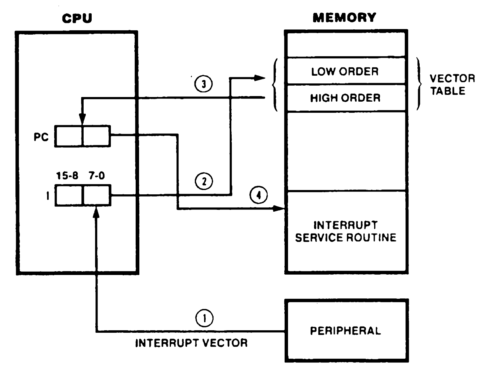
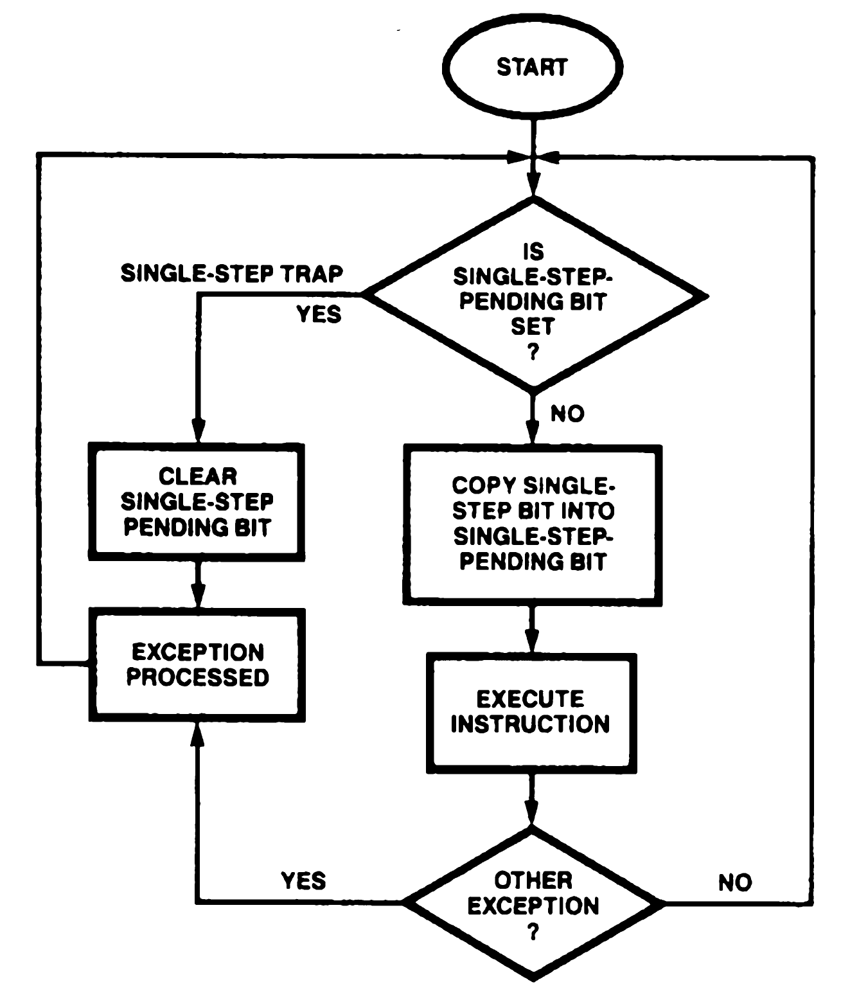
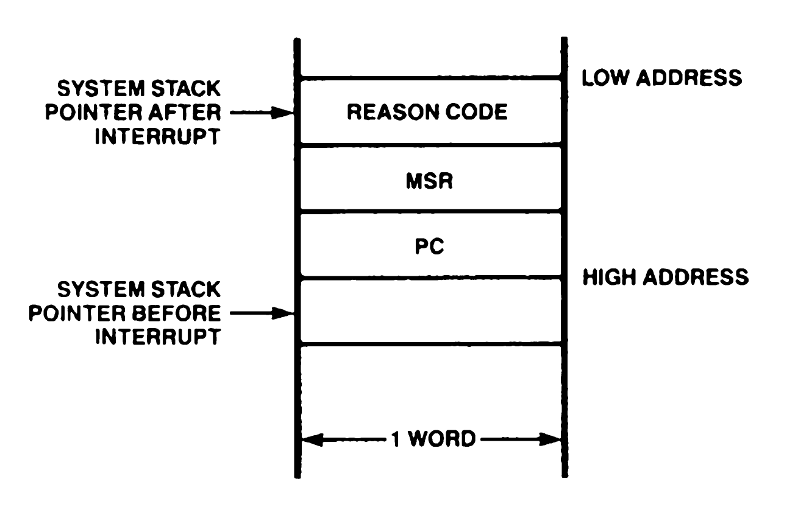

# 6. Interrupts and Traps

## Index

[6.1 INTRODUCTION](#61-introduction)

[6.2 INTERRUPTS](#62-interrupts)

[6.2.1 Interrupt Mode 0](#621-interrupt-mode-0)

[6.2.2 Interrupt Mode 1](#622-interrupt-mode-1)

[6.2.3 Interrupt Mode 2](#623-interrupt-mode-2)

[6.2.4 Interrupt Mode 3](#624-interrupt-mode-3)

[6.3 TRAPS](#63-traps)

[6.3.1 Extended Instruction Trap](#631-extended-instruction-trap)

[6.3.2 Privileged Instruction Trap](#632-privileged-instruction-trap)

[6.3.3 System Call Trap](#633-system-call-trap)

[6.3.4 Access Violation Trap](#634-access-violation-trap)

[6.3.5 System Stack Overflow Warning Trap](#635-system-stack-overflow-warning-trap)

[6.3.6 Division Exception Trap](#636-division-exception-trap)

[6.3.7 Single-Step Trap](#637-single-step-trap)

[6.3.8 Breakpoint-on-Halt Trap](#638-breakpoint-on-halt-trap)

[6.4 INTERRUPT AND TRAP HANDLING](#64-interrupt-and-trap-handling)

[6.4.1 Interrupt Acknowledge](#641-interrupt-acknowledge)

[6.4.2 Status Saving](#642-status-saving)

[6.4.3 Loading New Program Status](#643-loading-new-program-status)

[6.4.4 Executing the Service Routine](#644-executing-the-service-routine)

[6.4.5 Returning from a Service Routine](#645-returning-from-a-service-routine)

[6.5 INTERRUPT/TRAP VECTOR TABLE](#65-interrupttrap-vector-table)

[6.6 THE FATAL CONDITION](#66-the-fatal-condition)

## 6.1 INTRODUCTION

Exceptions are conditions that can alter the normal flow of program execution. The Z280 CPU supports three kinds of exceptions: interrupts, traps, and resets.

Interrupts are asynchronous events generated by a device external to the CPU; peripheral devices use interrupts to request service from the CPU. Traps are synchronous events generated internally in the CPU by particular conditions that can occur during the attempted execution of an instruction. Thus, the difference between traps and interrupts is their origin. A trap condition is always reproducible by re-executing the program that created the trap, whereas an interrupt is generally independent of the currently executing task.

A hardware reset overrides all other conditions, including interrupts and traps. It occurs when the RESET line is activated, and it causes certain CPU control registers to be initialized. Resets are discussed in detail in Chapter 11.

## 6.2 INTERRUPTS

Two kinds of interrupts are activated by four different pins on the Z280 MPU. The nonmaskable interrupt (NMI) is an interrupt that cannot be disabled (masked) by software. Typically, NMI is reserved for high-priority external events that need immediate attention, such as an imminent power failure. Maskable interrupts are interrupts that can be disabled (masked) via software by clearing the appropriate bits in the Interrupt Request Enable field of the Master Status register.

There are seven maskable interrupts in the Z280 MPU architecture. Three of these interrupts are external inputs to the device (Interrupts A, B, and C); the other four maskable interrupts are asserted by the on-chip peripherals. The seven Interrupt Request Enable bits in the Master Status register control which of the requested interrupts are accepted. Interrupt requests are grouped as listed in Table 6-1, with each group controlled by a separate Interrupt Request Enable bit. The list is presented in order of decreasing priority, with sources within a group listed in order of decreasing priority.

The Enable Interrupt (EI) instruction is used to selectively enable the maskable interrupts (by setting the appropriate bits in the MSR to 1) and the Disable Interrupt (DI) instruction is used to selectively disable interrupts (by clearing the appropriate bits in the MSR to 0). When an interrupt source has been disabled, the CPU ignores any requests from that source. Because maskable interrupt requests are not retained by the CPU, the request signal on a maskable interrupt line must be asserted until the CPU acknowledges the request.

When enabling interrupts with the EI instruction, all maskable interrupts are automatically disabled (whether previously enabled or not) for the duration of the execution of the EI instruction and the immediately following instruction.
Interrupts are always accepted between instructions. The block move, block search, and block I/O instructions can be interrupted after any iteration.

 

| Members of Interrupt Group | Enable bit In MSR |
|-|-|
Maskable Interrupt A line | 0
Counter/Timer 0, DMA Channel 0 | 1
Maskable Interrupt B line | 2
Counter/Timer 1, UART Receiver, DMA Channel 1 | 3
Maskable Interrupt C line | 4
UART Transmitter, DMA Channel 2 | 5
Counter/Timer 2, DMA Channel 3 | 6

_Table 6-1. Grouping of Maskable Interrupt Requests_

 

The Z280 CPU has four modes for handling externally generated interrupts, selectable using the IM instruction. The first three modes extend the Z80 CPU interrupt modes to accommodate the Z280 MPU's additional interrupt inputs in a compatible fashion. The fourth mode allows more flexibility in interrupt handling, providing support for nested interrupts and a sophisticated vectoring scheme. The on-chip peripherals always use this fourth interrupt mode, regardless of which mode is selected for the external interrupts. The current interrupt mode in effect can be read from the Interrupt Status register.

### 6.2.1 Interrupt Mode 0

Interrupt mode 0 is similar to the 8080 CPU interrupt response mode. For mode 0, an externally generated interrupt (maskable or nonmaskable) causes the User/<ins>System</ins> bit and the Single-Step bit in the Master Status register to be cleared to 0, thereby placing the CPU in system mode with single-stepping disabled. All the Interrupt Request Enable bits in the MSR are also cleared to zero, which disables the maskable interrupts. The previous condition of the MSR is not saved.

For nonmaskable interrupts, the current value in the Program Counter is saved on the system stack, using the System Stack Pointer, and the constant 0066H is loaded into the Program Counter. Location 0066H in system program memory is, then, the starting logical address of the nonmaskable interrupt service routine; this logical address can, of course, be translated into a physical memory address by the MMU.

For maskable interrupts, the interrupting device must place a Call or Restart instruction opcode on the data bus during the interrupt acknowledge bus transaction. The Z280 CPU reads this opcode and executes it; thus, the interrupting device, instead of memory, provides the first instruction of the service routine. Typically, a Restart instruction is used, since the Restart opcode is only one byte long, meaning that the interrupting peripheral needs to supply only one byte of information. Alternatively, a 3-byte call to any location can be executed.

### 6.2.2 Interrupt Mode 1

In interrupt mode 1, the Z280 CPU automatically executes a Restart to a fixed location when an interrupt occurs. An externally generated interrupt (maskable or nonmaskable) causes the User/System bit, the Single-Step bit, and all Interrupt Request Enable bits in the Master Status register to be cleared to 0, which puts the CPU in system mode with single-stepping disabled. The previous condition of the MSR is not saved. The current value in the Program Counter is pushed onto the system-mode stack. For nonmaskable interrupts, the constant 0066H is then loaded into the Program Counter; thus, 0066H is the starting address of the nonmaskable interrupt service routine. For maskable interrupts, the constant 0038H is loaded into the Program Counter; 0038H will be the starting address of the maskable interrupt service routine. These logical addresses can be converted to physical addresses by the MMU.

### 6.2.3 Interrupt Mode 2

Interrupt mode 2 is a vectored interrupt response mode for maskable interrupts, wherein the interrupting device identifies the starting location of the service routine using an 8-bit vector read by the CPU during the interrupt acknowledge cycle.

An externally generated interrupt (maskable or nonmaskable) causes the User/System bit, the Single-Step bit, and the Interrupt Enable Request bits in the Master Status register to be cleared to 0, which puts the CPU in system mode with single-stepping disabled. The previous condition of the MSR is not saved. The current value in the Program Counter is pushed onto the system mode stack.

For nonmaskable interrupts, the constant 0066H is then loaded into the Program Counter; thus, 0066H is the starting address of the nonmaskable interrupt service routine. For maskable interrupts, the programmer must maintain a table in memory of the 16-bit starting addresses for every maskable interrupt service routine. This table can be located anywhere in the system mode data memory address space, starting on a 256-byte memory boundary. When a maskable interrupt is accepted, a 16-bit pointer into this table is generated in order to select the starting address of the appropriate service routine from the table entries. The peripheral generating the interrupt places an 8-bit vector on the data bus in response to the interrupt acknowledge. This vector becomes the lower eight bits of the pointer into the table. The upper eight bits of the pointer are the contents of the I register. This pointer is treated as an address in the system data memory space that can be translated to a physical address by the MMU. The actual logical address of the service routine is found by referencing the word located at the address formed by concatenating the I register's contents with the vector. Figure 6-1 illustrates the sequence of events for processing mode 2 maskable interrupts. A reset clears the I register to all zeros.

 

 

**NOTES:**
1. Interrupt vector generated by peripheral is read by CPU during interrupt acknowledge cycle.
2. Vector combined with I register contents form 16-bit memory address pointing to vector table.
3. Two bytes are read sequentially from vector table. These two bytes are read into the PC.
4. Processor control is transferred to interrupt service routine and execution continues.

_Figure 6-1. Mode 2 Interrupt Processing_

 

The Master Status register is not saved when processing interrupts under interrupt modes 0, 1, and 2. If the Z280 CPU is running in the user mode when an interrupt occurs, the MSR is automatically changed to system mode when the interrupt is acknowledged, without recording the previous user mode of operation. Similarly, the single-step mode and the maskable interrupts are automatically disabled during interrupt processing, with no saving of the previous status. Thus, to resume processing of an interrupted user-mode program after the execution of an interrupt service routine, the operating system must change the Master Status register in order to switch back to user mode; the Return from Interrupt Long instruction can be used for this purpose.

In interrupt modes 0, 1, and 2, a nonmaskable interrupt automatically disables all maskable interrupts (as in the Z80 CPU). All of the Interrupt Request Enable bits (bits 0 through 6 in the MSR) are copied to a special register in the CPU called the Interrupt Shadow register. The Interrupt Request Enable bits are then cleared to all zeros. A Return from Nonmaskable Interrupt instruction restores the previous settings of the Interrupt Request Enable bits by copying the contents of the Interrupt Shadow register into bits 0 through 6 of the MSR. The nesting is only one level deep (again, as in the Z80 CPU).

For a Z80 Bus configuration of the Z280 MPU, only one interrupt line (either Interrupt A, Interrupt B, or Interrupt C) can be used if interrupt modes 0, 1, or 2 and the Z80 family peripherals are used; Z80 peripherals being serviced on multiple interrupt lines would all be affected by a Return from Interrupt (RETI) instruction.

### 6.2.4 Interrupt Mode 3

Interrupt mode 3 exploits the advanced features of the Z280 MPU architecture. When an interrupt request is accepted (maskable or nonmaskable), the Master Status register, Program Counter, and a 16-bit "reason code" are automatically stored on the system-mode stack. Next, new values for the MSR and PC are fetched from a table in memory called the Interrupt/Trap Vector Table, thereby determining the operating modes and starting address of the service routine (see section 6.5). The reason code for externally generated interrupts is the contents of the data bus during the interrupt acknowledge, and is usually supplied by the interrupting device. For 8-bit data bus configurations of the Z280 MPU, the upper byte of the reason code is all zeros. For interrupts from the on-chip peripherals, the reason code is identical to the vector address in the Interrupt/Trap Vector Table, thereby identifying the interrupting device. The Interrupt/Trap Vector Table Pointer register in the CPU is used to reference the Interrupt/Trap Vector Table during mode 3 interrupt processing.

Interrupt mode 3 is the intended mode of operation when using the advanced features of the Z280 MPU architecture, such as system and user modes and single-stepping, since the Master Status register of the interrupted task is automatically saved and another loaded for the service routine. This allows each service routine to be executed in the appropriate mode without affecting the status of the interrupted task. Also, vector tables can be provided for both maskable and nonmaskable interrupts when in mode 3.
Interrupt mode 3 is always used for processing interrupts from the Z280 MPU's on-chip peripherals, regardless of which mode is selected for the external interrupt requests.

Table 6-2 summarizes interrupt processing for all four modes.

 

Interrupt Mode | Interrupt Type | Saved Status Information | Effect on MSR | Effect on PC
|-|-|-|-|-|
0 | Nonmaskable | PC | System mode, Single-Step and interrupts disabled |Set to 66h
0 | Maskable | * | " | *
1 | Nonmaskable | PC | " | Set to 66h
1 | Maskable | PC | " | Set to 38H
2 | Nonmaskable | PC | " | Set to 66h
2 | Maskable | PC | " | Fetched from address formed by I register and Interrupt vector
3 | Nonmaskable | MSR, PC, and reason code | Fetched from Interrupt/ Trap Vector Table | Fetched from Interrupt/ Trap Vector Table
3 | Maskable | MSR, PC, and reason code | " | "

*: Depends on Instruction returned by interrupting device during acknowledge cycle.

_Table 6-2. Interrupt Modes_

## 6.3 TRAPS

The Z280 CPU architecture supports eight types of traps, all of which are generated internally in the MPU. The Privileged Instruction, System Call, Access Violation, and Division Exception traps cannot be disabled. I/O instructions can be specified as privileged instructions in the Trap Control register. The Extended Instruction, System Stack Overflow Warning, Single-Step, and Breakpoint-on-Halt traps can be selectively enabled or disabled in the Trap Control register and MSR.

Traps are processed by saving the current program status (PC and MSR) on the system stack and loading new program status from the Interrupt/Trap Vector Table, in a manner similar to interrupts using interrupt mode 3. The current interrupt mode has no effect on trap processing. Thus, the Interrupt/Trap Vector Table must be present in memory and the Interrupt/Trap Vector Table Pointer in the CPU must be initialized before executing any instruction that could generate a trap. Traps can occur only if executing Z280 MPU instructions that are not part of the Z80 CPU instruction set or if trap-generating features of the Z280 CPU (such as stack overflow warnings) have been explicitly enabled.

### 6.3.1 Extended Instruction Trap

The Extended Instruction trap occurs when the Z280 CPU encounters an extended instruction while the EPU Enable bit in the Trap Control register is a zero. For instructions that transfer data between an EPU and memory, the following information is pushed onto the system stack when processing the Extended Instruction trap: the address of the next instruction, the MSR, the address of the memory operand, and the address of the template portion of the extended instruction (in that order). For Load Accumulator from EPU and EPU Internal Operation instructions, the address of the next instruction, the MSR, and the address of the template in the extended instruction are saved. The PC and MSR values for the service routine are then loaded from the Interrupt/Trap Vector Table. The Interrupt/Trap Vector Table contains four different entries for Extended Instruction traps, one for each type of extended instruction.

The Extended Instruction trap allows the program to simulate (in software) the operation of an EPU in a trap service routine when no EPUs are present in the system.

### 6.3.2 Privileged Instruction Trap

The Privileged Instruction trap occurs when the Z280 CPU encounters a privileged instruction while in the user mode (the User/<ins>System</ins> bit in the MSR is set to 1). I/O instructions can be privileged instructions, depending on the contents of the Trap Control register. The following information is saved on the system stack when processing a Privileged Instruction trap: the address of the instruction causing the trap and the MSR (in that order).

The Privileged Instruction trap protects the operating system environment by preventing user mode programs from executing instructions that could disrupt the system.

### 6.3.3 System Call Trap

The System Call trap occurs whenever a System Call instruction is executed. The following information is saved on the system stack when processing a System Call trap: the address of the next instruction, the MSR, and the 16-bit immediate operand encoded in the System Call instruction (in that order).

The System Call trap provides a means by which a user mode program can request an operating system function, thereby allowing for an orderly transition between the user and system modes.

### 6.3.4 Access Violation Trap

The Access Violation trap occurs whenever the Z280 MPU's on-chip MMU detects an illegal memory access. Specifically, this trap occurs when the MMU's translation mode is enabled and either the address to be translated implies using a page descriptor register whose Valid bit is zero or the access is a write to a page whose Write-Protect bit is set to 1. The following information is saved on the system stack when processing an Access Violation trap: the address of the instruction causing the trap and the MSR (in that order). Information about the logical address that caused the fault is saved in the MMU (see Chapter 7).

The Access Violation trap facilitates the implementation of virtual memory systems using the Valid bit in the page descriptor registers and allows information in memory to be write-protected.

### 6.3.5 System Stack Overflow Warning Trap

The System Stack Overflow Warning trap can occur only if the Stack Overflow Warning bit in the Trap Control register is set to 1. If so, then for each push to the system stack, the 12 most significant bits of the Stack Pointer are compared to the contents of the Stack Limit register and a trap is generated if they match. The following information is saved on the system stack when processing a System Stack Overflow Warning trap (but no second System Stack Overflow Warning trap is generated): the address of the next instruction and the MSR (in that order). The Stack Overflow Warning bit in the Trap Control register is automatically cleared to 0 when this trap occurs in order to prevent repeated traps.

The System Stack Overflow Warning trap notifies the operating system of potential stack overflow problems.

### 6.3.6 Division Exception Trap

The Division Exception trap occurs while executing a Divide instruction if the divisor is zero (divide by zero case) or the quotient cannot be represented in the destination precision (overflow case); the CPU flags are set to distinguish between these two situations (see the descriptions for the Divide instructions in Chapter 5). The following information is saved on the system stack when processing a Division Exception trap: the address of the Divide instruction and the MSR (in that order).

### 6.3.7 Single-Step Trap

Two control bits in the Master Status register are used to control Single-Step traps: the Single-Step bit (bit 8) and the Single-Step Pending bit (bit 9). The Single-Step trap occurs when the Single-Step Pending bit in the MSR is set to 1. To enter single-step mode, wherein a Single-Step trap is executed after each instruction, the Single-Step bit in the MSR is set to 1. At the beginning of instruction execution, the state of the Single-Step Pending bit is checked; if it is set, a Single-Step trap ip executed. Then, the state of the Single-Step bit is copied into the Single-Step Pending bit and the instruction is executed. If the instruction generates another trap (such as a Privileged Instruction trap), that trap handling routine is executed before the Single-Step Pending bit is again checked and the Single-Step trap is processed. This execution sequence is illustrated in Figure 6-2. Note that once the Single-Step bit gets set, a Single-Step trap does not occur until after the next instruction, because the Single-Step Pending bit is checked before being loaded with the state of the Single-Step bit. Single-Step traps are then executed after each instruction until the Single-Step bit in the MSR is cleared to 0.

 

 
_Figure 6-2. Instruction Execution Sequence_

 

The Single-Step Pending bit in the MSR is automatically cleared by a Division Exception, Access Violation, Privileged Instruction, or Breakpoint-on-Halt trap, so that the saved MSR value put on the stack as a result of trap processing will have a 0 in bit position 9. For each of those trap types, the address of the actual trapping instruction is saved on the stack (as opposed to the address of the next instruction). The trapping instruction can be re-executed upon returning from the trap service routine, in which case another Single-Step trap is not desired before instruction execution. Similarly, the Single-Step Pending bit is automatically cleared by a Single-Step trap, to ensure that only one Single-Step trap occurs per instruction.

When executing a Return From Interrupt Long (RETIL) instruction to return from an interrupt or trap service routine, the Single-Step Pending bit in the MSR for the interrupted program is the OR of the Single-Step Pending bit in the MSR of the service routine and the Single-Step Pending bit in the MSR value that was saved during trap processing. Thus, if the service routine was being executed in single-step mode, a Single-Step trap occurs after execution of the RETIL instruction, before resumption of the interrupted program.

The following information is saved on the system stack when processing a Single-Step trap: the address of the next instruction and the MSR (in that order).

The Single-Step trap facilitates the debugging of Z280 CPU code. The following text explains four methods for entering single-step operations.

_Method A:_

1. PUSH a PC value for the instruction you wish to jump to.
2. PUSH an MSR value with the desired combination of the Single-Step (SS) and Single-Step Pending (SSP) bits.
3. Execute and RETIL instruction.

_Method B:_

Execute a LDCTL instruction with the desired combination of the SS and SSP bits.

_Method C:_

1. Execute a System Call (SC) with an identifier that you reserve for a single-step entry.
2. POP the identifier and branch to the remaining single-step code routine.
3. POP the MSR.
4. Set the desired combinations of SS and SSP.
5. PUSH the new MSR.
6. Execute the RETIL instruction.

_Method D:_

This method can be used only in the User Mode of operation.

Use the "Breakpoint-on-Halt" trap by substituting a HALT opcode for the first byte of an instruction where single-stepping is to start. The trap service routine should look something like this:

1. POP the MSR.
2. Set the desired combinations of SS and SSP.
3. PUSH the MSR.
4. Restore the instruction byte that the HALT opcode replaced.
5. Execute the RETIL instruction.

Both interrupt and trap routines can be single-stepped by setting the appropriate SS and SSP combination in the MSR entry in the Interrupt/Trap Vector Table.

Instructions that cause a trap but will be re-executed (ie: privileged, divide, page fault) automatically clear the SSP bit in the PUSHed MSR. This ensures that only one single-step trap will occur for these instructions.

### 6.3.8 Breakpoint-on-Halt Trap

The Breakpoint-on-Halt trap occurs if a Halt instruction is encountered while the Breakpoint-on-Halt Enable bit in the MSR is set to 1. The following information is saved on the system stack when processing a Breakpoint-on-Halt trap: the address of the Halt instruction and the MSR (in that order).

The Breakpoint-on-Halt trap provides a breakpoint facility that is useful in debugging environments in which breakpoints on instruction boundaries are desired.

The trap types and the status saved during the processing of each trap are summarized in Table 6-3.

 

Trap Type | Can be Disabled | Status Saved
|-|-|-|
Extended Instruction | Yes | Address of next instruction MSR value Address of operand in memory (if applicable) Address of EPU template
Privileged Instruction | No | Address of instruction causing trap MSR value
System Call | No | Address of next instruction MSR value 16-bit reason code from SC instruction
Access Violation | No | Address of instruction causing trap MSR value
System Stack Overflow | Yes | Address of next instruction MSR value
Division Exception | No | Address of instruction causing trap MSR value
Single-Step | Yes | Address of next instruction MSR value
Breakpoint-on-Halt | Yes | Address of Halt instruction MSR value

_Table 6-3. Trap Types_

## 6.4 INTERRUPT AND TRAP HANDLING

The Z280 CPU response to an interrupt request or trap condition consists of up to five steps: acknowledging the external request (externally-generated interrupts only), saving current program status, loading new program status, executing the service routine, and returning to the interrupted program. Interrupts are accepted and processed between instructions, with the exception of the block move, search, and I/O instructions, which can be interrupted between any iteration. Traps are detected during instruction execution, with the exception of the Single-Step trap, as described previously. Thus, a trap condition is processed before handling any pending interrupts.

### 6.4.1 Interrupt Acknowledge

An interrupt acknowledge bus transaction is required only for externally-generated interrupts. The main effect of the interrupt acknowledge is to establish communication between the requestor and the Z280 CPU.
For Z80 Bus configurations of the Z280 MPU, the type of interrupt being acknowledged is indicated on bus lines AD1 and AD2 while the Address Strobe is being asserted during the interrupt acknowledge cycle, as per Table 6-4.

 

AD2 | AD1 | Interrupt Being Acknowledged
|-|-|-|
0 | 0 | Interrupt A
0 | 1 | Nonmaskable Interrupt
1 | 0 | Interrupt B
1 | 1 | Interrupt C

_Table 6-4. Interrupt Acknowledge Encoding for Z80 Bus Configuration_

 

For the Z80 Bus configurations of the Z280 MPU, no external acknowledge cycle is generated for nonmaskable interrupts in interrupt modes 0, 1, and 2, or for maskable interrupts in interrupt mode 1. For maskable interrupts in interrupt modes 0, 2, and 3, and for nonmaskable interrupts in mode 3, 8-bit data is read from the AD0-AD7 bus lines during the acknowledge cycle; this data is used as dictated by the interrupt mode in effect, as described in section 6.2. For maskable interrupts in interrupt mode 0, successive bytes are read on AD0-AD7 until a complete instruction has been fetched, via repetition of the acknowledge cycle.

For Z-BUS configurations of the Z280 MPU, any interrupt from an external source is acknowledged. The type of interrupt being acknowledged is indicated by the ST0-ST3 status lines during the acknowledge cycle. A word of data is read from the address/data bus during the acknowledge cycle and used as dictated by the interrupt mode in effect. For interrupt modes 2 and 3, the lower byte of this data is used as the interrupt vector. For maskable interrupts in interrupt mode 0, successive bytes are read on AD0-AD7 until a complete instruction has been fetched, via repetition of the acknowledge cycle.

Acknowledge cycles are always executed in system mode, regardless of the mode of the interrupted program. The MSR of the interrupted program is not affected by this change in mode. The CPU stays in system mode until the start of execution of the service routine. In interrupt modes 0, 1, and 2, the service routine starts in system mode; in interrupt mode 3, the MSR of the service routine is determined by the contents of the Interrupt/Trap Vector Table.

Interrupt requests from the on-chip peripherals never generate an acknowledge cycle and are always processed using interrupt mode 3. Similarly, traps do not generate acknowledges.

### 6.4.2 Status Saving

During exception processing, the status of the interrupted program is saved on the system stack. In interrupt mode 0, the Program Counter is automatically saved when processing nonmaskable interrupts; the instruction returned by the peripheral device will determine what status information is
saved when processing maskable interrupts. For interrupts in interrupt mode 1 or 2, the Program Counter is automatically saved. For interrupts in interrupt mode 3, the Program Counter and MSR of the interrupted task are saved, followed by the "reason code" (Figure 6-3). For external interrupt requests, the reason code is the value read from the data bus during the interrupt acknowledge cycle; the upper byte of the reason code is all zeros for 8-bit data bus (Z80 Bus) configurations of the Z280 MPU. For interrupts from the on-chip peripherals, the reason code is the offset address in the Interrupt/Trap Vector Table that corresponds to the MSR value entry for that interrupt type.

 

 
_Figure 6-3. Format of Saved Status on System Stack Due to a Mode 3 Interrupt_

 

The Program Counter value saved during interrupt processing is the address of the next instruction in the interrupted routine, except for interrupts during block move, block search, and block 1/0 instructions. The block instructions can be interrupted between any one iteration of their operation, in which case the PC value saved is the address of the block instruction itself.
The status saved as a result of a trap depends on the type of trap being executed, as noted in Figure 6-3. The PC and MSR values are always saved during trap processing, along with other trap-dependent information.
If any memory write operation involved in saving status information during interrupt or trap processing causes a memory access violation, a special "fatal condition" is entered, as described in section 6.6.

### 6.4.3 Loading New Program Status

After saving the status of the interrupted program, new program status values (i.e., new values for the PC and MSR) are automatically loaded, in accordance with the interrupt mode and any data read during the acknowledge cycle. This new program status determines the operating modes and starting address of the service routine.

For externally generated interrupts in interrupt modes 0, 1, and 2, the Master Status register is automatically modified to specify system mode with the Single-Step trap and all maskable interrupts disabled. For externally generated interrupts in interrupt mode 3, all internally generated interrupts, and all traps, the new MSR value is loaded from the Interrupt/Trap Vector Table.

For externally generated maskable interrupts processed using interrupt mode 0, the first instruction of the service routine is supplied by the interrupting device. This must be a Call or Restart instruction that loads the PC with the starting address of the service routine. For nonmaskable interrupts in interrupt mode 0, the PC is set to 0066H, and all maskable interrupts are automatically disabled.

In interrupt mode 1, the PC is set to 0038H for externally generated maskable interrupts and to 0066H for nonmaskable interrupts.

For externally generated maskable interrupts in interrupt mode 2, the PC is fetched from an Interrupt Vector table in system data memory; the logical address of the fetched PC value is formed by concatenating the contents of the I register with the 8-bit vector returned by the interrupting device during the acknowledge cycle. For nonmaskable interrupts, the PC is set to 0066H.

For externally generated interrupts in interrupt mode 3, all internally generated interrupts, and all traps, the PC and MSR values for the service routine are fetched from the Interrupt/Trap Vector Table (see section 6.5). The new value for the MSR is at a fixed location in this table. Externally generated interrupts can be vectored or nonvectored in interrupt mode 3, as determined by the contents of the Interrupt Status register. For nonvectored interrupts and all traps, the new PC value is at a fixed location in the Interrupt/Trap Vector Table; for vectored interrupts, the location of the new PC in the table is dependent on the 8-bit vector read during the acknowledge cycle.

The value loaded into the Program Counter during exception processing is a logical address that can be translated to a physical address by the MMU when the CPU fetches the first instruction of the service routine.

### 6.4.4 Executing the Service Routine

In interrupt mode 0, the interrupting device provides the Restart or Call instruction that begins the service routine; this instruction saves the Program Counter value of the interrupted routine and provides the address of the service routine. In the other interrupt modes and for traps, the starting address of the service routine is determined automatically during interrupt processing, as described in the preceding section. This program is now executed.

For externally generated interrupts in interrupt modes 0, 1, and 2, all maskable interrupts are automatically disabled; therefore the service routine is protected from additional interrupts until the MSR is altered via a Load Control, Enable Interrupt, Return from Nonmaskable Interrupt, or Return from Interrupt Long instruction. Interrupts in mode 3 and all traps cause a new MSR to be loaded from the Interrupt/Trap Vector Table; the value of this MSR determines which interrupts are enabled during the service routine. Service routines that enable interrupts before exiting permit interrupts to be handled in a nested fashion.

### 6.4.5 Returning from a Service Routine

Three different instructions are available for returning from an interrupt or trap service routine: Return from Nonmaskable Interrupt, Return from Interrupt, and Return from Interrupt Long. All three are privileged instructions, since they must retrieve values from the system stack.
The Return from Nonmaskable Interrupt (RETN) instruction is used to return from nonmaskable interrupts in interrupt modes 0, 1, and 2. This instruction pops the word on the top of the stack into the Program Counter, restoring the Program Counter value present before the interrupt, and loads the Interrupt Request Enable bits in the MSR with the contents of the Interrupt Shadow register.

The Return from Interrupt (RETI) instruction is used to return from externally generated maskable interrupts in interrupt modes 0, 1, and 2. This instruction pops the word on the top of the stack into the Program Counter, which restores the Program Counter value present before the interrupt. The RETI instruction also causes a special bus transaction that fetches this instruction from external memory (regardless of whether it is contained in the on-chip cache), with the appropriate bus control and status signals to indicate that an instruction fetch is occurring; this is used to reset the interrupt logic of the Z80 family peripherals.

The Return from Interrupt Long (RETIL) instruction is used to return from interrupts in interrupt mode 3 and all traps, since it causes both the MSR and PC values to be popped from the stack. If this instruction is used to return from an interrupt processed with another interrupt mode (e.g., if RETIL is used to return from a mode 2, instead of a mode 3, interrupt), an MSR value must be pushed onto the stack in the service routine prior to execution of the RETIL. For interrupts in interrupt mode 3 and all traps, the service routine must pop the reason code or other trap-dependent information off the stack before executing RETIL. Unlike RETI, RETIL causes no special bus activity and, therefore, cannot be used to automatically reset Z80 family peripherals.

## 6.5 INTERRUPT/TRAP VECTOR TABLE

During interrupt processing under interrupt mode 3 and all trap processing, the PC and MSR values that determine the starting location and operating modes of the appropriate service routine are fetched from a table in memory called the Interrupt/Trap Vector Table. This table holds an MSR and PC value for the service routine for every possible type of interrupt and trap. The particular values fetched from the table during exception processing are a function of the type of exception that occurred and, for vectored external interrupts, the vector returned by the peripheral during the acknowledge cycle. The format of the Interrupt/Trap Vector Table is given in Table 6-5. Each entry in the Interrupt/Trap Vector Table consists of two words—an MSR value followed by a PC value. If an external interrupt is vectored, as determined by the contents of the Interrupt Status register, the 8-bit vector returned by the peripheral is used as an index into a list of up to 128 possible PC values for the service routine; only even-valued vectors are supported by the Z280 CPU architecture. Thus, for a vectored interrupt, there is only one starting MSR value for all the possible service routines, but up to 128 potential PC values. The NMI and Interrupt A requests share the same vectors.

For example, suppose an interrupt is requested by the on-chip counter/timer 0. If that interrupt request is enabled (bit 1 in the MSR is set to 1), the interrupt is processed as follows: the current PC and MSR values are saved on the system stack; an identifier word with the value 14H is saved on the system stack; a new value for the MSR is fetched from location 14H in the Interrupt/Trap Vector Table; a new value for the PC is fetched from location 16H in the Interrupt/Trap Vector Table; execution of the service routine is begun.

If an interrupt request is received from an external source on interrupt line A under interrupt mode 3 and that interrupt request is enabled (bit 0 in the MSR i3 set to 1), then interrupt processing proceeds as follows:

* An acknowledge cycle is executed, during which data is read from the external data bus.
* The current PC and MSR values are saved on the system stack.
* The data read from the bus during the acknowledge cycle is saved on the system stack as the identifier word.
* A new value for the MSR is fetched from location 08H in the Interrupt/Trap Vector Table
* A new value for the PC is fetched either from location 0AH in the Interrupt/Trap Vector Table (if bit 13 of the Interrupt Status register is 0, indicating that Interrupt A is not vectored) or from the location in the Interrupt/Trap Vector Table found by adding the lower byte of the data read from the bus during the acknowledge cycle (the interrupt vector) to 70H (if bit 13 of the Interrupt Status register is 1, indicating that Interrupt A is vectored).
* Execution of the service routine is begun.

For vectored interrupts, the interrupt vector returned during the acknowledge cycle must be even-valued in order to reference a valid PC value in the Interrupt/Trap Vector Table.

The Interrupt/Trap Vector Table Pointer register must be initialized to hold the most significant 12 bits of the starting physical address of the Interrupt/Trap Vector Table. The Interrupt/Trap Vector Table must start on a 4K byte boundary in physical memory (that is, a memory address whose 12 least significant bits are all zeros).

 

Address In Table (Hexadecimal) | Contents
|-|-|
00 | Reserved
04 | NMI vector
08 | Interrupt line A vector
0C | Interrupt line B vector
10 | Interrupt line C vector
14 | Counter/Timer 0 vector
18 | Counter/Timer 1 vector
1C | Reserved
20 | Counter/Timer 2 vector
24 | DMA channel 0 vector
28 | DMA channel 1 vector
2C | DMA channel 2 vector
30 | DMA channel 3 vector
34 | UART receiver vector
38 | UART transmitter vector
3C | Single-Step trap vector
40 | Breakpoint-on-Halt trap vector
44 | Division Exception trap vector
48 | Stack Overflow Warning trap vector
4C | Access Violation trap vector
50 | System Call trap vector
54 | Privileged Instruction trap vector
58 | EPU ← Memory Extended Instruction trap vector
5C | Memory ← EPU Extended Instruction trap vector
60 | A ← EPU Extended Instruction trap vector
64 | EPU Internal Operation Extended Instruction trap vector
68-6C | Reserved
70-16E | 128 Program Counter values for NMI and interrupt line A vectors (MSR values from position 04 and 08 in this table, respectively)
170-26E | 128 Program Counter values for interrupt line B (MSR value from position 0C in this table)
270-36E | 128 Program counter values for interrupt line C (MSR value from position 10 in this table)

_Table 6-5. Interrupt/Trap Vector Table Format_

## 6.6 THE FATAL CONDITION

During interrupt and trap processing, the CPU automatically attempts to save status information about the interrupted program on the system stack. If the MMU is enabled, an access violation can occur during the status saving process if a write is attempted to an invalidated page or to a page that is write-protected. Detection of an access violation during the status saving process causes the Z280 CPU to enter a special fatal condition; the following steps are taken automatically when the fatal condition occurs: the current PC contents are written to the HL register, the current MSR contents are written to the DE register, all the Interrupt Request Enable bits in the MSR are cleared to 0, and the CPU enters a Halt state. This Halt state is identical to the Halt state caused by the execution of a Halt instruction, with one exception: a Halt state induced by a fatal condition can be exited only by a reset.
