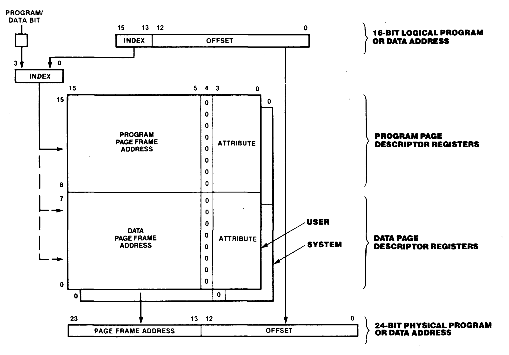

# 7. Memory Management Unit

## Index

[7.1 INTRODUCTION](#71-introduction)

[7.2 MMU ARCHITECTURE](#72-mmu-architecture)

[7.3 PAGE DESCRIPTOR REGISTERS](#73-page-descriptor-registers)

[7.4 ADDRESS TRANSLATION](#74-address-translation)

[7.4.1 Address Translation Without Program/data Separation](#741-address-translation-without-programbata-separation)

[7.4.2 Address Translation With Program/data Separation](#742-address-translation-with-programdata-separation)

[7.5 MMU CONTROL REGISTERS](#75-mmu-control-registers)

[7.6 ACCESSING PAGE DESCRIPTOR REGISTERS](#76-accessing-page-descriptor-registers)

[7.6.1 Descriptor Select Port](#761-descriptor-select-port)

[7.6.2 Block Move Port](#762-block-move-port)

[7.6.3 Invalidation Port](#763-invalidation-port)

[7.7 INSTRUCTION ABORTS](#77-instruction-aborts)

## 7.1 INTRODUCTION

The Z280 MPUs include an on-chip paged Memory Management Unit (MMU), which allows the MPUs to address more than 64K bytes of physical memory. Memory management with the MMU involves two issues: memory allocation and memory protection. The allocation of memory is controlled by allowing the MMU to translate the 16-bit logical addresses from the Z280 CPU into the 24-bit physical addresses output by the MPU. Thus, a given programming task can be relocated to any area of physical memory, regardless of the logical addresses used by that task. During this translation process, the MMU also monitors the type of memory access being made; the MMU can inhibit accesses or write-protect memory areas, thereby allowing memory to be protected from unwanted or unintended modes of use.

The MMU partitions the 64K logical address space of the Z280 CPU into fixed-sized memory pages and maps those pages into the physical address space. Separate mapping facilities are available for the system and user modes of operation; translation can be performed in either one or in both modes. Optionally, the MMU provides for separating instruction fetches from data references, which allows the user to define up to four different logical address spaces: system mode program, system mode data, user mode program, and user mode data. If the program and data address spaces are separated, the MMU uses a page size of 8192 (8K) bytes; if not, the page size is 4096 (4K) bytes.

The MMU is programmed via I/O references to its control registers. The MMU records which pages have been modified and can inhibit the cache mechanism to prevent the writing of data to the on-chip cache. Access Violation traps are generated when an error condition is detected (such as an attempted write to a read-only page). Access violations cause the currently executing instruction to be aborted, and allow that instruction to be restarted in a manner compatible with virtual memory requirements. Upon reset, the MMU is disabled, allowing logical addresses to pass through to physical memory without translation.

## 7.2 MMU ARCHITECTURE

The Z280 MMU consists of two sets of 16 page descriptor registers, used to translate addresses and assign memory attributes on a page-by-page basis, and a Master Control register that governs MMU operation. There is one page descriptor register associated with each logical page of memory. One set of 16 page descriptor registers is dedicated to system mode operation and the other set to user mode operation. The MMU registers are accessed using I/O instructions.

When translation is enabled for a particular mode (system or user), as determined by the contents of the MMU Master Control register, the MMU translates memory addresses whenever the CPU is operating in that mode, using the set of page descriptor registers dedicated to that mode. However, there are two exceptions to that rule:

* When the CPU is fetching program status information from the Interrupt/Trap Vector Table in response to an interrupt under interrupt mode 3 or a trap, the Interrupt Trap Vector Table Pointer register is used to determine the physical address of the program status information.

* The Load in User Program (LDUP) and Load in User Data (LDUD) instructions are executed in system mode but use the user mode page descriptor registers to translate the data operand's address.

Memory addresses generated by the on-chip DMA channels are 24-bit physical addresses that are not translated by the MMU. Only memory addresses, and not I/O addresses, are translated by the MMU.

While an address is being translated, any attributes associated with the logical page containing that address are checked. The attributes for a page are determined by the contents of that page's page descriptor register. Pages can be write-protected and/or made non-cacheable using these attributes. A non-cacheable page is one whose contents cannot be copied into the on-chip cache during program execution; thus, accesses to locations in non-cacheable pages always use the external bus. This attribute is useful in multiprocessor systems with shared memory areas, where each processor must be able to access the most current version of the information in the shared memory area, or in systems with memory-mapped I/O devices. The MMU also maintains a status bit for each page, which indicates if that page has been modified.

Each page descriptor register contains a Valid bit, which indicates if that descriptor contains valid information. Attempts to access an address contained in a page with an invalid descriptor and attempts to write to an address in a page that is write-protected generate Access Violation traps. An Access Violation trap causes the currently executing instruction to be aborted, facilitating the development of virtual memory systems. A special I/O port in the MMU (Invalidation I/O port) is available for resetting the valid bits in a whole group of page descriptor registers with a single I/O instruction.

For system mode operation, user mode operation, or both, the MMU can be configured to separate instruction fetches from data fetches, therefore separating the program address space from the data address space. This allows a Z280 MPU program to contain up to 64K bytes of code and operate on up to 64K bytes of data. With the program/data separation mode in effect, the 16 page descriptor registers for that mode are partitioned into two sets of eight descriptors: one set for instruction fetches and one set for data fetches. An instruction fetch or data reference using the PC relative addressing mode is translated using the page descriptor registers associated with the program address space; data accesses using other addressing modes and accesses to the interrupt vector table under interrupt mode 2 use the page descriptor registers associated with the data address space. In this mode, pages are 8K bytes long. Two control bits in the MMU Master Control register specify independently whether program/data separation is in effect for system mode and whether program/data separation is in effect for user mode.

When translation is disabled for a particular mode (system or user), the MMU does not translate memory addresses or perform attribute checking while the CPU is operating in that mode. For a memory access when the MMU is disabled, the logical memory address passes through the MMU without translation to physical address outputs A0-A15 and physical address outputs A16-A23 are all zeros. When the MMU is disabled all memory is assumed to be both writeable and cacheable.

## 7.3 PAGE DESCRIPTOR REGISTERS

There are two sets of 16 page descriptor registers in the MMU, one set for system mode operation and one set for user mode operation. Each page descriptor register is 16 bits long, consisting of a 12-bit page frame address field and a 4-bit attribute field (Figure 7-1).

 

 
_Figure 7-1. Page Descriptor Register_

 

The page frame address field contains the most significant 12 bits (if program/data separation is not in effect) or most significant 11 bits (if program/data separation is in effect) of the starting physical address for that page. The low-order bits of the page's base physical address are assumed to be all zeros; thus, pages always start on 4K byte boundaries in physical memory without program/data separation, or 8K byte boundaries with program/data separation.

The least significant four bits of each page descriptor register are attribute and status bits for that page, as described below:

**Modified Bit (M).** This status bit is automatically set to 1 whenever a write is successfully performed to a logical address in the page; it can be cleared to 0 only by writing to the page descriptor register via a software command. If the Valid bit is 0, the contents of this bit are undefined.

**Cacheable Bit (C).** When this bit is set to 1, information from the page can be stored in the on-chip cache memory. When this bit is cleared to 0, the cache control mechanism is inhibited from retaining a copy of information from the page.

**Write-Protect Bit (WP).** When set to 1, write operations to addresses in the page generate an Access Violation trap and the write is inhibited. When this bit is cleared to 0, all valid accesses to the page are allowed.

**Valid Bit (V).** This bit is set to 1 to indicate that the page descriptor register contains valid information about the page. When cleared to 0, all accesses to addresses in the page are inhibited and generate Access Violation traps.

## 7.4 ADDRESS TRANSLATION

If address translation is enabled, logical addresses are translated to physical addresses in one of two ways, depending on the program/data separation mode, as specified in the MMU Master Control register. The format of the page descriptor registers is independent of which mode is in effect.

### 7.4.1 Address Translation Without Program/data Separation

When program/data separation is not in effect, the 16-bit logical address from the CPU is divided into two fields, a 4-bit index field used to select one of the 16 page descriptor registers, and a 12-bit offset field that forms the lower 12 bits of the resulting physical address. The upper 12 bits of the physical address are provided by the page frame address field of the selected page descriptor register. The pages are 4K bytes long. This translation mechanism is illustrated in Figure 7-2. Page descriptor register 0 is the descriptor for logical addresses 0000H to 0FFFH, page descriptor register 1 is the descriptor for logical addresses 1000H to 1FFFH, and so on. Thus, the index portion of the logical address selects the page descriptor register. The page frame address field of that page descriptor register then determines the actual starting address for that page in physical memory; the low-order 12 bits of the logical address specify the offset within that 4K byte page.

 

 
_Figure 7-2. Address Translation without Program/Data Separation_

### 7.4.2 Address Translation With Program/data Separation

When program/data separation is in effect, the 16-bit logical address from the CPU is divided into a 3-bit index and a 13-bit offset. A Program/Data address control signal from the CPU becomes the most significant bit of the 4-bit index that selects the appropriate page descriptor register; the three most significant bits of the logical address form the least significant bits of this index. The upper 11 bits of the page frame address field in the selected page descriptor register provide the upper 11 bits of the resulting physical address. The least significant 13 bits of the logical address form the low order 13 bits of the physical address, as illustrated in Figure
7-3. Page descriptor register 0 is the descriptor for logical addresses 0000H-1FFFH in the data addres space, Page descriptor register 1 is the descriptor for logical addresses 2000H-3FFFH in the data address space, and so on through page descriptor register 7; page descriptor register 8 is the descriptor for logical addresses 0000H-1FFFH in the program address space, page descriptor register 9 is the descriptor for logical addresses 2000H-3FFFH in the program address space, and so on. Thus, each page is 8K bytes long, where the starting address of the page in physical memory is determined by the page frame address field in the selected page descriptor register, and the 13 least significant bits of the logical address specify the offset within that 8K byte page. In this mode, the least significant bit of the page frame address field in each page descriptor register is not used; this bit is modified by translation, and values read from it are unpredictable.

 

 
_Figure 7-3. Address Translation with Program/Data Separation_

## 7.5 MMU CONTROL REGISTERS

Besides the two sets of 16 page descriptor registers, the MMU contains a Master Control register and a Page Descriptor Register Pointer. The 16-bit Master Control register controls the operation of the MMU; the 8-bit Page Descriptor Register Pointer is used to select a particular page descriptor register during I/O accesses to the descriptors.

The 16-bit MMU Master Control register is shown in Figure 7-4. This register consists of four control bits and a 5-bit status field; the fields in this register are described below:

 

 
_Figure 7-4. MMU Master Control Register_

 

**User Mode Translate Enable (UTE).** When this bit is set to 1, logical memory addresses generated during user-mode operation are translated to physical addresses with attribute checking. When this bit is cleared to 0, the logical addresses are passed through the MMU to the address outputs with zeros in the most significant bits and no attribute checking or modified bit setting is performed.

**User Mode Program/Data Separation Enable (UPD).** When this bit is set to 1, instruction fetches and data accesses using the PC Relative addressing mode use user-mode Page Descriptor registers 8 through 15, and data references using other addressing modes use user-mode Page Descriptor registers 0 through 7; the page size is 8K bytes. When this bit is cleared to 0, both instruction and data fetches use user-mode Page Descriptor registers 0 through 15 and the page size is 4K bytes.

**System Mode Translate Enable (STE).** When this bit is set to 1, logical memory addresses generated during system-mode operation are translated to physical addresses with attribute checking. When this bit is cleared to 0, the logical addresses are passed through the MMU to the address outputs with zeros in the most significant bits and no attribute checking or modified bit setting is performed.

**System Mode Program/Data Separation Enable (SPD).** When this bit is set to 1, instruction fetches and data accesses using the PC Relative addressing mode use system-mode Page Descriptor registers 8 through 15, and data references using other addressing modes use system-mode Page Descriptor registers 0 through 7; the page size is 8K bytes. When this bit is cleared to 0, both instruction and data fetches use system-mode Page Descriptor registers 0 through 15 and the page size is 4K bytes.

**Page Fault Identifier (PFI) Field.** This 5-bit status field latches an identification number that indicates which Page Descriptor register was being accessed when an access violation was detected. The encoding used is given in Table 7-1.

The MMU Master Control register is programmed via a word output instruction to I/O port address FFxxF0H (where "x" indicates a "don't care") and is read via a word input instruction to that same port. A reset clears this register to all zeros, thereby disabling address translation and attribute checking in the MMU. Bits 5 through 9, 12, and 13 in this register are not used.

The Page Descriptor registers in the MMU are accessed using the Page Descriptor Register Pointer (PDR Pointer). The 8-bit PDR Pointer contains the address of one of the Page Descriptor registers; the encoding is given in Table 7-1. The permissible contents of the PDR Pointer are 00H through 1FH. The PDR Pointer is accessed via byte I/O instructions to port address FFxxF1H.

 

PDR Pointer or PFI Field | Selected Page Descriptor Register
|-|-|
00 | User Page Descriptor 0
01 | User Page Descriptor 1
• | •
• | •
• | •
0E | User Page Descriptor 14
0F | User Page Descriptor 15
10 | System Page Descriptor 0
11 | System Page Descriptor 1
• | •
• | •
• | •
1E | System Page Descriptor 14
1F | System Page Descriptor 15

_Table 7-1. Page Descriptor Register Addresses_

## 7.6 ACCESSING PAGE DESCRIPTOR REGISTERS

Data is read or written to the Page Descriptor registers via I/O instructions. Three different types of accesses are allowed, each of which is implemented with its own unique I/O port address.

### 7.6.1 Descriptor Select Port

Moves of one word of data to or from a Page Descriptor register are accomplished through I/O port address FFxxF5H, the Descriptor Select Port. The Page Descriptor register accessed is the one addressed by the PDR Pointer; the PDR Pointer itself is unaffected. Any word I/O instruction can be used.

### 7.6.2 Block Move Port

Block moves of data into and out of Page Descriptor registers are accomplished by word accesses to I/O port address FFxxF4H. The Page Descriptor register accessed is the one addressed by the PDR Pointer. Any word I/O instruction can be used. After the access, the contents of the PDR Pointer are automatically incremented by one; thus, a single block I/O instruction can be used to access several successive Page Descriptor registers. For example, if the PDR Pointer is initialized to 00, the execution of an INIRW instruction to I/O port FFxxF4H causes data from successive Page Descriptor registers starting with user Page Descriptor register 0 to be loaded into memory.

For accesses to the Page Descriptor registers using the Descriptor Select port or the Block Move port, the permissible contents of the PDR Pointer are the addresses for the Page Descriptors given in Table 7-11: 00H to 1FH. Execution of an I/O instruction to ports FFxxF4H or FFxxF5H when the contents of the PDR Pointer are outside of this permitted range will have unpredictable results.

### 7.6.3 Invalidation Port

The Valid bits in the Page Descriptor registers can be cleared to 0 via byte writes to I/O port address FFxxF2H, thereby invalidating the contents of the Page Descriptor registers. Individual Valid bits can subsequently be set by writing to individual Page Descriptor registers using the Descriptor Select port or the Block Move port. The Page Descriptor registers invalidated by a write to port FFxxF2H depend on the data written to that port, as delineated in Table 7-2. When writing to the invalidation port only the least significant four bits are sampled; the upper four bits are not used. Reading port FFxxF2H returns unpredictable data.

 

Data Written to Port FFxxF2 (Hexadecimal) | Page Descriptor Registers Invalidated
|-|-|
01 | System Page Descriptor Registers 0-7
02 | System Page Descriptor Registers 8-15
03 | System Page Descriptor Registers 0-15
04 | User Page Descriptor Registers 0-7
08 | User Page Descriptor Registers 8-15
0C | User Page Descriptor Registers 0-15

_Table 7-2. MMU Invalidation Port_

 

The I/O port addresses for the MMU registers are listed in Table 7-3.

 

Port Address | Register
|-|-|
FFxxF0H | Master Control Register
FFxxF1H | Page Descriptor Register Pointer
FFxxF5H | Descriptor Select Port
FFxxF4H | Block Move Port
FFxxF2H | Invalidation Port

_Table 7-3. I/O Port Addresses for MMU Control Registers_

 

Changing an MMU control register or Page Descriptor register does not cause a flush of the CPU instruction pipeline. While an instruction that changes an MMU register is executing, up to two subsequent instructions can be pre-fetched into the CPU pipeline; execution of these subsequent instructions must have benign results. In other words, when changing an MMU register, up to two subsequent instructions can be fetched before the change to the MMU register is guaranteed to take effect. (However, no data accesses are pre-fetched.) Therefore, when initially enabling the MMU for address translation, the instruction that enables the MMU and the next two instructions must be in a page whose logical addresses are identical to physical addresses (so that it is immaterial exactly when the MMU begins the translation process for those instruction fetches). When altering a page descriptor register while translation is enabled, neither of the next two instructions should reside in the page associated with the Page Descriptor register being changed.

## 7.7 INSTRUCTION ABORTS

Detection of a page fault (due to an attempted access to an invalidated page) or a write-protect violation (due to an attempted write to a write-protected page) causes the currently executing instruction to be immediately aborted and generates an Access Violation trap. The starting address of the instruction that caused the violation and the current MSR value are automatically saved on the system stack when processing an Access Violation trap. Furthermore, the MMU latches the address of the referenced Page Descriptor register in the PFI field of the MMU Master Control register whenever a violation occurs.

For most instructions, the CPU registers are not modified during the execution of aborted instructions; i.e., their contents are the same as before the aborted instruction began. The exceptions are the block move, block search, and block I/O instructions; when aborted, the CPU registers are the same as just before the iteration of the instruction in which the violation occurred. In either case, no modification of CPU registers is necessary before restarting the aborted instruction.

The instruction abort mechanism of the Z280 MPU facilitates the implementation of virtual memory in Z280-based systems. In a virtual memory system, a cleared Valid bit in the Page Descriptor register can be used to indicate when a memory page is not currently mapped into main memory. If an access is attempted to such a page, the instruction is aborted and the Access Violation trap service routine is invoked. The service routine can determine which Page Descriptor register is involved by reading the PFI field of the MMU Master Control register, swap the appropriate page from the secondary storage device into main memory, adjust the appropriate Page Descriptor registers, and then restart the aborted instruction. The aborted instruction is automatically restarted by using the Return from Interrupt Long instruction to retrieve the original PC and MSR values from the system stack. No adjustments to other CPU registers are required. During the swapping process, the modified status bit in the page descriptor register can be used to determine if a page has been modified since the last time it was copied to a secondary storage device.
