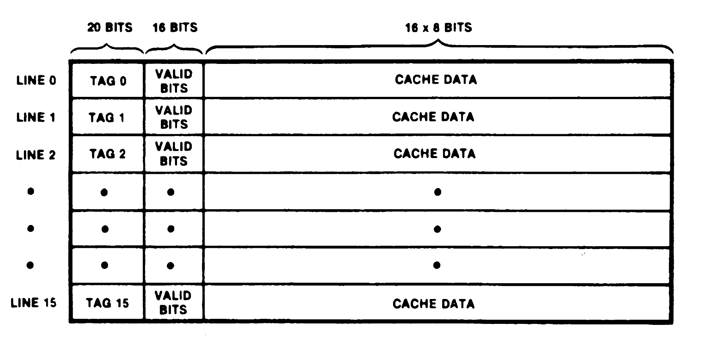

# 8. On-Chip Memory

## 8.1 INTRODUCTION

The Z280 MPU has 256 bytes of on-chip memory. This on-chip memory can operate in either of two modes, as determined by the contents of the Cache Control register (see Chapter 3). In one mode, the on-chip memory is dedicated to fixed physical memory locations; the memory addresses that are mapped into the on-chip memory are determined under program control. In the other mode, the on-chip memory acts as a cache for either instructions, data, or both. When acting as a cache, the set of memory locations mapped into the on-chip memory at a given time is determined by the action of the executing program; the memory locations that were most recently accessed are stored in the cache. Memory accesses to locations mapped into the on-chip memory do not generate external bus transactions and, therefore, are faster than accesses to external memory; thus, use of the on-chip memory leads to faster, more efficient program execution. On reset, the on-chip memory is automatically enabled for use as a cache for instructions only.

## 8.2 CACHE MEMORY MODE

If the M/<u>C</u> bit in the Cache Control register is cleared to 0, then the 256 bytes of on-chip memory are treated as a cache. Cache memories are small, high-speed memory buffers situated between the processor and main memory. (Main memory is the semiconductor memory accessed via bus transactions.) For each memory access, control logic in the MPU checks if the memory location involved is currently stored in the cache. If so, the access is made to the cache, usually without generating an external bus transaction; if not, the access is made to main memory and the contents of the cache may be updated.

Z280 MPU cache organization is illustrated in Figure 8-1. The cache is arranged as 16 lines of 16 bytes each. Each line of the cache can hold a copy of sixteen consecutive bytes of memory in physical memory locations whose 20 most significant address bits are identical. Thus, for example, one line of the cache could hold the data from physical memory locations 153820H to 15382FH. The 20 bits of physical address associated with one line of 16 bytes in the cache is called the tag address for that line. Each line of the cache also has 16 valid bits associated with it; each byte in the line is associated with one valid bit. The valid bit is used to indicate if the corresponding byte in the cache holds a valid copy of the memory contents at the associated physical memory location.

Tag n = the 20 Address bits associated with line n 
Valid bits = 16 bits that indicate which bytes in tha cache contain valid data 
Cache data = 16 bytes

_Figure 8-1. Cache Organization_

Lines in the cache are allocated using a Least-Recently Used (LRU) algorithm. If a read access is made to a physical memory address not currently stored in the cache (a cache "miss"), and the MMU does not assert cache inhibit, the line in the cache that has been least recently accessed is selected to hold the newly read data. All bytes in the selected line are marked invalid except for the bytes containing the newly accessed data. A cache miss on a data write does not cause a line to be allocated to the memory location accessed.

On a cache miss during a memory read, one or two bytes (depending on the bus size) are fetched from main memory and written to the cache. The cache does not prefetch beyond the currently reguested byte or word, with one exception; if burst mode operations are specified in the Cache Control register, burst mode transactions are used when fetching instructions.

The cache can be configured to hold only instructions, only data, or both instructions and data, as determined by the contents of the Cache Control register. If the cache contains data, writes to data at locations in the cache also generate external bus transactions to update the appropriate memory locations; thus, external memory is always guaranteed to contain valid information.

Tables 8-1 and 8-2 summarize cache operation. Whether or not a given memory operation accesses the cache depends on a number of factors: the type of access being made (program read, data read, or data write), whether the cache is enabled for that type of access, the type of instruction being executed, whether the MMU asserts cache inhibit, and whether the CPU or a DMA device initiates the transaction. The Cache Control register determines if the cache is used for instruction fetches or data accesses or both. Execution of the Test and Set (TSET) instruction, Return from Interrupt (RETI) instruction, and the extended instructions force external bus transactions, regardless of the contents of the cache, as described below. If the MMU is enabled, the access can be cacheable or noncacheable, as determined by the contents of the page descriptor register in use. If the MMU is not enabled, all transactions are considered to be cacheable. Both the CPU and on-chip DMA channels can access the cache. For DMA operations, only data read and data write transactions can occur. The state of the Cache Data Disable control bit in the Cache Control register is ignored during DMA transactions; therefore, an on-chip DMA device always updates the cache contents during DMA write operations to memory locations that are currently mapped into the cache.

 

_MMU Cache Inhibit → Cacheable Transaction:_

Operation | Hit/Miss | Cache Instruction | Cache Data | Cache Activity : Contents | Cache Activity : LRU | Bus Transaction | Cache/Memory Supplies Information
|-|-|-|-|-|-|-|-|
Instruction Read | Hit | Disabled | Don't care | Updated | No change | Yes | Memory
| | | Enabled | Don't care | No change | Updated | None | Cache
| | Miss | Disabled | Don't care | Updated* | No change | Yes | Memory
| | | Enabled | Don't care | Updated | Updated | Yes | Memory
Data Read (non Test & Set) | Hit | Don't care | Disabled | Updated |No change |Yes | Memory
| | | Don't care | Enabled | No change | Updated | None | Cache
| | Miss | Don't care | Disabled | Updated* | No change | Yes | Memory
| | | Don't care | Enabled | Updated | Updated | Yes | Memory
Data Read (Test & Set) | Don't care | Don't care | Don't care | Updated* | No change | Yes | Memory
Data Write | Hit | Don't care | Disabled | Updated | No change | Yes | —
| | | Don't care | Enabled | Updated | Updated | Yes | —
| | Miss | Don't care | Disabled | No change | No change | Yes | —
| | | Don't care | Enabled | No change | No change | Yes | —
EPU-to-Memory | Don't care | Don't care | Don't care | Updated* | No change | Yes | EPU
Memory-to-EPU | Don't care | Don't care | Don't care | No change | No change | Yes | Memory
EPU Template | Don't care | Don't care | Don't care | No change | No change | Yes | Memory
RETI Opcode | Don't care | Don't care | Don't care | No change | No change | Yes |Memory

 

_MMU Cache Inhibit → Noncacheable Transaction:_

Operation | Hit/Miss | Cache Instruction | Cache Data | Cache Activity : Contents | Cache Activity : LRU | Bus Transaction | Cache/Memory Supplies Information
|-|-|-|-|-|-|-|-|
Don't care | Don't care | Don't care | Don't care | Updated* | No change | Yes | Memory

\* Updated if a cache line contains the accessed location, otherwise unaffected.

_Table 8-1. CPU Accesses to On-Chip Memory as Cache_

For read operations, a cache "hit" is a reference to a location with a valid entry in the cache, and a cache "miss" is a reference to a location that has no valid entry in the cache. In the general case (and assuming the transaction is cacheable), read operations that are cache hits cause the data to be read from the cache without generating an external bus transaction. Read operations that are cache misses cause the data to be read from the external memory via an external bus cycle and update the cache contents. Updating the cache contents may involve replacing the least-recently used line of the cache with a new line that contains the read location. For write operations, a cache hit is a write to a location in the cache, even if the destination byte is marked as invalid in the cache, and a cache miss is a write to a location that is not in the cache. Write operations that are cache hits cause both the cache and external memory to be updated, and write operations that are cache misses have no effect on the cache. Memory write operations always generate external bus transactions.

Exceptions to the above rules include the Test and Set, Return from Interrupt, and extended instructions. Data read operations during execution of a Test and Set instruction always read the data from the main memory with an external bus transaction, regardless of whether or not the location read is valid in the cache. This ensures that the most recent value for a semaphore is read from external memory in the case that the semaphore is in shared memory in a multiprocessor system; another processor may have changed the semaphore after it was last read into the MPU's cache.

If an RETI opcode is fetched from the cache, the instruction fetch cycles are repeated with external bus transactions; this ensures that Z80 family peripherals connected to the Z280 MPU with an interrupt request daisy chain can detect the RETI opcode fetch (a requirement for the proper operation of the Z80 family peripherals).

If extended instructions are resident in the cache, the EPU template portion of those instructions is always read using external bus transactions. This ensures that an Extended Processing Unit (EPU) that is monitoring the external bus can detect and read the template during those instruction fetch cycles. If the extended instruction results in a transfer of data between the EPU and memory, all the involved data transactions occur on the external bus. Cache hits during EPU-to-memory write transactions result in the updating of cache contents as well as external memory.

For memory reads, the LRU algorithm logic is updated to reflect that the associated cache line is the most-recently accessed line if the read was an instruction fetch in a cache enabled for instructions or a data fetch in a cache enabled for data. For data writes, the LRU algorithm logic is updated only for a cache hit in a cache that is enabled for data.

When the on-chip DMA controllers transfer data to memory, cache contents are modified if the write is to a location mapped into the cache, but the LRU algorithm is unaffected. EPU-to-memory transactions have the same effect. The cache is not affected by the activity of external DMA controllers.

On reset, all the valid bits in the cache are cleared to 0, marking all cache entries as invalid, and the on-chip memory is configured as a cache for instructions only.

Operation | Hit/Miss | Cache Instruction | Cache Data | Cache Activity : Contents | Cache Activity : LRU | Bus Transaction | Cache/Memory Supplies Information
|-|-|-|-|-|-|-|-|
Read | Hit | Don't care | Don't care | Updated | No change | Yes | Memory
| | Miss | Don't care | Don't care | Updated* | No change | Yes | Memory
Write | Hit | Don't care | Don't care | Updated | No change | Yes | —
| | Miss | Don't care | Don't care | No change | No change | Yes | —

\* Updated if a cache line contains the accessed location, otherwise unaffected.

_Table 8-2. On-Chip DMA Accesses (Both Flowthrough and Flyby) 
Effect on On-Chip Memory as Cache_

## 8.3 FIXED-ADDRESS MODE

When the M/<u>C</u> bit in the Cache Control register is set to 1, the on-chip memory is treated as fixed physical memory locations. Accesses to these memory locations never generate external bus transactions and, therefore, are faster than memory accesses that use the external bus (Table 8-3).

In this mode, the on-chip memory is still organized as 16 lines of 16 bytes each, with a 20-bit tag address that specifies the 16 physical memory locations in each line. All locations are assumed to contain valid information, whether or not they have been initialized; the individual valid bits associated with each byte in the line are ignored in this mode. The Cache Data Disable and Cache Instruction Disable bits in the Cache Control register are also ignored in this mode, and no distinction is made as to whether the CPU is accessing instructions or data.

Before entering this mode, the user must initialize the tag addresses for all 16 lines of on-chip memory. The values for these tags determine the 256 physical memory addresses that are mapped into the on-chip memory. This is accomplished by enabling the on-chip memory as a cache for data only, reading data from 16 physical memory locations that are in different cache lines, and then setting the M/<u>C</u> bit in the Cache Control register to 1 to enable the fixed-address mode for the on-chip memory. Altering the M/<u>C</u> bit in the Cache Control register does not affect the contents of the on-chip memory, including the tag addresses.

Note that each line of the on-chip memory must be assigned a unique tag address before entering this mode so that no unpredictable addresses are mapped into the on-chip memory. If instructions are to be fetched from the on-chip memory while in this mode, Return from Interrupt (RETI) instructions and the templates within extended instructions should never be resident in the on-chip memory; in each case, the operation of devices external to the MPU depends on these instructions being fetched with external bus transactions, as mentioned in section 8.2. Data to be transferred to or from an EPU cannot be resident in on-chip memory either, since this data must be transferred to the EPU over the external bus.

Operation | Hit/Miss | Cache Instruction | Cache Data | Cache Activity : Contents | Cache Activity : LRU | Bus Transaction | Cache/Memory Supplies Information
|-|-|-|-|-|-|-|-|
Read | Hit | Don't care | Don't care | No change | No change | No | Cache
| | Miss | Don't care | Don't care | No change | No change | Yes | Memory
Write | Hit | Don't care | Don't care | Updated | No change | No | —
| | Miss | Don't care | Don't care | No change | No change | Yes | —

_Table 8-3. DMA/CPU Accesses to On-Chip Memory as Fixed Memory Location_
