# 9. On-Chip Peripherals

## 9.1 INTRODUCTION

The Z280 MPU features a number of peripheral devices on-chip in addition to the CPU, MMU, and cache memory. These peripheral devices include a clock oscillator, dynamic RAM refresh controller, four direct memory access (DMA) controllers, three counter/timers, and a universal asynchronous receiver/transmitter (UART).

The DMA channels, counter/timers, and UART are user-programmable devices that can be configured to operate in several different modes. These devices are accessed using I/O instructions; however, no external I/O bus transactions are generated when the on-chip peripherals are accessed by the CPU. These devices can generate interrupt requests to the Z280 MPU, as described below and in Chapter 6. Interrupts from these on-chip peripherals are always processed using interrupt mode 3, regardless of which interrupt mode is used for externally generated interrupts.

## 9.2 CLOCK OSCILLATOR

The Z280 MPU has an on-chip clock oscillator/generator that can be connected directly to a crystal or any other suitable clock source. The frequency of the processor clock is one-half of the frequency of the external clock source or crystal. The processor clock can be further divided by a factor of 1, 2, or 4 to provide the bus timing clock, as specified by the contents of the Bus Timing and Initialization register (see Chapter 3). The bus timing clock is output by the MPU for use by the rest of the system.

The on-chip clock oscillator, a high-gain amplifier, is enabled by either connecting a crystal across the Clock/Crystal Input (XTAL1) and Crystal Output (XTALO) pins or connecting a clock input to the Clock/Crystal Input pin. The crystal must be a parallel resonant fundamental type.

## 9.3 REFRESH CONTROLLER

An on-chip memory refresh controller in the Z280 MPU is available for generating memory refresh operations in systems utilizing dynamic RAMs. Operation of this mechanism is controlled by the Refresh Rate register, which is located in the Z280 MPU'S I/O address space. If enabled, memory refreshes are performed at a rate specified by the contents of this register.

The format of the 8-bit Refresh Rate register is shown in Figure 9-1. This register enables the refresh mechanism and determines the frequency of refresh transactions. The fields in this register are described below

 

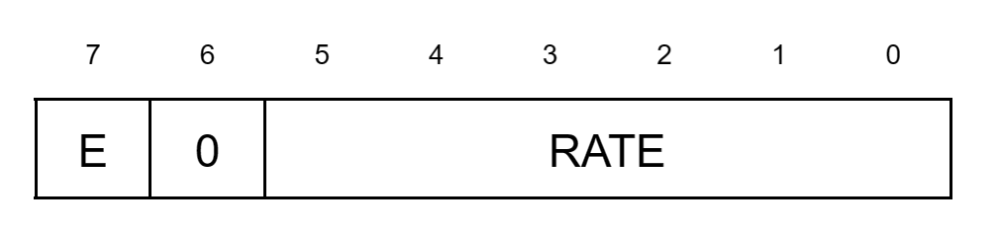 
_Figure 9-1. Refresh Rate Register_

 

**Refresh Enable (E) bit.** When this bit is set to 1, the refresh mechanism is enabled. When this bit is cleared to 0, the refresh mechanism is disabled and refresh transactions are not generated.

**Refresh Rate field.** The contents of this 6-bit field determine the frequency of refresh transactions if the Refresh Enable bit is set to 1. A value of n (0 < n < 63) in this field specifies a refresh rate of once every 4n processor clock cycles; a value of 0 in this field indicates a refresh rate of every 236 processor clock cycles.

The Refresh Rate register is accessed via byte I/O operations to I/O port address FFxxE8H (where x means "don't care"). Bit 6 of this register is not used. On reset, the Refresh Rate register is initialized to 88H, thereby enabling memory refresh at a rate of 32 processor clock cycles per refresh. This register can be read at any time to determine if refresh is enabled and the current refresh rate.

A 10-bit refresh address is output on address lines A0-A9 during a refresh transaction. This refresh address is incremented by one for Z80 bus (8-bit data bus) configuration and by two for Z-BUS (16-bit data bus) configuration of the Z280 MPU between refresh transactions. The refresh address is not accessible by the programmer and is not affected by a reset.

During instruction execution, the actual refresh transactions are generated as soon as possible after the refresh period has elapsed. Generally, the refresh transaction is executed after the last clock cycle of the bus transaction in progress at the time that the refresh period elapsed. If the CPU receives an interrupt request during that same bus transaction, the refresh transaction is inserted before processing the interrupt. When the Z280 MPU does not have control of the bus due to a bus request, refresh transactions cannot be executed; while the MPU is in this state, internal circuitry records the number of refresh periods that have elapsed (that is, the number of "missed" refresh transactions). When the Z280 MPU regains control of the bus, the refresh mechanism automatically issues the missed refresh cycles. Similarly, if the refresh period elapses while the MPU is in a wait state (due to <ins>WAIT</ins> being asserted) during a bus transaction, the number of missed refresh transactions is recorded internally, and those refresh cycles are issued after <ins>WAIT</ins> is deactivated and the bus transaction is completed. The internal circuitry can record up to 236 such missed refresh operations.

Pseudo-static memories and some peripheral devices (such as the Z8000 family of peripherals) require a minimum transaction rate on the bus for correct operation. If the refresh mechanism is disabled by clearing the Refresh Enable bit in the Refresh Rate register, the rate field in this register is used to determine the minimum transaction rate on the bus. In this mode, if the refresh timer reaches 0 and no external bus transaction has occurred since the last time the refresh timer elapsed, then a refresh transaction will be generated. Thus, in a system that does not require memory refresh transactions, the Refresh Rate field in the Refresh Rate register must be initialized to an appropriate value even if memory refresh operations are disabled.

## 9.4 COUNTER/TIMERS

The Z280 MPU's three on-chip 16-bit counter/timers can be configured to satisfy a broad range of counting and timing applications, including event counting, interval timing, watchdog timing, and clock generation. Each counter/timer is composed of a 16-bit downcounter, a 16-bit time constant register, and two 8-bit control and status registers (the Counter/Timer Configuration register and the Counter/Timer Command/Status register). The three independent devices are referred to as counter/timer 0 (C/T 0), counter/ timer 1 (C/T 1), and counter/timer 2 (C/T 2). Figure 9-2 is a block diagram of a Z280 MPU counter/timer.

 

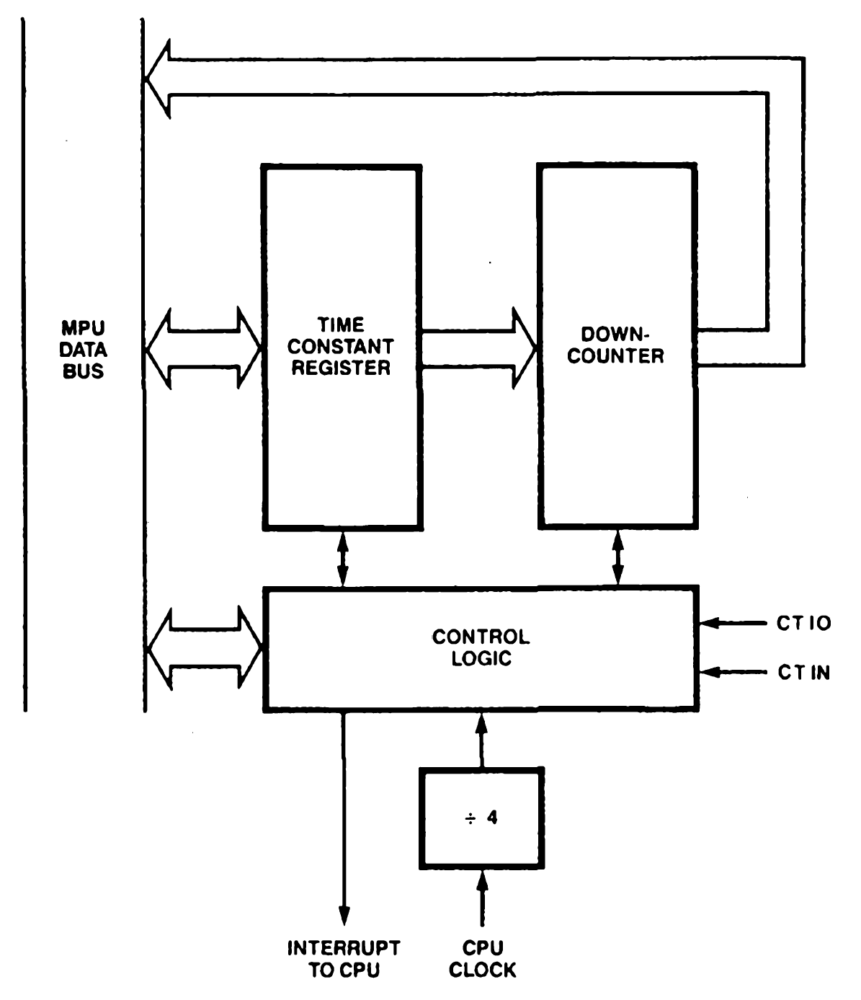 
_Figure 9-2. Counter/Timer Block Diagram_

 

C/T 0 and C/T 1 can be programmably linked to form a 32-bit counter/timer.

Two external connections are available for each counter/timer: a Counter/Timer I/O pin (C/T I/O) that can act as a gate or trigger input or a counter/timer output, and a Counter/Timer Input pin (C/T IN) that can serve as a count, gate, trigger, or gate/trigger input. The contents of the Counter/Timer Configuration register determine the pin functions for a given application.

The counter/timers can operate in counter mode or in timer mode. In counter mode, the downcounter decrements the count on the occurrence of an external event; specifically, the counter is clocked by a rising edge on the Counter/Timer Input pin. In timer mode, the downcounter is clocked by an internal signal—-the CPU clock divided by four.

Gate and trigger inputs to the downcounter can be used to control counter/timer activity. Both hardware and software gate and trigger signals are available. Either retriggerable or nonretriggerable modes can be specified.

The counter/timer's "terminal count" condition is when the downcounter holds a count of 0. This terminal count condition can be used to generate an interrupt request to the CPU. Counter/timers can generate a counter/timer output signal when the terminal count is reached. Upon reaching terminal count, a counter/timer can be programmed either to discontinue counting (single-cycle mode) or to reload the initial time constant value and continue counting (continuous mode).

### 9.4.1 Counter/Timer Operating Nodes

The counter/timers have two basic operating modes, distinguished by the clocking signal to the downcounter: counter mode and timer mode. The current mode for counter/timer operation is determined by the contents of the Counter/Timer Configuration register.

In counter mode operation, the counter/timer monitors an external input line and records low-to-high transitions on that line. The Counter/Timer Input pin is used as the counter's input signal; if the appropriate enabling conditions are met, a low-to-high transition on that pin will cause the contents of the down-counter to be decremented by one. The decrement operation in the downcounter is actually performed on the first rising edge of the scaled processor clock (CPU clock divided by 4) after the low-to-high transition on the C/T IN signal. Typically, counter mode is used in event-counting types of applications.

In timer mode operation, the counter/timer monitors the internal CPU clock scaled by four for low-to-high transitions. If the appropriate enabling conditions are met, such a transition causes the contents of the downcounter to be decremented by one. No external inputs are required in the timer mode of operation. Timer mode is used in applications such as delay interval timing, watchdog timing, and clock generation.

In either mode, the maximun count frequency is the CPU clock divided by four.

### 9.4.2 Gates and Triggers

Gate and trigger inputs are used to control counter/timer activity in either counter mode or timer mode.

Gate signals are used in applications where counting or timing is to occur only during certain specified intervals; the counter/timer will count or time only while the gating condition is met. For applications where an external pin is configured as a gate input, counting or timing operations are performed only while the gate input is high. A software gate bit (one bit of the Counter/Timer Command/Status register) is used as a filter for the gate input; while the software gate bit is cleared to 0, the gating condition is not met regardless of the state of the gating line. In other words, the gating condition is a logical AND of the hardware and software gates; both the gate input must be high and the software' gate bit must be set to 1 for the counter timer to be operating. If no external pins are configured as a gating signal, then the software gate bit must be set to 1 to satisfy the gating condition.

Figure 9-3 illustrates the gating facility in an application where the counter/timer is in counter mode with both the gate and the count signals coming from external pins. This example assumes that the software gate bit has been set to 1. The contents of the downcounter are decremented on a low-to-high transition of the count input only if the gate input is high.

 

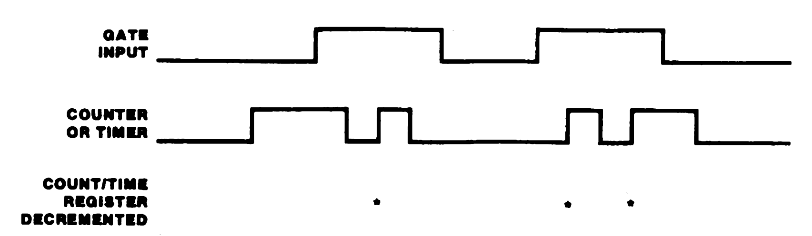 
_Figure 9-3. Counter Operation with Gate Only_

 

If trigger mode is selected, a countdown sequence for a counter/timer begins only after a triggering condition occurs; a counting or timing operation can begin only after a low-to-high transition is detected on the trigger. If an external input is used as a trigger, that line is monitored by the counter/timer. Alternatively, a software trigger bit (one bit in the Counter/Timer Command/Status register) can be set to 1 from a previously cleared value to activate the counter/timer. The trigger condition is a logical OR of the hardware and software triggers; that is, either a hardware or software trigger will activate an enabled counter/timer.

Figure 9-4 illustrates trigger operation in an application where the counter/timer is in the counter mode with both the trigger and count inputs provided by external pins. This example assumes that the software trigger bit does not make a low to high transition. The contents of the downcounter are decremented on a low-to-high transition of the count input only after a low-to-high transition on the trigger input has been detected.

 

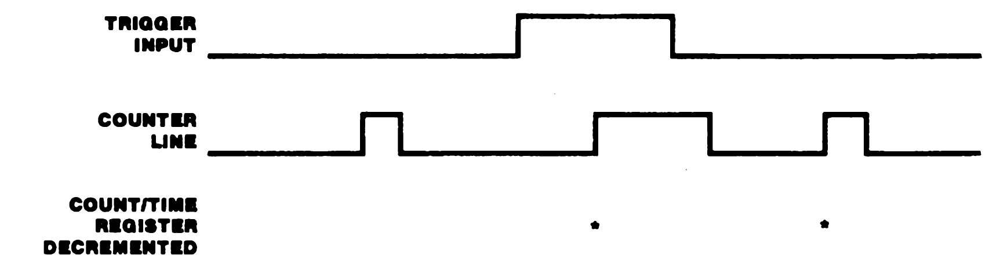 
_Figure 9-4. Counter Operation with Trigger Only_

 

Either a retriggerable or nonretriggerable operation can be specified. In the retriggerable mode, the occurrence of a trigger condition causes the counter/timer to reload its initial time constant value regardless of the current contents of the downcounter. This mode is used in applications such as watchdog timers. In the nonretriggerable mode, after the first trigger condition starts counter/timer activity, subsequent trigger conditions are ignored. Nonretriggerable mode is used in applications such as delay counters that measure a fixed delay from a given event.

Gate and trigger operations can be combined in a single counter/timer. Separate gate and trigger inputs (either hardware or software) can be specified, or one external input can be used as both a gate and a trigger. In the latter case, a low-to-high transition on the input acts as a trigger that starts counter/timer activity, and then counting or timing continues only as long as the input signal remains high. Again, either retriggerable or nonretriggerable modes are available. Figure 9-5 illustrates counter/timer operation in an application where counter mode is selected, one input is a count input, and the other input is used as both the trigger and gate.

 

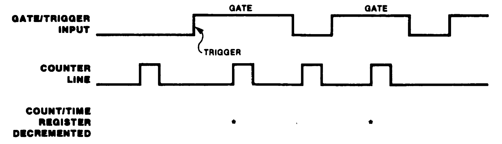 
_Figure 9-5. Counter Operation with Gate and Trigger_

 

### 9.4.3 Terminal Count Condition

During operation, the counter/timer counts down from a preset time constant value. The time constant value can range from 0 to 65535. The terminal count condition is reached with the transition from a count of 1 in the downcounter to a count of 0. The counter/timers can be programmed to interrupt the CPU and/or generate a counter/timer output signal when the terminal count is reached.

Another set of operating modes determines counter/timer activity upon reaching the terminal count. Whether in counter or timer mode, a counter/timer can be configured for single-cycle mode or continuous mode. In single-cycle mode, the counter/timer halts operation upon reaching terminal count; a new trigger is required to reload the time constant and initiate another countdown sequence. In continuous mode, the counter/timer is automatically reloaded with the time constant upon reaching terminal count; the downcounter is reloaded on the next count input after reaching terminal count. For example, a counter/timer in continuous mode with a 3 in its Time Constant register will be reloaded on every fourth count input.

An interrupt enable bit in the Counter/Timer Configuration register determines if an interrupt request is generated at the terminal count. This request will be processed by the CPU if the appropriate Interrupt Request Enable bit in the CPU's Master Status register is set to 1 (see Chapter 6).

The CTIO pin can be configured as a counter/timer output signal. Reaching the terminal count condition causes a low-to-high transition on the CTIO pin; this signal remains high as long as the downcounter holds a value of zero (that is, until a non-zero time constant is loaded into the downcounter due to a trigger condition).

### 9.4.4 Counter/Timer Registers

Each counter/timer has two 8-bit command and status registers and two 16-bit count registers. The 8-bit Counter/Timer Configuration and Counter/Timer Command/Status registers determine the counter/timer's operating modes and provide status information about the current operation.

If C/T 0 and C/T 1 are linked to form a 32-bit counter/timer, the functionality of these registers is affected, as described in section 9.4.5. The 16-bit Time Constant register holds the initialization value for the counter/timer, and the 16-bit Count-Time register contains the value of the current count in progress.

#### 9.4.4.1 Counter/Timer Configuration Register

The Counter/Timer Configuration register, shown in Figure 9-6, specifies the counter/timer's mode of operation.

 

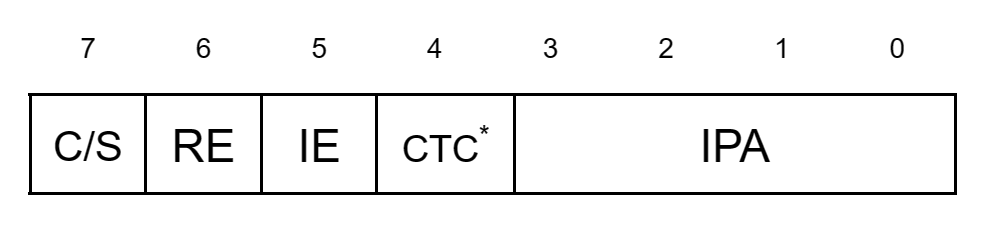 
\* CTC Is present on counter/timer 0 only.

_Figure 9-6. Counter/Timer Configuration Register_

 

The five fields in this register are described below.

**Continuous/Single Cycle (C/<ins>S</ins>).** While this bit is set to 1, the downcounter is automatically reloaded with the contents of the Time Constant register on the next count input signal after terminal count is reached, and the counting or timing operation continues. While this bit is cleared to 0, no automatic reloading occurs when terminal count is reached.

**Retrigger Enable (RE).** While this bit is set to 1, the value of the Time Constant register is loaded into the downcounter whenever a trigger input is received (retriggerable mode). While this bit is 0, trigger conditions do not cause reloading of the downcounter.

**Interrupt Enable (IE)**. While this bit is set to 1, the counter/timer generates an interrupt request to the Z280 CPU upon reaching terminal count. While this bit is cleared to 0, no interrupt requests can be generated by the counter/timer.

**Counter/Timer Cascade (CTC).** For C/T 0, this is the enable bit for linking to C/T 1 in order to form a 32-bit counter/timer (see section 9.4.5). The state of this bit has no effect in C/T 1 and C/T 2.

**Input Pin Assignments (IPA)**. The contents of this 4-bit field determine the operating mode of the counter/timer (counter or timer mode) and the functionality of the external pins associated with that counter/timer. The four bits in this field are associated with enabling the generation of an output pulse (EO), selecting the counter or timer mode (C/T), enabling the gating facility (G), and enabling the triggering facility (T). Table 9-1 shows the encoding of this field.

EO | C/T | G | T | Counter/Timer I/O | Counter/Timer Input | Mode
|-|-|-|-|-|-|-|
0 | 0 | 0 | 0 | Unused | Unused | Timer
0 | 0 | 0 | 1 | Unused | Trigger | Timer
0 | 0 | 1 | 0 | Gate | Unused | Timer
0 | 0 | 1 | 1 | Gate | Trigger | Timer
0 | 1 | 0 | 0 | Unused | Input | Counter
0 | 1 | 0 | 1 | Trigger | Input | Counter
0 | 1 | 1 | 0 | Gate | Input | Counter
0 | 1 | 1 | 1 | Gate/Trigger | Input | Counter
1 | 0 | 0 | 0 | Output | Unused | Timer
1 | 0 | 0 | 1 | Output | Trigger | Timer
1 | 0 | 1 | 0 | Output | Gate | Timer
1 | 0 | 1 | 1 | Output | Gate/Trigger | Timer
1 | 1 | 0 | 0 | Output | Input | Counter
1 | 1 | 0 | 1 | Unused | Unused | Reserved
1 | 1 | 1 | 0 | Unused | Unused | Reserved
1 | 1 | 1 | 1 | Unused | Unused | Reserved

_Table 9-1. Encoding of the IPA Field in the Counterfllmer Configuration Register_

If a reserved encoding of the IPA field is specified fur any counter/timer, counter/timer operation is unpredictable.

The Counter/Timer Configuration registers are cleared to all zeros by a reset.

#### 9.4.4.2 Couiter/Timer Command/Status Register

The Counter/Timer Command/Status register provides for software control of counter/timer operation and reflects the current status of the counter/timer. Three control bits and three status bits are included in the Command/Status register. The format for this register is illustrated in Figure 9-7.

 

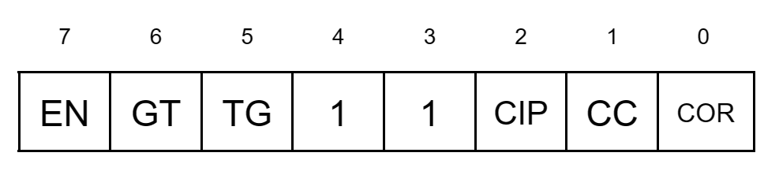 
_Figure 9-7. Counter/Timer Command/Status Register_

 

**Enable (EN).** While this bit is set to 1, the counter/timer is enabled; operation begins on the first rising edge of the processor clock following the setting of this bit from a previously cleared state. Writing a 1 to this bit when its previous value was a 1 has no effect. While this bit is cleared to 0, the counter/timer is disabled and performs no counting or timing operations. While in the disabled state, the contents of the Time Constant register are continuously loaded into the downcounter.

**Software Gate (GT).** While the counter/timer is enabled (the EN bit is a 1), downcounter operation begins on the rising edge of the first scaled processor clock following the setting of this bit from a previously cleared value. Writing a 1 to this bit when the previous value was a 1 has no effect. While this bit is cleared to 0, the counting or timing sequence is halted.

**Software Trigger (TR).** While the counter/timer is enabled (the EN bit is a 1), the trigger condition is generated on the rising edge of the first scaled processor clock following the setting of this bit from a previously cleared value. If a previous trigger condition has not occurred, the contents of the Time Constant register are loaded into the downcounter and the counting or timing sequence begins. If a hardware or software trigger has already occurred and the Retrigger Enable bit is set to 1, the counter/timer will be retriggered. If a trigger has already occurred, the Retrigger Enable bit is cleared to 0, and a counting or timing operation is in progress (that is, the downcounter holds a count other than 0), then setting the TR bit has no effect on counter/timer operation. Clearing this bit to 0 also has no effect on counter/timer operation.

**Count in Progress (CIP).** This status bit indicates if a counting or timing operation is in progress. While this bit is a 1, the counter/timer has a time constant loaded and the downcounter holds a non-zero value. While this bit is a 0, the counter/timer is not operating. The state of this bit is determined by control logic in the counter/timer and cannot be altered by a write operation to this register.

**End-of-Count Condition Has Been Reached (CC).** This status bit is set to 1 by control logic in the counter/timer when the end-of-count condition is reached (that is, the downcounter has been decremented to zero in the single-cycle mode or the downcounter has been reloaded in the continuous mode). While this bit is a 0, the
downcounter has not been decremented to 0 since the last time that this bit was cleared by software. This bit can be read or written under program control.

**Count Overrun (COR).** This status bit is set to 1 by control logic in the counter/timer if the end-of-count condition is reached while the CC bit is already set to 1, thereby indicating a count over-run condition. If this bit is a 0, the end-of-count condition has not been reached while the CC bit is a 1 since the last time the CC bit was cleared by software. This bit can be read or written under program control.

The Counter/Timer Command/Status register is cleared to all zeros by a reset. Bits 3 and 4 of this register are not used, and should always be written with zeros (however, when bits 3 and 4 are read back, they will be 1s regardless of whether they were written with zeros or ones).

#### 9.4.4.3 Time Constant and Count-Time Registers

The 16-bit Time Constant register holds the value to be loaded into the downcounter when counter/timer operation begins. The downcounter is loaded with the contents of the Time Constant register when the counter/timer is initially triggered to begin counter/timer operation, each time the end-of-count condition is reached if the continuous mode is selected, and at the occurrence of each trigger condition if retriggerable mode is selected. By loading the Time Constant register, the user can specify counts ranging from 1 to 65536. The contents of the Time Constant register are continuously loaded into the downcounter while the counter/timer is disabled (the EN bit is 0).

The 16-bit Count-Time register holds the current value in the downcounter and can be read at any time without affecting counter/timer operation. Writes to this register have no effect.

Both the Time Constant and Count-Time registers hold unpredictable values after a reset.

Table 9-2 lists the I/O port addresses associated with each of the counter/timers' registers. The Counter/Timer Configuration register and Counter/Timer Command/Status register are accessed with byte I/O instructions and, with the exception of the read-only CIP bit, can be read or written. The Time Constant and Count-Time registers are accessed with word I/O instructions. The Time Constant register can be read or written; the Count-Time register is read-only.

Register | C/T 0 | C/T 1 | C/T 2
|-|-|-|-|
Configuration | FExxE0 | FExxE8 | FExxF8
Command/Status | FExxE1 | FExxE9 | FExxF9
Time Constant | FExxE2 | FExxEA | FExxFA
Count-Time | FExxE3 | FExxEB | FExxFB

All addresses are in hexadecimal. 
"x" means "don't care".

_Table 9-2. I/O Addresses off Counter/Timer Registers_

### 9.4.5 Linking Counter/Timers

Under software control, two Z280 MPU counter/timers can be linked to form a 32-bit counter/timer. C/T 0 can be linked with C/T 1. This linking function is controlled by the CTC bit in the Counter/Timer Configuration register in C/T 0. While the CTC bit in C/T 0's Configuration register is set to 1, C/T 0 and C/T 1 are linked together.

Linking the two counter/timers together affects the functionality of the counter/timers' registers. If C/T 0 and C/T 1 are linked to form a 32-bit counter, C/T 1's Time Constant register holds the upper 16 bits and C/T 0's Time Constant register holds the lower 16 bits of the 32-bit count to be loaded into the downcounter when a counter/timer operation begins. Similarly, C/T 1's Count-Time register holds the upper 16 bits and C/T 0's Count-Time register holds the lower 16 bits of the current count.

The effect of linking counter/timers on the Configuration and Command/Status registers is summarized in Table 9-3. The configuration of the 32-bit counter/timer is determined by the state of the C/S, RE, and IPA fields in the Configuration register of the more significant counter/timer (C/T 1). Any external connections specified in the IPA field of the C/T 1 Configuration register use the pins associated with C/T 1. The controls in the Configuration register for C/T 0 are ignored, with the exception of the CTC, IE, and EO bits. The CTC bit in C/T 0 is used to specify linking of the counter/timers. If the IE bit in the more significant counter/timer (C/T 1) is set to 1, an interrupt request is generated when the 32-bit counter reaches end-of-count, using the interrupt request signal from C/T 1; if the IE bit in the less significant counter/timer (C/T 0) is set to 1, an interrupt request is generated when the lower 16 bits of the 32-bit downcounter reach 0 (in other words, when C/T 0 reaches end-of-count), using the interrupt request signal from C/T 0. If the OE bit in C/T 0 is set, the C/T I/O signal associated with C/T 0 goes high whenever the lower half of the 32-bit down-counter holds a 0 (in other Words, when C/T 0's downcounter holds a 0).

Similarly, the Command/Status register in the more significant counter/timer (C/T 1) contains the control and status bits for the linked 32-bit counter/timer. However, the status bits in the less significant counter/timer (C/T 0) hold valid status for the lower-half of the 32-bit counter/timer (that is, the status of C/T 0 itself).

 

_C/T 1 Configuration Register:_

Bit | Active/Ignored | Comments
|-|-|-|
C/<ins>S</ins> | Active | Specifies continuous or single-cycle mode for 32-bit counter/timer.
RE | Active | Specifies retriggerable or nonretriggerable mode for 32-bit counter/timer.
IE | Active | Interrupt enable for 32-bit counter/timer.
CTC | Ignored
EO | Active | Enable output for 32-bit counter/timer; C/T 1's output pin is used.
C/T | Active | Specifies counter or timer mode for 32-bit counter/timer.
G | Active | Enable gate input for 32-bit counter/timer; C/T 1's input pin is used.
T | Active | Enable trigger input for 32-bit counter/timer; C/T 1's input pin is used.

 

_C/T 0 Configuration Register:_

Bit | Active/Ignored | Comments
|-|-|-|
C/<ins>S</ins> | Ignored
RE | Ignored
IE | Active | Interrupt enable for lower half of 32-bit counter/timer.
CTC | Active | Set to 1 to link counter/timers.
EO | Active | Enable output for lower half of 32-bit counter/timer (C/T 0 only).
C/T | Ignored
G | Ignored
T | Ignored

 

_C/T 1 Command/Status Register:_

Bit | Active/Ignored | Comments
|-|-|-|
EN | Active | Enable control for 32-bit counter/timer.
GT | Active | Software gate for 32-bit counter/timer.
TG | Active | Software trigger for 32-bit counter/timer.
CIP | Active | Count-in-Progress status bit for 32-bit counter/timer.
CC | Active | End-of-Count Has Been Reached status bit for 32-bit counter/timer.
COR | Active | Count Overrun status bit for 32-bit counter/timer.

 

_C/T 0 Command/Status Register:_

Bit | Active/Ignored | Comments
|-|-|-|
EN | Ignored
GT | Ignored
TG |Ignored
CIP | Active | Count-in-Progress status bit for lower half of 32-bit counter/timer.
CC | Active | End-of-Count Has Been Reached status bit for lower half of 32-bit counter/timer.
COR | Active | Count Overrun status bit for lower half of 32-bit counter/timer.

_Table 9-3. Configuration and Command/Status Registers for Linked Counter/Timers_

### 9.4.6 Counter/Timer Sequence of Events

Before starting a counting or timing seguence, the counter/timer must be configured for the particular application by loading its Configuration register. Next, the starting value for the downcounter is specified by loading the Time Constant register; initial values ranging from 0 to 65535 can be specified for the downcounter. Lastly, the enable (EN) bit in the Command/Status register is set to 1 to enable counter/timer operation.

While the EN bit is cleared to 0, the counter/timer cannot be triggered, interrupt requests from the counter/timer cannot be generated, and the downcounter holds the value in the Time Constant register. However, clearing the EN bit does not clear any pending interrupt requests—it only prevents new interrupt requests from being generated.

Once the EN bit is set to 1, the countdown seguence begins when the counter/timer is triggered, causing the contents of the Time Constant register to be loaded into the down counter. The downcounter is loaded on the rising edge of the external trigger input (if an external trigger was specified in the Configuration register) or by writing a 1 into the TG bit of the Command/Status register. The EN and TG bits can both be set to 1 during the same write operation to the Command/Status register to both enable and trigger a counter/timer (assuming that the TG bit was a zero previously, so that a low-to-high transition on the trigger is detected). The trigger condition is a logical OR of the external trigger input (if specified) and the TG bit.

Once triggered, the rate at which the downcounter counts is determined by the mode of the counter/timer. In the timer mode, the downcounter is clocked internally by a signal that is one-fourth the frequency of the CPU clock (one-eighth the frequency of the external clock source). In the counter mode, the downcounter is clocked by a rising edge on the count input signal (this edge is internally synchronized with the scaled CPU clock).

In counter mode, the first low-to-high transition on the count input should occur a minimum of four internal CPU clock cycles after the trigger event. Count inputs occurring within four CPU clock cycles of the trigger may or may not be recognized by the downcounter.

Once the downcounter is loaded, the countdown sequence continues towards the terminal count condition as long as the counter/timer's gate input is high. The gate input to the counter/timer is the logical AND of the external gate input (if an external gate was specified in the Configuration register) and the GT bit in the Command/Status register. If the gate input goes low, the countdown halts, and then resumes when the gate input goes high again. The gate function does not affect the trigger function.

The reaction to triggers during the countdown operation depends on the state of the RE bit in the Configuration register. If RE is a 0, retriggers are ignored and the countdown sequence continues normally. If RE is a 1, each occurrence of a trigger condition causes the downcounter to be reloaded from the Time Constant register and the countdown sequence starts over again.

The current state of the downcounter can be determined by polling the status bits in the Command/Status register and by reading the current count from the Count-Time register. Reading these registers does not affect the current countdown sequence.

The state of the C/<ins>S</ins> bit in the Configuration register controls the operation of the counter/timer upon reaching terminal count. If the C/<ins>S</ins> bit is a 1, specifying the continuous mode of operation, the downcounter is reloaded from the Time Constant register on the next count input after reaching terminal count, and a new countdown sequence begins. The Time Constant register can be programmably altered during counter/timer operation without affecting the current countdown sequence. If the C/<ins>S</ins> bit is 0, specifying single-cycle operation, the downcounter halts upon reaching terminal count until the next occurrence of a trigger condition reloads the downcounter.

If the IE bit in the Configuration register is a 1, an interrupt request is generated upon reaching the terminal count. If a counter/timer output signal is specified in the IPA field of the Configuration register, reaching terminal count causes a low-to-high transition on the output signal; this signal then remains high until the downcounter is reloaded with a non-zero value due to a trigger condition or disabling of the counter/timer with a non-zero value in the Time Constant register. Note that the counter/timer output line can be forced high by disabling the counter/timer with all zeros loaded into the Time Constant register.

## 9.5 DMA CHANNELS

The Z280 MPU has four on-chip Direct Memory Access (DMA) transfer controllers for high-bandwidth data transmissions within a Z280-based system. Each DMA channel is capable of controlling high speed memory-to-memory, memory-to-peripheral, peripheral-to-memory, or peripheral-to-peripheral data transfers.

Ail four DMA channels, referred to as DMA0, DMA1, DMA2, and DMA3, are capable of controlling "flowthrough" type data transfers, wherein data is temporarily stored in the DMA device between reading from the source and writing to the destination. Two of the channels, DMA0 and DMA1, also support "flyby" mode data transfers, wherein the data is read from the source and written to the destination during a single bus transaction. Otherwise, the four DMA controllers are identical, although they have different priorities with respect to interrupt and bus requests.

Two external signals provide the interface between the DMA channels and external memory or peripheral devices. The READY (<ins>RDY</ins>) input is used by an external device to request activity by a DMA channel. The DMA STRO8E (<ins>DMASTB</ins>) output is used to signal the I/O port when a flyby transaction is in progress; <ins>DMASTB</ins> is available only for DMA0 and DMA1.

Two 24-bit addresses are generated by the DMA for each flowthrough transaction, and one 24-bit address for each flyby transaction. These addresses can be physical memory addresses or I/O port addresses. The addresses are automatically generated for each transaction, and can be fixed, incrementing, or decrementing. Two readable registers, the Source Address register and Destination Address register, hold the current address of the source and destination ports.

During a DMA-controlled transaction, the DMA channel assumes control of the system's address and data buses. The on-chip DMA channels behave as if they were external bus requestors with respect to acquiring, using, and relinquishing the bus. The DMA channels are arranged in a priority daisy chain with the external Bus Request input signal being the "next lowest bus requestor" on the chain. Data can be transferred as bytes or words, using the same memory and I/O timing as the CPU for bus transactions (as determined by the contents of the Bus Timing and Initialization register).

Two DMA devices can be programmably linked, where one DMA channel is used to program the second DMA channel. DMA3 can be linked to DMA1 and DMA2 can be linked to DMA0 in this manner. DMA0 can also be programmably linked to the on-chip UART's receiver, and DMA1 can be linked to the on-chip UART's transmitter.

The DMA Master Control register specifies the general configuration of all four DMA channels, including the linking of DMA channels to the UART. Each DMA channel has its own Transaction Descriptor register that determines the operating modes for that channel, Source Address and Destination Address registers that hold the addresses for the DMA transfers, and a Count register that controls the number of transfers to be performed. All DMA registers are accessed via I/O instructions.

### 9.5.1 Types of DMA Operations

The Z280 MPU's on-chip DMA channels are capable of two basic types of operations: flowthrough mode data transactions and flyby mode data transactions.

All four on-chip DMA channels support flowthrough mode data transactions. In flowthrough mode, each DMA-controlled data transfer involves two bus operations: a read cycle to obtain the data from the source and a write cycle to transfer the data to the destination. The data is temporarily stored in the DMA device between the read and write operations. Flowthrough mode transactions use the same address, data, and control signals as CPU-initiated transactions and, therefore, require no additional external logic in a Z280-based system. Memory-to-memory, memory-to-peripheral, peripheral-to-memory, or peripheral-to-peripheral transfers are possible using flowthrough mode.

Flyby mode data transactions are supported only by DMA0 and DMA1. In a flyby mode transaction, the data is read from the source and written to the destination in a single bus operation. There are two types of flyby transactions: memory-to-peripheral and peripheral-to-memory. For a memory-to-peripheral transaction, the DMA channel generates a memory read bus cycle and notifies the I/O devifce that a flyby transaction is in progress by activating the <ins>DMASTB</ins> output. The data must be written to the I/O device during the memory read operation. For a peripheral-to-memory flyby transaction, the DMA channel generates a memory write bus cycle while activating the <ins>DMASTB</ins> output; the data must be read from the I/O device during the memory write transaction. In other words, during flyby mode transactions, the DMA channel generates the bus signals needed to control the memory access, and <ins>DMASTB</ins> is used to notify the peripheral device when to read data from the bus (for memory-to-peripheral transfers) or when to put data onto the bus (for peripheral-to-memory transfers.) Thus, flyby mode transactions require additional external logic to activate the appropriate peripheral device when <ins>DMASTB</ins> is active. However, flyby mode transactions are faster than flowthrough mode transactions, since only one bus cycle is needed to complete a data transfer.

### 9.5.2 DMA Transfer Modes

When transferring data under DMA control (with either flowthrough or flyby transactions), one of three transfer modes can be selected: single transaction, burst, or continuous mode. Once DMA activity has been initiated, the transfer mode determines how many DMA-controlled data transfers are to occur before the DMA channel relinquishes the bus to the CPU or another DMA channel.

In the single transaction mode, the DMA controller transfers only one byte or word of data at a time. Control of the system bus is returned to the CPU between each DMA transfer; the DMA must make a new request for the bus before performing the next data transfer.

In the burst mode, once the DMA channel gains control of the bus, it continues to transfer data until the <ins>RDY</ins> input goes inactive. When the <ins>RDY</ins> line becomes inactive, the DMA releases the system bus; bus control then returns back to the CPU or to the next lower-priority DMA channel with a bus request pending.

In the continuous mode, the DMA channel retains control of the system bus until the entire block of data has been transferred. If the <ins>RDY</ins> line goes inactive before the entire data block is transferred, the DMA simply waits until <ins>RDY</ins> becomes active again, without releasing the bus. This mode is the fastest mode since it has the least response-time overhead when the <ins>RDY</ins> line momentarily goes inactive and returns active again. However, this mode does not allow any CPU activity for the duration of the transfer. Figure 9-8 summarizes the DMA transfer modes.

 

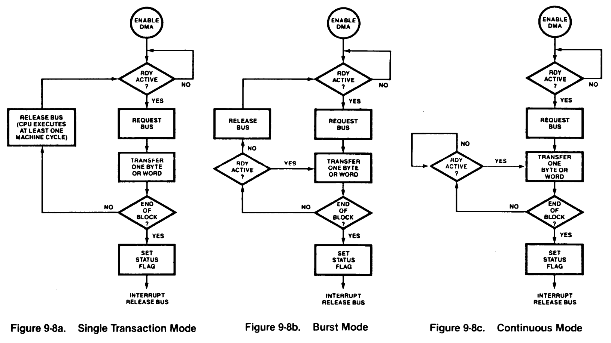 
_Figure 9-8. Modes of Operation_

 

In any transfer mode, once a DMA-controlled data transfer begins, that transaction is completed in an orderly fashion, regardless of the state of the <ins>RDY</ins> input.

DMA0 and DMA1 include a software <ins>RDY</ins> signal in the DMA Master Control register. The <ins>RDY</ins> input to these DMA channels is the logical OR of the <ins>RDY</ins> pin and the software-controlled <ins>RDY</ins> signal.

A DMA channel can be programmed to perform data transfers on a byte (8-bit), word (16-bit), or long word (32-bit) basis. If a DMA's port address is a memory address that is auto-incremented or auto-decremented after each transfer, the size of the data transfer determines whether the memory address is incremented or decremented by a factor of 1, 2, or 4. For word and long word transfers to or from memory locations, the memory address must be even-valued (that is, the least significant bit of the memory address must be 0).

Transfers of unaligned data on 16-bit buses can be accomplished via byte transfers only. Long word transfers are used in applications where the Z280 MPU is acting as a DMA controller for a system with a 32-bit bus, such as a Z80,000-based system. During long word transactions, the Z280 MPU's DMA channel provides only 24 bits of the address; the upper 8 bits of the 32-bit address have to be generated with external logic. Long word transfers are supported only in the flyby mode with the on-chip cache programmdbly disabled.

### 9.5.3 End-of-Process

An enable bit in the DMA Master Control register allows the Interrupt A input to be used as an end-of-process (<ins>EOP</ins>) input during DMA transactions. When enabled, transfers by DMA channels can be prematurely terminated by a low on the <ins>EOP</ins> (Interrupt A) line. Recognition of the <ins>EOP</ins> signal is not affected by the state of the Interrupt Request Enable bit for Interrupt A in the CPU's Master Status register.

If the <ins>EOP</ins> signal goes active during the read portion of a flowthrough transaction, the DMA activity is aborted before the write portion of that transaction. If <ins>EOP</ins> becomes active during the write portion of a flowthrough transaction or during, a flyby transaction, that transfer is completed before stopping the DMA operation.

When an active <ins>EOP</ins> signal terminates a DMA operation, the <ins>EOP</ins> Signaled (EPS) status bit in that channel's Transaction Descriptor register is automatically set to 1 and the Enable bit in that same register is cleared to 0. If that channel's Interrupt Enable bit is set to 1, an interrupt request to the CPU is generated.

The <ins>EOP</ins> signal is level-sensitive and shared by all four on-chip DMA channels. Thus, if an active <ins>EOP</ins> signal terminates the activity of one DMA channel and another DMA channel immediately requests the bus, the second DMA's activity is terminated before any transactions can be generated if <ins>EOP</ins> is still active. In other words, the second DMA channel also recognizes the <ins>EOP</ins> signal, and so on. Therefore, in order for the currently active DMA channel to be the only channel whose activity is terminated, <ins>EOP</ins> should be asserted for only one bus clock cycle in systems where the bus clock frequency is equal to or one-half of the processor clock frequency; <ins>EOP</ins> should be asserted for one-half of a bus clock cycle in systems where the bus clock frequency is one-fourth of the processor clock frequency.

If the end-of-process capability is enabled, a single input to the Z280 MPU can act as both the Interrupt A and the <ins>EOP</ins> signal; it acts as the Interrupt A Request line when the CPU controls the bus and as the <ins>EOP</ins> line when a DMA channel controls the bus. If an <ins>EOP</ins> signal terminates a DMA operation, and that signal is still asserted when the CPU regains control of the bus, then the signal is interpreted as an interrupt request. Thus, a single signal can be used to stop DMA activity and generate an interrupt, if so desired. Note that the interrupt request generated by the DMA channel and the interrupt request generated by an active signal on the Interrupt A line are different interrupt requests, each with its own priority and its own enabling bit in the CPU's Master Status register.

### 9.5.4 Priority Resolution

Prioritization of the four on-chip DMA channels is implemented via an internal "service request" latch. A DMA channel generates a service request, indicating that the channel needs to gain control of the bus, if that channel's Enable bit in the Transaction Descriptor register is set to 1 and an active <ins>RDY</ins> signal is asserted. This service request signal is latched in the service request latch only if all preceding service requests have already been serviced (that is, there are no service requests active in the latch). Once a service request is latched, the service request latch is "closed" to all other service requests until the current requests are serviced; the latched requests are serviced in priority order, where DMA channel 0 has highest priority and DMA channel 3 has lowest priority. When all latched service requests have been serviced, the latch is "opened" so that new service requests can be latched.

This service request mechanism provides for non-preemptive prioritization of DMA activity. For example, if DMA channel 1 requires servicing while the other channels are quiescent (that is, not currently controlling the bus or making a service request), channel 1's service request is latched and the service request latch is closed. Thus, no other channel can preempt channel 1's activity. If channels 0 and 2 activate service requests while channel 1 is being serviced, both those requests will be latched after channel 1's activity is completed, and channel 0 will be serviced next, followed by channel 2. No new service requests are latched until both channels 0 and 2 have been serviced, and so on.

All service requests from the on-chip DMA channels have priority over bus requests made via the <ins>BUSREQ</ins> input by external DMA controllers.

### 9.5.5 DMA Linking

The Z280 MPU's on-chip DMA devices can be linked together to provide for DMA transfers to non-contiguous memory locations. In a linked configuration, one channel, called the master DMA, controls the actual data transfers to the memory and/or peripheral devices; the second channel, called the linked DMA, is used to load the master DMA's control registers from memory when the master DMA completes an operation. The master DMA signals the linked DMA when a transaction is completed via an internal "ready" input to the linked DMA. The linked DMA then initiates the transfers that load the master DMA's control registers from memory, allowing the master DMA to perform multiple data transfer operations without any CPU intervention.

Control bits in the DMA Master Control register allow DMA3 to be linked to DMA1, with DMA1 the master DMA and DMA3 the linked DMA, and DMA2 to be linked to DMAO, with DMAO the master DMA and DMA2 the linked DMA.

When the linked DMA loads the master DMA's registers, the registers are written in the following order:

* Destination Address register (least significant word)
* Destination Address register (most significant word)
* Source Address register (least significant word)
* Source Address register (most significant word)
* Count register
* Transaction Descriptor register

After the six words have been written to the master DMA, the master DMA deasserts the ready signal to the linked DMA and begins the new transfer operation. For Z-BUS configurations of the Z280 MPU, the linked DMA uses six word transactions on the bus to program the master DMA; for Z80 Bus configurations, the linked DMA uses twelve byte transactions to program the master DMA, with the least significant byte of each word being transferred first.

Control bits in the DMA Master Control register also allow DMA0 to be programmably linked to the on-chip UART's receiver and DMA1 to be linked to the UART's transmitter. If so linked, an internal "ready" signal to DMA0 is automatically generated when the UART's receive buffer is full. Similarly, an internal "ready" signal to DMA1 is automatically generated when the UARt's transmit buffer is empty. The external <ins>RDY</ins> inputs are ignored while in this configuration.

### 9.5.6 DMA Registers

DMA registers consist of a DMA Master Control register that specifies the general configuration of all four channels, and a Transaction Descriptor register, Source Address register, Destination Address register, and Count register for each DMA channel. All DMA registers are accessed using word I/O instructions.

#### 9.5.6.1 DM6 Master Control Register

The 16-bit DMA Master Control register is illustrated in Figure 9-9.

 

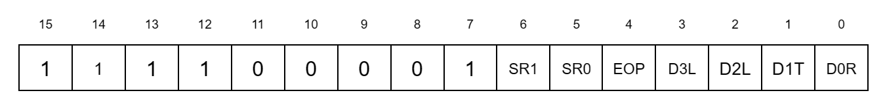 
_Figure 9-9. DMA Master Control Register_

 

The bit fields within this register are described below.

**DMA0 to Receiver Link (D0R).** While this bit is set to 1, DMA0 is linked to the on-chip UART's receiver.

**DMA1 to Transmitter Link (D1T).** While this bit is set to 1, DMA1 is linked to the on-chip UART's transmitter.

**DNA2 Link (D2L).** While this bit is set to 1, DMA2 is linked to DMA0.

**DMA3 Link (D3L).** While this bit is set to 1, DMA3 is linked to DMA1.

**End-of-Process (EOP).** While this bit is set to 1, the Interrupt A input acts as an End-of-Process input for the active DMA channel during DMA operations.

**Software Ready for DMA0 (SR0).** While this bit is set to 1, DMA0 requests use of the system bus if enabled.

**Software Ready for DMA1 (SR1).** While this bit is set to 1, DMA1 requests use of the system bus if enabled.

The DMA Master Control register is cleared to all zeros by a reset, unless bootstrap mode is enabled during the reset operation (see sections 3.2.1 and 9.7). Bits 7 through 15 of this register are not used.

#### 9.5.6.2 DMA Transaction Descriptor Register

Each DMA channel has its own 16-bit Transaction Descriptor register. The Transaction Descriptor register (Figure 9-10) describes the type of DMA transfer to be performed and contains control and status information.

 

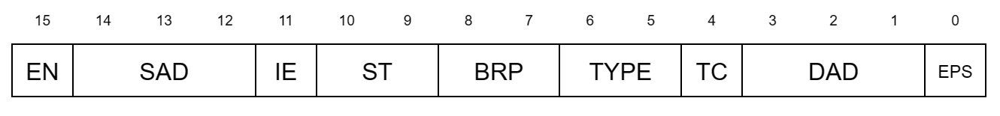 
_Figure 9.10. Transaction Descriptor Register_

 

**End-of-Process Signaled (EPS).** This status bit is set to 1 automatically when an active End-of-Process signal prematurely terminates a DMA transfer. This bit can be set to 1 or cleared to 0 under software control.

**Destination Address Descriptor (DAD).** This 3-bit control field determines the type of location (memory or I/O) to be accessed as the destination port during DMA transfers, and whether the destination address is to be incremented, decremented, or left unchanged between transfers, as shown in Table 9-4. When memory addresses are auto-incremented or auto-decremented, the incrementing or decrementing value is determined by the size of the data transfer, as specified in the ST field. I/O port addresses are always auto-incremented and auto-decremented by 1.

Encoding | Address Modification Operation
|-|-|
000 | Auto-increment memory location
001 | Auto-decrement memory location
010 | Memory address unmodified by transaction
011 | Reserved
100 | Autoincrement I/O location
101 | Auto-decrement I/O location
110 | I/O address unmodified by transaction
111 | Reserved

_Table 9-4. Encoding off DAD and SAD Fields In DMA Transaction Descriptor Register_

**Transfer Complete (TC).** This status bit is set to 1 automatically when the Count register has reached zero. This bit can be set to 1 or cleared to 0 under software control.

**Transaction Type (Type).** This 2-bit control field specifies the type of DMA operation to be performed, as shown in Table 9-5.

Encoding | DMA Operation
|-|-|
00 | Flowthrough
01 | Reserved
10 | Flyby write (peripheral-to-memory)
11 | Flyby read (hnemory-to-peripheral)

_Table 9-5. Encoding of Type Field in Transaction Descriptor Register_

**Bus Request Protocol (BRP).** This 2-bit control field determines the transfer mode for the DMA operation, as shown in Table 9-6.

Encoding | DMA Transfer Mode
|-|-|
00 | Single transaction
01 | Burst
10 | Continuous
11 | Reserved

_Table 9-6. Encoding of BRP Field In Transaction Descriptor Register_

**Size of Transfer (ST).** This 2-bit control field specifies the size of the entity to be transferred during each DMA-controlled transaction, as shown in Table 9-7. If auto-increment or auto-decrement of a source or destination memory address is specified in the SAD or DAD fields, then the state of this field determines the size of the increment or decrement operation.

Encoding | Size of Transfer | Number to Increment or Decrement By
|-|-|-|
00 | Byte | 1
01 | Word  | 2
10 | Long word | 4
11 | Reserved

_Table 9-7. Encoding of ST Field in Transaction Descriptor Register_

**Interrupt Enable (IE).** While this bit is set to 1, the DMA channel generates an interrupt request to the CPU either when the Count register goes to zero, indicating the completion of a DMA operation, or when an End-of-Process signal prematurely terminates a DMA operation. While this bit is cleared to 0, no interrupt request is generated.

**Source Address Descriptor (SAD).** This 3-bit control field determines the type of location (memory or I/O) to be accessed as the source port during DMA transfers, and whether the source address is to be incremented, decremented, or left unchanged between transfers, as shown in Table 9-4.

**DMA Enable (EN).** While this bit is set to 1, the DMA channel is enabled; while enabled, the DMA can request control of the system bus and, upon becoming bus master, initiate transactions on the bus. While this bit is a 0, the DMA channel is disabled and cannot request control of the bus. The DMA registers can be accessed regardless of the state of this bit.

For DMA0, a reset loads a 0100H into the Transaction Descriptor register. For the remaining three channels, the EN, IE, TC, and EPS bits are all cleared to 0 by a reset, and the remaining fields are unaffected.

#### 9.5.6.3 Count Register

Each channel has a 16-bit Count register that is programmed to contain the number of DMA transfers to be performed. When the contents of the Count register reach zero (terminal count), further requests on the <ins>RDY</ins> line are ignored, and, if the IE bit in the Transaction Descriptor register is set to 1, an interrupt request is generated.

A reset loads a 0100H into DMA0's Count register; the other channels' Count registers are unaffected by a reset.

#### 9.5.6.4 Source Address and Destination Address Registers

The 24-bit Source Address register and Destination Address register hold the port addresses used during DMA transfers. These are physical addresses that are not translated by the MMU. In flyby mode, only one of these registers is used to supply the address for the transaction, as determined by the Type field in the Transaction Descriptor register. The contents of these registers can be automatically incremented or decremented by each DMA transaction, as determined by the SAD and DAD field in the Transaction Descriptor register.

The entire 24-bit Source Address or Destination Address register is read and written via two word accesses to the register. Twelve, bits of the address are accessed by each word I/O operation; the format used when accessing these registers is shown in Figure 9-11.

 

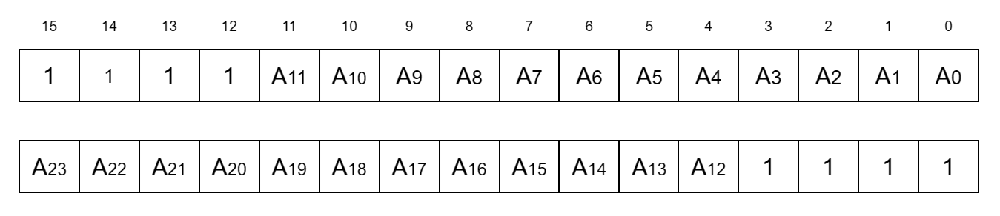 
_Figure 9-11. Source and Destination Address Registers Format_

 

DMA0's Destination Address register is cleared to 0 by a reset; all other Source and Destination Address registers are unaffected by a reset.

All DMA registers are located in I/O page FFH. The DMA Master Control register is accessed at I/O port address FFxx1F. Table 9-8 lists the I/O port addresses for the other DMA registers. All DMA registers can be read or written using word I/O instructions.

Register | DMA0 | DMA1 | DMA2 | DMA3
|-|-|-|-|-|
Destination Address (bits 0-11) | FFxx00 | FFxx08 | FFxx10 | FFxx18
Destination Address (bits 12-23) | FFxx01 | FFxx09 | FFxx11 | FFxx19
Source Address (bits 0-11) | FFxx02 | FFxx0A | FFxx12 | FFxx1A
Source Address (bits 12-23) | FFxx03 | FFxx0B | FFxx13 | FFxx1B
Count | FFxx04 | FFxx0C | FFxx14 | FFxx1C
Transaction Descriptor | FFxx05 | FFxx0D | FFxx15 | FFxx1D 

All addresses are in hexadecimal. 
"x" means "don't care".

_Table 9-8. I/O Addresses of DMA Registers_

No checking is performed by the hardware to determine if an invalid configuration is specified in the DMA registers, such as specifying word transactions on 8-bit data bus configuration of the Z280 MPU; in such cases, DMA behavior is unpredictable.

### 9.5.7 DMA Sequence of Events

This section describes a typical sequence of events when a DMA channel is used in flowthrough or flyby mode to control data transfers.

Before a DMA channel can begin operation, that DMA channel must be configured for the particular application by loading its Destination Address, Source Address, Count, and Transaction Descriptor registers. DMA operations cannot take place while the EN bit in the Transaction Descriptor register is cleared to 0. Thus, the EN bit should be cleared to zero while configuring the DMA channel, and set to 1 as the last step in the configuration process; the EN bit can be set at the same time that the other bit fields in the Transaction Descriptor register are specified.

Once the EN bit is set to 1, the DMA channel requests use of the system bus only after an active <ins>RDY</ins> signal is received. The <ins>RDY</ins> signal is sampled by the DMA on the rising edge of each processor clock cycle. For DMA0 and DMA1, the <ins>RDY</ins> signal is the logical OR of the external <ins>RDY</ins> input and the software <ins>RDY</ins> bit in the DMA Master Control register.

When the system bus is available for DMA transfers, the highest priority DMA channel with a request pending becomes the bus master. The priority of the on-chip DMA channels from highest to lowest is DMA0, DMA1, DMA2, and DMA3. The external Bus Request input has the next lowest priority after the on-chip DMA channels.

The number of data transfers performed by a DMA that has gained control of the bus is determined by the current transfer mode (single transaction, burst, or continuous) and the contents of the Count register. A DMA channel in single transaction mode relinquishes the bus after a single data transfer; a DMA channel in burst mode relinquishes the bus when <ins>RDY</ins> is deasserted or when terminal count is reached; a DMA channel in continuous mode relinquishes the bus when the terminal count is reached. Regardless of the transfer mode, a DMA channel will relinquish the bus if an <ins>EOP</ins> is signalled or the terminal count is reached.

If the destination for a DMA-controlled data transfer is a memory location that corresponds to an entry in the on-chip memory (in either the cache or fixed-address mode), the on-chip memory is updated to reflect the new contents of that memory location.

For each DMA-controlled data transfer on the bus, that DMA's Count register is decremented by 1, regardless of the size of the data transferred. The Destination Address and Source Address registers might also be incremented or decremented, as determined by the DAD, SAD, and ST fields in the Transaction Descriptor register. When a DMA operation reaches completion, either by assertion of an <ins>EOP</ins> signal or by reaching terminal count (a count of 0) in the Count register, the EN bit in the Transaction Descriptor register is automatically cleared to 0. If the IE bit is set to 1, an interrupt request to the CPU is generated. If the DMA operation terminated due to an active <ins>EOP</ins> signal, the EPS status bit is set to 1; if the DMA operation terminated due to reaching terminal count, the TC status bit is set to 1.

### 9.5.8 DMA Programming: Linked DMAs

When two DMA channels are linked together, the master DMA's registers are written via memory-to-peripheral data transfers initiated by the linked DMA. Thus, to begin DMA operations, the linked DMA must be programmed to load the master DMA. While the linked DMA is being configured, the master DMA must be prohibited from asserting a <ins>RDY</ins> signal to the linked DMA. The internal <ins>RDY</ins> signal from the master DMA to the linked DMA is controlled by the TC status bit of the master DMA; therefore, before configuring the linked DMA, the TC bit of the master DMA's Transaction Descriptor register should be written with a 0. Then, the linked DMA is configured by writing to its registers. Finally, the TC bit in the master DMA should be set to 1; this causes the internal <ins>RDY</ins> signal to the linked DMA to go active, which in turn causes the linked DMA to request the bus and, upon acknowledgement of that request, initiates the transactions that program the master DMA.

The linked DMA must be configured for flowthrough-type data transfers. The transfer size must match the size of the external data bus (that is, byte for Z80 bus configurations and word for Z-BUS configurations). The Source Address register is loaded with the starting address of the memory block that holds the data to be written to the master DMA's registers; for the Z-BUS, this starting address must be even-valued (A0=0). The SAD field of the Transaction Descriptor register should specify an auto-increment or auto-decrement of the memory address. The Destination Address register must be set to FFxx00H when DMA2 is the linked DMA, or FFxx08H when DMA3 is the linked DMA ("x" means don't care). The DAD field in the linked DMA's Transaction Descriptor register should be Set to 100H (auto-increment I/O address). Burst mode transactions must be specified. The contents of the Count register vary depending on the number of times that the linked DMA is required to reconfigure the master DMA.

When the master DMA has completed a transaction (terminal count is reached), an internal <ins>RDY</ins> signal to the linked DMA is activated. If the linked DMA is enabled, the linked DMA will generate the transactions that program the master DMA's registers. (The linked DMA's external <ins>RDY</ins> input is ignored when DMA linking is specified.)

When the linked DMA loads the master DMA's registers, the registers are written in the following order:

* Destination Address register (least significant word)
* Destination Address register (most significant word)
* Source Address register (least significant word)
* Source Address register (most significant word)
* Count register
* Transaction Descriptor register

After the six words have been written to the master DMA, the master DMA deasserts the ready signal to the linked DMA and begins the new transfer operation. For Z-BUS configurations of the Z280 MPU, the linked DMA uses six word transactions on the bus to program the master DMA; for Z80 Bus configurations, the linked DMA uses twelve byte transactions to program the master DMA, with the least significant byte of each word being transferred first.

Both the master and linked DMAs can be programmed to generate an interrupt request to signal the end of DMA activity. If the IE bit of the master DMA is set, an interrupt request is generated when the master DMA reaches terminal count and the linked DMA's TC bit is set (that is, when the last block has been transferred), or if EOF is asserted. If the IE bit in the linked DMA is set, an interrupt request is generated when the linked DMA reaches terminal count (that is, when the last block transfer has been programmed into the master DMA), or if EOF is asserted.

### 9.5.9 DMA Programming: DMAs Linked to UART

The D0R and D1T bits of the DMA Master Control register specify whether DMA0 is linked to the UART receiver and DMA1 is linked to the UART transmitter, respectively.

When DMA0 is linked to the UART receiver, the state of the Source Address register and the SAD field in the Transaction Descriptor register do not affect DMA operation. The Destination Address register is programmed with the starting address of the memory area or the address of the I/O device that will be used to store the received data; if the destination port is a memory block, the DAD field should specify an auto-increment or auto-decrement of the memory address.

Flowthrough-type transactions and the byte transfer size must be specified. Single, burst, or continuous mode operation can be used.
When DMA1 is linked to the UART transmitter, the Source Address register is programmed with the starting address of the memory area or the address of the I/O device that holds the data to be transmitted; if the source is a memory area, the SAD field should specify an auto-increment or auto-decrement of the memory address. The Destination Address register must be set to xxxx18H, and the DAD field to a 110H. Flowthrough type transactions and the byte transfer size must be specified. Single, burst, or continuous mode operation can be used.

## 9.6 UART

The on-chip universal asynchronous receiver/ transmitter (UART) provides the Z280 MPU with serial I/O capability. The full-duplex UART transmits and receives serial data using any common asynchronous data communication protocol.

Figure 9-12 illustrates the general format for an asynchronous transmission using the Z280 MPU's UART. Characters can contain five, six, seven, or eight bits, plus an optional even or odd parity bit. The transmitter can supply one or two stop bits per character. Break outputs can be produced by the transmitter at any time under program control; the receiver can detect breaks as well as parity errors, framing errors, and overrun errors. Transmission and reception are performed independently.

The UART uses the same clock frequency for both the transmitter and the receiver. The UART's clock input can be generated externally or internally. For externally generated clocks, Counter/Timer 1's input line is used as the source of the UART's clock in addition to being an input to the counter/timer. The maximum external clock frequency is the CPU clock divided by 4. Alternately, the UART's clock can be provided by the output pulse from Counter/Timer 1, allowing the internal processor clock to be used for bit rate generation. The UART's clock input is further scaled by a factor of 1, 16, 32, or 64 for clocking the transmitter and receiver.

The UART can be used in an interrupt-driven or polled environment. If enabled, separate transmit and receive interrupt requests are generated by the UART. Transmit interrupts occur when the transmitter's data buffer is emptied, and receive interrupts occur when an entire character is received or an error is detected. In polled environments, status bits in UART registers can be read to determine if the transmit buffer is empty or receive buffer is full. As described in section 9.5.9, DMA channel 0 can be linked to the receiver and DMA channel 1 to the transmitter to provide for DMA-controlled transfers between the UART and memory.

The UART uses two external pins, Transmit (Tx) and Receive (Rx). Data that is to be transmitted is placed serially on the Transmit pin and data that is to be received is read from the Receive pin.

 

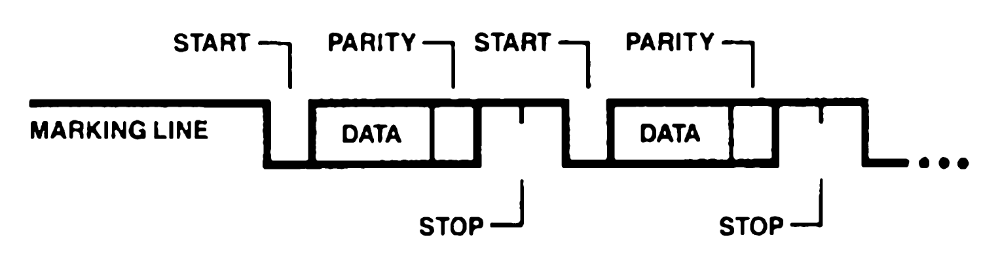 
_Figure 9-12. General Format for an Asynchronous Transmission_

 

The UART contains five registers. UART operation is controlled by three registers: the UART Configuration register, which contains controls for both the transmitter and receiver, the Transmitter Control/Status register, and the Receiver Control/Status register. Received data is read from the Receive Data register, and data to be transmitted is written to the Transmit Data register.

### 9.6.1 Transmitter Operation

Transmit operations are performed only when the Transmitter Enable bit in the Transmitter Control/Status register is set to 1. In order to transmit data, the data character is written to the Transmit Data register. The UART automatically adds the start bit, the programmed parity-bit (if so specified), and the programmed number of stop bits to the data character to be transmitted. The number of bits per character, the number of stop bits per character, and the type of parity (even, odd, or none) is determined by the contents of the UART Configuration register. When the transmit character size is five, six, or seven bits, the unused most significant bits in the Transmit Data register are ignored by the UART.

Serial data is shifted out of the transmitter on the Tx pin at a rate egual to 1, 1/16th, 1/32nd, or 1/64th of the clock signal supplied to the UART, as determined by the contents of the UART Configuration register. Serial data is shifted on the falling edge of the clock input.

The Tx output line is held high (marking) when the transmitter has no data to send or is disabled. If transmit interrupts are enabled, an interrupt request is generated when the Transmit Data register is emptied. Under program control, break conditions can be generated, wherein the Tx line is held low (spacing) until the break command is cleared.

### 9.6.2 Receiver Operation

Receive operations are performed only when the Receiver Enable bit in the Receiver Control/Status register is set to 1. A low (spacing) condition on the Receive input line indicates a start bit; if the low persists for at least one-half of a bit time, the start bit is assumed to be valid and the data input is sampled at mid-bit times until the entire character is assembled. Thus, reception is protected from transients on the input line by checking for a valid start bit one-half bit time after detecting a high-to-low transition on the Receive input; if the low does not persist (as with a transient), the character assembly process is not started. If the bit time is one clock period (the x1 clock mode), bit synchronization must be accomplished externally; received data is sampled on the rising edge of the clock.

Received characters are read from the Receive Data register. If parity is enabled, the parity bit is assembled as part of the character for character lengths other than eight bits. If the resulting character is still less than eight bits, 1's are appended in the unused high-order bit positions. For example, Figure 9-13 illustrates how the character is assembled in the Receive Data register when receiving 5-bit characters with parity.

 

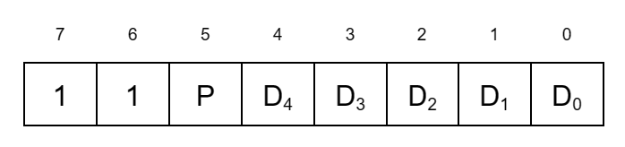 
_Figure 9-13. Byte Assembled by Receiver for 5-bit Character with Parity_

 

For each character assembled by the receiver, error flags in the Receiver Control/Status register indicate if an error condition was detected. These flags are loaded when the character assembly process is completed—that is, when the character is loaded into the Receive Data register from the receiver's shift register. The receiver checks for parity errors, framing errors, and overrun errors for each received character.

A parity error occurs when the parity bit of the received character does not match the programmed parity, as determined by the contents of the UART Configuration register.

A framing error occurs if a character is assembled without any stop bits (that is, if a low level is detected for the stop bit). A built-in checking process prevents a framing error from being interpreted as a new start bit; detection of a framing error results in the addition of one-half of a bit time to the point at which the search for a new start bit is begun.

An overrun error occurs if a new character is assembled and loaded into the Receive Data register before the previous character has been read from that register. Since the receiver is buffered by the Receive Data register in addition to the receiver shift register, ample time is available for responding to a receiver interrupt and accepting a received character before the next character is assembled by the receiver.

### 9.6.3 UART Registers

UART operation is controlled by three 8-bit registers: the UART Configuration register, Transmitter Control/Status register, and Receiver Control/Status register. Data to be transmitted is written to an 8-bit Transmit Data register, and received data is read from an 8-bit Receive Data register. All UART registers are accessed using byte I/O instructions.

#### 9.6.3.1 UART Configuration Register

The 8-bit UART Configuration register (Figure 9-14) contains control information for both the receiver and transmitter.

 

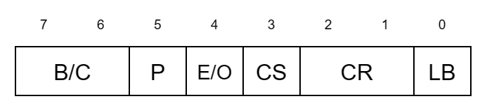 
_Figure 9-14. UART Configuration Register_

 

The control fields within this register are described below.

**Loop Back Enable (LB).** When set to 1, the UART is in local loopback mode; in this mode, the internal transmit data line is tied to the internal receiver input line and the external receiver input pin is ignored. Thus, all transmitted data is automatically received. When this bit is cleared to 0, the transmitter and receiver operate independently.

**Clock Rate (CR).** This 2-bit field determines the multiplier between the UART clock and data rates (that is, the number of clocks per bit time), as specified in Table 9-9. The same data rate is used by both the transmitter and receiver. If the X1 clock rate is selected, bit synchronization must be accomplished externally. In the X1 mode, the transmitter sends data on the falling edge of the clock and the receiver samples data on the rising edge of the clock.

CR Field | UART Clock Rate
|-|-|
00 | X1
01 | X16
10 | X32
11 | X64

_Table 9-9. CR Field of UART Configuration Register_

**Clock Select (CS)**. The state of this bit specifies the clock input for the UART. When this bit is set to 1, counter/timer 1's output pulse supplies the UART clock. When this bit is cleared to 0, counter/timer 1's clock input pin provides the UART clock signal, thus allowing the use of an externally-generated clock. The content of the IPA field of C/T 1's Configuration register does not affect these UART clocking modes.

**Transmitter Buffer Empty (BE).** This status bit is automatically set to 1 whenever the Transmit Data register becomes empty and cleared to 0 whenever a character is loaded into the Transmit Data register. The BE bit is controlled by the UART circuitry; it can be read via an I/O read but is unaffected by an I/O write to this register. A reset loads a 1 into this bit.

**Parity (P).** When set to 1, an additional bit position (in addition to the number of bits per character specified in the BC field) is added to each transmitted character and expected in each received character; this additional bit is the parity bit. Parity bits in received characters are assembled as part of the character for character lengths of less than 8 bits.

**Parity Even/bdd (E/O).** If parity is specified (P = 1), this bit determines whether an odd or even parity bit is added to transmitted characters and whether odd or even parity is checked for in received characters. E/O = 1 specifies even parity and E/0 = 0 specifies odd parity. If P = 0, then this bit is ignored.

**Bits per Character (B/C).** This 2-bit field determines the number of bits per character in both the transmitter and receiver, as specified in Table 9-10. If this field is changed while a character is being transmitted or received, the results are unpredictable.

BC Field | Bits per Character
|-|-|
00 | 5
01 | 6
10 | 7
11 | 8

_Table 9-10. BC Field of UART Control Register_

A reset clears the UART Configuration register to all zeros, unless bootstrap mode is selected (see section 9.7).

#### 9.6.3.2 Transmitter Control/Status Register

The 8-bit Transmitter Control/Status register, shown in Figure 9-15, specifies the operation of the UART transmitter, as described below.

 

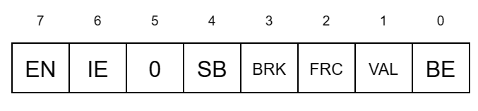 
_Figure 9-15. Transmitter Control/Status Register_

 

**Value (VAL).** This bit determines the value of the bits transmitted by the UART when the FRC bit is set to 1 and "dummy" characters are loaded into the Transmit Data register. When the VAL bit is set to 1, a mark character (all 1s) is transmitted; when the VAL bit is cleared to 0, a break character (all 0s) is transmitted.

**Force Character (FRC).** When this bit is set to 1, writing a character to the Transmit Data register causes the transmitter output to be held high or low (depending on the state of the VAL bit) for the length of time required to transmit the character. Note that characters written to the Transmit Data register are not themselves transmitted while FRC is set to 1. When FRC is cleared to 0, the transmitter operates normally, sending characters that are written to the Transmit Data register.

**Send Break (BRK).** When this bit is set to 1, the transmitter is forced into the spacing condition, wherein the transmit data output is forced to 0. When this bit is cleared to 0, normal transmitter operation resumes.

**Stop Bits (SB).** The state of this bit determines the number of stop bits appended to each character by the transmitter. Setting this bit to 1 specifies two stop bits per character; clearing this bit to 0 specifies one stop bit per character.

**Transmitter Interrupt Enable (IE).** When this bit is set to 1, an interrupt request is generated whenever the Transmit Data register is emptied. When this bit is cleared to 0, no tranmsit interrupts are generated.

**Transmitter Enable (EN).** When this bit is cleared to 0, the transmitter is disabled and the transmitter output line is held high (marking). When this bit is set to 1, the transmitter is enabled and operates as specified by the UART Configuration register and the Transmitter Control/Status register. If this bit is cleared while a character is in the process of being transmitted, transmission of that character is completed.

A reset sets the Transmitter Control/Status register to a 01H. Bit 5 of this register is not used.

#### 9.6.3.3 Receiver Control/Status Register

The 8-bit Receiver Control/Status register, shown in Figure 9-16, specifies the operation of the UART receiver, as described below.

 

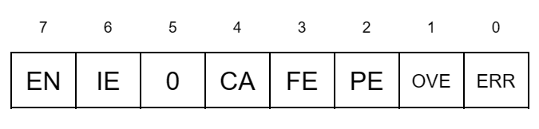 
_Figure 9-16. Receiver Control/Status Register_

 

**Receiver Error (ERR).** This bit is the logical OR of the PE, OVE, and FE bits.

**Framing Error (FE).** This bit is automatically set to 1 if the receiver detects a framing error when assembling the received character. Detection of a framing error adds an additional one-half bit time to the character to ensure that the framing error is not interpreted as a new start bit. This bit is not latched; once set, it remains set only until a new character is assembled and shifted into the Receive Data register.

**Parity Error (PE).** When parity is enabled (P = 1 in the UART Configuration register) this bit is automatically set to 1 if a character is received without the specified parity. This bit is latched; once set, it remains set until cleared via software.

**Receiver Overrun Error (OVE).** This bit is automatically set to 1 if a new character is assembled and loaded into the Receive Data register before the previous character has been read from that register. Only the most recently received character is flagged with this error, but once this character is read, the OVE bit remains latched until cleared via software.

**Receiver Character Available (CA).** This bit is automatically set to 1 when a received character is available in the Receive Data register and automatically cleared to 0 when the Receive Data register is read. This bit is controlled by UART circuitry; it can be read via an I/O read but cannot be altered by an I/O write to this register.

**Receiver Interrupt Enable (IE).** When this bit is set to 1, an interrupt request is generated whenever the receiver has a character available in the Receive Data register or when a receiver error is detected.

**Receiver Enable (EN).** When set to 1, receiver operation is enabled. This bit should be set after programming the UART Configuration register.

The Receiver Control/Status register is cleared to all zeros by a reset, unless bootstrap mode is selected (see section 9.7). Bit 5 of this register is not used.

All UART registers are in I/O page FE and are accessed via byte I/O instructions. Table 9-11 lists the I/O port addresses for the UART registers.

Register | I/O Port Address
|-|-|
UART Configuration Register | FExx10
Transmitter Control/Status Register | FExx12
Receiver Control/Status Register | FExx14
Receive Data Register | FExx16
Transmit Data Register | FExx18

All addresses are in hexadecimal. 
"x" means "don't care".

_Table 9-11. I/O Addresses of UART Registers_

### 9.6.4 UART Operation

Operation of the UART's transmitter and receiver are enabled by the Transmitter Enable and Receiver Enable control bits in their respective control/status registers. Before enabling the UART by setting one of those bits, the UART's configuration must be determined by programming the UART Configuration register. If the UART Configuration register is to be altered during system operation, the transmitter and receiver should be disabled before writing to the Configuration register, and then re-enabled afterwards.

Once enabled, the UART can be used in an interrupt-driven or polled environment. Separate transmit and receive interrupts are controlled by the interrupt enable bits in the control/status registers. Receive interrupts are generated whenever a new character is available in the Receive Data register or when an error is detected. Transmit interrupts are generated whenever the Transmit Data register is emptied.

For polled environments, the Character Available bit in the Receiver Control/Status register must be monitored to determine when a character is to be read from the Receive Data register; this bit is automatically cleared when the received data is read. For transmitting characters, the Transmit Buffer Empty flag should be checked before writing to the Transmit Data register to prevent the overwriting of transmitted data.

The error flags in the Receiver Control/Status register are loaded at the same time that the received data character is moved from the receiver's shift register to the Receive Data register. Since the parity and receiver overrun error flags are latched, the error status reflects any errors in the current character in the Receive Data register plus any parity or overrun errors that have been detected since the last write to the Receiver Control/Status register. To maintain correspondence between the state of the error flags and the data in the Receive Data register, the flags in the Receiver Control/Status register should be read before the data.

Once the transmitter has been enabled, there are two ways to produce a break output on the transmit data line. Setting the BRK bit in the Transmitter Control/Status register forces a break condition on the transmit data output until that bit is cleared. Alternatively, setting the FRC bit to 1 and clearing the VAL bit to 0 causes a break condition on the transmit data output each time a character is loaded into the Transmit Data register; this break output persists for the same amount of time that it would have taken to transmit the data written to the Transmit Data register had the FRC bit been 0. Note that the characters written to the Transmit Data register while the FRC bit is set to 1 are not actually transmitted.

## 9.7 UART BOOTSTRAPPING OPTION

The on-chip UART and DMA Channel 0 can be used to automatically initialize the Z280 MPU's memory with values received by the UART following a reset. This system bootstrapping capability permits ROMless system configurations, where memory is initialized using a serial link prior to the first Z280 MPU instruction fetch after the reset.

As described in Section 3.2.1 and Chapter 11, bootstrap mode is selected by driving <ins>WAIT</ins> low and AD6 high while <ins>RESET</ins> is asserted. The appropriate UART and DMA registers are automatically programmed as shown in Table 9-12 as a result of selecting bootstrap mode. The UART is initialized to receive data in 8-bit characters with odd parity, an external clock source, and a x16 clock rate. DMA Channel 0 is initialized with the link to the UART receiver and end-of-process capability enabled, and set up for flowthrough byte transfers in continuous mode. The destination address starts at memory location 0, with an autoincrement after each transfer, and a transfer count of 236 (100H).

Register | Initial Hex Value
|-|-|
UART Configuration register | E2
UART Receiver Control/Status register | 80
DMA Master Control register | 0011
DMA Channel 0 Transaction Descriptor register | 8100
DMA Channel 0 Destination Address register | 000000
DMA Channel 0 Source Address register | Undefined
DMA Channel 0 Count register | 0100

_Table 9-12. Reset Value of UART and DMA Registers When Bootstrap Mode Is Selected_

If bootstrap mode is specified, the Z280 CPU automatically enters an idle state when <ins>RESET</ins> is deasserted. A minimum of 15 processor clock cycles must elapse after <ins>RESET</ins> is deasserted before tranmission of data to the UART receiver begins. DMA Channel 0 is then used to transfer characters received by the UART into memory. The data received is placed in memory starting at
physical address 0. If an error is detected by the UART receiver, the Transmit Output (Tx) line is driven low; external circuitry can use this signal to restart the initialization procedure, if so desired. After 256 bytes of data have been received and transferred to memory, the Z280 CPU automatically begins execution with an instruction fetch from memory location 0.
