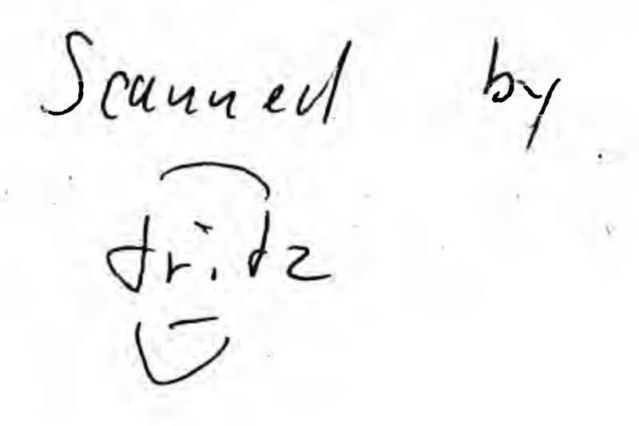

# Z280™ MPU Microprocessor Unit Technical Manual

This repository contains a transcript of the _Z280™ MPU Microprocessor Unit Preliminary Technical Manual_ book, published by Zilog in July 1987.

## Index

[1. Architectural Overview](1-Architectural_Overview.md)

[2. Address Spaces](2-Address_Spaces.md)

[3. CPU Control Registers](3-CPU_Control_Registers.md)

[4. Addressing Modes and Data Types](4-Addressing_Modes_and_Data_Types.md)

[5. Instruction Set](5-Instruction_Set.md)

[6. Interrupts And Traps](6-Interrupts_And_Traps.md)

[7. Memory Management Unit](7-Memory_Management_Unit.md)

[8. On Chip Memory](8-On-Chip_Memory.md)

[9. On-Chip Peripherals](9-On-Chip_Peripherals.md)

[10. Multiprocessor Configurations](10-Multiprocessor_Configurations.md)

[11. Reset](11-Reset.md)

[12. Z280 Bus External Interface](12-Z280_Bus_External_Interface.md)

[13. Z-Bus External Interface](13-Z-Bus_External_Interface.md)

[Appendix A. Z80/Z280 Compatibility](A-Z80_Z280_Compatibility.md)

[Appendix B. Z280/MPU Instruction Formats](B-Z280_MPU_Instruction_Formats.md)

[Appendix C. Instructions In Alphabetical Order](C-Instructions_In_Alphabetical_Order.md)

[Appendix D. Instructions In Numeric Order](D-Instructions_In_Numeric_Order.md)

Appendix E. Instruction Timing

[Appendix F. Compatible Peripheral Families.md](F-Compatible_Peripheral_Families.md)

[Glossary](Glossary.md)

## How?

This transcript has been created from two scans of the book that are available online:

* `z280_mpu_(ocr_gray_300).pdf`: This version has all (well, actually most of) the texts extracted with an OCR tool, it has been used for the text content.

* `z280_mpu_(noocr_bw_400).pdf`: This version doesn't have extracted text, but is of slightly higher quality; it has been used for the captures of the figures.

The transcript has been performed as follows:

* All the text has been extracted from the OCR version. Missing styling have been added, and spotted OCR mistakes have been fixed.
  * Data tables have been converted to Markdown tables.
  * MPU pins and register bits that are negated (because they are active when their value is 0) and are represented with a line on top in the original book are represented underlined here (e.g. R/<ins>W</ins>, <ins>BUSREQ</ins>). A CSS style for overline exists, but unfortunately GitHub strips off all the custom CSS styles in MarkDown files before rendering them.
* Figures that represent a 8 bit or 16 bit register of the MPU or bit rotations have been recreated, bit position numbers have been added.
* Other figures have been captured directly from the original PDF, hopefully with a proper size and with enough quality for all the embedded texts to be recognizable.

This transcript is incomplete, the following is still missing:

* Appendix E (Instruction Timing).
* Cross-links between chapters and sections.

## Contributing

Pull requests are welcome for the following:

* Fixing transcript mistakes that I may have missed (or that I introduced myself).
* Creating better-looking versions of the figures.
* Adding the missing content (please contact me first so we can coordinate).
* Adding cross-links between chapters and sections.

## Disclaimer/Copyright

Original book ©1987 by Zilog, Inc. Z280 is a trademark of Zilog, Inc. Z80, Z8000 and Z-BUS are registered trademarks of Zilog, Inc.

This transcript has been created with the hope that it will be useful for the retrocomputing community. It will be put offline if so is formally requested by the copyright owners.

The PDf files used for the transcription contain the following:

